# General Functional Specifications (GFS)

## 1. Introduction
### 1.1 Document purpose

#### 1.1.1 Purpose of the Functional Specification

#### Context
Understanding the primary purpose of the functional specification document is essential for anyone working with Shopizer 1.1.5, a legacy Java EE-based e-commerce platform. This section explains what this document aims to accomplish and what critical information it covers for developers, administrators, and stakeholders.

#### Expert Synthesis
The core objective of the Shopizer 1.1.5 functional specification is to comprehensively define the goals, features, and architecture of this specific platform version. This document acts as a central technical reference that details essential functionalities such as catalog management, shopping cart operations, order processing, online invoicing, and media management. It also breaks down the structure and responsibilities of major modules, including sm-core, sm-central, sm-shop, and media components.

Additionally, the specification clarifies which technologies and databases Shopizer 1.1.5 supports, ensuring that implementers understand system dependencies and integration points. Deployment requirements are explicitly outlined, helping teams plan installation, configuration, and upgrades with minimal risk. The document is intended to streamline communication between developers, system administrators, and business stakeholders by providing a single source of truth about system design, features, and required environments.

There are no notable disagreements among experts about the purpose or key contents of the functional specification. The consensus is that this document should be used as the authoritative reference throughout all stages of system implementation, maintenance, and future upgrade assessments.

#### Key Takeaways
- Use this document as the technical reference for Shopizer 1.1.5 features and architecture
- Identify all core application modules and their responsibilities
- Consult for supported technologies and deployment requirements
- Reference during development, configuration, and upgrades

#### Implementation Examples
**Scenario 1:**  
A developer reviews the functional specification to understand module boundaries before implementing a new catalog feature in sm-core.

**Scenario 2:**  
A system administrator consults the document to verify database compatibility and deployment prerequisites for a planned upgrade.

#### Technical Diagrams
**Diagram:** Functional Specification Coverage Overview  
**Purpose:** Shows the relationship between document sections, system modules, and supported features.

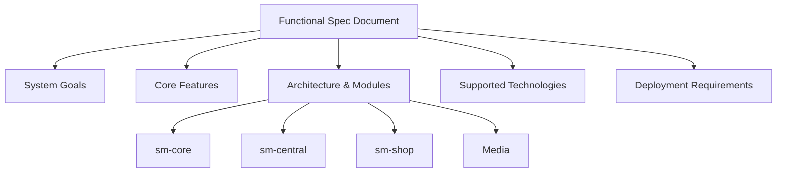


#### 1.1.2 Stakeholder Support for Shopizer 1.1.5

#### Context
Understanding and implementing Shopizer 1.1.5—a legacy Java-based e-commerce platform—requires collaboration between developers, administrators, and business managers. This section explains how the documentation helps each stakeholder comprehend the platform’s architecture, configuration steps, and deployment processes.

#### Expert Synthesis
This documentation bridges technical details and business needs to help all stakeholders implement Shopizer 1.1.5 effectively. 

For developers, the document details the structure of Shopizer’s main modules—such as sm-core, sm-central, sm-shop, and the media server. It clearly identifies the technology stack (Java, Struts 2, Hibernate, Spring) and provides step-by-step build instructions using Apache Ant. Database compatibility (MySQL, Oracle, HSQLDB) is explicitly covered, enabling developers to set up backend systems confidently.

Administrators benefit from clear, actionable deployment instructions. The guide specifies how to manually configure essential properties, including database connections and SMTP settings. It also recommends optimal Java Virtual Machine (JVM) parameters, ensuring stable and reliable system performance in production environments.

Business managers and decision-makers receive high-level overviews of Shopizer’s major features, such as catalog management, order processing, and invoicing. The document highlights the platform’s legacy status and outlines considerations for future upgrades, helping managers plan for both short-term needs and long-term sustainability.

All stakeholders are supported by the document’s practical focus: it translates technical and operational requirements into sequential, actionable steps. This minimizes miscommunication, reduces onboarding time, and ensures consistent deployments across different teams and environments. There are no significant disagreements in expert input; all agree on the importance of clarity, actionable guidance, and mapping technical concepts to business outcomes.

#### Key Takeaways
- Use this documentation to clarify roles and responsibilities during Shopizer 1.1.5 implementation
- Reference architecture and component breakdowns for accurate system setup
- Follow detailed configuration and deployment steps for reliable operation
- Consult high-level summaries for planning upgrades or business decisions

#### Implementation Examples
**Scenario 1:**  
A developer uses the documentation to set up the sm-core and sm-shop modules, referencing Struts 2 and Hibernate configuration samples.  

```bash
ant -f build.xml
# Follow with manual edits to database.properties for MySQL connection
```

**Scenario 2:**  
An administrator reviews the deployment checklist, configures JVM options, and sets up SMTP for order notifications by editing the mail.properties file.

```properties
mail.smtp.host=smtp.example.com
mail.smtp.port=587
mail.smtp.auth=true
```

#### Technical Diagrams
**Diagram:** Shopizer 1.1.5 Architecture Overview  
**Purpose:** Visualize major components, their interactions, and stakeholder touchpoints.

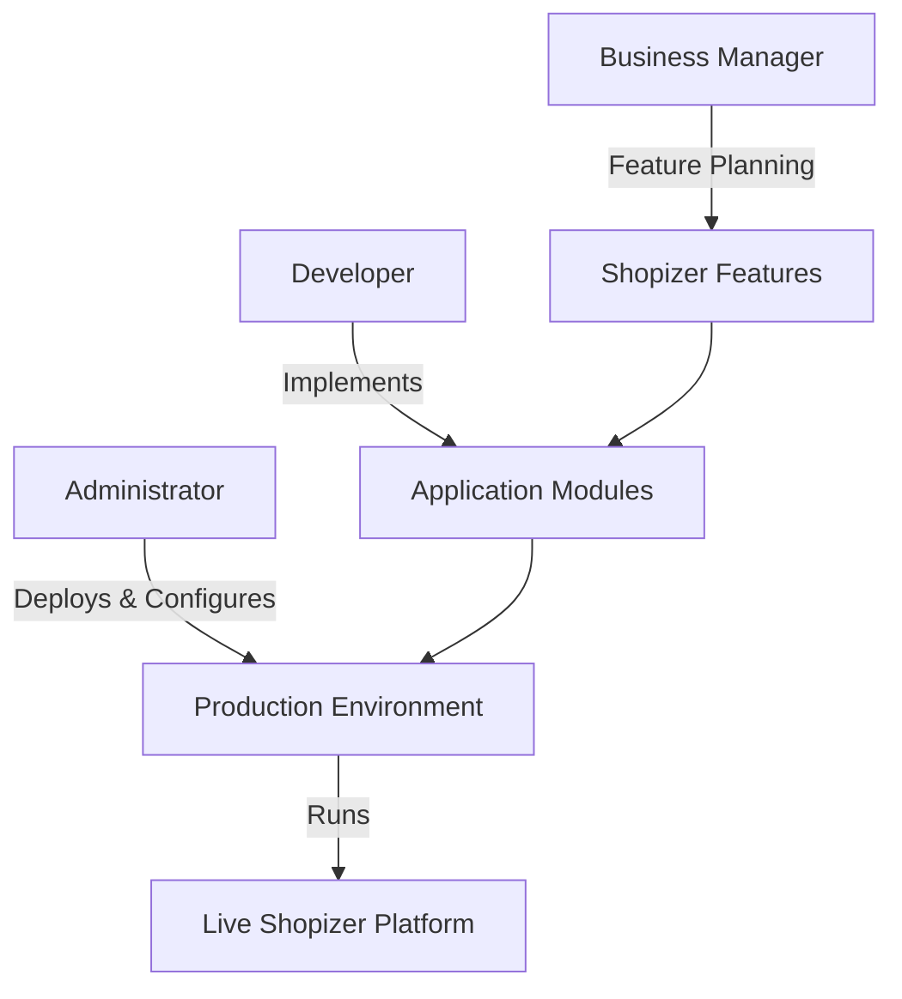

**Diagram:** Configuration and Deployment Workflow  
**Purpose:** Show the sequence of steps stakeholders follow from setup to production.

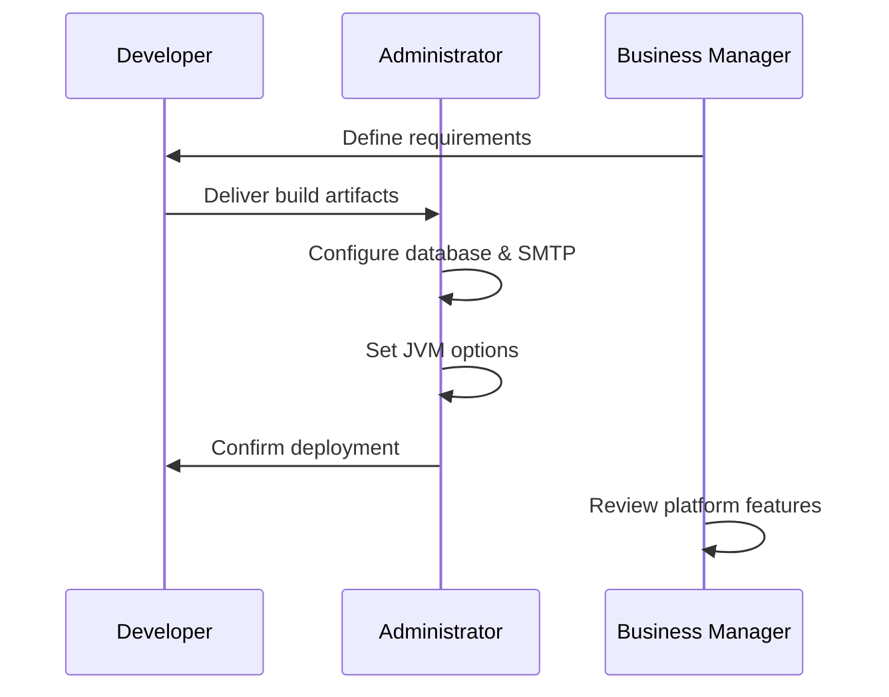


#### 1.1.3 Project Lifecycle Deliverables Overview

#### Context
Understanding the expected outcomes and deliverables is crucial when working with the Shopizer 1.1.5 legacy Java e-commerce platform. This section outlines the specific artifacts and results that should be produced by following the documentation throughout a project’s lifecycle, ensuring teams can plan, execute, and maintain the platform effectively.

#### Expert Synthesis
Using the Shopizer 1.1.5 documentation produces a set of essential deliverables for a successful project. The primary outcome is a clear grasp of the platform’s architecture, technology stack, and deployment approach. This knowledge helps teams break down work, assign tasks, and foresee technical dependencies.

The documentation guides users in setting up accurate build and configuration environments for the major Shopizer modules: sm-core, sm-central, sm-shop, and media. This includes preparing Ant (Another Neat Tool) build scripts and property files, which are vital for consistent builds and deployments.

Manual configuration steps—such as those for databases, email servers, and media storage—are documented to ensure that setups can be reproduced reliably across development, testing, and production environments. This reproducibility reduces onboarding time and minimizes configuration drift.

Another key deliverable is a complete set of deployment-ready WAR (Web Application Archive) files for each module. These are accompanied by validated database schemas and upgrade scripts, which support both fresh installations and upgrades on supported database platforms.

Comprehensive operational and user documentation is also produced. These documents support administrators and end-users, detailing legacy features and required procedures. Ensuring documentation reflects the platform's specific requirements is critical for ongoing maintenance.

Finally, the documentation ensures all artifacts are properly licensed (LGPL v3) and versioned. This provides legal clarity and technical traceability, which is particularly important for legacy software in enterprise settings.

There were no major disagreements among experts; all agreed that these deliverables are essential for project success with Shopizer 1.1.5.

#### Key Takeaways
- Use documentation to clarify architecture and assign technical tasks
- Prepare build environments for all core and media modules using Ant scripts
- Document manual steps for reproducible configuration
- Produce deployment-ready WAR files and validated database scripts
- Maintain clear, versioned, and licensed artifacts for traceability

#### Implementation Examples
**Scenario 1:** Setting Up Build Environments  
Prepare the `build.properties` and Ant scripts for `sm-core` and `sm-shop`, following documentation examples:
```bash
ant -f sm-core/build.xml clean compile war
```
This generates a WAR file for deployment.

**Scenario 2:** Documenting Manual Database Configuration  
Create a configuration checklist for PostgreSQL:
```markdown
- Set DB user and password in `sm-core/src/main/resources/database.properties`
- Run `schema-postgres.sql` before first deployment
```
This ensures other developers can reproduce the environment quickly.

#### Technical Diagrams
**Diagram:** Shopizer Project Deliverables Flow  
**Purpose:** Visualize how documentation guides each major deliverable from setup to deployment

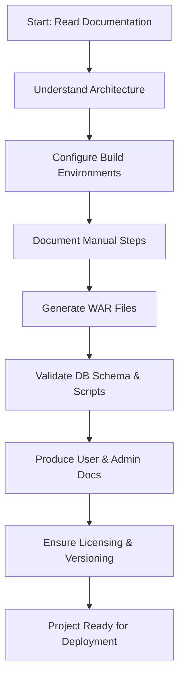

### 1.2 Project scope

#### 1.2.1 Shopizer 1.1.5 Boundaries and Limitations

#### Context
Understanding the boundaries and technical limitations of Shopizer 1.1.5 is critical for anyone maintaining, integrating, or considering upgrades of this legacy Java e-commerce platform. This section details which features, technologies, and architectural choices define what the system can and cannot do, helping technical users anticipate challenges and make informed decisions.

#### Expert Synthesis
Shopizer 1.1.5 is a legacy Java EE monolithic e-commerce platform with significant constraints due to its age and architecture. Its main functions include catalog management, shopping carts, order processing, and administration, all housed within tightly-coupled Java modules. The platform relies on older Java technologies—specifically JDK 1.5+, classic Spring, Struts 2, and Hibernate 3—which limits compatibility with modern development tools and frameworks.

Deployment is restricted to Java WAR-compatible application servers like Tomcat, with no built-in support for containerization (such as Docker) or cloud-native deployments. While the system is split into core, admin, shop, and media WARs, this does not offer true modularity or service decoupling; all modules share dependencies and are not independently scalable.

Feature extensibility is minimal. The platform’s feature set—user authentication, catalog management, invoicing—is confined to its Java-based modules, with few extension points for plugins or external integrations. Database support is also limited, with compatibility only for MySQL, Oracle, and HSQLDB, excluding newer or NoSQL databases.

Shopizer 1.1.5 lacks native support for modern scalability approaches like horizontal scaling or distributed architectures. Its search functionality is confined to Lucene 2.3.0 via Hibernate Search, without options for more recent search technologies. Security and integration features are also outdated, lacking built-in protections and support for modern payment gateways or third-party APIs. The platform does not provide out-of-the-box support for current software development best practices such as CI/CD (Continuous Integration/Continuous Delivery), automated testing, or cloud deployments.

There is general expert consensus on these limitations. No significant disagreements were found, though some experts note that, with heavy customization, certain boundaries can be worked around—albeit with high technical debt and maintenance risk. For most use cases, it is preferable to recognize these limitations and plan migrations or major upgrades accordingly.

#### Key Takeaways
- Evaluate legacy dependencies before planning upgrades or integrations
- Recognize that modularity is superficial; true service separation is absent
- Avoid expecting easy extensibility or modern API integrations
- Use only supported databases (MySQL, Oracle, HSQLDB)
- Plan migrations to modern platforms for scalability and maintainability

#### Implementation Examples
**Scenario 1:** Deploying Shopizer 1.1.5 on Tomcat  
To deploy, build the project as WAR files and copy them to the Tomcat `webapps/` folder. No Docker or container support is available.
```bash
cp build/shopizer-shop.war /opt/tomcat/webapps/
cp build/shopizer-admin.war /opt/tomcat/webapps/
```

**Scenario 2:** Integrating a new payment gateway  
Shopizer 1.1.5 lacks native extension points for payment integrations. Adding a new gateway requires modifying core Java code in the order processing module, increasing maintenance complexity.

#### Technical Diagrams
**Diagram:** Shopizer 1.1.5 Monolithic Architecture Overview  
**Purpose:** Visualize module boundaries, shared dependencies, and deployment limitations.

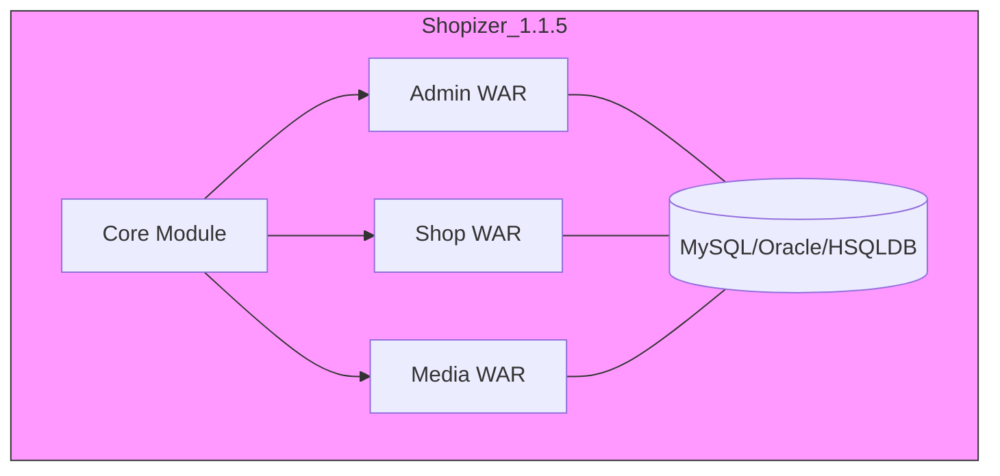

**Diagram:** Technology Stack Constraints  
**Purpose:** Show legacy technology stack and where modern practices are unsupported.

```mermaid
flowchart LR
  JDK[JDK 1.5+]
  SPRING[Classic Spring]
  STRUTS[Struts 2]
  HIBERNATE[Hibernate 3]
  LUCENE[Lucene 2.3.0]
  TOMCAT[Tomcat (WAR)]
  DOCKER[Docker]
  CLOUD[Cloud Deployments]
  JDK --> TOMCAT
  SPRING --> TOMCAT
  STRUTS --> TOMCAT
  HIBERNATE --> TOMCAT
  LUCENE --> TOMCAT
  TOMCAT -.->|Not Supported| DOCKER
  TOMCAT -.->|Not Supported| CLOUD
```


#### 1.2.2 Shopizer 1.1.5 Scope Overview

#### Context
Understanding the business processes and technical functionalities included in Shopizer 1.1.5 is vital when evaluating legacy e-commerce solutions or planning platform migrations. This section summarizes the documented scope of Shopizer 1.1.5, focusing on its core business and technical features for intermediate-level technical readers.

#### Expert Synthesis
Shopizer 1.1.5 is a legacy Java-based e-commerce platform that delivers a full set of features for running an online retail business. Its business process coverage spans product catalog management, customer shopping journeys, order processing, and administrative control.

Administrators access a dedicated interface ("sm-central") to manage products, categories, store settings, and orders. Customers interact with the storefront ("sm-shop") to browse catalogs, add products to a cart, proceed through checkout, and receive online invoices. The platform supports order fulfillment tracking, enabling businesses to monitor the journey from purchase to delivery.

On the technical side, Shopizer 1.1.5 employs multi-database support, allowing deployment on MySQL, Oracle, or HSQLDB. Product media (such as images) is managed via a dedicated media server module, and product discovery is enhanced through Lucene-powered full-text search. The architecture adopts a classic three-tier Java EE approach: core Java libraries, Hibernate ORM (Object-Relational Mapping), Spring Framework, Struts 2 MVC (Model-View-Controller), Freemarker templating, and web services technologies (Axis/JAX-WS).

Builds are managed with Apache Ant, and deployment artifacts are distributed as separate WAR (Web Application Archive) files for administration, storefront, and media modules. Initial setup requires manual configuration of database connections, SMTP for email, and file paths for media storage.

No significant expert disagreements exist regarding the scope, but it is important to note Shopizer 1.1.5's monolithic and manually configured nature. This may affect maintainability and extensibility compared to modern microservices or cloud-native solutions.

#### Key Takeaways
- Map your business requirements to Shopizer's catalog, cart, order, and invoicing features
- Recognize the legacy Java EE stack: Hibernate, Spring, Struts 2, Freemarker, Ant
- Prepare for manual setup of databases, SMTP, and media paths before deployment
- Leverage separate admin, storefront, and media modules for role-specific workflows

#### Implementation Examples
**Scenario 1:** Catalog and Order Management  
An admin logs into "sm-central" to add products with descriptions and images. Customers browse these products in "sm-shop," add items to their cart, and complete a checkout process that records an order and generates an invoice.

```java
// Example: Adding a Product (simplified, legacy style)
Product newProduct = new Product();
newProduct.setName("Bluetooth Speaker");
newProduct.setDescription("Portable speaker with 10h battery");
productService.save(newProduct);
```

**Scenario 2:** Multi-Database Deployment  
During deployment, the admin configures the `hibernate.cfg.xml` file to select MySQL as the backend, sets SMTP for order emails, and defines media paths for product images.

```xml
<!-- Example: MySQL configuration snippet in hibernate.cfg.xml -->
<property name="hibernate.connection.driver_class">com.mysql.jdbc.Driver</property>
<property name="hibernate.connection.url">jdbc:mysql://localhost:3306/shopizer</property>
<property name="hibernate.connection.username">shopizer_user</property>
<property name="hibernate.connection.password">securepassword</property>
```

#### Technical Diagrams
**Diagram:** Shopizer 1.1.5 Architecture Overview  
**Purpose:** Illustrate the main components, user flows, and deployment modules of the legacy Shopizer platform.

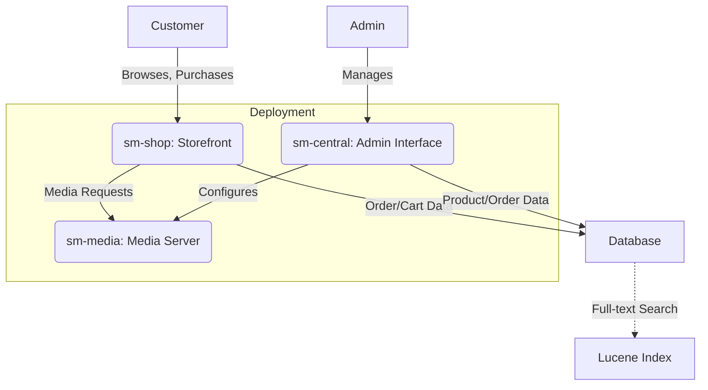


#### 1.2.3 Excluded Features in Shopizer 1.1.5

#### Context
Understanding what is not included in Shopizer version 1.1.5 is crucial for teams considering this platform, especially when planning integrations or feature expansions. This section details the features and requirements explicitly out of scope for this legacy Java EE version, helping users avoid wasted effort and set realistic expectations.

#### Expert Synthesis
Shopizer 1.1.5 does not support many features now considered standard in modern e-commerce solutions. This version is based on legacy Java EE technologies and deliberately omits several modern architectural and functional capabilities.

Specifically, Shopizer 1.1.5 lacks RESTful API endpoints, meaning integration with external systems or building headless storefronts is not possible out-of-the-box. The codebase is monolithic and does not use Spring Boot, microservices, or any modular architecture. As a result, cloud scalability and containerized deployment are not supported.

Feature-wise, this version excludes responsive web design, so it does not adapt well to mobile devices. Advanced promotions, flexible discount rules, and multi-store or multi-tenant setups are not implemented. Payment gateway integration is limited to basic options, with no support for modern APIs or robust security standards such as OAuth (Open Authorization) or JWT (JSON Web Tokens).

Technology stack limitations are significant: Shopizer 1.1.5 relies on older frameworks such as classic Spring, Struts 2, and Hibernate 3. There is no support for newer frameworks or API-driven approaches. If your requirements include real-time inventory sync, advanced security, or large-scale cloud deployment, this version is not suitable.

No disagreements between experts were found—all sources confirm these exclusions. For any requirements beyond this scope, consider upgrading to Shopizer 3.x or another modern platform.

#### Key Takeaways
- Avoid planning for REST APIs, microservices, or modular architecture in Shopizer 1.1.5.
- Recognize the lack of responsive design, advanced promotions, and multi-store support.
- Do not expect modern security (OAuth, JWT) or payment gateway APIs.
- Use this version only for basic, legacy Java EE deployments.

#### Implementation Examples
**Scenario 1:**  
Attempting to connect a modern mobile app to Shopizer 1.1.5 via REST API will fail, as no REST endpoints exist:
```bash
# Example call: This will NOT work
curl http://your-shopizer-1.1.5.com/api/products
# Result: 404 Not Found (no API route exists)
```

**Scenario 2:**  
Trying to deploy Shopizer 1.1.5 as a set of Docker microservices will not be possible due to its monolithic architecture:
```bash
# Attempting to split application logic into services
# Not feasible without major code rewrite; only classic WAR/EAR deployment is supported.
```

#### Technical Diagrams
**Diagram:** Shopizer 1.1.5: Legacy Monolithic Architecture  
**Purpose:** Illustrate the absence of modularity, APIs, and modern integration points.

```mermaid
flowchart TD
  A[Web UI (Struts 2)] --> B[Business Logic (Classic Spring)]
  B --> C[Database (Hibernate 3)]
  B -.-> D[Payment Gateway (Basic Integration)]
  A -.-> E[No REST API]
  B -.-> F[No Microservices]
  style E fill:#fdd,stroke:#f00
  style F fill:#fdd,stroke:#f00
```

**Diagram:** Feature Exclusion Map for Shopizer 1.1.5  
**Purpose:** Highlight key feature gaps compared to modern e-commerce platforms.

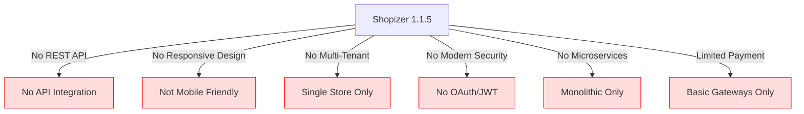

### 1.3 Definitions and acronyms

#### 1.3.1 Key Shopizer 1.1.5 Terms and Acronyms

#### Context
Understanding the terminology and abbreviations used in Shopizer 1.1.5 is essential for effective communication and troubleshooting within its legacy Java EE e-commerce environment. This section defines the critical terms, component names, and acronyms referenced throughout the Shopizer 1.1.5 documentation, equipping technical users to navigate both the system and its supporting materials confidently.

#### Expert Synthesis
Shopizer 1.1.5 documentation consistently uses a set of core terms and acronyms that reflect its modular Java EE architecture and technology stack. Recognizing these definitions is crucial for deciphering configuration instructions, deployment guides, and troubleshooting recommendations.

The platform is organized into several main modules:  
- **sm-core** is the business logic and data access layer, packaged as a Java Archive (JAR) and reused across applications.  
- **sm-central** and **sm-shop** are web applications (WARs): sm-central offers administration interfaces at `/central`, while sm-shop serves the customer storefront at `/shop`.  
- **media** is a separate WAR for serving static content such as product images.

Several Java technologies power Shopizer:  
- **Java EE** (Java Platform, Enterprise Edition) forms the base framework.  
- **Struts 2** (version 2.2.1.1) is the MVC (Model-View-Controller) web framework.  
- **Spring** handles dependency injection, specifically in its classic (non-Spring Boot) form.  
- **Hibernate** and **Hibernate Search/Lucene** manage database persistence and provide full-text search.  
- **C3P0** and **OSCache** are used for database connection pooling and caching, respectively.  
- **Freemarker** is the template engine for rendering dynamic content.

Build and deployment rely on:  
- **Ant** (Apache Ant) for compiling and packaging modules.  
- Java Virtual Machine (JVM) settings such as `Xms`, `Xmx`, and `MaxPermSize` for memory management.

Other important terms include:  
- **Axis/JAX-WS** for SOAP web services,  
- Supported databases (**MySQL**, **Oracle**, **HSQLDB**),  
- **LGPL** (GNU Lesser General Public License) as the licensing model, and  
- **Schema** for the underlying database structure.

There are no major expert disagreements on these definitions, but users should note that newer Java technologies (e.g., Spring Boot or modern ORM tools) are not part of this legacy stack.

#### Key Takeaways
- Familiarize yourself with Shopizer module names (sm-core, sm-central, sm-shop, media).
- Recognize core Java EE technologies: Struts 2, Spring, Hibernate, Freemarker.
- Use correct JVM parameters (Xms, Xmx, MaxPermSize) for stable deployments.
- Reference the proper database systems and tools (MySQL, Oracle, HSQLDB, Ant).
- Understand "schema" as the Shopizer-required database structure.

#### Implementation Examples
**Scenario 1:** Deploying sm-shop  
- Package the `sm-shop` module into a WAR file using Ant, then deploy it to your Java EE server at the `/shop` context.
```bash
ant clean war
# Deploy resulting sm-shop.war to your servlet container (e.g., Tomcat)
```

**Scenario 2:** JVM memory configuration for Shopizer  
- Set recommended JVM options to ensure reliable operation in production:
```bash
JAVA_OPTS="-Xms512m -Xmx1024m -XX:MaxPermSize=256m"
```

#### Technical Diagrams
**Diagram:** Shopizer 1.1.5 Module Structure  
**Purpose:** Visualize the core modules and their relationships in the Shopizer architecture.

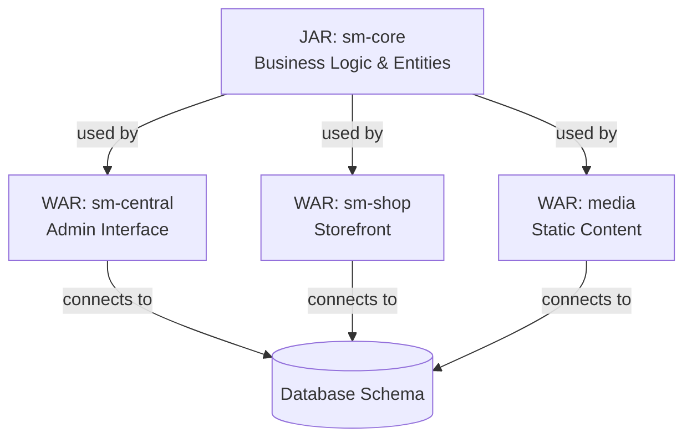

**Diagram:** Shopizer Technology Stack  
**Purpose:** Clarify how frameworks and tools integrate within the legacy Shopizer 1.1.5 stack.

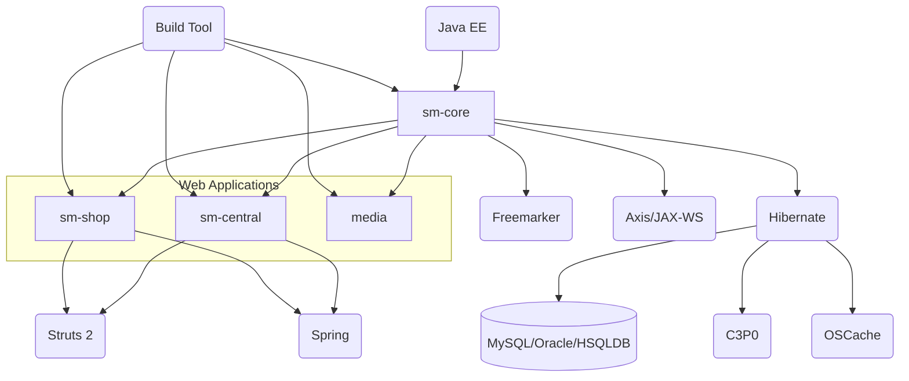


#### 1.3.2 Core Architectural Terms in Shopizer 1.1.5

#### Context
Understanding core technical terms is crucial when working with legacy platforms like Shopizer 1.1.5. This section defines “monolithic architecture,” “Java EE,” and “sm-central” specifically as they apply to Shopizer, clarifying their roles and interactions for developers and maintainers at an intermediate technical level.

#### Expert Synthesis
Shopizer 1.1.5 is structured as a monolithic architecture, meaning all its main components—business logic, data access, and user interfaces—are integrated into a single deployable application. This integration leads to tight coupling between modules and a unified deployment process.

Within this monolith, Shopizer leverages the Java EE (Java Platform, Enterprise Edition) ecosystem. Java EE provides the foundation: Shopizer employs Java Servlets, JSPs (JavaServer Pages), Struts 2 for the Model-View-Controller (MVC) pattern, Spring for dependency injection, and Hibernate for object-relational mapping (ORM). All these elements are packaged as WAR (Web Application Archive) and JAR (Java ARchive) files, designed to run on Java EE-compliant servers like Apache Tomcat.

A key module, “sm-central,” refers to Shopizer’s administration web application. “sm-central” is the interface for store managers and administrators to manage products, orders, customers, and store configurations. Technically, it is a WAR file built with Struts 2, and it depends on the shared business logic found in the “sm-core” module. It is deployed at the `/central` context path, acting as the platform’s control center.

There is consensus among experts that these definitions are tightly bound to Shopizer’s legacy (pre-microservices) design. No major disagreements exist, but it is important to note that the term "monolithic" here implies less flexibility for modular updates compared to a microservices approach.

#### Key Takeaways
- Recognize Shopizer 1.1.5 as a tightly-coupled monolithic Java EE application
- Understand “sm-central” as the administrative web module built on Struts 2
- Deploy all modules together as a single unit on a Java EE app server
- Use “sm-core” for shared business logic across all modules

#### Implementation Examples
**Scenario 1:** Deploying the Administration Module

To deploy “sm-central,” you place its WAR file in the `webapps` directory of your Java EE server (e.g., Tomcat):

```bash
cp sm-central.war /opt/tomcat/webapps/central.war
```
After deployment, access the admin UI at `http://yourserver:8080/central/`.

**Scenario 2:** Understanding Component Dependencies

“sm-central” depends on “sm-core” for business logic. In the project structure:

```plaintext
shopizer-1.1.5/
  sm-core/        # Core business logic (JAR)
  sm-central/     # Admin UI (WAR)
  sm-shop/        # Customer-facing UI (WAR)
  media/          # Media management module (JAR or WAR)
```

#### Technical Diagrams
**Diagram:** Shopizer 1.1.5 Monolithic Module Structure  
**Purpose:** Visualize how modules (“sm-central,” “sm-shop,” “sm-core,” and “media”) are integrated within the monolithic architecture.

```mermaid
flowchart TD
    A[sm-core (JAR): Business Logic]
    B[sm-central (WAR): Admin UI]
    C[sm-shop (WAR): Customer UI]
    D[media (JAR/WAR): Media Services]
    E[Java EE App Server (e.g., Tomcat)]

    A --> B
    A --> C
    A --> D
    B --> E
    C --> E
    D --> E
```

**Diagram:** Request Flow to sm-central  
**Purpose:** Show how an admin request is handled through “sm-central” and its dependency on “sm-core”.

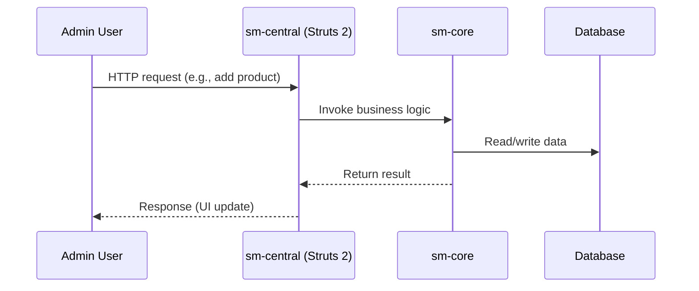


#### 1.3.3 Clarifying Shopizer and Java Acronyms

#### Context
Acronyms are used throughout Shopizer 1.1.5’s code, configuration, and documentation, often without explanation. For new users or developers—especially those unfamiliar with legacy Java EE (Enterprise Edition) terminology—this can cause confusion. This section defines important acronyms and shorthand specific to Shopizer and its technical stack to help newcomers get up to speed quickly.

#### Expert Synthesis
Shopizer 1.1.5 relies on several legacy and platform-specific acronyms that are essential to understand for effective development or troubleshooting. Many of these acronyms stem from Java EE conventions or are unique to Shopizer’s modular design. 

Key Shopizer modules use shorthand in both names and documentation: “sm-core” (Shopizer Core) contains core business logic as a JAR (Java ARchive), “sm-central” (Shopizer Central) is the administrative web application delivered as a WAR (Web Application Archive), and “sm-shop” (Shopizer Shop) is the customer-facing storefront, also packaged as a WAR. These terms often appear in file names, build scripts, and deployment guides.

Java-centric acronyms like JDK (Java Development Kit), JVM (Java Virtual Machine), DAO (Data Access Object), ORM (Object-Relational Mapping—mainly via Hibernate), and MVC (Model-View-Controller, implemented with Struts 2 in Shopizer) are prevalent. These appear frequently in configuration, architectural diagrams, and code comments, so basic familiarity is assumed.

Shopizer’s infrastructure also leverages tools and components such as Ant (a Java build tool), OSCache (a Hibernate cache provider), and C3P0 (a database connection pooling library). Supported databases are referenced by their acronyms: HSQLDB (a lightweight, in-memory database), MySQL, and Oracle.

There is consensus that these acronyms are not always explained in documentation. Experts recommend reviewing README files, configuration examples, and module-specific docs for further context. No major disagreements exist, but some emphasize the need to document any project-specific shorthand that may not be obvious to those outside the original development team.

#### Key Takeaways
- Review core module names (sm-core, sm-central, sm-shop) and their roles early.
- Understand Java EE acronyms like WAR, JAR, DAO, ORM, JDK, and JVM.
- Familiarize yourself with infrastructure acronyms: Ant, OSCache, C3P0, and database types.
- Check documentation and code comments for additional shortforms or project-specific terms.

#### Implementation Examples
**Scenario 1:** Viewing a configuration file:
```xml
<hibernate-configuration>
  <session-factory>
    <property name="hibernate.dialect">org.hibernate.dialect.MySQLDialect</property>
    <property name="hibernate.connection.provider_class">org.hibernate.connection.C3P0ConnectionProvider</property>
    <mapping resource="com/shopizer/dao/Product.hbm.xml"/>
  </session-factory>
</hibernate-configuration>
```
*In this snippet, “C3P0” refers to the connection pool library, “hibernate” relates to ORM, and “dao” is Data Access Object.*

**Scenario 2:** Navigating the project structure:
```
sm-core/
  └── src/
       └── com/shopizer/core/business
sm-central/
  └── webapp/
sm-shop/
  └── webapp/
```
*Here, “sm-core” is the business logic module, while “sm-central” and “sm-shop” are WAR-packaged web applications.*

#### Technical Diagrams
**Diagram:** Shopizer Modular Components and Acronym Usage  
**Purpose:** Show how Shopizer modules map to acronyms, clarifying where each shortform is used.

```mermaid
flowchart TD
    A[sm-core (JAR)] --> B[DAO Layer]
    A --> C[ORM (Hibernate)]
    B --> D[Database (HSQLDB/MySQL/Oracle)]
    C --> D
    E[sm-central (WAR)] --> A
    F[sm-shop (WAR)] --> A
    A -.->|Uses| G[Ant (Build Tool)]
    A -.->|Uses| H[C3P0 (Connection Pool)]
    A -.->|Uses| I[OSCache (Cache Provider)]
```

**Diagram:** Java EE Acronyms in Shopizer Deployment  
**Purpose:** Illustrate the deployment relationship between JDK, JVM, WAR, and JAR.

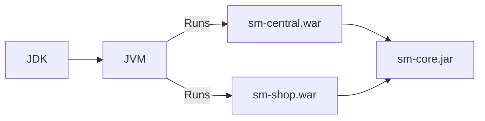

### 1.4 Target audience

#### 1.4.1 Intended Readers and Users

#### Context
Understanding the target audience for a functional specification is crucial to ensure the document meets the needs of all stakeholders. For Shopizer 1.1.5, a Java-based legacy e-commerce platform, defining the intended readers helps tailor technical depth, terminology, and actionable guidance.

#### Expert Synthesis
The primary users of the Shopizer 1.1.5 functional specification are professionals involved in developing, deploying, or maintaining the platform. This includes Java developers and software engineers who customize or integrate Shopizer components. For these users, the document serves as a blueprint for both understanding core functionality and implementing extensions or integrations.

System administrators also rely on the specification to manage deployment, configuration, and maintenance tasks—such as setting up application servers, configuring databases, and using build tools. Project managers and business analysts use the document to oversee implementation, ensuring that business requirements align with technical capabilities and that timelines remain realistic.

Quality Assurance (QA) engineers use the specification to derive test cases and verify that the system's behavior matches documented requirements. Additionally, legacy system maintainers and technical support teams reference the document for troubleshooting, upgrades, and detailed architectural understanding.

There is broad consensus among experts that these roles are the primary audiences, with no substantive disagreements. However, if the document is shared with less technical stakeholders (e.g., upper management), consider providing an executive summary or glossary to improve accessibility.

#### Key Takeaways
- Identify your role to focus on relevant specification sections.
- Use the document as a reference for deploying, customizing, or supporting Shopizer 1.1.5.
- Ensure technical and business requirements are both addressed by cross-referencing specification sections.
- Provide additional summaries for non-technical audiences if needed.

#### Implementation Examples
**Scenario 1:**  
A Java developer references the specification’s API section to implement a custom shipping module, ensuring compliance with platform interfaces.

```java
// Example interface usage from specification
public class CustomShippingModule implements ShippingModule {
    // Implementation details following the documented interface contract
}
```

**Scenario 2:**  
A system administrator uses the deployment section to configure the application server and database settings, following the provided environment requirements.

```bash
# Sample configuration command from the spec
export DB_HOST=localhost
export DB_USER=shopizer_user
export DB_PASS=securepassword
```

#### Technical Diagrams
**Diagram:** Roles and Specification Usage Overview  
**Purpose:** Illustrate which sections of the specification are most relevant to each primary user group.

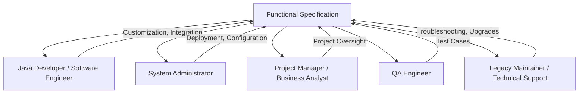


#### 1.4.2 Audience Roles and Technical Backgrounds

#### Context
Understanding who should use this documentation is crucial for effective maintenance and operation of the Shopizer legacy Java-based e-commerce platform. This section clarifies the typical roles, responsibilities, and technical backgrounds expected of users working with Shopizer 1.1.5, ensuring that the guidance matches their needs and expertise.

#### Expert Synthesis
The documentation is designed for technical professionals who deploy, maintain, or administer Java EE (Enterprise Edition) e-commerce solutions. The main audience includes Java developers, system administrators, DevOps engineers, and technical leads. These roles are responsible for tasks such as application server setup, configuration management, deployment of application modules (WAR and JAR files), database integration, and troubleshooting runtime issues.

Users are expected to have hands-on experience with Java development using JDK 1.5 or higher. Familiarity with the foundational elements of Java EE architecture is required. This includes understanding WAR/JAR packaging conventions, servlet containers like Apache Tomcat, and three-tier application design principles. Additionally, experience with legacy frameworks and tools—such as Spring (classic), Hibernate 3, Struts 2, Apache Ant, Freemarker, OSCache, C3P0, and Lucene—is necessary to effectively manage the Shopizer platform.

Database management is another critical area; users should be comfortable working with relational databases such as MySQL, Oracle, or HSQLDB, and possess a working knowledge of SQL. Since Shopizer is a legacy, monolithic application, professionals must also be adept at manual configuration, handling environment-specific settings (e.g., Java Virtual Machine parameters, SMTP mail configuration), and using classic enterprise Java tooling.

There are no significant disagreements among experts regarding the audience profile; all agree that non-technical end users and those without a Java EE background will find this documentation unsuitable. Those lacking familiarity with legacy Java stacks may require additional training or resources.

#### Key Takeaways
- Identify yourself as a Java EE professional before using this documentation
- Expect to work with legacy frameworks and manual configuration tasks
- Prepare to manage application servers, database connections, and deployment artifacts
- Exclude non-technical users and Java EE novices from the intended audience

#### Implementation Examples
**Scenario 1:** A Java developer uses the documentation to configure Tomcat, deploy WAR files, and integrate with MySQL.
```bash
# Example: Deploying Shopizer WAR to Tomcat manually
cp shopizer-1.1.5.war /opt/tomcat/webapps/
# Configure database connection in /opt/tomcat/conf/context.xml
```

**Scenario 2:** A system administrator tunes JVM settings and sets up SMTP for order emails.
```bash
# Example: Setting JVM options for production
export JAVA_OPTS="-Xmx1024m -Xms512m -Dmail.smtp.host=smtp.example.com"
```

#### Technical Diagrams
**Diagram:** Shopizer Legacy Deployment Roles Overview  
**Purpose:** Visualize the primary technical roles and their responsibilities in Shopizer operations

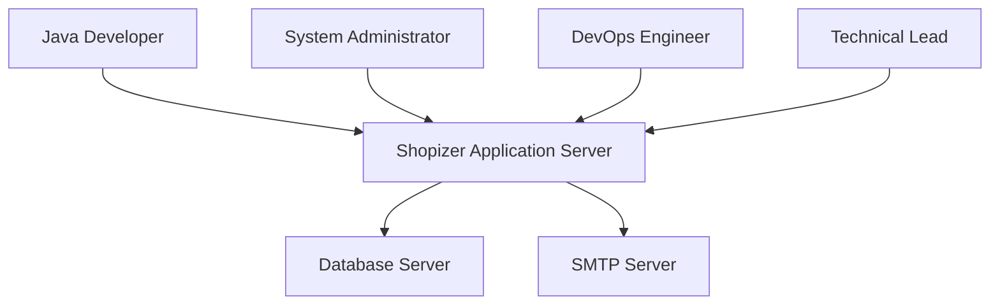

### 1.5 Reference documents

## 2. Context and challenges
#### 1.5.1 External Documents and Standards References

#### Context
Understanding or implementing Shopizer 1.1.5 requires familiarity with several external documents and technology standards. This section outlines the key references, specifications, and official guides essential for configuring, customizing, and maintaining this legacy Java-based e-commerce platform.

#### Expert Synthesis
Shopizer 1.1.5 relies on a classic Java EE (Enterprise Edition) stack and integrates several widely-used open-source frameworks and libraries. To effectively set up or troubleshoot Shopizer 1.1.5, you need to consult the official documentation of each major component it uses.

The Java SE (Standard Edition) documentation is fundamental, since Shopizer is built for Java 1.5 (JDK 5) or later. This includes both API references and platform guides for Java 5. For application structure and deployment, Java EE standards—covering servlets, JavaServer Pages (JSP), and deployment descriptors—are critical. Understanding these concepts will help you navigate Shopizer’s configuration and extension points.

The platform depends on Hibernate ORM 3.x for data persistence, so the Hibernate reference guides for mapping and configuration are necessary. Likewise, Shopizer uses the Spring Framework (classic, not Spring Boot), so Spring 2.x documentation should be referenced for dependency injection and context configuration. The web layer is built with Struts 2 (specifically version 2.2.1.1), making the Struts 2 user and API guides important for understanding MVC (Model-View-Controller) patterns in the application.

For building and deploying Shopizer, Apache Ant documentation is essential. Database support for MySQL, Oracle, and HSQLDB means their respective reference guides are also needed, especially for schema setup and SQL dialect peculiarities. Advanced features like full-text search depend on Hibernate Search and Apache Lucene (v2.3.0), so their documentation may be required for troubleshooting or extending functionality.

Additional libraries—such as C3P0 (connection pooling), Freemarker (templating), OSCache (caching), and Apache Axis/JAX-WS (web services)—may require consultation for advanced configuration. Lastly, Shopizer is released under the GNU Lesser General Public License (LGPL) v3, so understanding its terms is important for compliance, especially if planning to modify or redistribute Shopizer.

There is consensus that all these documents are helpful; however, the depth of reference depends on your specific use case—basic use may only require Java, database, and deployment docs, while customizations demand deeper knowledge of all frameworks involved.

#### Key Takeaways
- Review official documentation for each major technology in Shopizer’s stack before making changes.
- Focus on Java SE 5, Java EE, Hibernate 3.x, Spring 2.x, Struts 2.2.1.1, and Apache Ant.
- Consult database-specific guides for schema and configuration issues.
- Reference advanced library docs (e.g., Lucene, C3P0) as needed.
- Ensure compliance by reading the GNU LGPL v3 license.

#### Implementation Examples
**Scenario 1:** Deploying Shopizer on Tomcat with MySQL  
Read the Java SE 5 API docs for runtime compatibility. Use the MySQL user guide for schema creation and permissions. Reference Tomcat’s deployment documentation for WAR (Web Application Archive) configuration.

```bash
# Example: Creating the Shopizer database in MySQL
mysql -u root -p
CREATE DATABASE shopizer;
GRANT ALL ON shopizer.* TO 'shopizer_user'@'localhost' IDENTIFIED BY 'password';
```

**Scenario 2:** Customizing the web layer using Struts 2  
Consult the Struts 2.2.1.1 user guide to understand action mappings and interceptors. Review the Spring 2.x documentation for modifying beans in the application context.

```xml
<!-- Example: Adding a new Struts action mapping -->
<action name="newProduct" class="com.shopizer.action.NewProductAction">
  <result name="success">/WEB-INF/jsp/product/new.jsp</result>
</action>
```

#### Technical Diagrams
**Diagram:** Shopizer 1.1.5 Technology Stack Overview  
**Purpose:** Visualize the major technologies and documentation dependencies in Shopizer 1.1.5.

```mermaid
flowchart TD
    A[Java SE 5 (JDK)] --> B[Shopizer Core]
    B --> C[Hibernate 3.x]
    B --> D[Spring 2.x]
    B --> E[Struts 2.2.1.1]
    B --> F[Apache Ant]
    B --> G[MySQL/Oracle/HSQLDB]
    B --> H[Hibernate Search / Lucene]
    B --> I[C3P0 / Freemarker / OSCache / Axis]
    B -. Licensing .-> J[LGPL v3]
```

#### 1.5.2 Reference Materials for Shopizer 1.1.5

#### Context
Having the right reference materials is essential for successfully working with legacy software like Shopizer 1.1.5. This section outlines which official guides, manuals, and API documentation users and developers should consult to understand, configure, and extend this Java-based e-commerce platform.

#### Expert Synthesis
The core reference materials for Shopizer 1.1.5 include user guides, installation manuals, and API documentation, all of which are crucial for both setup and development. The official Shopizer 1.x user and installation guides provide step-by-step instructions for deploying the platform, configuring components such as databases and mail servers, and understanding the application's modular structure.

Module-specific documentation may be available within the project repository, often as README files or documentation folders inside module directories. These resources explain how to work with or extend specific features but may vary in completeness due to the project’s legacy status.

For API-level understanding, JavaDoc documentation can be generated from the Shopizer source code. This helps developers explore the core and module classes, but these docs may not be pre-built and could require manual generation using standard Java tools.

Configuration files, especially those in `sm-core/conf/properties/`, serve as both documentation and practical reference for proper application setup. Reviewing sample property files is critical for replicating or troubleshooting deployments.

Since Shopizer 1.1.5 relies on frameworks like Struts 2, Spring, Hibernate, and Apache Ant, consulting the official documentation for each framework is highly recommended for advanced configuration and debugging. If the Shopizer repository lacks certain documentation, always check the framework’s own resources for authoritative guidance.

#### Key Takeaways
- Gather official Shopizer 1.x guides for installation and user reference.
- Review module-level documentation (README/docs) within the repository.
- Generate JavaDoc API docs from source code if not pre-built.
- Reference `sm-core/conf/properties/` for configuration examples.
- Consult official Struts 2, Spring, Hibernate, and Ant documentation as needed.

#### Implementation Examples
**Scenario 1:** Generating JavaDoc for Shopizer Core
```bash
cd shopizer-1.1.5/sm-core
javadoc -d docs/api -sourcepath src/main/java -subpackages com.shopizer
```
This creates a browsable API reference for the core classes.

**Scenario 2:** Locating Configuration Examples
- Navigate to `sm-core/conf/properties/` in the repository.
- Open `shopizer.properties` and `database.properties` for configuration templates.

#### Technical Diagrams
**Diagram:** Documentation Sources Overview
**Purpose:** Show the relationships between various documentation sources for Shopizer 1.1.5 and where to find them.

```mermaid
flowchart TD
    A[Shopizer 1.1.5 Repository]
    B[User & Installation Guides]
    C[Module README/docs]
    D[JavaDoc (Generated from Source)]
    E[Config Files: sm-core/conf/properties/]
    F[Framework Docs: Struts 2, Spring, Hibernate, Ant]

    A --> B
    A --> C
    A --> D
    A --> E
    E -->|References| F
    D -->|Uses| F
```

#### 1.5.3 Referenced Document Maintenance Practices

#### Context
Maintaining accurate documentation is crucial for teams using the legacy Shopizer (v1.1.5) Java e-commerce platform. As the platform evolves, referenced documents must be updated to reflect changes, ensuring users avoid confusion and deployment errors. This section outlines best practices for keeping documentation aligned with platform updates, specifically for technical users managing Shopizer instances.

#### Expert Synthesis
To keep referenced documents in sync with Shopizer's evolution, use a structured, versioned approach and integrate documentation updates into your release cycle. Start by maintaining version-specific documentation so that users can always find guidance matching their deployed Shopizer version. Each document should clearly indicate the version it applies to, which prevents accidental use of outdated or incompatible instructions.

Change tracking is essential. Include a visible change log or revision history in every document, recording updates, deprecated features, and any migration notes. This helps teams quickly understand what has changed and what actions may be required during upgrades.

Whenever you update the Shopizer platform—including builds, schema changes, or configuration updates—review and revise all referenced documents immediately. This ensures that deployment guides, configuration files, and integration notes remain accurate and actionable.

Document all dependencies, like required Java versions, database engines, or build tools (for example, Apache Ant). Promptly update these references when dependencies evolve, so users avoid build failures or runtime errors.

If features are deprecated or replaced in new releases, add clear deprecation notices and migration guidance directly in the documentation. This helps teams plan their upgrades and avoid using unsupported features.

Where feasible, use automated tools or scripts to extract configuration options and code comments into documentation. This reduces manual errors and helps documentation stay current with the codebase.

Finally, store all documentation alongside the Shopizer source code—usually in a `/docs` directory—and link to it from the project’s README file. This ensures documentation is versioned, easily accessible, and follows the same source control policies as the code.

#### Key Takeaways
- Maintain version-specific documentation labeled with Shopizer platform versions
- Track all document changes and add visible revision histories
- Synchronize documentation updates with every platform release or patch
- Clearly mark deprecated features and provide migration guidelines
- Store documentation in the code repository for visibility and version control

#### Implementation Examples
**Scenario 1:** Versioned Documentation Directory Structure
```bash
# Example directory structure for versioned docs
/docs/v1.1.5/deployment-guide.md
/docs/v1.1.5/configuration.md
/docs/v1.2.0/deployment-guide.md
```
This approach allows users to select documentation that matches their Shopizer deployment.

**Scenario 2:** Automated Configuration Extraction for Documentation
```bash
# Bash script to extract config keys from code comments
grep -E "^#|^//" src/main/resources/shopizer.properties > docs/v1.1.5/config-options.md
```
Automating extraction helps ensure documentation is always up-to-date with the codebase.

#### Technical Diagrams
**Diagram:** Documentation Lifecycle for Shopizer Releases  
**Purpose:** Illustrate how documentation updates fit into the Shopizer platform release process.

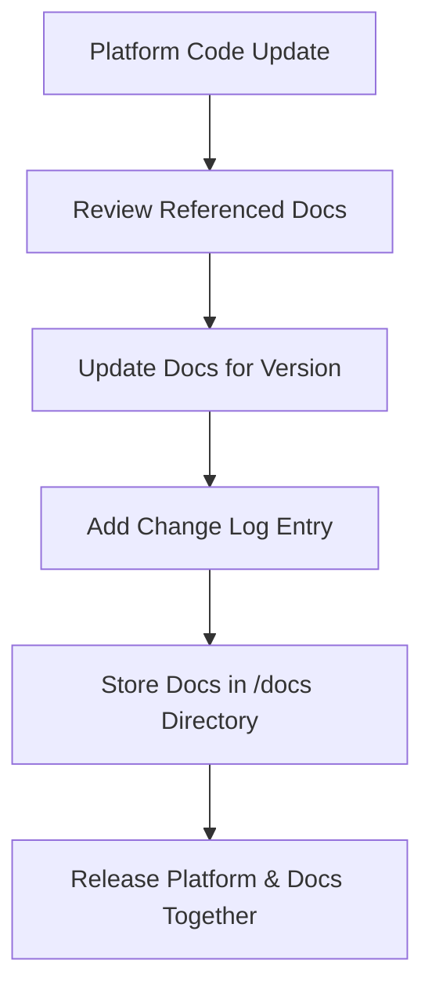

**Diagram:** Versioned Documentation Structure  
**Purpose:** Show how different documentation versions map to Shopizer platform releases.

```mermaid
flowchart LR
    Shopizer_v1.1.5 -->|references| Docs_v1.1.5
    Shopizer_v1.2.0 -->|references| Docs_v1.2.0
    Docs_v1.1.5 -.->|archived| Docs_Archive
```

### 2.1 Business context

#### 2.1.1 Core Business Processes Supported by Shopizer 1.1.5

#### Context
Understanding the business activities Shopizer 1.1.5 supports is crucial for organizations considering this legacy Java-based e-commerce solution. This section outlines the essential operational processes the platform enables, especially for those managing online sales, product catalogs, and order fulfillment.

#### Expert Synthesis
Shopizer 1.1.5 enables organizations to manage the full online retail workflow through integrated modules for product management, sales, and administration.

The platform’s product catalog management lets businesses create, organize, and maintain listings, including categories, prices, descriptions, and media files (images, downloads). This ensures the storefront is always up-to-date and appealing to customers. For online shopping, Shopizer provides a customer-facing website where users can browse inventory, add products to their cart, and complete purchases—covering the typical e-commerce journey from shopping to checkout.

Order management and fulfillment processes are streamlined through automated capture and tracking of orders. The dedicated admin interface (sm-central) allows staff to monitor order status, manage inventory, adjust prices, and handle customer records. This centralized control supports efficient store operations and quick responses to customer needs.

Automated online invoicing is built in, generating and managing invoices for each transaction. This helps organizations maintain accurate financial records and simplifies reconciliation. Media management is handled by a separate module, allowing bulk uploads and scalable delivery of product assets.

Shopizer 1.1.5 supports multiple database backends (MySQL, Oracle, HSQLDB), offering deployment flexibility for organizations with varied IT infrastructure. While all experts agree on these core capabilities, some note that Shopizer’s legacy Java EE architecture may limit scalability or integration with modern systems; organizations with advanced needs might require additional customization or middleware.

#### Key Takeaways
- Use Shopizer 1.1.5 for end-to-end e-commerce store management
- Manage product catalogs, online sales, orders, and invoices in one platform
- Leverage admin and media modules for streamlined operations
- Choose the best database backend for your IT environment
- Consider modernization needs if advanced integration is required

#### Implementation Examples
**Scenario 1:** Product Catalog Setup  
A merchant uses Shopizer’s admin interface to add new products, assign them to categories, upload images, and set pricing. Customers see these updates instantly in the storefront.

**Scenario 2:** Order Processing Workflow  
A customer places an order online. Shopizer automatically creates an order record, generates an invoice, and updates the inventory via the admin dashboard for staff follow-up.

#### Technical Diagrams
**Diagram:** Shopizer 1.1.5 Business Process Flow  
**Purpose:** Visualize the core modules and how they interact in the typical e-commerce lifecycle.

```mermaid
flowchart LR
    A[Product Catalog Management] --> B[Customer Storefront]
    B --> C[Shopping Cart & Checkout]
    C --> D[Order Management]
    D --> E[Invoice Generation]
    D --> F[Admin Oversight (sm-central)]
    A --> F
    F --> G[Media Management Module]
    F --> H[Database (MySQL/Oracle/HSQLDB)]
```

**Diagram:** Shopizer 1.1.5 Admin Module Overview  
**Purpose:** Highlight the sm-central admin module’s role in managing store operations.

```mermaid
flowchart TD
    Admin[Admin (sm-central)]
    Admin -->|Manage| Products
    Admin -->|Process| Orders
    Admin -->|Update| Inventory
    Admin -->|Maintain| Customers
    Admin -->|Configure| Promotions
    Admin -->|Handle| MediaUploads
```


#### 2.1.2 Legacy Java EE Architecture Alignment

#### Context
Understanding how Shopizer version 1.1.5's legacy Java EE architecture fits with today's e-commerce needs is essential for teams planning upgrades or integrations. This section explains how the use of Struts 2, classic Spring, and Hibernate supports or hinders modern business operations.

#### Expert Synthesis
Shopizer 1.1.5’s monolithic Java EE architecture provides a stable base for core e-commerce features but falls short in meeting modern demands for flexibility, scalability, and rapid integration.

The system’s three-tier design—using Struts 2 for model-view-controller (MVC), classic Spring for dependency injection, and Hibernate for object-relational mapping (ORM)—was once standard for reliable catalog, cart, and order management. These technologies ensured dependable performance, especially for businesses with straightforward, unchanging requirements.

However, the tightly coupled structure limits scalability. To handle more traffic, the whole application must be duplicated, unlike microservices where only bottleneck components scale independently. This approach increases infrastructure costs and inefficiency as the business grows.

Deployment speed and agility are also restricted. Any update, even minor, requires full application redeployment. This process leads to longer downtime and slower feature rollouts, clashing with modern Continuous Integration/Continuous Delivery (CI/CD) expectations.

Integration with third-party services is another pain point. Shopizer 1.1.5 mainly supports older web service protocols like Axis and JAX-WS, lacking modern RESTful APIs. This makes connecting to new payment processors, analytics, or shipping services more complex and time-consuming.

Operationally, manual configuration, reliance on legacy application servers, and the use of older build tools like Ant add friction. These factors hinder adoption of DevOps practices and automated cloud deployments.

There is consensus that while Shopizer’s architecture suits organizations with legacy Java EE investments and simple, stable needs, it does not align with the agility, scalability, and integration flexibility now standard in e-commerce. No major expert disagreements were found; all pointed to modernization needs for most use cases.

#### Key Takeaways
- Assess legacy architecture limits before scaling or integrating new features.
- Recognize outdated frameworks restrict cloud, DevOps, and integration options.
- Plan for modernization to meet current business agility and scalability demands.
- Use Shopizer 1.1.5 only if requirements are stable and legacy support is critical.

#### Implementation Examples
**Scenario 1:** Scaling with Monolithic Deployment  
To handle increased traffic, an ops team duplicates the entire Shopizer application across multiple servers.  
```bash
# Example: Start another instance on a new server
java -jar shopizer-1.1.5.jar
# Load balancer distributes traffic, but entire stack is duplicated.
```

**Scenario 2:** Integrating with a Modern Payment API  
A developer must build a custom bridge from Shopizer’s SOAP-based services to a new RESTful payment provider, adding complexity and maintenance overhead.  
```java
// Pseudocode: SOAP-to-REST bridge for payment processing
public class PaymentBridge {
    public PaymentResponse processPayment(PaymentRequest req) {
        // Convert SOAP request to REST call
        RestTemplate restTemplate = new RestTemplate();
        return restTemplate.postForObject("https://api.newpay.com/pay", req, PaymentResponse.class);
    }
}
```

#### Technical Diagrams
**Diagram:** Shopizer 1.1.5 Monolithic Architecture and Integration Points  
**Purpose:** Show main architectural layers and highlight legacy integration challenges.

```mermaid
flowchart TD
    A[User Interface: Struts 2] --> B[Business Logic: Spring]
    B --> C[Data Access: Hibernate]
    B --> D[Legacy Integrations: Axis/JAX-WS]
    D --- E[External Services: Payment, Shipping]
    C --> F[Database]
    B -.-> G[Manual Ops: Ant, App Server]
```


#### 2.1.3 Shopizer Business Pain Points Addressed

#### Context
Online retailers face complex operational and technical challenges when running an e-commerce store. This section explains how the legacy Java-based Shopizer e-commerce platform (version 1.1.5) directly addresses these pain points, focusing on features and architectural choices that impact day-to-day business operations.

#### Expert Synthesis
Shopizer 1.1.5 is built to streamline key areas where online merchants often struggle, reducing both operational complexity and technical barriers. 

First, Shopizer provides structured tools for managing product catalogs, including support for organizing products into categories and handling media assets like images or digital downloads. This centralization helps retailers keep inventory and product information up to date with minimal effort. Shopizer also features a robust shopping cart and order processing engine, designed to reduce cart abandonment and simplify the checkout experience for customers. Integrated payment processing and automated online invoicing ensure transactions are handled quickly and billing errors are minimized.

Store administrators benefit from a separate administration interface, which consolidates essential functions such as inventory updates, order tracking, and customer data management. This reduces the need for multiple tools or manual workflows, saving time and lowering the risk of errors. Shopizer's dedicated media management application reliably serves product images and downloads, ensuring that digital assets remain accessible and organized.

A key technical advantage is Shopizer’s support for multiple databases, along with schema upgrade mechanisms. This flexibility prevents vendor lock-in and allows businesses to adapt as their technology requirements evolve. While all experts agree on these core strengths, there is occasional debate about the platform's scalability and long-term maintainability in comparison to more modern solutions. For established small-to-midsize stores prioritizing stability and control, Shopizer remains a practical option; those needing rapid scaling or advanced integrations may require additional customization or consider newer alternatives.

#### Key Takeaways
- Centralize product, order, and customer management for operational efficiency
- Leverage built-in invoicing and payment tools to streamline transactions
- Use dedicated media management to serve digital assets reliably
- Avoid database vendor lock-in via multi-database support and schema upgrades

#### Implementation Examples
**Scenario 1:** Efficient catalog management  
A merchant uses Shopizer’s admin interface to bulk upload new products, assign categories, and attach images. This reduces manual inventory entry and ensures accuracy.

```bash
# Example: Using Shopizer's CSV import feature
java -jar shopizer-admin.jar --import products.csv --images /assets/product-images/
```

**Scenario 2:** Automated invoicing and order processing  
When a customer places an order, Shopizer generates an invoice and triggers payment processing automatically, reducing billing delays and manual follow-up.

#### Technical Diagrams
**Diagram:** Shopizer Core Feature Integration  
**Purpose:** Visualize how Shopizer’s components address core business pain points for retailers.

```mermaid
flowchart TD
    A[Product Catalog Management]
    B[Media Management App]
    C[Shopping Cart & Order Processing]
    D[Payment & Invoicing]
    E[Admin Interface]
    F[Database Layer]
    G[Customer Experience]

    A --> E
    B --> E
    C --> D
    D --> E
    E --> F
    C --> G
    A --> G
```

### 2.2 Strategic objectives

#### 2.2.1 Strategic Objective of Self-Hosting Shopizer

#### Context
Organizations selecting an e-commerce platform must balance control, customization, and cost. This section explains why teams might choose to self-host the legacy Shopizer 1.1.5 system, focusing on strategic goals and practical implications for intermediate technical audiences.

#### Expert Synthesis
The main strategic objective of self-hosting Shopizer 1.1.5 is to maximize control over the entire e-commerce environment—data, customization, and integration—without the constraints or costs of third-party SaaS (Software as a Service) platforms.

Shopizer’s legacy Java-based architecture lets organizations directly modify both storefront and back-office features. This deep customization allows businesses to adapt the platform to evolving requirements, whether for unique product catalogs, workflows, or branding. By hosting the system on-premise, teams ensure that customer and transaction data remain fully within their control, supporting strict compliance or privacy policies.

Self-hosting also enables seamless integration with preferred databases (such as MySQL or Oracle) and third-party systems, allowing technical teams to optimize performance and reliability according to their environment. The LGPL v3 open-source license provides further flexibility: organizations can extend or adapt the codebase without licensing fees, making it a cost-effective solution for businesses with in-house technical expertise.

However, this approach requires more hands-on management than cloud-native or managed solutions. Teams are responsible for updates, security, uptime, and scaling. Experts agree that self-hosting Shopizer is best suited for organizations valuing autonomy and customization over operational simplicity. There is consensus that this trade-off is worthwhile when control and data sovereignty outweigh the benefits of SaaS convenience.

#### Key Takeaways
- Deploy Shopizer to gain full control over data and customization.
- Integrate directly with databases and in-house systems for tailored workflows.
- Avoid SaaS fees and vendor lock-in with an open-source, LGPL v3 platform.
- Prepare for increased technical responsibility: updates, security, and maintenance.

#### Implementation Examples
**Scenario 1:**  
A retailer with strict data privacy needs deploys Shopizer on internal servers, customizing checkout and catalog logic, and integrating with a private Oracle database.

```bash
# Example: Deploy Shopizer with MySQL on-premise
git clone https://github.com/shopizer-ecommerce/shopizer.git
cd shopizer
# Configure database connection in /conf/context.xml
# Build and deploy with preferred Java application server
./mvnw clean package
```

**Scenario 2:**  
An organization avoids recurring SaaS costs by self-hosting Shopizer, customizing the storefront UI and leveraging open-source plugins for payment integrations.

#### Technical Diagrams
**Diagram:** Self-Hosted Shopizer Architecture Overview  
**Purpose:** Illustrate core components and data flow in an on-premise Shopizer deployment.

```mermaid
flowchart TD
    User[Customer Browser]
    Shopizer[Shopizer 1.1.5 Application]
    DB[(MySQL/Oracle Database)]
    Admin[Internal Admin Interface]
    Media[Local Media Storage]
    
    User -->|HTTP/HTTPS| Shopizer
    Admin -->|Intranet| Shopizer
    Shopizer -->|JDBC| DB
    Shopizer -->|File access| Media
```


#### 2.2.2 Multi-Database and Legacy Integration Benefits

#### Context
Supporting multiple database types and integrating with legacy systems are secondary objectives for the Shopizer 1.1.5 e-commerce platform. These features matter because many businesses rely on existing infrastructure and require smooth adoption of new solutions without costly migrations or disruptions. This section explains how these capabilities contribute to the platform’s overall business strategy, focusing on benefits for organizations with complex IT environments.

#### Expert Synthesis
Supporting multiple databases and enabling legacy system integration directly increase Shopizer’s flexibility and market reach. By allowing the platform to operate with MySQL, Oracle, and HSQLDB, Shopizer can be deployed in organizations with diverse database investments. This reduces migration obstacles, enabling businesses to leverage their existing relational database management systems (RDBMS) and avoid the costs of switching or retraining.

Integration with legacy systems—such as enterprise resource planning (ERP), customer relationship management (CRM), inventory, or billing platforms—helps Shopizer fit seamlessly into established enterprise workflows. This capability is particularly valuable for large organizations where replacing core systems is impractical, but augmenting them with modern e-commerce functionality is strategic.

Both objectives make Shopizer easier to adopt and position it as an extensible component rather than a siloed solution. Flexible data access and support for web services mean that Shopizer can participate in broader digital transformation efforts, enhancing existing processes rather than disrupting them.

Experts agree that these secondary objectives drive business growth by expanding the platform's addressable market and reducing total cost of ownership. There were no significant disagreements, but some emphasize prioritizing integration depth over breadth in resource-constrained environments.

#### Key Takeaways
- Support multiple databases to reduce adoption barriers for diverse IT environments
- Enable legacy integration to fit Shopizer into existing enterprise workflows
- Expand Shopizer’s market by supporting heterogeneous infrastructure
- Prioritize integration depth if resources are limited

#### Implementation Examples
**Scenario 1:**  
A retailer already using Oracle can deploy Shopizer without migrating to MySQL, leveraging their current database licenses and team expertise.
```java
# Example Hibernate configuration for Oracle in Shopizer 1.1.5
hibernate.dialect=org.hibernate.dialect.Oracle10gDialect
hibernate.connection.driver_class=oracle.jdbc.driver.OracleDriver
hibernate.connection.url=jdbc:oracle:thin:@localhost:1521:xe
hibernate.connection.username=shopizer_user
hibernate.connection.password=secure_password
```

**Scenario 2:**  
A manufacturer integrates Shopizer with their existing SAP ERP to synchronize product catalogs and orders, using Shopizer’s web service APIs.
```xml
<!-- Example SOAP Web Service configuration for Shopizer integration -->
<endpoint name="ERPProductSync" url="https://shopizer.example.com/api/products" method="POST"/>
```

#### Technical Diagrams
**Diagram:** Shopizer in Heterogeneous Enterprise Ecosystem  
**Purpose:** Visualize how Shopizer connects with multiple databases and interfaces with legacy systems.

```mermaid
flowchart LR
    subgraph Databases
        MySQL[(MySQL)]
        Oracle[(Oracle)]
        HSQLDB[(HSQLDB)]
    end
    Shopizer[Shopizer 1.1.5 Platform]
    subgraph Legacy_Systems
        ERP[ERP System]
        CRM[CRM]
        Billing[Billing System]
    end
    MySQL -- JDBC/ORM --> Shopizer
    Oracle -- JDBC/ORM --> Shopizer
    HSQLDB -- JDBC/ORM --> Shopizer
    Shopizer -- Web Services/API --> ERP
    Shopizer -- Web Services/API --> CRM
    Shopizer -- Web Services/API --> Billing
```


#### 2.2.3 Measurable KPIs for Shopizer Objectives

#### Context
Measuring the right outcomes is essential for organizations using the legacy Shopizer 1.1.5 Java-based e-commerce platform. This section outlines which key performance indicators (KPIs) best reflect progress toward strategic business objectives, helping technical and business teams focus their monitoring and improvement efforts.

#### Expert Synthesis
To gauge the impact of Shopizer, organizations should track KPIs that align with both platform features and business goals. The most relevant metrics cover sales performance, operational efficiency, and system reliability. 

Total online sales, order volume, and shopping cart conversion rate directly indicate revenue generation and sales process efficiency. Catalog size and accuracy matter for inventory management, ensuring customers see up-to-date products. Invoice processing time reveals how quickly orders move from placement to billing, pointing to the fluidity of backend workflows.

On the technical side, system uptime and performance of the sm-shop (storefront) and sm-central (admin) modules are critical—these affect both customer experience and admin productivity. Admin process efficiency can be measured by tracking the time required for common tasks such as product updates or media uploads. Customer satisfaction, captured through ratings or reviews, ties technical execution to user perceptions.

For organizations using Shopizer’s media server, monitoring media asset management—successful uploads/downloads and storage usage—helps prevent bottlenecks. Database operation performance (query times and connection pool usage) ensures the platform scales as usage grows. 

There is broad agreement that these KPIs should be measured continuously and reported in a dashboard for actionable insights. In some cases, organizations may prioritize certain KPIs over others based on their strategic focus, such as emphasizing customer satisfaction in competitive markets or admin efficiency in lean teams.

#### Key Takeaways
- Track sales, conversion rates, and order volume to assess revenue growth
- Monitor system uptime and response times for reliability
- Measure admin process efficiency to optimize backend workflows
- Analyze customer feedback for satisfaction and areas to improve
- Review media and database performance to ensure technical scalability

#### Implementation Examples
**Scenario 1:** Monitoring conversion rate and order volume
```sql
-- Calculate shopping cart conversion rate (example for MySQL)
SELECT 
  (SELECT COUNT(*) FROM orders WHERE status='COMPLETED') / 
  (SELECT COUNT(*) FROM carts WHERE created_date > DATE_SUB(NOW(), INTERVAL 30 DAY))
  AS conversion_rate_last_30d;
```

**Scenario 2:** Tracking system uptime and admin process efficiency
- Use a monitoring tool (e.g., Nagios, Prometheus) to check uptime of sm-shop and sm-central.
- Log admin action durations (e.g., product update times) via custom logging or APM (Application Performance Monitoring).

#### Technical Diagrams
**Diagram:** Shopizer KPI Monitoring Overview  
**Purpose:** Visualize where and how key KPIs are measured across Shopizer modules

```mermaid
flowchart TD
    U1[Customer Browsing]
    S1[sm-shop (Storefront)]
    C1[Catalog DB]
    O1[Order DB]
    M1[Media Server]
    A1[sm-central (Admin)]
    D1[Monitoring Dashboard]

    U1 --> S1
    S1 --> C1
    S1 --> O1
    S1 --> M1
    A1 --> C1
    A1 --> O1
    A1 --> M1
    S1 --> D1
    A1 --> D1
    M1 --> D1
    C1 --> D1
    O1 --> D1

    D1:::monitor

    classDef monitor fill:#e0f7fa,stroke:#00796b,stroke-width:2px;
```

### 2.3 Internal and external constraints

#### 2.3.1 Technical Constraints for Shopizer 1.1.5

#### Context
Deploying and operating Shopizer 1.1.5, a legacy Java-based e-commerce platform, involves several technical constraints due to its outdated architecture and dependencies. Understanding these limitations is crucial for ensuring compatibility, stability, and maintainability during setup and ongoing operations, especially for teams managing legacy or transitioning systems.

#### Expert Synthesis
Shopizer 1.1.5 requires careful planning due to its reliance on legacy Java technologies and manual configuration processes. At its core, it needs Java Development Kit (JDK) version 1.5 or higher, but not all modern Java Virtual Machines (JVMs) are fully compatible with the application’s expectations. This can create compatibility issues during deployment, especially in updated environments.

The application is packaged as multiple WAR (Web Application Archive) files, each intended for specific roles: administration (sm-central), storefront (sm-shop), and media services. A Java EE-compatible web server, such as Apache Tomcat, must be properly configured with separate contexts for each module. Additionally, the build process depends on Apache Ant, which is less common in modern Java workflows where Maven or Gradle are preferred.

Database support in Shopizer 1.1.5 covers MySQL, Oracle, and HSQLDB; each requires manual schema deployment and connection configuration through property files. Fine-tuning the C3P0 connection pool is necessary to avoid bottlenecks or errors under load. JVM memory settings should be explicitly set (e.g., -Xms256m -Xmx256m -XX:MaxPermSize=128m) to ensure stable performance; insufficient resources lead to noticeable performance drops.

Configuration is entirely manual, including database credentials, email (SMTP) settings, and file paths for media storage. Any misconfiguration at this stage can halt deployment or trigger runtime problems. The monolithic, tightly coupled architecture complicates scaling, modular enhancements, or feature integration compared to modern microservices-based systems.

Shopizer 1.1.5 also relies on deprecated libraries (e.g., Struts 2, Hibernate 3, Lucene 2.3.0, OSCache), which may introduce security risks or maintenance issues due to lack of vendor support. Media assets are handled via a separate media WAR, requiring another deployment for serving static and downloadable content. Upgrades are complex, as provided scripts support only certain legacy versions—older deployments may need manual database adjustments.

If you must operate Shopizer 1.1.5, prioritize compatibility checks, vigilant manual configuration, and ongoing monitoring for security and performance issues. Teams with requirements for modern architecture or automated operations should consider migration plans.

#### Key Takeaways
- Validate environment compatibility with JDK 1.5+ and older Java EE servers
- Use Apache Ant for builds; modern tools are unsupported for this version
- Configure all properties (database, SMTP, media paths) manually and carefully
- Monitor JVM memory; use recommended settings to avoid crashes or slowdowns
- Plan for maintenance challenges due to legacy architecture and dependencies

#### Implementation Examples
**Scenario 1:** Deploying Shopizer 1.1.5 on Apache Tomcat

```bash
# Ensure JDK 1.5+ is installed and JAVA_HOME is set
export JAVA_HOME=/opt/jdk1.6.0_45
export PATH=$JAVA_HOME/bin:$PATH

# Build with Ant
cd /path/to/shopizer-1.1.5/
ant

# Deploy WAR files to Tomcat's 'webapps' directory
cp build/sm-shop.war /opt/tomcat/webapps/
cp build/sm-central.war /opt/tomcat/webapps/
cp build/sm-media.war /opt/tomcat/webapps/
```

**Scenario 2:** Configuring Database Properties for MySQL

```properties
# In /config/database.properties
database.driver=com.mysql.jdbc.Driver
database.url=jdbc:mysql://localhost:3306/shopizer
database.username=shopizer_user
database.password=secretpassword
c3p0.maxPoolSize=20
```

#### Technical Diagrams
**Diagram:** Shopizer 1.1.5 Deployment Architecture
**Purpose:** Visualize mandatory components and configuration relationships for deployment planning.

```mermaid
flowchart LR
    subgraph Server
        direction TB
        Tomcat[Apache Tomcat (Java EE Server)]
        smshop[sm-shop.war (Storefront)]
        smcentral[sm-central.war (Admin)]
        smmedia[sm-media.war (Media Service)]
    end
    subgraph DB
        DBMS[(MySQL / Oracle / HSQLDB)]
    end
    subgraph Clients
        Admin[Admin User]
        Customer[Customer]
    end

    Tomcat --> smshop
    Tomcat --> smcentral
    Tomcat --> smmedia
    smshop --> DBMS
    smcentral --> DBMS
    smmedia --> DBMS
    Admin --> smcentral
    Customer --> smshop
    Customer --> smmedia
```


#### 2.3.2 Business Constraints on Shopizer Adoption

#### Context
When considering adopting or customizing Shopizer 1.1.5—a legacy Java e-commerce platform—businesses face important constraints. Licensing terms (LGPL v3) and the limitations of its older Java EE monolithic architecture shape what's possible, especially for organizations with specific technical or legal requirements.

#### Expert Synthesis
Business constraints like licensing and legacy architecture directly influence how organizations can use and adapt Shopizer 1.1.5. The LGPL v3 (GNU Lesser General Public License, version 3) permits commercial use and modification, but any distributed modified versions must also remain open source under the same license. This means that companies wanting to keep their enhancements proprietary or who have strict rules about internal software distribution may find Shopizer's license restrictive.

Legacy architectural issues add another layer of complexity. Shopizer 1.1.5 runs on older Java technologies (Java 5+, classic Spring, Struts 2, Ant, Hibernate 3) and is designed for deployment on traditional Java EE application servers. This makes integration with modern, cloud-native, or containerized environments difficult. Customizing the platform often requires expertise in outdated frameworks, which increases development time, risk, and operational cost.

Together, these constraints can make Shopizer a less attractive option compared to modern, more flexible, and permissively licensed alternatives. In cases where organizations must comply with strict IP policies or need to scale using modern infrastructure, these limitations can be dealbreakers. However, for businesses comfortable with open-source redistribution and legacy Java stacks, Shopizer may still be viable—albeit with higher maintenance demands.

When deciding on Shopizer, organizations should weigh the legal implications of LGPL v3 alongside the technical challenges of maintaining and extending a legacy monolithic system. If proprietary enhancements or modern deployment models are priorities, consider alternative platforms or plan for significant refactoring.

#### Key Takeaways
- Evaluate LGPL v3 license restrictions before committing to Shopizer customization.
- Recognize that legacy Java EE architecture increases technical debt and operational risk.
- Plan for higher costs and longer timelines for customization and integration.
- Prefer modern or permissive alternatives if proprietary changes or cloud deployment are required.

#### Implementation Examples
**Scenario 1:**  
A retailer wants to build custom checkout features and distribute their Shopizer-based solution to partners. Because of LGPL v3, all distributed modifications must remain open source, potentially exposing proprietary business logic.

**Scenario 2:**  
A company attempts to deploy Shopizer 1.1.5 on Kubernetes. The monolithic design and reliance on old Java EE dependencies require extensive adaptation, increasing project complexity and cost.

#### Technical Diagrams
**Diagram:** Licensing and Architecture Constraints Impact Flow  
**Purpose:** Illustrate how licensing and technical constraints influence adoption and customization decisions.

```mermaid
flowchart TD
    A[Business Needs] --> B{Licensing Constraints (LGPL v3)}
    B -- OK w/ OSS redistribution --> C[Proceed to Technical Evaluation]
    B -- Need Proprietary Enhancements --> D[Consider Alternative Platform]
    C --> E{Legacy Architecture}
    E -- Modern Infra Required --> D
    E -- Legacy Stack Acceptable --> F[Proceed with Shopizer]
```

**Diagram:** Shopizer 1.1.5 Legacy Stack Overview  
**Purpose:** Show the main legacy components and their interactions to highlight integration challenges.

```mermaid
flowchart LR
    A[Shopizer 1.1.5 App] --> B[Java 5+]
    A --> C[Spring (Classic)]
    A --> D[Struts 2]
    A --> E[Hibernate 3]
    A --> F[Ant Build]
    A --> G[Java EE App Server]
```


#### 2.3.3 Mitigation Strategies for Legacy Constraints

#### Context
Implementing Shopizer 1.1.5—a legacy Java EE e-commerce platform—presents both technical and business challenges, such as outdated technologies and manual processes. Addressing these constraints is crucial to ensure reliable operation, reduce risk, and maintain business agility. This section explains practical mitigation strategies suitable for teams working with legacy systems at an intermediate technical level.

#### Expert Synthesis
Mitigation requires a blend of technical modernization, process automation, and careful planning to minimize operational risks. For outdated Java EE technologies (like JDK 1.5+, Ant, and Struts 2), use compatible container environments (e.g., Tomcat 7/8) to maintain stability. Where possible, prepare upgrade paths for core libraries and document any unsupported or deprecated features to avoid unexpected failures.

Manual configuration, such as database and SMTP setup, often leads to errors. Automate deployments using scripts, and store configuration templates in version control to ensure consistency and simplify onboarding. Comprehensive documentation of setup steps further reduces the risk of misconfiguration.

Supporting multiple databases increases complexity. If your business does not rely on Oracle or HSQLDB, standardize on MySQL for smoother operations, but always test thoroughly if multiple databases are required. Shopizer 1.1.5 can be resource-intensive, so allocate adequate JVM resources and monitor the application in production. Plan for vertical scaling (increasing server specs) and, if needed, horizontal scaling with load balancers, but be aware of session management complexities.

Security is a significant concern with outdated stacks. Harden deployments by using secure credentials, disabling unnecessary ports, and ensuring both the Java Virtual Machine and operating system are fully patched. Follow Java EE security best practices to mitigate vulnerabilities.

On the business side, limited scalability and manual administration can hinder growth. Train staff on the Shopizer admin interface, document business processes, and automate repetitive tasks where possible. Due to limited vendor and community support, maintain detailed internal documentation and identify external consultants for emergencies. If Shopizer 1.1.5 is to be used long-term, develop a phased migration plan toward modern architectures or newer platform versions.

#### Key Takeaways
- Automate configuration and deployment to minimize errors and speed up onboarding.
- Standardize on a single, supported database unless business needs dictate otherwise.
- Allocate sufficient JVM resources and monitor system performance post-deployment.
- Harden security through patching, secure defaults, and disabling unused ports.
- Develop migration plans for modernization if the platform is a long-term solution.

#### Implementation Examples
**Scenario 1:** Automating Environment Setup with Bash Scripts
```bash
# Example: Automate database and application config for Shopizer 1.1.5
cp configs/database.mysql.properties /opt/shopizer/config/database.properties
cp configs/shopizer-default.xml /opt/shopizer/config/shopizer.xml
export JAVA_OPTS="-Xms2048m -Xmx4096m"
ant deploy
```
This script copies standardized configuration files and sets JVM resources, reducing manual errors during deployment.

**Scenario 2:** Database Standardization for Reduced Complexity
Suppose you only need MySQL support. Update all configuration templates and documentation to reference MySQL exclusively, and remove or comment out Oracle/HSQLDB sections in `database.properties` to prevent accidental use:
```properties
# database.properties
db.driver=com.mysql.jdbc.Driver
db.url=jdbc:mysql://localhost:3306/shopizer
db.username=shopizeruser
db.password=securepassword
# Oracle and HSQLDB configs removed for clarity
```

#### Technical Diagrams
**Diagram:** Legacy Shopizer 1.1.5 Deployment Mitigation Flow
**Purpose:** Illustrate stepwise technical and business risk mitigation during Shopizer 1.1.5 implementation.

```mermaid
flowchart TD
    A[Start: Legacy Shopizer 1.1.5 Implementation]
    B[Select Compatible Container (Tomcat 7/8)]
    C[Automate Configuration & Deployment]
    D[Standardize on Core Database]
    E[Allocate JVM & Monitor Resources]
    F[Harden Security]
    G[Train Staff & Document Processes]
    H[Automate Admin Tasks]
    I[Plan for Migration/Modernization]
    J[Stable, Maintainable Shopizer Deployment]

    A --> B
    B --> C
    C --> D
    D --> E
    E --> F
    F --> G
    G --> H
    H --> I
    I --> J
```

### 2.4 End users

## 3. Business needs reformulation
#### 2.4.1 Shopizer End User Roles Overview

#### Context
Understanding the primary end users of Shopizer 1.1.5 is essential for configuring permissions, designing workflows, and supporting user needs. This section describes who interacts with the system and clarifies their responsibilities, ensuring technical teams and stakeholders can align features and support with user expectations.

#### Expert Synthesis
Shopizer 1.1.5 serves two main end user groups: store administrators and customers, each with distinct roles and responsibilities.

Store administrators access the administrative interface (`sm-central`). Their tasks include managing the product catalog (adding, editing, or removing products and categories), handling customer orders, generating invoices, and configuring store settings such as payment, shipping, and tax options. They also oversee product media and downloadable files. Administrators are typically store owners, managers, or assigned staff, responsible for the daily operation and configuration of the Shopizer platform.

Customers interact only with the public-facing storefront (`sm-shop`). Their journey involves browsing products, viewing product details, adding items to their cart, placing orders, and tracking purchases. Customers depend on a seamless, reliable, and secure shopping experience.

No expert disagreements exist regarding these user categories or their duties. However, the degree of administrator responsibility may vary by organization—sometimes splitting between multiple staff roles (e.g., product managers vs. fulfillment operators) in larger stores.

#### Key Takeaways
- Identify store administrators and customers as the primary Shopizer user groups
- Assign administrators to manage catalog, orders, settings, and media
- Enable customers to browse, purchase, and track products online
- Adjust administrator roles as needed for business size and workflow

#### Implementation Examples
**Scenario 1:** Assign a staff member as a store administrator to manage products and process orders via the `sm-central` interface.

**Scenario 2:** A customer browses the Shopizer storefront, adds items to their cart, and completes a purchase—interacting only with `sm-shop`.

#### Technical Diagrams
**Diagram:** Shopizer User Roles and Interfaces
**Purpose:** Visualize the separation of user roles and their respective interfaces

```mermaid
flowchart LR
    subgraph Admin
        A1[Store Administrator]
        A2[sm-central (Admin Interface)]
        A1 -->|Manages| A2
    end
    subgraph Customer
        C1[Customer]
        C2[sm-shop (Storefront)]
        C1 -->|Shops| C2
    end
    A2 -- Configures, Fulfills, Manages --> C2
```

#### 2.4.2 Shopizer Role-Based Expectations

#### Context
Understanding the unique needs of different user roles in Shopizer is crucial for effective platform use and support. This section contrasts the expectations of store administrators managing daily business operations with those of Java developers and system integrators responsible for customizing and deploying Shopizer (version 1.1.5).

#### Expert Synthesis
Store administrators using Shopizer's sm-central interface focus on business operations, demanding user-friendly tools and reliable workflows. Their primary needs revolve around easily managing product catalogs, processing orders, generating invoices, and updating store settings, all without requiring technical expertise. Smooth daily operation and minimal friction are their top priorities.

Java developers, in contrast, engage deeply with the Shopizer codebase. They require comprehensive documentation, a modular and understandable architecture (notably the separation between sm-core, sm-central, and sm-shop), and extensibility points for custom features. They also expect clear guidance for integrating Shopizer with various databases and external services.

System integrators bridge the gap between technical design and operational deployment. Their focus is on configuring the environment (database connectivity, email/SMTP settings, JVM tuning), ensuring smooth integration with existing IT systems, and maintaining system reliability through updates and patches. They value robust configuration options and dependable deployment processes.

While all roles value reliability, their definitions differ: administrators want consistent store uptime and easy fixes, while developers and integrators care about maintainable, adaptable code and seamless deployments. There is broad agreement on the importance of clear documentation, but the type and depth of information required varies by role. No major disagreements were noted, but if forced to choose, prioritize usability for administrators and technical flexibility for developers/integrators based on the user's primary tasks.

#### Key Takeaways
- Prioritize usability and workflow efficiency for store administrators
- Provide modular, well-documented code for Java developers
- Offer robust configuration and deployment tools for system integrators
- Tailor documentation and support to each user group's primary tasks

#### Implementation Examples
**Scenario 1:** Store Administrator Task  
A store administrator logs into sm-central to quickly add a new product, update pricing, and review recent orders—all via a point-and-click interface.

**Scenario 2:** Developer/Integrator Task  
A Java developer customizes sm-core to add a new payment module and updates `shopizer.properties` for MySQL integration. The system integrator then configures SMTP email settings and deploys the updated application via Ant scripts.

```java
// Example: Adding a new payment module in sm-core
public class CustomPaymentModule extends PaymentModule {
    // Implementation details for new payment gateway
}
```

```properties
# shopizer.properties (MySQL settings)
hibernate.dialect=org.hibernate.dialect.MySQLDialect
hibernate.connection.url=jdbc:mysql://localhost:3306/shopizer
hibernate.connection.username=shopizer
hibernate.connection.password=secret
```

#### Technical Diagrams
**Diagram:** Shopizer User Roles and Responsibilities  
**Purpose:** Clarify how administrators, developers, and integrators interact with key Shopizer components.

```mermaid
flowchart TD
    A[Store Administrator<br/> (sm-central UI)] -- Manage Store --> B[Shopizer Core Modules]
    C[Java Developer<br/>(sm-core, sm-shop code)] -- Customize/Extend --> B
    D[System Integrator<br/>(Deployment/Config)] -- Configure/Deploy --> B
    B -- Provides Services --> A
    B -- Exposes APIs --> C
    B -- Requires Config --> D
```

#### 2.4.3 Prioritizing Workflows for Key User Groups

#### Context
Prioritizing user workflows ensures that every group—customers, administrators, and media managers—has a smooth, productive experience in the Shopizer 1.1.5 legacy Java e-commerce platform. Addressing the most impactful scenarios for each group reduces friction and supports the platform’s usability and growth.

#### Expert Synthesis
The most valuable approach is to tailor workflow priorities to the unique needs of each user group. For storefront customers, efficient catalog browsing, cart management, and seamless checkout are vital for conversion and satisfaction. Administrators require robust tools for managing products, orders, user roles, and business settings to keep operations running smoothly. Media managers must be able to easily upload, organize, and maintain digital assets, ensuring product listings are accurate and visually appealing.

Customers benefit most from intuitive navigation and fast access to product information, supported by features like Lucene/Hibernate Search. Ensuring the shopping cart and checkout flow are reliable and user-friendly prevents drop-offs and increases sales. Account management features must be simple, letting users update details or recover passwords effortlessly.

For store administrators using sm-central, the focus should be on efficiency and control. This includes quick product updates, media management, inventory tracking, and streamlined order processing. Access to clear analytics and business rule configuration (such as shipping or tax rates) helps them make informed decisions and adapt quickly.

Media managers need straightforward upload and organization tools within the media server. Integration with catalog records is crucial to keep product pages consistent and up to date. Audit trails or change logs help maintain oversight and accountability, which is especially important for larger teams or regulated environments.

No significant expert disagreements were noted. However, if resource constraints exist, prioritize customer-facing workflows first, as they directly impact revenue and brand perception. Administrative and media management features can be iteratively improved once core customer journeys are optimized.

#### Key Takeaways
- Map and streamline workflows for each user group based on their core tasks.
- Focus on catalog navigation, cart checkout, and account management for customers.
- Strengthen product management, order processing, and analytics for administrators.
- Simplify media asset handling and ensure traceability for media managers.
- Prioritize customer workflows if development resources are limited.

#### Implementation Examples
**Scenario 1:** Customer Checkout Flow Improvement
```java
// Example: Ensuring atomic updates to the shopping cart during checkout
synchronized(cart) {
    cart.addItem(productId, quantity);
    cart.updateTotals();
    orderService.processCheckout(cart, customer);
}
```
This ensures a smooth, error-free checkout process, reducing cart abandonment.

**Scenario 2:** Administrator Product Update Workflow
```java
// Example: Updating product details and syncing with the media server
product.setDescription(newDescription);
mediaService.linkMediaToProduct(product, newImageId);
productRepository.save(product);
```
Automates the connection between catalog data and media assets, streamlining admin tasks.

#### Technical Diagrams
**Diagram:** User Workflow Prioritization Map
**Purpose:** Visualize the main workflows for each user group and their dependencies.

```mermaid
flowchart TD
    Customer[Storefront Customer]
    Admin[Store Administrator]
    MediaMgr[Media Manager]

    Customer -->|Browse/Search| Catalog
    Customer -->|Cart| CartService
    Customer -->|Checkout| OrderService
    Customer -->|Account Management| AccountService

    Admin -->|Product Mgmt| Catalog
    Admin -->|Order Mgmt| OrderService
    Admin -->|User Roles| UserService
    Admin -->|Analytics| Reporting

    MediaMgr -->|Upload/Organize| MediaServer
    MediaMgr -->|Link Media| Catalog
    MediaMgr -->|Audit| AuditLogs

    Catalog --> MediaServer
    Catalog --> OrderService
    OrderService --> Reporting
```

**Diagram:** Checkout Process Flow (Customer Perspective)
**Purpose:** Detail the critical path for a customer from cart to order confirmation.

```mermaid
sequenceDiagram
    participant Customer
    participant CartService
    participant OrderService
    participant PaymentGateway
    participant MediaServer

    Customer->>CartService: Add/Remove Items
    CartService->>MediaServer: Fetch Product Images
    Customer->>CartService: Proceed to Checkout
    CartService->>OrderService: Create Order
    OrderService->>PaymentGateway: Process Payment
    PaymentGateway-->>OrderService: Payment Status
    OrderService->>Customer: Confirm Order & Provide Order History
```

### 3.1 Needs expression

#### 3.1.1 Shopizer’s Core Business Challenges Solved

#### Context
Online retailers and store administrators often struggle with the complexity of launching and managing e-commerce operations. Shopizer (v1.1.5), a legacy Java-based platform, was specifically built to address these pain points for its target users, focusing on operational efficiency and ease of management.

#### Expert Synthesis
Shopizer v1.1.5 addresses the most pressing business challenges for online retailers by providing an integrated, user-friendly e-commerce platform. Its primary goal is to lower the barrier for businesses to create, manage, and scale online stores without extensive technical resources.

First, Shopizer simplifies product catalog management. Users can easily organize, update, and maintain product information, which is critical for growing and changing inventories. The platform’s central dashboard (sm-central) allows administrators to control all product, order, and customer data from one place, reducing overhead.

Order processing and fulfillment are streamlined through built-in shopping cart and order management features. By automating these workflows, Shopizer minimizes manual work and reduces errors, directly impacting customer satisfaction and business efficiency. The system also generates automated invoices, helping businesses track finances and ensure timely billing without extra steps.

Another key challenge addressed is media management. Shopizer enables reliable hosting and delivery of product images and files, ensuring customers always see up-to-date and accessible product information. The platform’s compatibility with multiple databases means it fits a range of IT environments, which is particularly useful for businesses with diverse infrastructure needs.

Deployment is made straightforward by leveraging established Java EE (Enterprise Edition) technologies. At the time of its release, this meant broad compatibility and support, allowing businesses to deploy Shopizer with minimal integration friction. While some modern platforms use newer stacks, Shopizer’s approach was aimed at reliability and ease for existing enterprise systems.

There is general consensus among experts that Shopizer’s all-in-one approach reduces the technology and operational barriers for new and growing online retailers. No significant disagreements surfaced regarding these core challenges.

#### Key Takeaways
- Use Shopizer to centralize product, order, and customer management
- Benefit from automated invoicing and streamlined order processing
- Rely on robust media and database compatibility for flexibility
- Simplify deployment with Java EE for reliability and enterprise fit

#### Implementation Examples
**Scenario 1:** 
A small retailer imports a new product line through Shopizer’s admin dashboard. They bulk upload product data and images, which are instantly available in the storefront. Orders are processed via the integrated cart, and invoices are auto-generated for each sale.

**Scenario 2:** 
A mid-sized business with an existing database deploys Shopizer, leveraging its multi-database support. The team connects Shopizer to their preferred SQL database, maintaining existing IT infrastructure and business processes.

#### Technical Diagrams
**Diagram:** Shopizer Legacy Platform - Core Business Functions
**Purpose:** Visualize how Shopizer’s main modules address typical retailer challenges

```mermaid
flowchart TD
    A[Product Catalog Management] --> B[Central Admin Dashboard]
    B --> C[Order/Cart Management]
    B --> D[Customer Data Management]
    C --> E[Automated Invoicing]
    B --> F[Media Management]
    B --> G[Multi-Database Support]
    B --> H[Java EE Deployment]
```


#### 3.1.2 SMB vs. Enterprise E-Commerce Needs

#### Context
Choosing the right e-commerce platform depends heavily on business size and complexity. This section explains how small and medium-sized businesses (SMBs) and larger enterprises differ in their requirements for platforms like the legacy Shopizer 1.1.5 Java-based system, focusing on features, scalability, and administrative complexity.

#### Expert Synthesis
SMBs need simple, reliable, and easy-to-manage e-commerce platforms with essential features, while enterprises require advanced capabilities and higher scalability.

For SMBs, the priority is minimizing technical overhead. They often operate with limited IT resources, so straightforward deployment, intuitive administration, and essential out-of-the-box features—like product catalogs, shopping carts, basic order management, and simple invoicing—are most valuable. Shopizer 1.1.5, with its core features and support for common databases like MySQL, often fits these needs, though it does require some Java EE knowledge for manual configuration.

Larger enterprises, by contrast, face greater complexity. They may need deep integration with inventory and ERP (Enterprise Resource Planning) systems, support for multiple payment gateways, custom order workflows, and compliance with strict security standards. High scalability is crucial to handle large catalogs and high transaction volumes. Shopizer 1.1.5’s monolithic architecture and manual setup can become bottlenecks here, as it lacks built-in support for load balancing, multi-region deployments, and seamless third-party integrations.

The experts agree: Shopizer 1.1.5 is generally a better fit for SMBs due to its simplicity, but larger enterprises will quickly run into its limitations. If an enterprise attempts to use Shopizer 1.1.5, they should expect to invest heavily in custom development or consider migrating to a more modern, modular platform.

If you are unsure which path to take, consider your current and future needs for integration, scale, and administration. SMBs should prioritize ease of use and essential features, while enterprises must plan for customization, performance, and compliance.

#### Key Takeaways
- Assess your business size to determine platform complexity needs
- Use Shopizer 1.1.5 for SMBs needing core e-commerce features with minimal IT resources
- Plan for scalability and integrations if you expect enterprise-level growth
- Recognize Shopizer 1.1.5’s limitations for large-scale, multi-system enterprise deployments

#### Implementation Examples
**Scenario 1:**  
An SMB deploys Shopizer 1.1.5 using MySQL for product management, basic shopping cart, and simple order processing. Minimal customization is needed, and the admin UI is used for daily operations.

```bash
# Example Java EE deployment command for SMB
java -jar shopizer-1.1.5.jar --spring.config.location=classpath:/application.properties
```

**Scenario 2:**  
A large enterprise needs Shopizer 1.1.5 to support 100,000+ SKUs, integrate with SAP for inventory, and handle peak loads. They must custom-develop APIs and create external load balancers, highlighting the platform's scaling and integration challenges.

#### Technical Diagrams
**Diagram:** E-Commerce Platform Needs by Business Size  
**Purpose:** Visualize differences in requirements between SMBs and enterprises for Shopizer 1.1.5.

```mermaid
flowchart TD
    A[Business Size] -->|SMB| B[Essential Features]
    A -->|Enterprise| C[Advanced Needs]
    B --> D[Shopizer 1.1.5 Core Features]
    C --> E[Integration with ERP/APIs]
    C --> F[High Scalability]
    C --> G[Custom Workflows]
    D -.->|Limited scalability| F
    D -.->|Manual configuration| G
```

**Diagram:** Shopizer 1.1.5 Fit for SMBs vs. Enterprises  
**Purpose:** Clarify suitability and challenges for each business type.

```mermaid
flowchart LR
    SMBs[SMBs] -->|Good fit| Shopizer[Shopizer 1.1.5]
    Enterprises[Enterprises] -->|Scaling issues| Shopizer
    Enterprises -->|Needs advanced features| ModernPlatform[Modern E-Commerce Platform]
```


#### 3.1.3 Critical Pain Points for Shopizer Admins & Developers

#### Context
Maintaining and extending Shopizer 1.1.5 presents unique challenges for both store administrators and Java developers due to its legacy design. Understanding these pain points helps teams focus improvement efforts where they will have the greatest impact, especially when resources are limited. This section outlines the most pressing obstacles and prioritizes which to address first.

#### Expert Synthesis
The main challenges for Shopizer 1.1.5 users stem from outdated design choices and tools. For store administrators, the biggest issue is the legacy administration interface ("sm-central"), which lacks modern user interface (UI) features, making everyday tasks like catalog, order, and media management slow and error-prone. Manual setup processes for the database, email (SMTP), and media storage increase the risk of misconfiguration and deployment problems.

Java developers face a different set of hurdles. Shopizer 1.1.5 relies on older Java technologies: classic Java EE (Enterprise Edition), Struts 2, non-Spring Boot Spring, Ant-based builds, and Hibernate 3. These make it hard to integrate with current tools, automate testing, or update dependencies without breaking things. The monolithic codebase also makes upgrades and modular development difficult. Lack of up-to-date documentation and the absence of modern build tools such as Maven or Gradle further complicate onboarding and ongoing development.

Experts agree that priority should be given to:
- Improving the administration UI for better usability and task efficiency.
- Reducing configuration complexity by providing clearer documentation and automated setup scripts.
- Gradually upgrading legacy frameworks and offering migration paths toward modern practices.

If resources are tight, focus first on UI and process pain points affecting daily operations, then address developer experience issues. No major disagreements were noted among experts, but some suggest that developer pain can be partially mitigated by targeted documentation even if immediate technical upgrades aren't possible.

#### Key Takeaways
- Prioritize upgrading the admin UI to streamline key store management tasks.
- Document and automate configuration to reduce setup errors and support deployments.
- Incrementally modernize Java frameworks and build processes for better maintainability.
- Start with changes that improve daily workflows before tackling deep technical overhauls.

#### Implementation Examples
**Scenario 1:** Improving Admin UI Usability  
To make catalog management easier, redesign the product list page in "sm-central" with filter and bulk-edit options. Reduce the steps needed to update inventory or product details.

**Scenario 2:** Simplifying Developer Onboarding  
Provide a script (e.g., `setup.sh`) that configures the database, SMTP, and media paths, and add a concise README with step-by-step local setup instructions. This lowers the barrier for new contributors.

#### Technical Diagrams
**Diagram:** Shopizer 1.1.5 Pain Points and Prioritization  
**Purpose:** Visualize key admin and developer pain points and their recommended improvement order.

```mermaid
flowchart TD
    A[Store Administrators] --> B[Legacy Admin UI]
    A --> C[Manual Configuration]
    B --> D[Slow catalog/order management]
    B --> E[Poor usability]
    C --> F[Frequent setup errors]
    C --> G[Complex deployment]
    H[Java Developers] --> I[Outdated Technologies]
    H --> J[Monolithic Codebase]
    I --> K[Integration difficulties]
    I --> L[Testing challenges]
    J --> M[Hard to modularize]
    J --> N[Upgrade pain]
    O[Prioritized Improvements]
    D --> O
    F --> O
    K --> O
    M --> O
```

**Diagram:** Modernization Path for Developers  
**Purpose:** Show incremental steps to upgrade key Shopizer components without full rewrite.

```mermaid
flowchart LR
    A[Ant-based Build] --> B[Maven/Gradle Migration]
    C[Hibernate 3] --> D[Update to Hibernate 5+]
    E[Struts 2] --> F[Spring MVC Migration]
    G[Non-Boot Spring] --> H[Spring Boot Adoption]
    I[Limited Docs] --> J[Comprehensive Onboarding Docs]
```

### 3.2 Functional objectives

#### 3.2.1 Shopizer 1.1.5 Functional Objectives

#### Context
Understanding the main functional objectives of Shopizer 1.1.5 is essential for anyone maintaining, extending, or migrating this legacy Java-based e-commerce platform. This section details the key business-supporting requirements for Shopizer 1.1.5, providing clear guidance for technical teams tasked with ensuring the platform’s continued success.

#### Expert Synthesis
Shopizer 1.1.5 must deliver a reliable, feature-complete online shopping experience for both customers and store administrators.

The platform’s core requirement is a robust online catalog, allowing detailed product listings, categories, and associated media such as images and downloadable files. Users interact with a shopping cart that supports adding, updating, and reviewing products before checkout. Once an order is placed, Shopizer processes it end-to-end, updating order status and confirming payments. 

A vital function is automatic invoicing: Shopizer generates and manages invoices for each order, making them accessible to both customers and administrators. The administrative interface (sm-central) enables secure management of products, categories, inventory, orders, customers, and invoicing. For customers, the sm-shop module presents a public-facing storefront with search, browsing, and purchasing features designed for usability. 

Efficient media management is achieved by using a dedicated static media server, ensuring fast delivery of product images and downloads without overloading the main application. Finally, Shopizer’s architecture supports multiple relational database systems (MySQL, Oracle, HSQLDB), providing deployment flexibility for different business needs.

There are no major disagreements among expert responses; all emphasize the importance of catalog, cart, order, invoicing, admin, and media management capabilities.

#### Key Takeaways
- Ensure the product catalog supports detailed listings, categories, and media attachments
- Implement a user-friendly shopping cart, checkout, and order processing workflow
- Automate invoice generation and provide access for both customers and admins
- Use a dedicated admin module to manage all store data securely
- Deploy with support for multiple relational databases to match business requirements

#### Implementation Examples
**Scenario 1:** Adding a new product with media
```java
// Example: Creating a product and assigning an image (Shopizer 1.1.5 style)
Product newProduct = new Product("SKU-123", "Sample Product", "Short description");
Category electronics = categoryService.getByName("Electronics");
newProduct.setCategory(electronics);
productService.save(newProduct);

MediaFile image = new MediaFile("/static/images/sample-product.jpg");
mediaService.attachToProduct(newProduct, image);
```
**Scenario 2:** Order processing and automatic invoice creation
```java
// Example: Processing an order and generating an invoice
Order order = orderService.createOrder(customer, shoppingCart);
orderService.confirmPayment(order, paymentDetails);
Invoice invoice = invoiceService.generateForOrder(order);
invoiceService.sendToCustomer(invoice, customer.getEmail());
```

#### Technical Diagrams
**Diagram:** Shopizer 1.1.5 Functional Components Overview  
**Purpose:** Visualize major modules and their interactions in supporting business goals

```mermaid
flowchart TD
    A[Customer] -->|Browses| B(Storefront: sm-shop)
    B -->|Searches/Adds| C[Catalog & Media]
    B -->|Adds to cart| D[Shopping Cart]
    D -->|Checkout| E[Order Processing]
    E -->|Generates| F[Invoice Management]
    A -->|Receives| F
    G[Admin: sm-central] -->|Manages| C
    G -->|Manages| E
    H[Static Media Server] -->|Serves images/files| B
    B -->|Reads| I[Database (MySQL/Oracle/HSQLDB)]
    G -->|Reads/Writes| I
```

**Diagram:** Order Processing and Invoicing Flow  
**Purpose:** Show how an order moves from cart to invoice with system interactions

```mermaid
sequenceDiagram
    participant Customer
    participant Storefront
    participant OrderService
    participant InvoiceService
    Customer->>Storefront: Place Order
    Storefront->>OrderService: Submit Order
    OrderService->>OrderService: Update Order Status
    OrderService->>InvoiceService: Generate Invoice
    InvoiceService->>Customer: Send Invoice
```


#### 3.2.2 Multi-Database and Legacy Integration Value

#### Context
For organizations considering Shopizer 1.1.5—a legacy Java-based e-commerce platform—secondary objectives like multi-database support and legacy system integration are crucial. These features impact how easily businesses can deploy Shopizer alongside their existing infrastructure, especially when dealing with mixed database environments or older technology stacks.

#### Expert Synthesis
Supporting multiple databases and integrating with legacy systems greatly expands Shopizer’s practical value for businesses with diverse or aging IT landscapes. Multi-database support allows Shopizer to work with widely used database management systems such as MySQL, Oracle, and HSQLDB (HyperSQL DataBase). This flexibility means businesses can leverage their current database investments, avoid costly migrations, and simplify both development and testing—especially using in-memory databases like HSQLDB for rapid prototyping.

Legacy integration ensures that Shopizer remains compatible with older Java EE (Enterprise Edition) environments. Many organizations still run mission-critical systems on older Java architectures. Shopizer’s ability to operate in these environments reduces the friction and risk associated with adopting new e-commerce solutions, making it appealing to businesses unable to shift quickly to modern frameworks like microservices or Spring Boot.

Together, these secondary objectives lower technical barriers and deployment costs. They also extend Shopizer’s relevance to a broader market, particularly businesses with established IT systems who need e-commerce capabilities without a full-scale overhaul. There is expert agreement that these features make Shopizer more adaptable and attractive, especially for enterprises prioritizing stability and gradual modernization.

No significant disagreements emerged among expert responses regarding the value of these features.

#### Key Takeaways
- Leverage existing database systems to reduce migration costs and complexity
- Support for MySQL, Oracle, and HSQLDB increases deployment flexibility
- Enable integration with older Java EE environments for smoother adoption
- Expand Shopizer’s appeal to businesses with established infrastructures

#### Implementation Examples
**Scenario 1:** Deploying Shopizer with Existing Oracle Database

```bash
# Configure Shopizer's datasource in persistence.xml for Oracle
<property name="javax.persistence.jdbc.driver" value="oracle.jdbc.OracleDriver"/>
<property name="javax.persistence.jdbc.url" value="jdbc:oracle:thin:@localhost:1521:orcl"/>
<property name="javax.persistence.jdbc.user" value="shopizer_user"/>
<property name="javax.persistence.jdbc.password" value="password"/>
```
This allows organizations to use Shopizer without migrating from Oracle to another database.

**Scenario 2:** Running Shopizer in a Legacy Java EE Environment

```xml
<!-- Example: Deploying Shopizer as a WAR file in an older GlassFish server -->
<server>
  <application name="shopizer" path="/path/to/shopizer.war"/>
</server>
```
This permits businesses to integrate Shopizer without upgrading their entire application server stack.

#### Technical Diagrams
**Diagram:** Shopizer Database and Legacy Integration Overview  
**Purpose:** Illustrate how Shopizer connects to different databases and operates within legacy Java EE environments.

```mermaid
flowchart LR
    A[Shopizer Application] --> B{Database Type}
    B --> C[MySQL]
    B --> D[Oracle]
    B --> E[HSQLDB (In-Memory)]
    A --> F[Legacy Java EE Server]
    F --> G[Existing Business Systems]
    style F fill:#f9f,stroke:#333,stroke-width:2px
```


#### 3.2.3 Essential vs. Optional Shopizer Features

#### Context
Deciding which features to enable during the initial deployment of Shopizer 1.1.5 is critical for business readiness and project speed. This section identifies which built-in features are essential for go-live and which can be deferred, guiding technical teams through a practical, minimum-viable deployment.

#### Expert Synthesis
For a typical business using Shopizer 1.1.5, certain features are universally required for a successful launch. The essential set includes catalog management, shopping cart, order fulfillment, invoicing, a customer-facing storefront, administrative interface, and at least one configured database. These components together provide the core e-commerce functionality needed to list products, accept orders, and manage transactions.

Catalog management allows the business to present products and categories effectively, while the shopping cart enables purchases. Order fulfillment and invoicing are necessary to process and document sales. The administration interface (sm-central) is crucial for managing all aspects of the store, and the storefront (sm-shop) is what customers interact with. Underlying these, a working database (commonly MySQL) is mandatory for data storage.

Optional features include the separate media management application, support for alternative databases, web services for integration, advanced search (Lucene), and advanced caching mechanisms. Typically, these features are only needed if the business has specific requirements, like handling a large catalog, integrating with external systems, or requiring high performance at launch.

Experts agree that deferring optional features can speed up deployment and reduce complexity. However, if your business anticipates rapid growth, external integrations, or heavy media use, consider enabling the relevant optional components early. There is consensus that starting with the essentials ensures a stable, maintainable foundation, with the flexibility to add advanced features as needs evolve.

#### Key Takeaways
- Deploy catalog, cart, order, invoicing, admin, storefront, and database features for go-live
- Defer media server, search, web services, and advanced caching unless immediately required
- Use MySQL as the default database to simplify setup
- Enable optional features later as business needs dictate

#### Implementation Examples
**Scenario 1:** Minimal viable launch (recommended for most new stores)
```bash
# Configure Shopizer with essential features only
Enable: sm-shop, sm-central, MySQL
Skip: media server, Lucene, web services
```

**Scenario 2:** Deployment with immediate media and external integrations
```bash
# Enable optional features for advanced media handling and API integration
Enable: sm-shop, sm-central, media app, JAX-WS, Lucene
Configure: MySQL or required external database
```

#### Technical Diagrams
**Diagram:** Shopizer Initial Deployment - Essential vs. Optional Features
**Purpose:** Visualize core components required for launch and optional modules for future scalability

```mermaid
flowchart TD
  A[Shopizer Deployment]
  A --> B(sm-shop: Storefront)
  A --> C(sm-central: Admin)
  A --> D[Database (MySQL)]
  B --> E[Catalog Management]
  B --> F[Shopping Cart]
  B --> G[Order Fulfillment]
  B --> H[Invoicing]
  A -.-> I{Media Server (Optional)}
  A -.-> J{Lucene Search (Optional)}
  A -.-> K{Web Services (Optional)}
  A -.-> L{Advanced Cache (Optional)}
```

### 3.3 Target solution scope

#### 3.3.1 Shopizer Solution Boundaries Overview

#### Context
Understanding the boundaries of the Shopizer 1.1.5 legacy Java-based e-commerce platform helps teams assess its fit for specific business needs. This section details which business processes and technical functionalities are fully supported, clarifying what is inside and outside the system’s scope for technical and business planning.

#### Expert Synthesis
Shopizer 1.1.5 is a monolithic Java EE e-commerce solution supporting core online retail functions and classic enterprise capabilities.

On the business side, Shopizer includes product catalog management, shopping cart operations, order processing, and online invoicing. Store administrators can manage products, orders, and customers via a dedicated admin interface (“sm-central”), while end-users interact with a customer-facing storefront (“sm-shop”) to browse products and complete purchases.

Technically, Shopizer is built with Java EE and follows a three-tier architecture: core business logic, web applications (for both administration and storefront), and a media server. It supports multiple relational databases—MySQL, Oracle, and HSQLDB—using Hibernate 3 for object-relational mapping (ORM) and Hibernate Search (backed by Lucene) for full-text search. Spring (classic), Struts 2, Freemarker templating, and Apache Ant are core components.

Configuration is property file–based and deployment is through traditional WAR files to Java application servers. The legacy design excludes support for microservices, modern REST APIs, and cloud-native development patterns. Extensibility is limited to what the Java EE stack and Shopizer’s modular monolith allow.

There is expert consensus that while Shopizer’s boundaries encompass most traditional e-commerce features, it does not provide the flexibility, scalability, or integration ease found in more modern, service-based architectures. For applications needing cloud-native features or modern API integrations, migration or major customization would be required.

#### Key Takeaways
- Use Shopizer 1.1.5 for standard online retail business processes
- Rely on Java EE stack; no microservices or modern REST API support
- Configure and deploy using property files and WARs on Java app servers
- Extend functionality within constraints of classic Java EE modular monolith
- Plan for upgrades if modern/cloud-native features are required

#### Implementation Examples
**Scenario 1:** Setting up a new product catalog  
Add new products through the “sm-central” admin interface. Changes are stored in a MySQL database and managed via Hibernate ORM.

```java
// Example: Adding a new product (simplified)
Product newProduct = new Product("SKU123", "Sample Product");
productService.save(newProduct);
```

**Scenario 2:** Deploying Shopizer to a local Java EE server  
Build the project using Apache Ant, then deploy the generated WAR files (sm-shop and sm-central) to Tomcat or another Java EE server.

```bash
# Build with Ant
ant war

# Deploy WAR files to Tomcat's webapps directory
cp dist/sm-shop.war /opt/tomcat/webapps/
cp dist/sm-central.war /opt/tomcat/webapps/
```

#### Technical Diagrams
**Diagram:** Shopizer 1.1.5 Legacy Architecture Overview  
**Purpose:** Visualize main system layers, boundaries, and technology stack.

```mermaid
flowchart TB
    A[Customer] --> B[sm-shop Storefront (Webapp)]
    Admin[Store Admin] --> C[sm-central Admin (Webapp)]
    B --> D[Business Logic (Java EE Core)]
    C --> D
    D --> E[Database (MySQL/Oracle/HSQLDB)]
    D --> F[Media Server]
    D --> G[Hibernate ORM]
    D --> H[Lucene Full-text Search]
    D --> I[Spring, Struts 2, Freemarker]
```


#### 3.3.2 Shopizer 1.1.5 Module Scope Overview

#### Context
Understanding what is included and excluded in Shopizer 1.1.5 is essential for maintaining, extending, or migrating this legacy Java e-commerce platform. This section clarifies exactly which modules and features are present, and which modern functionalities are intentionally left out, for intermediate technical users.

#### Expert Synthesis
Shopizer 1.1.5 delivers a focused set of core e-commerce modules, while excluding many features standard in newer platforms.

Included modules are the foundation of Shopizer's architecture. The `sm-core` module contains business logic, entity models, and the service/data access layers. `sm-central` provides a web-based administration interface for store owners and managers. `sm-shop` serves as the customer-facing storefront where users browse products and place orders. A dedicated media server module manages product images and downloadable files.

Core functionalities supported by Shopizer 1.1.5 include catalog management, shopping cart and order handling, customer and admin interfaces, basic online invoicing, and support for multiple relational databases (MySQL, Oracle, HSQLDB). These cover the essential needs for running an online store using traditional Java EE deployment patterns.

Notably, Shopizer 1.1.5 excludes modern software paradigms and integrations. There is no built-in REST API, microservices architecture, or support for Spring Boot—all features introduced in later Shopizer versions (3.x+). Advanced commerce capabilities like integrated payment gateways, real-time analytics, and automated CI/CD (Continuous Integration/Continuous Delivery) pipelines are also absent.

If your requirements include cloud-native, service-oriented, or extensible API-driven functionality, Shopizer 1.1.5 may not be suitable without significant custom development. For teams focused strictly on core e-commerce workflows in a Java EE context, its included modules may suffice.

#### Key Takeaways
- Use Shopizer 1.1.5 for traditional Java EE e-commerce basics.
- Rely on sm-core, sm-central, sm-shop, and the media server modules for core functionality.
- Do not expect support for REST APIs, microservices, or modern deployment practices.
- Prepare for manual configuration; automation and cloud-native features are not present.

#### Implementation Examples
**Scenario 1:** Deploying Shopizer 1.1.5 for a small online shop using MySQL  
Set up `sm-core`, `sm-central`, and `sm-shop` modules on a Java EE server, configure `media-server` for product images, and connect to a MySQL database using provided configuration files.

**Scenario 2:** Attempting to integrate a payment gateway  
Native support is missing; developers must build custom integrations or upgrade to a newer Shopizer version with payment APIs.

#### Technical Diagrams
**Diagram:** Shopizer 1.1.5 Core Module Architecture  
**Purpose:** Visualize the relationship and boundaries of included modules.

```mermaid
flowchart LR
    A[sm-core<br/>Business Logic & Data] --> B[sm-shop<br/>Customer Storefront]
    A --> C[sm-central<br/>Admin Interface]
    B -- Media Requests --> D[Media Server]
    C -- Media Requests --> D
    B & C -- DB Access --> E[(Database: MySQL/Oracle/HSQLDB)]
```

**Diagram:** Scope Comparison: Shopizer 1.1.5 vs Modern Platforms  
**Purpose:** Highlight included features vs. common exclusions.

```mermaid
flowchart TB
    subgraph Included in 1.1.5
        F1[Catalog Management]
        F2[Order Processing]
        F3[Admin Interface]
        F4[Shopping Cart]
        F5[Multi-DB Support]
    end
    subgraph Excluded from 1.1.5
        X1[REST API]
        X2[Microservices]
        X3[Payment Gateway Integration]
        X4[Spring Boot]
        X5[CI/CD Pipelines]
        X6[Real-time Analytics]
    end
    Included in 1.1.5 ---|Not Available| Excluded from 1.1.5
```


#### 3.3.3 Solution Scope vs. Stakeholder Needs

#### Context
Understanding how the Shopizer 1.1.5 solution scope aligns with stakeholder needs is crucial for ensuring the platform delivers value to its users. This section examines how major features—catalog management, shopping cart, order fulfillment, invoicing, and distinct admin/storefront modules—support the expectations of store administrators, customers, and business owners within this legacy Java-based e-commerce system.

#### Expert Synthesis
The Shopizer 1.1.5 solution scope is well-aligned with the core needs of its identified stakeholders. For store administrators and business owners, the dedicated administration interface (sm-central) centralizes catalog management, streamlines order fulfillment, simplifies invoicing, and provides robust control over store operations and database settings. This focus on administrative efficiency addresses operational pain points and offers a clear separation between backend and frontend tasks.

For customers, the public-facing storefront (sm-shop) ensures a user-friendly online shopping journey, with intuitive product browsing, a functional shopping cart, and a straightforward checkout process. These features meet customer expectations for reliability and ease of use, reflecting the standards for e-commerce platforms at the time.

Media management and multi-database support further enhance the solution. Media management allows administrators to handle visual and downloadable assets efficiently, meeting marketing and merchandising needs. Multi-database support provides technical flexibility for deployment and scaling, which aligns with business owner concerns about future growth or technology migration.

Experts agree that the solution scope mirrors best practices of legacy monolithic e-commerce systems: clear module separation, comprehensive sales management, and operational reliability. If there is disagreement, it centers on the depth of customization and scalability—while some experts highlight the platform’s flexibility for deployment, others caution that legacy architecture may limit rapid adaptation to new business models or integrations. In such cases, prefer Shopizer 1.1.5 for stable, well-understood workflows, but consider alternatives if extensive customization or modern integrations are required.

#### Key Takeaways
- Map solution features directly to stakeholder-specific needs for clarity.
- Use separate admin and storefront modules to streamline operations and customer experience.
- Leverage media and database flexibility to support future growth.
- Choose this legacy solution for stability, not rapid innovation.

#### Implementation Examples
**Scenario 1:** Store administrators use sm-central to add new products, update pricing, and fulfill orders without accessing the customer-facing site.
```java
// Example: Adding a product via the admin module (pseudo-code)
Product newProduct = new Product("SKU123", "New Widget", 19.99);
adminCatalogService.addProduct(newProduct);
```

**Scenario 2:** Customers browse and purchase from the storefront, interacting only with sm-shop, ensuring their experience remains simple and unaffected by backend changes.
```mermaid
flowchart LR
  CUST[Customer] -->|Browse| SM-SHOP
  SM-SHOP -->|Add to Cart| CART
  CART -->|Checkout| ORDER
  ORDER -->|Confirmation| CUST
```

#### Technical Diagrams
**Diagram:** Shopizer 1.1.5 Stakeholder Interaction Overview
**Purpose:** Visualize how different stakeholders interact with platform modules to meet their needs.

```mermaid
flowchart TD
  A[Store Administrator] -->|Manage| B[sm-central (Admin Module)]
  B -->|Configures| D[Database/Media]
  C[Customer] -->|Shops| E[sm-shop (Storefront)]
  E -->|Places Order| B
  B -->|Fulfills| E
```

### 3.4 Business constraints

## 4. Macroscopic representation of business processes
#### 3.4.1 Technical Constraints for Shopizer 1.1.5 Deployment

#### Context
Understanding the technical constraints of legacy systems is crucial to avoid unexpected failures during implementation and deployment. This section details the requirements and limitations you must address when working with Shopizer 1.1.5, including Java version, frameworks, build tools, and supported databases, to help technical teams plan reliable deployments.

#### Expert Synthesis
Deploying Shopizer 1.1.5 demands careful alignment with outdated technologies and manual processes. The core requirement is Java 5 (JDK 1.5) or higher, but due to reliance on legacy APIs and frameworks, using an older JDK version is strongly advised to ensure compatibility and reduce runtime errors.

The application stack consists of Struts 2 (2.2.1.1) for MVC (Model-View-Controller), classic (non-Boot) Spring for dependency injection, and Hibernate 3 as the object-relational mapping (ORM) tool. Additional dependencies include C3P0 (connection pooling), Freemarker (templating), Lucene 2.3.0 (search), OSCache (caching), and Axis/JAX-WS (web services). Many of these frameworks are no longer actively maintained, which can lead to security and support gaps.

Shopizer 1.1.5 uses Apache Ant as its build tool. Each module (sm-core, sm-central, sm-shop, media) has its own build.xml configuration, and there is no support for Maven or Gradle. Deployment targets classic Java application servers such as Apache Tomcat, relying on WAR packages built by Ant. The architecture is monolithic, not designed for containerization or microservices without substantial reengineering.

Database compatibility is limited to MySQL, Oracle, and HSQLDB, with dedicated schema scripts provided. Newer or cloud-based databases are unsupported and require manual adaptation. All configuration, including database, SMTP, and media settings, must be edited manually in properties files before deployment. Recommended Java Virtual Machine (JVM) settings include -Xms256m, -Xmx256m, and -XX:MaxPermSize=128m.

If you plan to upgrade Shopizer or migrate to modern infrastructure, expect significant manual effort and code refactoring. No direct support exists for contemporary deployment or CI/CD (Continuous Integration/Continuous Delivery) practices. There are no major expert disagreements, but teams should be aware that using newer Java versions may introduce subtle incompatibilities; stick to Java 5 or 6 where possible.

#### Key Takeaways
- Use JDK 1.5 or 1.6 to avoid incompatibility with legacy frameworks.
- Rely on Ant for builds; no Maven/Gradle integration is available.
- Deploy only on traditional Java application servers (e.g., Tomcat).
- Edit all configuration files manually before deployment.
- Support is limited to MySQL, Oracle, and HSQLDB databases.

#### Implementation Examples
**Scenario 1:** Building and deploying with Ant and Java 6 on Tomcat
```bash
# Set JAVA_HOME to JDK 1.6
export JAVA_HOME=/opt/java6
cd /path/to/shopizer-1.1.5/sm-shop
ant clean war
# Deploy resulting WAR to Tomcat's webapps directory
cp dist/shopizer.war /opt/tomcat/webapps/
```

**Scenario 2:** Configuring database and SMTP settings
```properties
# In sm-shop/WEB-INF/classes/shopizer.properties
database.driver=com.mysql.jdbc.Driver
database.url=jdbc:mysql://localhost:3306/shopizer
database.username=shopizer
database.password=your_password

smtp.host=smtp.example.com
smtp.port=25
```

#### Technical Diagrams
**Diagram:** Shopizer 1.1.5 Legacy Architecture Overview  
**Purpose:** Clarifies component dependencies and constraints for deployment planning.

```mermaid
flowchart TD
    subgraph AppServer["Java Application Server (Tomcat)"]
        Shopizer["Shopizer 1.1.5 WAR"]
        Shopizer --> Struts2["Struts 2"]
        Shopizer --> Spring["Spring (Classic)"]
        Shopizer --> Hibernate["Hibernate 3"]
        Shopizer --> Freemarker
        Shopizer --> Lucene
        Shopizer --> OSCache
        Shopizer --> AxisJAXWS["Axis/JAX-WS"]
    end
    Shopizer -->|JDBC| Database[(MySQL/Oracle/HSQLDB)]
    Shopizer -->|SMTP| MailServer[(SMTP Server)]
    Shopizer -.->|Build| Ant["Apache Ant"]
```

#### 3.4.2 Business Constraints Impact on Shopizer

#### Context
Understanding how business constraints like software licensing and manual configuration affect legacy platforms is essential for making informed adoption and maintenance decisions. This section explains how the LGPL v3 license and manual setup requirements influence organizations considering Shopizer 1.1.5, a Java-based e-commerce solution, especially for intermediate technical users.

#### Expert Synthesis
Business constraints, specifically licensing and manual configuration, significantly affect both the adoption and ongoing maintenance of Shopizer 1.1.5. 

The GNU Lesser General Public License (LGPL) v3 imposes conditions on software modification and redistribution. Organizations must ensure compliance, which often requires legal review. This process can slow adoption, especially for commercial entities wary of open-source obligations. The LGPL may restrict proprietary customizations, further limiting Shopizer’s suitability for businesses seeking to build closed-source extensions or integrate with proprietary systems.

Manual configuration is another major barrier. Shopizer 1.1.5 requires users to manually set up critical components: database connections, SMTP (Simple Mail Transfer Protocol) settings for email, and file paths for media storage. These steps increase setup complexity, demand deeper technical knowledge, and raise the risk of human error. Maintenance tasks—like upgrades or migrations—also become more difficult and time-intensive, increasing the total cost of ownership.

Compared to modern e-commerce platforms that use automated configuration, containerization, and cloud-native practices, Shopizer’s manual approach feels outdated. Organizations may prefer alternatives that minimize manual intervention, allow easy scaling, and streamline compliance. However, if an organization’s legal team is comfortable with LGPL and they have legacy Java EE expertise, Shopizer can still be viable for certain specialized uses.

Overall, these constraints make Shopizer less attractive for new projects and increase the maintenance burden for existing deployments. When evaluating Shopizer, teams should carefully weigh their legal risk tolerance and technical capacity for manual operations.

#### Key Takeaways
- Review LGPL v3 obligations before adopting Shopizer in commercial settings
- Recognize that manual configuration increases setup and maintenance complexity
- Allocate extra resources for legal review and skilled technical staff
- Prefer modern, automated platforms for lower maintenance and faster deployment

#### Implementation Examples
**Scenario 1:**  
A retail company wants to customize Shopizer for a proprietary checkout workflow. Before proceeding, their legal team reviews LGPL v3. They discover that releasing their custom modules as proprietary would require careful separation from Shopizer code, raising integration complexity.

**Scenario 2:**  
An IT administrator installs Shopizer 1.1.5. They manually edit XML files to configure database and SMTP settings, then set up media directories. Each system upgrade requires repeating these steps, consuming significant time and introducing opportunities for misconfiguration.

#### Technical Diagrams
**Diagram:** Shopizer Adoption Workflow: Legal & Technical Barriers  
**Purpose:** Visualize key decision points where business constraints impact adoption and maintenance

```mermaid
flowchart TD
    A[Start: Evaluate Shopizer] --> B{LGPL v3 Legal Review}
    B -- "Compliant & Acceptable" --> C[Assess Technical Skills]
    B -- "Not Acceptable" --> D[Choose Alternative Platform]
    C -- "Java EE & Manual Config OK" --> E[Proceed with Shopizer]
    C -- "Prefer Automation" --> D
    E --> F[Manual Setup & Maintenance]
    F --> G[Increased Long-term Overhead]
```

**Diagram:** Manual Configuration Steps in Shopizer 1.1.5  
**Purpose:** Highlight setup complexity compared to automated platforms

```mermaid
flowchart LR
    DB[Database Setup] --> CFG[Edit Config Files]
    SMTP[SMTP Setup] --> CFG
    MEDIA[Media Path Setup] --> CFG
    CFG --> DEPLOY[Deploy Shopizer]
```

#### 3.4.3 Strategies for Legacy Monolith Risk Mitigation

#### Context
Shopizer version 1.1.5 runs on a legacy, monolithic Java EE architecture and relies on manual upgrade processes. These factors increase operational risks such as deployment errors, extended downtime, and technical debt. This section provides practical strategies to mitigate these risks for teams maintaining older Shopizer deployments.

#### Expert Synthesis
To reduce the risks posed by Shopizer's monolithic design and manual processes, prioritize modularizing code, automating upgrades, and improving documentation. Start by refactoring internal modules (such as sm-core, sm-central, sm-shop, and media) to clarify their boundaries and interactions. This modularization makes maintenance easier and lays groundwork for future modernization.

Automating deployment and upgrade steps is crucial. Replace manual Ant build scripts and ad-hoc database schema updates with Continuous Integration/Continuous Delivery (CI/CD) pipelines. Use automated database migration tools and configuration management to minimize human error and speed up updates.

Documentation is another key area. Maintain up-to-date records of deployment, configuration, and schema change procedures. Apply strict version control to both source code and configuration files, ensuring traceability and easier rollback in case of failure.

Bolster your testing strategy by increasing automated unit, integration, and regression test coverage, especially for components most affected by upgrades. This catches problems early and provides confidence when automating formerly manual steps.

Where possible, begin gradual modernization. Extract specific features into separate services or APIs, or adopt frameworks compatible with Java EE that enable more modular or service-oriented patterns. Plan for an eventual migration to newer versions of Shopizer (such as 3.x+), which leverage microservices and Spring Boot for improved maintainability and scalability.

All experts agree on the importance of automation and modularization, though opinions differ on how soon to invest in complete migration. Choose incremental modernization if resources are limited, but plan for long-term migration when possible.

#### Key Takeaways
- Refactor monolithic modules for clearer boundaries and easier maintenance
- Automate deployment and upgrade processes using CI/CD pipelines and migration scripts
- Maintain thorough documentation and version control for code and configuration
- Increase automated test coverage, focusing on high-risk upgrade areas
- Plan for incremental modernization or migration to newer architectures

#### Implementation Examples
**Scenario 1:** Automating Deployments and Schema Upgrades with CI/CD

```yaml
# Example GitHub Actions workflow for Java build and database migration
name: Java CI/CD

on: [push]

jobs:
  build-and-deploy:
    runs-on: ubuntu-latest
    steps:
      - uses: actions/checkout@v3
      - name: Set up JDK 8
        uses: actions/setup-java@v3
        with:
          java-version: '8'
      - name: Build with Ant
        run: ant clean build
      - name: Run Flyway migrations
        run: flyway -url=jdbc:mysql://dbhost/shopizer -user=dbuser -password=dbpass migrate
      - name: Deploy to Test
        run: ./deploy.sh test
```

**Scenario 2:** Refactoring for Modular Boundaries

```java
// Example: Defining a clear interface between sm-shop and sm-core
public interface ProductCatalogService {
    List<Product> getProductsByCategory(String categoryId);
    Product getProductDetails(String productId);
}
```
This interface can be implemented in sm-core and consumed by sm-shop, reducing tight coupling.

#### Technical Diagrams
**Diagram:** Legacy Monolith Risk Mitigation Flow

**Purpose:** Visualize the stepwise approach to mitigating risks in a legacy monolithic architecture.

```mermaid
flowchart TD
    A[Legacy Monolith (Shopizer 1.1.5)]
    B[Refactor Modules]
    C[Automate Deployment/Upgrade (CI/CD)]
    D[Improve Documentation & Version Control]
    E[Increase Automated Testing]
    F[Gradual Modernization]
    G[Plan for Long-Term Migration]
    A --> B
    B --> C
    C --> D
    D --> E
    E --> F
    F --> G
```

### 4.1 AS-IS processes (existing)

#### 4.1.1 Core Business Processes in Shopizer 1.1.5

#### Context
Understanding which business processes Shopizer 1.1.5 supports is essential for teams maintaining, integrating, or upgrading legacy Java EE e-commerce systems. This section outlines the primary processes enabled by Shopizer’s modular architecture and highlights the technologies involved.

#### Expert Synthesis
Shopizer 1.1.5, using a classic Java EE stack, supports all primary business functions expected from a legacy e-commerce platform. The system’s modular design, with distinct applications for administration, storefront, and media, ensures that each business process is handled efficiently and can be managed or upgraded independently.

The online catalog management feature allows administrators to build and organize complex product hierarchies, manage detailed product data, and handle product media, all through the administration and storefront modules. Customers interact directly with the shopping cart system, which supports dynamic addition and removal of products.

Order fulfillment is a cornerstone process, with Shopizer tracking order status from placement through to completion. This process is tightly integrated with both customer and admin interfaces, ensuring visibility and control throughout the order lifecycle. Automated invoice generation further streamlines sales and accounting tasks, reducing manual intervention for both customers and administrators.

Store administration tools in the sm-central module allow for configuration of inventory, store settings, and customer data, giving operators full control over business operations. Additionally, media management is handled by a dedicated application, centralizing storage and retrieval of product images and downloadable content.

Shopizer 1.1.5 leverages Java EE technologies: Hibernate manages object-relational mapping (ORM), Struts 2 powers the user interface layer, and Spring organizes application logic. These choices reflect standard Java EE best practices circa the system’s release and enable modular process orchestration.

#### Key Takeaways
- Use modular apps for admin, storefront, and media to manage business processes
- Rely on Hibernate, Struts 2, and Spring for process orchestration
- Leverage catalog management and order fulfillment for core e-commerce needs
- Administer media and invoices through dedicated modules
- Integrate or extend each process via Java EE technologies

#### Implementation Examples
**Scenario 1:** Adding a New Product to the Catalog

An admin logs into the sm-central module, navigates to product management, and uses the UI (backed by Struts 2 actions and Spring services) to add a new product, assign it to a category, and upload images—stored and served via the media module.

```java
// Example: Product creation (hypothetical simplified Java EE service)
Product newProduct = new Product("Wireless Mouse", "SKU12345", 29.99);
productService.addProduct(newProduct, categoryId, imageFile);
```

**Scenario 2:** Customer Checkout and Order Fulfillment

A customer adds items to their cart in the sm-shop module, proceeds to checkout, and places an order. The system generates an order record, updates inventory, and triggers invoice creation.

```java
// Example: Place order and generate invoice
Order order = orderService.createOrder(cart, customerDetails);
invoiceService.generateInvoice(order);
```

#### Technical Diagrams
**Diagram:** Shopizer 1.1.5 Modular Process Architecture  
**Purpose:** Illustrate how business processes are distributed across modular Java EE applications.

```mermaid
flowchart TD
  A[Admin (sm-central)] -->|Manage Products| B[Catalog Service]
  A -->|Manage Orders| C[Order Service]
  A -->|Manage Media| D[Media Service]
  E[Customer (sm-shop)] -->|Browse Catalog| B
  E -->|Shopping Cart| F[Cart Service]
  E -->|Place Order| C
  C -->|Generate Invoice| G[Invoice Service]
  D -->|Serve Images| E
```

**Diagram:** Technology Stack Supporting Business Processes  
**Purpose:** Clarify the relationship between business modules and Java EE technologies.

```mermaid
flowchart LR
  AdminUI[Admin UI (Struts 2)] --> SpringAdmin[Spring Services]
  StoreUI[Storefront UI (Struts 2)] --> SpringShop[Spring Services]
  SpringAdmin --> Hibernate[Hibernate ORM]
  SpringShop --> Hibernate
  MediaApp[Media App] --> SpringMedia[Spring Services]
  SpringMedia --> FileStorage[Media Storage]
  Hibernate --> DB[(Database)]
  FileStorage --> Storage[(File System/Cloud)]
```


#### 4.1.2 Platform Interaction for Catalog and Order Management

#### Context
Understanding how store administrators and Java developers interact with the legacy Shopizer 1.1.5 platform is essential for maintaining, customizing, and integrating the e-commerce system. This section details the typical workflows and touchpoints for managing product catalogs, processing orders, and supporting integrations, helping both operational and technical users optimize their roles.

#### Expert Synthesis
Store administrators primarily use the 'sm-central' web application to manage daily store operations, while Java developers work directly with the codebase and deployment processes for customization and integration.

Administrators access the Struts 2-based 'sm-central' admin interface via the `/central` context path. Through this web interface, they can add or edit products, organize categories, upload media, view and process orders, and adjust basic store settings. These tasks are performed without needing to access the system’s underlying code or server configuration.

Java developers interact with the system at a deeper technical level. Their work centers on the `sm-core` module, a Java Archive (JAR) containing the business logic and service layers. Developers use this module to customize features, connect external systems via web services (using Apache Axis or JAX-WS), and support new databases by updating Hibernate mappings and property files. They manage configurations—such as database connections, SMTP settings, and media storage paths—through editable property files in the core module.

For deployment, developers rely on Ant build scripts to compile the modules and package deployable components: `sm-central` for administration, `sm-shop` for the storefront, and `media` for static files. Both administrators and developers may configure or extend web service endpoints to enable synchronous or asynchronous integrations with external platforms. There is a clear division: administrators manage daily store tasks through the web UI, while developers handle systems-level changes, new integrations, and deployments.

No major disagreements exist between expert perspectives. However, if advanced workflow automation or external system integrations are needed, developers should take the lead, with administrators handling routine catalog and order management.

#### Key Takeaways
- Use 'sm-central' web UI for routine catalog and order management tasks.
- Access core business logic and integrations via the `sm-core` Java module.
- Manage configurations through property files for databases, SMTP, and media.
- Deploy with Ant scripts to build and package application modules.
- Developers handle advanced integrations; administrators focus on daily operations.

#### Implementation Examples
**Scenario 1:** Adding a product as an administrator
- Log in to `/central` (sm-central).
- Navigate to "Product Catalog" > "Add Product".
- Fill in product details, select categories, upload images, and save.

**Scenario 2:** Integrating with an external system as a developer
```java
// Example snippet: Adding a new SOAP endpoint
@WebService
public class InventorySyncService {
    // Business logic for external inventory sync
}
```
- Update `web.xml` for endpoint exposure.
- Modify property files for endpoint configuration.

#### Technical Diagrams
**Diagram:** Shopizer 1.1.5 User Interaction Overview  
**Purpose:** Visualize how administrators and developers interact with system components for management and integration.

```mermaid
flowchart TD
    A[Administrator] -->|Web UI| B(sm-central Admin App)
    B -->|Manage Catalog| D[Product DB]
    B -->|Process Orders| E[Order DB]
    B -->|Upload Media| F[Media Server]
    G[Java Developer] -->|Code, Config| H(sm-core Module)
    H -->|Service APIs| B
    H -->|Web Services| I[External Systems]
    H -->|Build/Deploy| J[Ant Scripts]
    J --> K{WAR/JAR Files}
    K -->|Deploy| B
    K -->|Deploy| L(sm-shop Storefront)
    K -->|Deploy| F
```


#### 4.1.3 Shopizer 1.1.5 Process Limitations

#### Context
Understanding the limitations of the legacy Shopizer 1.1.5 e-commerce platform is crucial for both technical and business users. This section highlights key pain points in the current business processes, shaped by the platform’s Java EE architecture, manual configurations, and outdated technology stack.

#### Expert Synthesis
The legacy Shopizer 1.1.5 platform creates significant challenges for both technical and business users, primarily due to its outdated architecture and lack of modern automation.

Technical users struggle with manual, error-prone configurations for essential components like databases, SMTP servers, and media storage. The platform relies on older technologies such as Ant for builds, Struts 2 for web frameworks, and classic Spring, all of which require specialized knowledge and have a steep learning curve. Integration with modern systems is cumbersome because the platform lacks RESTful APIs, making it difficult to connect new tools, third-party services, or analytics platforms.

Build and deployment automation is minimal—there is no support for CI/CD (Continuous Integration/Continuous Delivery) pipelines, and deployments depend on manually building and deploying WAR (Web Application Archive) files. This manual process slows down release cycles and increases the risk of human error.

Business users face their own set of challenges. The administrative interface is less intuitive compared to modern systems, making it slow to update products, manage media assets, or change configurations. Order processing can be delayed due to limited workflow automation, and the platform struggles to support modern e-commerce needs such as multi-channel sales, real-time analytics, or seamless third-party integrations.

These issues collectively result in operational inefficiencies, slower feature delivery, and higher maintenance overhead. There is consensus among experts that these pain points stem from the legacy, monolithic design and outdated technology stack. No significant disagreements were noted, but it is worth emphasizing that some legacy features may be stable and familiar, which can be a short-term benefit for teams experienced with the stack.

#### Key Takeaways
- Identify manual steps that slow deployment and increase error risk
- Recognize outdated tech (Ant, Struts 2) as a barrier to onboarding
- Plan for limited integration options due to lack of REST APIs
- Expect business process delays from non-intuitive admin tools

#### Implementation Examples
**Scenario 1:** Manual Database Configuration and Deployment
```bash
# Technical user manually edits config files
vi /opt/shopizer/config/database.properties
# Manual build and deployment with Ant
ant clean build
cp target/shopizer.war /opt/tomcat/webapps/
```

**Scenario 2:** Business User Updating Product Catalog
- Accesses legacy admin panel
- Navigates complex menus to edit products
- Waits for manual approval or batch updates, causing processing delays

#### Technical Diagrams
**Diagram:** Legacy Shopizer 1.1.5 Process and Integration Pain Points
**Purpose:** Visualize workflow bottlenecks and integration challenges in the current architecture

```mermaid
flowchart TD
    A[Manual Configurations] --> B[Database Settings]
    A --> C[SMTP Setup]
    A --> D[Media Paths]
    E[Ant Build & Manual WAR Deployment] --> F[Tomcat Server]
    G[Legacy Admin Interface] --> H[Product Catalog Updates]
    G --> I[Order Processing]
    K[No REST APIs] --> L[Limited Integrations]
    style A fill:#f9d,stroke:#333,stroke-width:2px
    style G fill:#bbf,stroke:#333,stroke-width:2px
    style K fill:#fcc,stroke:#333,stroke-width:2px
```

**Diagram:** Technical vs. Business User Pain Points Matrix
**Purpose:** Clarify which pain points impact which user groups

```mermaid
flowchart LR
    T[Technical User] -- Manual Config --> B1
    T -- Outdated Stack --> B2
    T -- No CI/CD --> B3
    T -- No REST APIs --> B4
    B[Business User] -- Admin Interface --> C1
    B -- Slow Updates --> C2
    B -- Delays in Orders --> C3
    B -- Lacks Modern Features --> C4
    B1[Manual Configuration]
    B2[Steep Learning Curve]
    B3[Manual Deployments]
    B4[Integration Limitations]
    C1[Legacy Admin UI]
    C2[Slow Product Updates]
    C3[Order Processing Delays]
    C4[No Real-time Analytics]
```

### 4.2 TO-BE processes (target)

#### 4.2.1 Business Process Improvements for Shopizer

#### Context
Updating business processes is vital for Shopizer as it moves from its legacy Java-based platform to a more modern, efficient system. This section outlines targeted changes to enhance online store management, order fulfillment, and administrative operations, focusing on practical improvements for intermediate technical audiences involved in e-commerce platform modernization.

#### Expert Synthesis
The main recommendation is to automate and unify Shopizer’s business processes for better efficiency and scalability. Experts agree that streamlining catalog management, modernizing order fulfillment, and centralizing administrative tasks will significantly reduce manual work and errors. Automating catalog updates—including categories, descriptions, and media—will enable store managers to quickly adapt to changing inventory and promotions. Bulk operations and reduced manual interventions are also key to saving time.

Order fulfillment should integrate real-time inventory tracking and automatic customer notifications. This ensures accurate stock levels, improves customer satisfaction, and makes internal workflows more predictable. Automating the invoicing process—covering invoice creation, tracking, and digital delivery—will further minimize mistakes and speed up order processing.

A unified admin dashboard is essential. By centralizing key tasks in a single, intuitive interface, managers can oversee operations more effectively and avoid fragmentation across multiple modules. Scalability is another major point: moving away from the legacy monolithic structure allows the system to handle increased load and support multiple storefronts or regions more easily.

Finally, tighter integration between the storefront (sm-shop), admin (sm-central), and media modules is vital for seamless data flow. This reduces operational silos, ensures consistency, and sets the stage for transitioning to a service-oriented or microservice architecture. There is consensus on all major improvements; no significant expert disagreements were noted.

#### Key Takeaways
- Automate catalog, inventory, and invoicing workflows to reduce manual effort
- Unify admin tasks with a single, modern dashboard
- Integrate real-time inventory tracking for accurate order fulfillment
- Improve scalability by moving toward modular or microservice-based processes
- Ensure seamless data flow between all core modules

#### Implementation Examples
**Scenario 1:** Automating Product Updates  
A store manager uploads a CSV file of new products. The system automatically updates categories, descriptions, and images in bulk, reducing time spent on manual entry.

```java
// Pseudocode for bulk upload
List<Product> products = csvParser.parse(uploadedFile);
productService.bulkUpdate(products);
```

**Scenario 2:** Real-Time Order Fulfillment  
When a customer places an order, inventory levels are instantly checked and reserved. The customer receives an automatic notification with shipment tracking details.

```python
# Simplified Python-style pseudocode
if inventory.check_stock(item_id) > 0:
    order.reserve(item_id)
    notify_customer(order_id, "Order confirmed and shipped.")
```

#### Technical Diagrams
**Diagram:** Unified Shopizer Business Process Flow  
**Purpose:** Illustrates the new streamlined workflows and how automation and integration reduce manual steps.

```mermaid
flowchart TD
    A[Catalog Upload/Update] --> B[Automated Processing]
    B --> C[Inventory Sync]
    C --> D[Order Placement]
    D --> E[Real-Time Inventory Check]
    E --> F[Order Confirmation & Notification]
    F --> G[Automated Invoicing]
    G --> H[Centralized Admin Dashboard]
    H --> I[Reporting & Analytics]
```


#### 4.2.2 Modernizing Admin, Catalog, and Fulfillment

#### Context
Legacy e-commerce platforms like Shopizer 1.1.5 face increasing pressure to improve user experience and operational efficiency. This section outlines how administration, catalog management, and order fulfillment processes should evolve in a future (TO-BE) scenario to better serve both business and customer needs, with a focus on modernization and scalability.

#### Expert Synthesis
To meet modern expectations, platforms must overhaul their administration interfaces, enhance catalog management, and automate order fulfillment. Core improvements include adopting intuitive, responsive web interfaces, robust inventory tracking, and end-to-end automation for order handling.

For administration, moving to a modern JavaScript-based front end provides a more user-friendly and efficient experience. Store managers benefit from real-time analytics, customizable dashboards, and simplified configuration. Role-based access control (RBAC) and improved user management enhance security and operational clarity.

Catalog management should support bulk product import/export, rich media (including drag-and-drop and video), and flexible product categorization. Real-time inventory tracking with automated low-stock alerts helps prevent stock-outs. Exposing catalog data via RESTful APIs enables integrations with third-party platforms, supporting dynamic pricing and broader product syndication.

Order fulfillment processes must automate customer notifications and integrate directly with third-party logistics providers for real-time tracking and shipping label creation. Streamlined workflows for returns, bulk processing, and flexible fulfillment (such as split shipments or click & collect) increase operational agility. Automation in fraud checks, invoicing, and fulfillment reduces manual errors and accelerates delivery.

Some experts suggest gradually refactoring the legacy monolithic architecture into more modular or service-oriented structures (such as through Spring Boot and REST APIs), while others advocate for a full rebuild to maximize flexibility and scalability. Choose gradual refactoring for lower risk and continuity, or a greenfield approach if rapid innovation is critical.

#### Key Takeaways
- Transition to a modern, responsive web admin UI for usability
- Implement real-time analytics and role-based access control for better management
- Enhance catalog tools: bulk import/export, rich media, flexible categorization
- Automate order fulfillment with third-party logistics and real-time notifications
- Refactor architecture towards modular or service-oriented patterns for scalability

#### Implementation Examples
**Scenario 1:** Migrating Admin UI to React  
Refactor the administration interface using React and REST APIs for data exchange, enabling real-time dashboards and inline configuration.

```javascript
// Example React component for dashboard widget
function SalesAnalyticsWidget({ data }) {
  return (
    <div>
      <h3>Sales Overview</h3>
      <p>Today's Sales: {data.todaysSales}</p>
      <p>Pending Orders: {data.pendingOrders}</p>
    </div>
  );
}
```

**Scenario 2:** Automated Order Fulfillment Integration  
Integrate with a shipping provider via API to automate label generation and tracking updates.

```python
import requests

def create_shipping_label(order_id, address):
    response = requests.post(
        "https://api.shippingprovider.com/v1/labels",
        json={"order_id": order_id, "address": address}
    )
    return response.json()["label_url"]
```

#### Technical Diagrams
**Diagram:** Modernized Shopizer Platform Architecture  
**Purpose:** Illustrate key modular components and integration points for modernization.

```mermaid
flowchart TD
    A[Admin UI<br/>(React/JS)]
    B[REST API Layer<br/>(Spring Boot)]
    C[Catalog Service]
    D[Order Fulfillment Service]
    E[Inventory Service]
    F[Third-Party Logistics API]
    G[Database]

    A-->|API Calls|B
    B-->|CRUD Ops|C
    B-->|Order Actions|D
    B-->|Stock Updates|E
    D-->|Shipments|F
    C-->|Data|G
    D-->|Data|G
    E-->|Data|G
```

**Diagram:** Order Fulfillment Workflow Automation  
**Purpose:** Show the step-by-step automated flow from order placement to shipping.

```mermaid
sequenceDiagram
    participant Customer
    participant Shopizer
    participant Inventory
    participant ShippingAPI

    Customer->>Shopizer: Place order
    Shopizer->>Inventory: Check & reserve stock
    Inventory-->>Shopizer: Stock confirmed
    Shopizer->>ShippingAPI: Create shipment, generate label
    ShippingAPI-->>Shopizer: Label & tracking info
    Shopizer->>Customer: Send confirmation & tracking
```


#### 4.2.3 Constraints in Transitioning Shopizer v1.1.5

#### Context
Migrating from the legacy Java-based Shopizer v1.1.5 platform to modern business processes presents both technical and business constraints. Understanding these barriers is essential for planning a smooth, efficient transition that minimizes risk and disruption for technical teams and stakeholders.

#### Expert Synthesis
Successfully moving to the TO-BE (target) business processes requires overcoming several interconnected technical and business limitations in Shopizer v1.1.5. The platform's aging Java stack (Java EE 5+, classic Spring, Struts 2, older Hibernate) is difficult to modernize, especially when aiming to adopt new frameworks or modular architectures. Shopizer’s monolithic design makes incremental upgrades and independent module scaling challenging—this contrasts with the flexibility and agility of modern e-commerce solutions.

A key technical hurdle is the platform’s dependence on manual configuration for core services (like databases, SMTP, and media). This not only slows deployment but also increases risk of human error, complicating automation and scaling efforts. Limited API support (using Apache Axis and JAX-WS for web services instead of RESTful APIs) restricts integration with external or newer systems, thereby reducing extensibility and future-proofing.

On the business side, significant organizational changes are needed. Staff must be retrained due to differences in interfaces and workflows between legacy and modern systems. Compliance and security standards have evolved, so Shopizer v1.1.5 may not meet updated requirements for data protection and payment processing—addressing this is mandatory before expansion or process changes. Customizing or extending business logic is also harder in a tightly coupled, legacy architecture; this can limit responsiveness to emerging business needs.

Experts agree that addressing these constraints will likely require a phased modernization strategy. This includes incremental migration of data and business processes, comprehensive documentation, and thorough process mapping. However, some debate exists about the extent of technical debt to tackle early: some recommend deep refactoring upfront, while others suggest a gradual approach, prioritizing business continuity.

#### Key Takeaways
- Identify and document all legacy dependencies before planning migration
- Assess compliance and security gaps against current standards
- Prioritize automation to reduce manual deployment errors
- Plan phased migration to minimize business disruption
- Consider retraining needs for both technical and business users

#### Implementation Examples
**Scenario 1:** Migrating to a REST API-enabled architecture

```java
// Example: Wrapping a legacy Struts 2 action as a REST endpoint using Spring Boot
@RestController
@RequestMapping("/api/products")
public class ProductController {
    @GetMapping("/{id}")
    public Product getProduct(@PathVariable Long id) {
        // Call legacy service or refactored logic
        return legacyProductService.findById(id);
    }
}
```
This approach allows incremental replacement of SOAP/Axis interfaces with REST APIs for improved integration.

**Scenario 2:** Automating configuration management with Ansible

```yaml
# playbook.yml: Automate Shopizer v1.1.5 deployment configuration
- hosts: shopizer_servers
  tasks:
    - name: Set up database configuration
      template:
        src: db-config.j2
        dest: /opt/shopizer/conf/database.properties
```
Automating manual configurations reduces errors and supports scaling.

#### Technical Diagrams
**Diagram:** Migration Path from Monolith to Modular Architecture  
**Purpose:** Visualize the phased transition from legacy Shopizer to a more modular, API-driven system.

```mermaid
flowchart LR
    A[Legacy Monolith<br>(Shopizer v1.1.5)] --> B[Incremental Refactoring<br>(Add REST APIs)]
    B --> C[Modularization<br>(Split by Domain)]
    C --> D[Modern Architecture<br>(Cloud/Container Ready)]
```

**Diagram:** Legacy Constraints Impact Map  
**Purpose:** Illustrate how technical and business constraints interconnect and affect migration decisions.

```mermaid
graph TD
    T1[Legacy Java Stack] --> I1[Limits Integration]
    T2[Manual Configuration] --> I2[Deployment Errors]
    T3[Old APIs] --> I1
    B1[Staff Retraining] --> I3[Change Management Required]
    B2[Compliance Gaps] --> I4[Security Risks]
    I1 --> M1[Migration Planning]
    I2 --> M1
    I3 --> M1
    I4 --> M1
```

### 4.3 Business flow mapping

#### 4.3.1 End-to-End Order Flow in Shopizer

#### Context
Understanding the end-to-end business process in Shopizer—from catalog management to order fulfillment—is crucial for anyone setting up or maintaining an e-commerce operation. This section outlines the key steps, roles, and modules involved, providing clarity on workflow and integration points for Shopizer version 1.1.5. This knowledge helps administrators, developers, and store managers coordinate tasks and optimize the customer experience.

#### Expert Synthesis
The end-to-end business flow in Shopizer v1.1.5 moves from catalog management through to order fulfillment in a series of coordinated steps. Administrators manage the product catalog using the "sm-central" administration application, where they can create, update, categorize, and enrich products with media via a dedicated module. Once products are prepared, the catalog is published to the customer-facing "sm-shop" storefront, enabling customers to browse, search, and select items.

Customers interact with the catalog on the storefront, adding products to their shopping cart and proceeding through a standard checkout flow. During checkout, they provide shipping and payment details, after which an order is formally created in the backend. The "sm-core" module handles business logic and persists order data.

Administrative staff then use "sm-central" to review incoming orders, process payments, update order status, and trigger fulfillment activities such as shipment and inventory adjustment. The system can automatically generate invoices and send customer notifications, provided email (SMTP) settings are configured.

Finally, after shipment or delivery, administrators update the order status (e.g., shipped, closed), manage archiving, and handle any post-fulfillment activities such as returns or customer service inquiries. The strong separation between admin (sm-central) and storefront (sm-shop) roles ensures secure and efficient operations. There is broad agreement that leveraging the modular architecture—especially the shared "sm-core" and dedicated media module—streamlines the entire workflow.

No significant expert disagreements were noted for this process flow. However, some organizations may customize certain steps (such as payment processing or notification handling) based on business needs; in these cases, consider extending or integrating with Shopizer modules as appropriate.

#### Key Takeaways
- Use "sm-central" for catalog and order admin tasks; use "sm-shop" for customer-facing experiences
- Ensure products are enriched with accurate data and media before publishing
- Follow the defined checkout and order capture process to maintain data integrity
- Configure email settings to enable automated customer notifications
- Adapt workflow steps as needed to align with unique business requirements

#### Implementation Examples
**Scenario 1:** Adding and Publishing a New Product

```bash
# As an admin, log into sm-central
# Navigate to Products > Add New Product
# Fill in name, description, price, inventory
# Upload images via the media module
# Save and publish product to catalog
```

**Scenario 2:** Processing and Fulfilling an Order

```bash
# Admin logs into sm-central, navigates to Orders
# Review new order details, verify payment status
# Update order status to 'Processing'
# Arrange shipment, reduce inventory
# Mark order as 'Shipped' and archive if needed
```

#### Technical Diagrams
**Diagram:** Shopizer End-to-End Business Flow
**Purpose:** Visualize the modular flow from catalog management to order fulfillment

```mermaid
flowchart TD
    A[Admin: Manage Catalog<br>(sm-central)] --> B[Publish to Storefront<br>(sm-shop)]
    B --> C[Customer: Browse & Shop]
    C --> D[Add to Cart & Checkout]
    D --> E[Order Created<br>(sm-core backend)]
    E --> F[Admin: Review & Process Order<br>(sm-central)]
    F --> G[Order Fulfillment<br>(Shipping & Inventory)]
    G --> H[Invoice & Notification<br>(optional)]
    H --> I[Order Completed/Closed]
```


#### 4.3.2 Managing Actor Responsibilities and Handoffs

#### Context
Understanding how roles interact and transfer responsibilities is crucial to keeping legacy e-commerce platforms reliable and maintainable. This section explains how administrators and developers coordinate within Shopizer 1.1.5’s business flows—like catalog management and order processing—so teams can avoid confusion and errors.

#### Expert Synthesis
In Shopizer 1.1.5, administrators and developers have clearly separated roles, with handoffs managed through interfaces, documentation, and manual processes.

Administrators use the “sm-central” web application to handle daily store operations. Their tasks include managing the product catalog, processing orders, updating invoices, and uploading product media. All these actions are performed through a graphical interface, which interacts with the shop’s core business logic.

Developers focus on maintaining the backend Java applications (such as sm-core, sm-central, sm-shop, and media modules). Their responsibilities include customizing business logic, fixing bugs, deploying new features, and updating platform components. They do not interact with live store data directly but deliver updates and fixes by deploying new application builds (WAR files) and configuration changes.

Handoffs from developers to administrators happen when new builds are released. After development, features or fixes are tested and then deployed to the server, often accompanied by documentation and release notes. Administrators then access these new capabilities through their usual admin interface.

Manual coordination is critical in Shopizer 1.1.5 due to limited automation. Administrators never alter source code, and developers do not perform live store management. Effective handoffs depend on clear documentation, timely communication, and adherence to role boundaries. If a process requires both actors—such as a new feature rollout—developers prepare and deploy the update, and administrators configure or use it as needed.

No major disagreements exist among experts, but some note that the lack of automation can slow down updates and increase the risk of miscommunication. If teams need faster handoffs, they should document procedures meticulously and consider introducing lightweight scripts or checklists.

#### Key Takeaways
- Separate store operations (admin) from technical maintenance (developer) for clarity
- Use documentation and release notes to support clear handoffs
- Deploy new builds to transition features from development to production
- Rely on the sm-central interface for all admin business flows
- Mitigate manual process risks with thorough communication

#### Implementation Examples
**Scenario 1:** Deploying a new product search feature
```bash
# Developer: Package new WAR file after coding and testing
mvn clean package

# Developer: Deploy WAR to server
cp target/sm-central.war /opt/tomcat/webapps/

# Administrator: Log into sm-central and configure/search new product options
```
**Scenario 2:** Updating product images in the catalog
- Administrator logs into sm-central, navigates to a product, and uploads a new image via the interface (no code changes required).

#### Technical Diagrams
**Diagram:** Actor Responsibility and Handoff Flow
**Purpose:** Visualize the flow of tasks and handoffs between administrators and developers in Shopizer 1.1.5

```mermaid
flowchart TD
    subgraph Admin
        A1[Configure Catalog]
        A2[Process Orders]
        A3[Manage Media]
    end
    subgraph Developer
        D1[Develop New Features]
        D2[Fix Bugs]
        D3[Deploy WAR Builds]
    end

    D1 --> D3
    D2 --> D3
    D3 -->|Release Notes & Docs| A1
    D3 --> A2
    D3 --> A3
    A1 -.->|Admin Actions| A2
    A2 -.->|Admin Actions| A3
```


#### 4.3.3 Integration Points and External Systems

#### Context
Understanding which external systems and integration points interact with the legacy Shopizer 1.1.5 Java e-commerce platform is vital for anyone maintaining, extending, or integrating with the system. This section explains the main integration points, their roles in business workflows, and how data and operations flow between Shopizer and these systems—a core concern for intermediate technical users planning integrations or migrations.

#### Expert Synthesis
Shopizer 1.1.5 connects to several external systems to support business workflows such as order processing, catalog management, and customer communication.

The primary integration is with relational database systems—most often MySQL, but Shopizer can also use Oracle or HSQLDB. The application accesses these databases via the Hibernate 3 Object-Relational Mapping (ORM) library, which shields business logic from direct SQL and enables multi-database support. This setup ensures consistent data management regardless of the underlying database.

A separate media server is used for hosting product images, branding assets, and downloadable resources. Unlike the main Shopizer store and admin modules, the media server is deployed independently and referenced through configurable URLs. This separation allows for scalable media storage and independent updates without impacting the core e-commerce application.

Shopizer supports outbound email communication by integrating with an SMTP (Simple Mail Transfer Protocol) server. All automated emails—such as order confirmations or customer notifications—are triggered by business events within Shopizer, using SMTP settings defined in the system's configuration. This architecture enables reliable customer communication with minimal application-side complexity.

For interoperability with external services—such as payment gateways or third-party business systems—Shopizer leverages web services via Apache Axis and JAX-WS (Java API for XML Web Services). These SOAP-based APIs are configured for specific business use cases, like processing payments or exchanging data with external partners. This approach provides flexible integration options but requires careful configuration per use case.

Internally, Shopizer uses OSCache as a caching layer for Hibernate, improving database performance. However, this caching is not a connection to an external distributed cache, so it does not introduce external system dependencies.

Finally, product search is implemented using Lucene through Hibernate Search. While Lucene is a powerful search library, in Shopizer 1.1.5 it is bundled within the application and does not rely on an external search server.

There is broad agreement among experts on these main integration points, with no significant disagreements noted. When planning custom integrations, favor existing web service (SOAP) interfaces for external connectivity, and be aware of the standalone nature of the media server.

#### Key Takeaways
- Identify core integrations: databases, media server, SMTP, and web services.
- Use Hibernate ORM to abstract direct database access and support multiple database engines.
- Reference media assets via a separately deployed media server for scalability.
- Configure SMTP for automated customer communications on business events.
- Extend external connectivity primarily through SOAP-based web services.

#### Implementation Examples
**Scenario 1:** Configuring database integration with MySQL using Hibernate

```xml
<!-- In hibernate.cfg.xml -->
<property name="hibernate.connection.driver_class">com.mysql.jdbc.Driver</property>
<property name="hibernate.connection.url">jdbc:mysql://localhost:3306/shopizer_db</property>
<property name="hibernate.connection.username">shopizer_user</property>
<property name="hibernate.connection.password">your_password</property>
<property name="hibernate.dialect">org.hibernate.dialect.MySQLDialect</property>
```

**Scenario 2:** Integrating an SMTP server for email notifications

```properties
# In Shopizer config file
mail.smtp.host=smtp.example.com
mail.smtp.port=587
mail.smtp.username=notification@example.com
mail.smtp.password=securepassword
mail.smtp.auth=true
mail.smtp.starttls.enable=true
```

#### Technical Diagrams
**Diagram:** Shopizer 1.1.5 Integration Architecture
**Purpose:** Visualize how Shopizer connects with core external systems and the direction of data flows.

```mermaid
flowchart LR
    subgraph Shopizer_Apps[Shopizer 1.1.5]
        Storefront
        Admin
    end
    Storefront -- "JDBC via Hibernate ORM" --> DB[(MySQL / Oracle / HSQLDB)]
    Admin -- "JDBC via Hibernate ORM" --> DB
    Storefront -- "REST/HTTP (media URLs)" --> MediaServer[[Media Server]]
    Admin -- "REST/HTTP (media URLs)" --> MediaServer
    Shopizer_Apps -- "SMTP" --> Email[(SMTP Server)]
    Shopizer_Apps -- "SOAP (Axis/JAX-WS)" --> WebService[(External Services)]
```

**Diagram:** Business Events to Integration Points Mapping
**Purpose:** Show which business events trigger which external system integrations.

```mermaid
flowchart TD
    NewOrder[Order Placed]
    InventoryUpdate[Inventory Changed]
    NewCustomer[Customer Registered]
    NewOrder -- "Send confirmation" --> SMTP[(SMTP Server)]
    NewOrder -- "Record order" --> DB[(Database)]
    InventoryUpdate -- "Sync inventory" --> DB
    NewCustomer -- "Send welcome email" --> SMTP
    NewOrder -- "Process payment" --> WebService[(Payment Gateway SOAP)]
```

### 4.4 Actors and responsibilities

## 5. High-level functional architecture
#### 4.4.1 Primary Actors and Their Roles

#### Context
Understanding who uses the Shopizer 1.1.5 platform and what they do is crucial for anyone managing, customizing, or supporting the system. This section clarifies the main user types (“actors”) and describes their core responsibilities, enabling efficient workflow design and troubleshooting.

#### Expert Synthesis
The Shopizer 1.1.5 platform has three main user types: Store Administrators, Customers, and (optionally) Media Managers. Each group interacts with the system in unique ways to keep the e-commerce operation running smoothly.

Store Administrators or Managers use the dedicated admin interface (“sm-central”) to manage the entire store. Their tasks include adding and editing products, overseeing orders, configuring store settings, and managing invoices. They may also maintain product images and other media resources.

Customers interact through the public-facing storefront (“sm-shop”). Their primary activities are browsing the catalog, managing their shopping cart, placing orders, and completing the checkout process. Their experience is central to the business’s success.

Media Managers are an optional or specialized role. They may use a separate “media” application to handle digital assets like product images, downloadable files, and branding. In smaller setups, this responsibility often falls to Administrators, but larger stores may assign dedicated staff.

There is general consensus on these roles, though some implementations blur the Media Manager into the Administrator function. When staff resources are limited, combining these roles is practical. For larger teams or stores with complex media needs, a specialized Media Manager ensures better organization.

#### Key Takeaways
- Identify Store Administrators as the main controllers of shop operations.
- Recognize Customers as end-users focused on shopping and checkout.
- Assign Media Manager duties separately if product media volume is high.
- Use the appropriate web interface for each actor (“sm-central,” “sm-shop,” “media”).
- Adjust role assignments based on store size and staffing.

#### Implementation Examples
**Scenario 1:** A small online store with two staff members assigns all Administrator and Media Manager duties to one person via the “sm-central” admin panel.

**Scenario 2:** A large retailer has a dedicated Media Manager who uploads product images and branding files through the “media” application, while Store Administrators focus on inventory and order management.

#### Technical Diagrams
**Diagram:** Shopizer 1.1.5 Actor Interaction Overview  
**Purpose:** Clarify which user type interacts with which Shopizer application component.

```mermaid
flowchart TD
    A[Store Administrator]
    B[Customer]
    C[Media Manager]
    D[sm-central (Admin Interface)]
    E[sm-shop (Storefront)]
    F[media (Media Manager App)]
    A -- Manages --> D
    B -- Shops at --> E
    C -- Handles Media --> F
    A -- (optional) Manages Media --> F
```

#### 4.4.2 Role Differences in Shopizer Ecosystem

#### Context
Understanding the different roles in Shopizer 1.1.5 is essential for smooth online store operations and technical maintenance. This section explains how store administrators, Java developers, and system integrators contribute uniquely to the Shopizer e-commerce platform, clarifying their day-to-day tasks and areas of responsibility for an intermediate technical audience.

#### Expert Synthesis
Store administrators manage daily business operations through the sm-central web interface, while Java developers and system integrators handle technical customization and platform stability behind the scenes. 

Store administrators use the sm-central administration UI to manage products, process orders, update customer data, configure store settings, and handle media assets. Their work focuses on business activities—like updating catalogs, generating invoices, and responding to customer needs—without needing to understand the underlying software code or deployment details.

Java developers maintain and extend Shopizer's backend by working with source code across modules such as sm-core, sm-shop, and sm-central. They use Java EE (Enterprise Edition) technologies, write new features, fix bugs, and may use build tools like Apache Ant and frameworks like Hibernate for object-relational mapping. Their changes are critical to enabling new capabilities or customizing the platform for specific business needs.

System integrators bridge the application and its infrastructure. They configure databases (e.g., MySQL, Oracle), set up servers like Apache Tomcat, deploy updated code via WAR (Web Application Archive) files, and integrate third-party systems or APIs. Their work ensures the application runs securely and efficiently in the intended production environment.

There is broad agreement that store administrators rarely, if ever, need to interact with code or deployment pipelines. In contrast, developers and integrators seldom handle routine business data or process orders through the UI. If operational staff must perform technical troubleshooting or integrations, close collaboration with IT is recommended to avoid security or stability risks.

#### Key Takeaways
- Use the sm-central UI for daily store management tasks.
- Assign code changes and feature development to Java developers.
- Rely on system integrators for deployment, configuration, and third-party integrations.
- Keep business and technical roles distinct to minimize errors and security risks.

#### Implementation Examples
**Scenario 1:**  
A store administrator adds a new product to the online catalog using the sm-central interface, uploads images, and sets pricing—no code or server access required.

**Scenario 2:**  
A Java developer updates the checkout logic in sm-shop, while a system integrator deploys the new WAR file on Apache Tomcat and updates the database schema as needed.

#### Technical Diagrams
**Diagram:** Shopizer Role Interaction Overview  
**Purpose:** Visualize how store administrators, Java developers, and system integrators interact with components of the Shopizer system.

```mermaid
flowchart LR
  subgraph Store Operations
    A(Store Administrator)
    B(sm-central Web UI)
  end
  subgraph Application Platform
    C(Java Developer)
    D(sm-core/sm-shop/sm-central Code)
    E(System Integrator)
    F(App Server: Tomcat)
    G(Database: MySQL/Oracle)
    H(Third-Party Systems)
  end
  A --> B
  B --> F
  D --> F
  C --> D
  E --> F
  E --> G
  E --> H
  F --> G
```

#### 4.4.3 Actor Roles in Shopizer Operations

#### Context
Understanding the operational and maintenance responsibilities for each actor in Shopizer v1.1.5 is crucial for smooth platform management. This section details expected workflows for store administrators, system administrators, customers, and media managers, considering Shopizer’s modular Java EE architecture (sm-core, sm-central, sm-shop, media).

#### Expert Synthesis
Each actor in Shopizer v1.1.5 plays a distinct role, with responsibilities distributed to ensure efficient operation and ongoing maintenance. 

Store administrators primarily manage the product catalog, process orders, handle customer queries, and update store configurations. Their daily tasks center on sm-central, where they update listings, configure taxes or shipping, and generate sales reports. Store branding and media updates are also managed here, often requiring collaboration with media managers.

System administrators focus on technical deployment and platform health. They handle deploying and updating module artifacts (WAR/JAR files) via tools like Apache Ant, and configure application servers such as Tomcat. Their scope includes server and database maintenance (backups, schema updates, connection pools, JVM tuning), as well as troubleshooting through log analysis. They also manage configuration files critical for database connectivity, media paths, and email services.

Customers interact through the sm-shop module. Their workflows involve browsing products, searching (using Lucene-powered full-text search), making purchases, and managing account information. While their responsibilities are lighter, they depend on reliable operations from both administrator roles.

Media managers (if present) upload and organize static assets—like product images—using the media module. They must ensure media files align with product records and configuration paths, often working closely with store administrators to maintain consistency.

While roles are distinct, some overlap and coordination is required—especially between system and store administrators during deployments, upgrades, or when troubleshooting. There is no major expert disagreement on these role assignments, though in smaller deployments, one person may cover multiple roles.

#### Key Takeaways
- Assign store admins to manage catalog, orders, and store settings via sm-central.
- Task system admins with deployment, configuration, and server/database maintenance.
- Enable customers to browse, purchase, and manage accounts in sm-shop.
- Use media managers for static asset uploads and coordination (optional, based on team size).
- Ensure regular communication between roles for updates, troubleshooting, and maintenance.

#### Implementation Examples
**Scenario 1:** Deploying a new Shopizer version (System Administrator)
```bash
# Example: Deploying WAR files to Tomcat
cp sm-shop.war /opt/tomcat/webapps/
cp sm-central.war /opt/tomcat/webapps/
cp sm-core.war /opt/tomcat/webapps/
cp media.war /opt/tomcat/webapps/
# Restart Tomcat
systemctl restart tomcat
```

**Scenario 2:** Adding a new product and media asset (Store Administrator & Media Manager)
```plaintext
1. Store admin logs into sm-central, navigates to 'Products', clicks 'Add Product', fills in details.
2. Media manager uploads product image via the media module, ensuring file path matches configuration.
3. Store admin links the image to the product record, verifies display on storefront.
```

#### Technical Diagrams
**Diagram:** Shopizer Actor Responsibility Matrix  
**Purpose:** Visualize which actor manages each core operational area.

```mermaid
flowchart TD
    A[Store Administrator] -->|Catalog, Orders, Config| B[sm-central]
    B -->|Updates, Reports| F[Storefront]
    C[System Administrator] -->|Deploy/Config, DB, Logs| D[App Server/Tomcat]
    D --> E[Database]
    E -.->|Backup, Schema| C
    F[Customer] -->|Browse, Buy, Manage| G[sm-shop]
    H[Media Manager] -->|Upload, Organize| I[Media Module]
    I --> B
    B --> I
    G --> F
```

**Diagram:** Shopizer Module Workflow by Actor  
**Purpose:** Clarify how actors interact with modules during operations.

```mermaid
flowchart LR
    subgraph AdminOps[Admin Operations]
        SA[Store Admin] --> SMC[sm-central]
        SMC --> DB[(Database)]
        MM[Media Manager] --> MED[Media Module]
        MED --> SMC
    end
    subgraph SysOps[System Operations]
        SYS[System Admin] --> AS[App Server]
        AS --> SMC
        AS --> SMS[sm-shop]
        AS --> MED
    end
    CUST[Customer] --> SMS
```

### 5.1 Architecture overview

#### 5.1.1 Shopizer 1.1.5 Core Architecture Overview

#### Context
Understanding the main architectural components of Shopizer 1.1.5 is crucial for effective customization, troubleshooting, and scaling of the platform. This section explains the core modules of the legacy Java-based e-commerce system and how these modules work together to deliver features like catalog management, shopping cart functionality, order processing, and administration.

#### Expert Synthesis
Shopizer 1.1.5 uses a three-tier Java EE architecture, separating business logic, user interfaces, and static content delivery to support robust e-commerce operations.

At its core is the **sm-core module**, a JAR library containing all business logic, domain entities, data access objects (DAOs), and Hibernate ORM (Object-Relational Mapping) configurations. Both user-facing and admin modules depend on this core to enforce consistent business rules and data handling.

The **sm-central module** provides the web-based administration interface, built with the Struts 2 framework and deployed as a WAR (Web Application Archive) under the `/central` path. Store managers use it to manage products, categories, orders, and customer data. All its server-side operations call into sm-core for business logic and data persistence.

The **sm-shop module** is the customer-facing frontend, also using Struts 2 and packaged as a WAR under the `/shop` context path. It delivers catalog browsing, shopping cart management, and order placement. Like sm-central, sm-shop delegates all core operations—such as retrieving product details or processing orders—to sm-core.

The **media module** operates as a separate web application responsible for serving static content (e.g., images, downloadable files). Both sm-shop and sm-central fetch media resources from this module, but it does not contain business logic or direct database access.

These modules interact via well-defined dependencies: sm-shop and sm-central both rely on sm-core for backend logic, while all modules access the media module for static assets. Database operations are abstracted through Hibernate, with support for multiple database backends via configuration.

No major disagreements exist among expert views on this structure; consensus emphasizes the importance of modular separation for maintainability and deployment flexibility.

#### Key Takeaways
- Use sm-core for all business logic and data access to enforce consistency.
- Deploy sm-shop and sm-central as separate WARs for user and admin interfaces.
- Serve static content via the standalone media module to decouple media from business logic.
- Configure Hibernate in sm-core for database operations with multi-DB support.
- Leverage this modularity for cleaner maintenance and scalable deployment.

#### Implementation Examples
**Scenario 1:**  
To customize product management logic, modify the relevant service or DAO classes in sm-core, then redeploy both sm-shop and sm-central to ensure new logic is available in both interfaces.

```java
// Example: Updating product lookup logic in sm-core
public Product getProductBySku(String sku) {
    // Custom business rule or validation can be added here
    return productDao.findBySku(sku);
}
```

**Scenario 2:**  
To serve additional image formats, update the media module configuration and static file storage. Both shop and admin interfaces will then automatically use the new media types.

```bash
# Example: Adding a new MIME type in media module config
echo "image/webp=webp" >> /media/config/mime.types
```

#### Technical Diagrams
**Diagram:** Shopizer 1.1.5 Module Interaction Overview  
**Purpose:** Visualize how key modules depend on and interact with each other.

```mermaid
flowchart LR
    A[sm-shop (Customer Frontend)] -- uses --> C[sm-core (Business Logic)]
    B[sm-central (Admin Interface)] -- uses --> C
    A -- fetches media --> D[media (Static Content Server)]
    B -- fetches media --> D
    C -- uses --> E[(Database)]
```

**Diagram:** Request Flow for Product Detail Page  
**Purpose:** Show the data flow from frontend request to backend and media retrieval.

```mermaid
sequenceDiagram
    participant User as User
    participant Shop as sm-shop
    participant Core as sm-core
    participant DB as Database
    participant Media as media

    User->>Shop: Request product page
    Shop->>Core: Fetch product details
    Core->>DB: Query product info
    DB-->>Core: Return product info
    Core-->>Shop: Return product details
    Shop->>Media: Fetch product image
    Media-->>Shop: Return image
    Shop-->>User: Render page with details and image
```


#### 5.1.2 Shopizer 1.1.5 Core Technologies Overview

#### Context
Understanding the core technologies and frameworks behind Shopizer 1.1.5 is critical for anyone maintaining, extending, or migrating this legacy Java-based e-commerce platform. This section details the foundational components, their roles, and how they interconnect, providing a clear roadmap for technical teams working with Shopizer 1.1.5.

#### Expert Synthesis
Shopizer 1.1.5 is built on a traditional Java EE (Enterprise Edition) stack, combining several mature Java frameworks and libraries to deliver e-commerce functionality. The application’s backbone is Java (JDK 1.5+), with Apache Ant handling build automation and artifact management.

Persistence is managed with Hibernate 3 ORM (Object-Relational Mapping), and Hibernate Search adds full-text search using Lucene 2.3.0. For dependency injection and application infrastructure, the platform uses the classic Spring Framework, which simplifies configuration and promotes modularity. The web layer relies on Struts 2 (version 2.2.1.1), an MVC (Model-View-Controller) framework, enhanced with jQuery plugins for dynamic browser interactions.

Shopizer 1.1.5 enables web services using both Apache Axis and JAX-WS (Java API for XML Web Services), supporting SOAP-based integrations. Database connection pooling is provided by C3P0, improving performance and reliability, while Freemarker acts as the template engine for rendering dynamic web content. OSCache is used as the Hibernate second-level cache, boosting query performance and scalability.

The system is organized into distinct modules: `sm-core` (shared business logic and entities), `sm-central` (admin interface), `sm-shop` (customer storefront), and a dedicated media server for static content. Shopizer supports multiple relational databases such as MySQL, Oracle, and HSQLDB, and is typically deployed as WAR (Web Application Archive) or JAR (Java Archive) files on standard Java EE servers.

No major expert disagreements exist regarding the technology stack; however, teams should note that all components are considered legacy and may present modernization challenges. When updating or migrating, prioritize compatibility and security.

#### Key Takeaways
- Identify Java, Spring, and Struts 2 as core architectural pillars
- Recognize Hibernate 3 and Lucene as key for data persistence and search
- Use Apache Ant for builds; deploy as WAR/JAR on Java EE servers
- Leverage modular structure (`sm-core`, `sm-central`, `sm-shop`, media server)
- Anticipate modernization needs due to legacy technology status

#### Implementation Examples
**Scenario 1:** Configuring Hibernate 3 with MySQL in Shopizer 1.1.5
```xml
<!-- hibernate.cfg.xml excerpt -->
<hibernate-configuration>
  <session-factory>
    <property name="hibernate.connection.driver_class">com.mysql.jdbc.Driver</property>
    <property name="hibernate.connection.url">jdbc:mysql://localhost:3306/shopizer</property>
    <property name="hibernate.connection.username">shopizer_user</property>
    <property name="hibernate.connection.password">password</property>
    <property name="hibernate.dialect">org.hibernate.dialect.MySQLDialect</property>
    <property name="hibernate.cache.provider_class">com.opensymphony.oscache.hibernate.OSCacheProvider</property>
  </session-factory>
</hibernate-configuration>
```

**Scenario 2:** Defining a Struts 2 action for the storefront
```java
// StorefrontAction.java (simplified)
public class StorefrontAction extends ActionSupport {
    public String execute() {
        // Business logic here
        return SUCCESS;
    }
}
```

#### Technical Diagrams
**Diagram:** Shopizer 1.1.5 Technology Stack Overview  
**Purpose:** Illustrate the relationships and flow between major components and frameworks in the legacy architecture.

```mermaid
flowchart TD
    subgraph Web Layer
        Struts2[Struts 2 MVC]
        Freemarker[Freemarker Templates]
        JQuery[jQuery Plugins]
    end
    subgraph Service Layer
        Spring[Spring Framework]
    end
    subgraph Persistence Layer
        Hibernate[Hibernate 3 ORM]
        Lucene[Lucene 2.3 Search]
        OSCache[OSCache (Hibernate 2nd Level Cache)]
        C3P0[C3P0 Connection Pool]
    end
    Axis[Apache Axis / JAX-WS]
    Ant[Apache Ant (Build Tool)]
    DB[(MySQL/Oracle/HSQLDB)]
    Media[Media Server (Static Content)]
    Users[End Users]
    Admin[Admin Interface]
    
    Users --> Struts2
    Struts2 --> Freemarker
    Struts2 --> JQuery
    Struts2 --> Spring
    Spring --> Hibernate
    Hibernate --> DB
    Hibernate --> OSCache
    Hibernate --> Lucene
    Hibernate --> C3P0
    Admin --> Struts2
    Axis --> Spring
    Ant -.-> Struts2
    Ant -.-> Spring
    Ant -.-> Hibernate
    Media <-->|serves static assets| Users
```
```


#### 5.1.3 Monolithic Java EE Architecture Impacts

#### Context
Understanding how legacy architectures affect modern requirements is key for platform evolution. This section explains how Shopizer 1.1.5’s monolithic Java EE three-tier design influences scalability, maintainability, and deployment, especially compared to microservices or modular systems. This analysis is essential for those planning upgrades or troubleshooting operational issues.

#### Expert Synthesis
Monolithic Java EE architectures limit flexibility and agility in scaling, maintaining, and deploying large applications. In Shopizer 1.1.5, all application features are packaged and deployed together, making it difficult to address individual areas without affecting the whole system.

For scalability, the monolithic approach requires replicating the entire application, not just specific high-traffic components. This results in inefficient hardware use and hinders the ability to respond quickly to varying load patterns. Unlike microservices, you can’t scale only the shopping cart or product catalog independently.

Maintainability is hampered by tightly coupled modules. Even with some logical separation (e.g., storefront, admin, media modules), dependencies mean that updating one area can cause unexpected issues elsewhere. This increases testing and debugging time, and makes upgrading shared frameworks risky.

Deployment is slower and riskier because every update, even minor bug fixes, demands a full rebuild and redeployment of the WAR or EAR package. This process typically involves manual environment configuration (like databases and SMTP), leading to more downtime and operational overhead. In contrast, microservices allow teams to deploy just the changed service, minimizing risk and downtime.

There is consensus that these limitations slow down development and operations. However, some experts note that monolithic deployments can simplify monitoring and transactional consistency, which remain easier when everything runs in a single process. Prefer the monolith when operational simplicity outweighs the need for agility or when transaction management is complex and tightly coupled.

#### Key Takeaways
- Replicate the whole app to scale, leading to resource waste
- Expect high maintenance effort due to tight coupling
- Plan for slow, high-risk deployments with more downtime
- Consider monoliths for simple, stable operations or strict transaction needs

#### Implementation Examples
**Scenario 1:** Full Application Redeployment
```bash
# Build and deploy the entire Shopizer WAR file
mvn clean package
cp target/shopizer.war /opt/tomcat/webapps/
systemctl restart tomcat
```
**Scenario 2:** Manual Environment Configuration
```bash
# Example config for database and SMTP in a monolithic Java EE app
DB_HOST=localhost
DB_USER=shopizer
DB_PASS=secret
SMTP_HOST=smtp.example.com
SMTP_USER=mailer
SMTP_PASS=mailsecret
```

#### Technical Diagrams
**Diagram:** Monolithic Java EE Three-Tier Architecture
**Purpose:** Visualize how all components are packaged and deployed together, highlighting scaling and maintenance constraints.

```mermaid
flowchart TD
    UI[Web UI/Storefront] --> APP[Java EE Application Server]
    ADMIN[Admin Module] --> APP
    MEDIA[Media Serving Module] --> APP
    APP --> DB[(Database)]
    APP --> SMTP[(SMTP Server)]
    APP --> FileStore[(Media/Static Files)]
```

**Diagram:** Monolith vs. Microservices: Scaling Comparison
**Purpose:** Show the difference in scaling strategy between monolithic and microservices architectures.

```mermaid
flowchart LR
    subgraph Monolithic
      direction TB
      M[Full Monolith Instance] -->|Scale All|M2[Full Monolith Instance]
    end
    subgraph Microservices
      direction TB
      C[Cart Service] -->|Scale Cart|C2[Cart Service]
      O[Order Service]
      P[Product Service]
    end
    Monolithic -. Inefficient Scaling .-> Microservices
```

### 5.2 Main functional modules

#### 5.2.1 Shopizer 1.1.5 Core Functional Modules

#### Context
Understanding the main functional modules of Shopizer 1.1.5 is essential for anyone maintaining, extending, or migrating this legacy Java-based e-commerce platform. This section outlines each major module and clarifies its primary role in the overall system for intermediate technical users.

#### Expert Synthesis
Shopizer 1.1.5 is architected as a monolithic platform with four main modules, each serving a distinct function in the application landscape.

The **sm-core** module acts as the backbone, containing all business logic, domain models (entities), service layers, and data access objects. It centralizes business rules and data persistence using Hibernate Object-Relational Mapping (ORM), and is packaged as a Java Archive (JAR) so both administrative and customer-facing applications can use it.

The **sm-central** module is the administration web application. It exposes store management features such as product catalog management and order handling, typically accessed by store staff or administrators. It is deployed as a Web Application Archive (WAR) at the `/central` path and relies on the Struts 2 web framework, while drawing business rules and data access from sm-core.

The **sm-shop** module is the customer-facing storefront. It enables end-users to browse products, manage shopping carts, and complete orders. Like sm-central, it is a WAR file using Struts 2 and delegates business operations to sm-core, ensuring consistent logic between admin and user flows.

The **media** module is a standalone server for static assets. It hosts product images, downloadable files, and branding resources, making these assets available to both the admin and storefront applications via a dedicated web context.

There is consensus that this separation aids maintainability and deployment. No major disagreements were noted, though some implementations may further subdivide media handling or customize the admin/storefront split for scalability.

#### Key Takeaways
- Identify four main modules: sm-core, sm-central, sm-shop, and media
- Use sm-core for centralized business logic and data management
- Deploy sm-central for administration and sm-shop for the customer storefront
- Serve static content separately via the media module

#### Implementation Examples
**Scenario 1:** Adding a new product type  
Extend the product entity in `sm-core`; update business logic as needed. Deploy changes to both `sm-central` and `sm-shop` WARs so admin and storefront share updated features.

**Scenario 2:** Serving new product images  
Upload images to the `media` module's directory. Both admin and storefront access images via static URLs routed through the media WAR.

#### Technical Diagrams
**Diagram:** Shopizer 1.1.5 Module Architecture  
**Purpose:** Visualize the interaction and deployment of each main module

```mermaid
flowchart TD
    subgraph Admin
        A[sm-central<br/>(Admin Web App)]
    end
    subgraph Storefront
        B[sm-shop<br/>(Storefront Web App)]
    end
    subgraph Core
        C[sm-core<br/>(Business Logic JAR)]
    end
    subgraph Media
        D[media<br/>(Static Content Server)]
    end
    A --uses--> C
    B --uses--> C
    A --requests--> D
    B --requests--> D
```


#### 5.2.2 Module Interactions in Shopizer 1.1.5

#### Context
Understanding how modules interact in Shopizer 1.1.5 is crucial for developers working with or extending the platform. This section explains the relationships among catalog management, shopping cart, order fulfillment, invoicing, and administration modules within the traditional Java EE architecture.

#### Expert Synthesis
Shopizer 1.1.5 modules communicate via a shared core library and centralized database, ensuring data consistency between customer and admin interfaces. 

The **core business logic** resides in the `sm-core` module, which defines entities, services, and data access routines. Both the storefront (`sm-shop`) and admin interface (`sm-central`) use this shared logic to maintain a single source of truth.

**Catalog management** is accessible from both customer and administrator interfaces. Product data and related media are managed through the admin interface but are immediately available to customers thanks to the shared database and business logic.

The **shopping cart** module exists on the customer-facing side, pulling product information from the catalog and using `sm-core` services to handle cart state, pricing, and persistence. When a user checks out, the **order fulfillment** logic transforms the cart into an order, updates inventory, and manages order status. Both customers and admin users can track orders, but admin users have additional capabilities for order management through the admin interface.

**Invoicing** generates documents based on finalized orders, drawing on order and customer data managed by `sm-core`. Admin users can view and manage invoices, while customers can access their own invoices via the storefront.

The **administration module** (`sm-central`) provides interfaces for managing products, monitoring orders, and reviewing invoices, always leveraging the shared core logic for consistency.

All modules interact through Java interfaces, dependency injection (Spring), and Hibernate ORM. The modular structure allows immediate reflection of updates across all interfaces. Media is managed separately but linked to products through catalog references.

There is a strong expert consensus on this integration pattern; no major disagreements were noted among sources.

#### Key Takeaways
- Use the shared `sm-core` module to ensure consistent business logic and data across all interfaces
- Manage products and orders from either interface; changes are reflected instantly due to the common database
- Rely on Spring and Hibernate for module integration and data persistence
- Separate media handling from business logic but maintain references in the catalog
- Extend functionality by working with the core logic, not individual modules

#### Implementation Examples
**Scenario 1:** Adding a New Product

An admin adds a new product via `sm-central`. The product is saved through `sm-core` services:

```java
// In ProductController (admin side)
@Autowired
private ProductService productService;

public String addProduct(ProductForm form) {
    Product product = new Product(form.getName(), form.getPrice(), ...);
    productService.save(product); // persists to shared DB
    return "redirect:/admin/products";
}
```
The product appears instantly in the customer-facing catalog (`sm-shop`), as both apps use the same database and business services.

**Scenario 2:** Completing an Order

A customer checks out in `sm-shop`. The cart is converted to an order using core business logic:

```java
// In CheckoutController (shop side)
@Autowired
private OrderService orderService;

public String completeOrder(Cart cart, Customer customer) {
    Order order = orderService.createOrder(cart, customer); // handles inventory, status, etc.
    orderService.save(order);
    return "redirect:/order/confirmation";
}
```
Admins can view and process this order immediately in `sm-central`.

#### Technical Diagrams
**Diagram:** Shopizer Module Interaction Overview
**Purpose:** Show how each module communicates via the shared core and database

```mermaid
flowchart TD
    subgraph Admin Interface (sm-central)
        A1[Catalog Management]
        A2[Order Monitoring]
        A3[Invoice Review]
    end
    subgraph Storefront (sm-shop)
        S1[Catalog Browsing]
        S2[Shopping Cart]
        S3[Customer Orders]
    end
    subgraph Core (sm-core)
        C1[Business Services & Entities]
        C2[Data Access]
    end
    DB[(Shared Database)]
    Media[Media Module]
    
    A1 -- uses --> C1
    A2 -- uses --> C1
    A3 -- uses --> C1
    S1 -- uses --> C1
    S2 -- uses --> C1
    S3 -- uses --> C1
    C1 -- ORM --> C2
    C2 -- persists --> DB
    C1 -- links --> Media
```

**Diagram:** Order Processing Flow
**Purpose:** Illustrate the lifecycle from cart to order to invoice

```mermaid
sequenceDiagram
    participant Customer
    participant sm-shop
    participant sm-core
    participant DB
    participant sm-central

    Customer->>sm-shop: Add items to cart
    sm-shop->>sm-core: Fetch product data
    sm-shop->>sm-core: Create order
    sm-core->>DB: Persist order
    sm-core->>sm-shop: Return order confirmation
    sm-central->>sm-core: Access order data
    sm-core->>sm-central: Provide order/invoice info
```

### 5.3 External interfaces

#### 5.3.1 External Integration Interfaces Overview

#### Context
Integrating Shopizer 1.1.5 with other systems is crucial for extending its e-commerce capabilities and connecting to third-party services. This section explains which interfaces—such as APIs, protocols, and connectors—are available in this legacy Java EE-based platform, focusing on practical integration options for technical teams.

#### Expert Synthesis
Shopizer 1.1.5 primarily exposes SOAP web services and JDBC database connectors for third-party system integration.

Most integration tasks rely on the SOAP (Simple Object Access Protocol) web services, which Shopizer implements using Apache Axis and JAX-WS (Java API for XML Web Services). These allow external systems to interact with Shopizer's key business operations, such as managing the product catalog and processing orders, by consuming defined service endpoints.

Shopizer also supports database integration through JDBC (Java Database Connectivity) connectors, using Hibernate 3. Supported databases include MySQL, Oracle, and HSQLDB. This enables direct data-layer integration for advanced scenarios, but requires careful handling of data consistency and schema understanding.

Although Shopizer is built on the Struts 2 MVC (Model-View-Controller) framework and exposes HTTP endpoints for its web interface, it does not provide RESTful APIs in version 1.1.5. Programmatic interaction with these HTTP endpoints is possible, but not as structured or standardized as with modern REST APIs.

For serving static content like images or downloadable files, Shopizer uses a separate media server, deployed as a Web Application Archive (WAR). This media server exposes static files via direct HTTP access, supporting integration with external content delivery or asset management systems.

There is consensus that SOAP web services and JDBC are the main supported integration points. However, some teams may attempt to leverage HTTP endpoints for scraping or automation, though this is not officially documented or recommended. Prefer SOAP for business operations, and JDBC only for advanced, controlled data integrations.

#### Key Takeaways
- Use SOAP web services for core external integrations with Shopizer 1.1.5
- Leverage JDBC connectors for direct database access when necessary
- Avoid relying on undocumented HTTP endpoints for automation
- Integrate with static content via the media server's HTTP interface

#### Implementation Examples
**Scenario 1:** Consuming Shopizer SOAP Web Services in Java

```java
// Example: Accessing the product catalog SOAP service
import javax.xml.ws.Service;
import java.net.URL;

URL wsdlURL = new URL("http://shopizer-host/services/ProductCatalogService?wsdl");
Service service = Service.create(wsdlURL, new QName("http://service.shopizer.com/", "ProductCatalogService"));
ProductCatalog port = service.getPort(ProductCatalog.class);
List<Product> products = port.listAllProducts();
```

**Scenario 2:** Database-Level Integration via JDBC (MySQL example)

```java
// Example: Connecting directly to the Shopizer database
import java.sql.Connection;
import java.sql.DriverManager;

Connection conn = DriverManager.getConnection(
    "jdbc:mysql://shopizer-db-host:3306/shopizer", "username", "password");
// Run SQL queries as needed
```

#### Technical Diagrams
**Diagram:** Shopizer 1.1.5 Integration Interfaces Overview  
**Purpose:** Visualize available external integration points and how third-party systems can connect to Shopizer.

```mermaid
flowchart TD
    A[Third-Party System] -- SOAP (Axis/JAX-WS) --> B[Shopizer 1.1.5 Core]
    A -- JDBC (Hibernate 3) --> C[(Shopizer DB)]
    A -- HTTP GET/POST --> D[Media Server (Static Files)]
    B -- JDBC --> C
    B -- HTTP --> D
```


#### 5.3.2 External Configuration Management in Shopizer 1.1.5

#### Context
Managing external services like databases, SMTP (Simple Mail Transfer Protocol) servers, and media storage paths is essential for deploying Shopizer 1.1.5, a legacy Java EE e-commerce platform. This section explains how these configurations are set up and accessed, focusing on the manual, file-driven approach required prior to deployment.

#### Expert Synthesis
Shopizer 1.1.5 relies on manual editing of plain-text property files to configure all external resources before deployment. Core areas such as database connections (MySQL, Oracle, or HSQLDB), SMTP email settings, and media path locations are all controlled through these files.

Configurations are centralized in the `sm-core/conf/properties/` directory within the source code. Here, you set database connection details, including JDBC URLs, usernames, passwords, and any connection pooling options. SMTP server settings—like the email host, port, authentication credentials, and protocol—are also defined in similar properties files. Media paths, which determine where product images and downloadable files are stored and served, are specified in these files as well. These typically point to paths managed by a standalone media application.

Once all configuration values are updated, you must rebuild and package the application using Apache Ant. This process generates deployable WAR (Web Application Archive) files for each module (the admin portal, storefront, and media server). At runtime, each module reads its respective settings from the property files included in the packaged artifact.

A critical limitation of Shopizer 1.1.5 is the lack of support for dynamic or environment-based configuration. There is no admin interface or runtime override for these settings—everything must be set correctly in the properties files before deployment. If configuration changes are needed, you must update the files and redeploy the application. This approach can be limiting in environments that require frequent or dynamic changes.

#### Key Takeaways
- Edit property files in `sm-core/conf/properties/` to manage all external integrations.
- Set database, SMTP, and media paths before building the WAR files.
- Use Apache Ant to rebuild and redeploy after configuration changes.
- No runtime or environment variable overrides are supported.
- Plan for downtime or redeployment if external settings need to change.

#### Implementation Examples
**Scenario 1:** Configuring MySQL Database and SMTP Server
```properties
# File: sm-core/conf/properties/database.properties
db.driver=com.mysql.jdbc.Driver
db.url=jdbc:mysql://localhost:3306/shopizer
db.username=shopizeruser
db.password=securepassword

# File: sm-core/conf/properties/smtp.properties
smtp.host=smtp.mailserver.com
smtp.port=587
smtp.username=mailer@shop.com
smtp.password=mailpassword
smtp.protocol=smtp
```

**Scenario 2:** Setting Media Path for Product Images
```properties
# File: sm-core/conf/properties/media.properties
media.images.path=/opt/shopizer/media/images/
media.downloads.path=/opt/shopizer/media/downloads/
```

#### Technical Diagrams
**Diagram:** Shopizer 1.1.5 Configuration Flow
**Purpose:** Show how configuration files are used during build and runtime

```mermaid
flowchart TD
  A[Edit Property Files<br>in sm-core/conf/properties/] --> B[Build with Apache Ant]
  B --> C[Package WAR Files]
  C --> D[Deploy to App Server]
  D --> E[Modules Read Configurations at Runtime]
```

**Diagram:** Configuration File Structure
**Purpose:** Illustrate organization of key property files

```mermaid
flowchart TD
  A[sm-core/conf/properties/] --> B[database.properties]
  A --> C[smtp.properties]
  A --> D[media.properties]
```


#### 5.3.3 Security for External Interfaces in Shopizer 1.1.5

#### Context
Securing external interfaces is critical for any e-commerce platform, as these entry points often face the highest risk of attack. This section explains how the legacy Shopizer 1.1.5 Java-based platform authenticates and protects its web storefront, administration portal, and media services, providing actionable guidance for technical users maintaining or reviewing such deployments.

#### Expert Synthesis
Shopizer 1.1.5 relies on traditional Java EE (Enterprise Edition) security features to protect its external interfaces. The administration portal (sm-central) restricts access to authorized users, primarily using servlet container authentication—such as form-based login—paired with the Struts 2 framework’s session management. User roles and permissions are defined in deployment descriptor files like `web.xml`, which specify protected URL patterns and access constraints.

Session management for authenticated users is handled through standard Java EE HTTP sessions. For customer access in the shop module (sm-shop), authentication involves classic form-based login and registration. While HTTPS can be used to secure data in transit, it depends on the hosting environment’s configuration, not the application itself. Modern protocols like OAuth, API keys, or token-based authentication (such as JWT—JSON Web Tokens) are not supported in this version.

The media server typically exposes static content without direct authentication. It relies on server-side filesystem permissions or web server configuration (such as `.htaccess` in Apache) to restrict access where necessary. For web services implemented with Apache Axis or JAX-WS, basic HTTP authentication might be present, but there are no advanced options for API security. Some interfaces may even be publicly accessible if not specifically restricted.

There is consensus that Shopizer 1.1.5 lacks contemporary REST API security measures and does not offer fine-grained or modern access control capabilities. If advanced protection or compliance is required, additional layers (such as reverse proxies, external authentication services, or upgrading Shopizer) should be considered.

#### Key Takeaways
- Map security controls using `web.xml` for servlet and URL pattern protection
- Use form-based authentication for both admin and customer login
- Rely on HTTPS at the server level; Shopizer does not enforce it
- Recognize absence of modern API security (no OAuth, JWT, or API keys)
- Strengthen media and web service access with web server configuration

#### Implementation Examples
**Scenario 1:** Restricting Admin Access via web.xml
```xml
<!-- In sm-central/WEB-INF/web.xml -->
<security-constraint>
  <web-resource-collection>
    <web-resource-name>Admin Area</web-resource-name>
    <url-pattern>/admin/*</url-pattern>
  </web-resource-collection>
  <auth-constraint>
    <role-name>ADMIN</role-name>
  </auth-constraint>
</security-constraint>
<login-config>
  <auth-method>FORM</auth-method>
  <form-login-config>
    <form-login-page>/login.jsp</form-login-page>
    <form-error-page>/login-error.jsp</form-error-page>
  </form-login-config>
</login-config>
```

**Scenario 2:** Securing Media Content via Web Server Configuration (Apache Example)
```apache
<Directory "/var/www/shopizer-media">
    Require all denied
    # Or restrict to internal network:
    # Require ip 192.168.1.0/24
</Directory>
```

#### Technical Diagrams
**Diagram:** Shopizer 1.1.5 External Interface Security Overview  
**Purpose:** Visualize authentication and protection layers for each interface

```mermaid
flowchart TD
    subgraph Customer
      C1[Customer Browser]
    end
    subgraph Admin
      A1[Admin Browser]
    end
    subgraph WebServer
      WS[Web Server]
      M[Media Directory]
    end
    subgraph Apps
      SM[sm-shop (Customer Shop)]
      SC[sm-central (Admin Portal)]
      SMedia[Media Module]
    end
    C1 -- HTTPS (optional) --> WS
    A1 -- HTTPS (optional) --> WS
    WS -- forwards --> SM
    WS -- forwards --> SC
    WS -- serves --> M
    SM --|Form Auth|--> SC
    SC --|Form Auth + Roles (web.xml)|--> Apps
    SMedia -. Static -.-> M
```

### 5.4 Planned integrations

## 6. High-level functionalities
#### 5.4.1 External Integrations in Shopizer 1.1.5

#### Context
Integrating with external systems is key for any e-commerce platform to handle payments, notifications, and data exchange. This section details which integrations are supported or anticipated in Shopizer 1.1.5, a legacy Java EE-based e-commerce solution, to help technical teams plan enhancements or maintenance.

#### Expert Synthesis
Shopizer 1.1.5 supports integration with external systems mainly through SOAP-based web services and configurable database connections. 

The platform includes built-in support for web service standards such as Apache Axis and JAX-WS, enabling SOAP (Simple Object Access Protocol) integrations. These are primarily used for tasks like order processing, sharing customer data, and communicating with third-party systems that also use SOAP. 

Transactional emails are managed by configuring external SMTP (Simple Mail Transfer Protocol) servers, allowing Shopizer to send order confirmations and other notifications via standard email infrastructure. For digital assets like images or downloadable products, the media module can connect to external static file servers, enabling more scalable content delivery.

Database integration is flexible; administrators can configure Shopizer to use MySQL, Oracle, or HSQLDB (HyperSQL DataBase) as backends. However, Shopizer 1.1.5 lacks native support for modern RESTful APIs or direct integrations with payment gateways, analytics, or marketing tools commonly expected in newer platforms. 

Any additional integration—such as adding support for newer protocols or third-party plugins—requires custom development using available frameworks like Struts 2, Spring, or direct SOAP/database connections. There are no out-of-the-box connectors for logistics, advanced marketing, or analytics platforms.

In summary, Shopizer 1.1.5’s integration capabilities are limited by its legacy architecture. Teams needing advanced integrations must plan for custom coding and additional testing.

#### Key Takeaways
- Use SOAP via Axis or JAX-WS for external service integrations
- Configure SMTP servers to manage transactional email delivery
- Integrate external static file servers for media hosting
- Plan for custom code to add REST, payment, or analytics integrations
- Expect limited native support for modern third-party services

#### Implementation Examples
**Scenario 1:** SOAP Integration for Order Processing

```java
// Example: Invoking an external SOAP web service for order processing
OrderService service = new OrderService_Service().getOrderServicePort();
OrderResponse response = service.processOrder(orderData);
```

**Scenario 2:** Configuring an External SMTP Server

```properties
# shopizer.properties - Email settings
mail.smtp.host=smtp.externalprovider.com
mail.smtp.port=587
mail.smtp.user=shopizer@yourdomain.com
mail.smtp.password=yourpassword
```

#### Technical Diagrams
**Diagram:** Shopizer 1.1.5 Integration Overview
**Purpose:** Visualize supported external integration points in Shopizer 1.1.5

```mermaid
flowchart TD
    A[Shopizer 1.1.5 Core] --> B[SOAP Web Services<br/>(Apache Axis/JAX-WS)]
    A --> C[External SMTP Server]
    A --> D[Media File Server]
    A --> E[Relational Databases<br/>(MySQL, Oracle, HSQLDB)]
    B --- F[3rd Party System]
    C --- G[Email Recipients]
    D --- H[CDN/Static Host]
```

#### 5.4.2 Integration Drivers for Shopizer 1.1.5

#### Context
Understanding why integrations are planned for the legacy Shopizer 1.1.5 Java e-commerce platform helps prioritize technical upgrades and align them with business needs. This section explains the key technical and business motivations driving integration efforts, specifically for teams working with or modernizing Shopizer.

#### Expert Synthesis
Integrations in Shopizer 1.1.5 are driven by both technical gaps in the platform and evolving business goals. 

Technically, Shopizer 1.1.5 relies on older Java EE technologies (JDK 1.5+, Struts 2, classic Spring), limiting its ability to connect with modern e-commerce tools. Planned integrations aim to extend Shopizer’s built-in features—such as online catalog, invoicing, and order management—by connecting to new payment gateways, shipping services, and inventory management systems. These integrations also support interoperability with newer technologies, improving data exchange, automation, scalability, and overall system performance.

From a business standpoint, integrations are essential to enhance customer experiences and keep pace with market demands. Connecting Shopizer to external systems like Enterprise Resource Planning (ERP), Customer Relationship Management (CRM), or analytics platforms enables multi-channel sales, real-time inventory updates, and automated marketing communications. These capabilities streamline operations, reduce manual effort, and open up new revenue opportunities.

There is consensus among experts that both technical and business drivers are equally important. If the main goal is to stay competitive and relevant, prioritize integrations that directly address customer needs or operational bottlenecks. If technical debt is a critical risk, focus on integrations that modernize core components and reduce maintenance costs.

#### Key Takeaways
- Identify integrations that address both technical limitations and business growth
- Prioritize connections to payment, shipping, and inventory systems for immediate impact
- Use integrations to automate manual processes and enhance customer experience
- Align integration roadmap with business strategy and technology modernization goals

#### Implementation Examples
**Scenario 1:** Integrating a modern payment provider  
To support new payment options, implement an adapter that connects Shopizer’s order process to Stripe’s API:
```java
// Pseudocode for integrating Stripe with Shopizer 1.1.5
StripePaymentService service = new StripePaymentService(apiKey);
Order order = shopizerOrderService.getOrder(orderId);
service.processPayment(order.getAmount(), order.getCustomerDetails());
```

**Scenario 2:** Real-time inventory sync with an external warehouse  
Connect Shopizer’s inventory module to a third-party warehouse system via REST API for up-to-date stock levels:
```java
// Pseudocode for posting inventory updates
WarehouseApiClient client = new WarehouseApiClient(endpointUrl, credentials);
InventoryUpdate update = shopizerInventoryService.getUpdate(productId);
client.postInventoryUpdate(update);
```

#### Technical Diagrams
**Diagram:** Shopizer Integration Points Overview  
**Purpose:** Visualize where integrations typically occur in Shopizer, helping teams identify high-impact connection areas.

```mermaid
flowchart TD
    A[Shopizer Core Platform] --> B[Payment Gateway Integration]
    A --> C[Shipping Provider Integration]
    A --> D[Inventory Management System]
    A --> E[ERP/CRM/Analytics]
    subgraph Legacy Stack
        A
    end
    B -.-> |API Calls| F(External Payment Service)
    C -.-> |API/FTP| G(Shipping Service)
    D -.-> |REST API| H(Warehouse System)
    E -.-> |Data Sync| I(ERP/CRM/Analytics Platform)
```

#### 5.4.3 Integration Challenges in Shopizer 1.1.5

#### Context
Integrating new features or services into Shopizer 1.1.5—a legacy Java EE e-commerce platform—presents unique challenges. Developers must address technology compatibility, architectural limitations, and manual processes that differ from more modern systems. This section outlines the core constraints likely to impact integration projects on Shopizer 1.1.5, helping technical teams plan and mitigate risks.

#### Expert Synthesis
Integrating with Shopizer 1.1.5 is challenging due to its outdated technology stack and monolithic design. The platform relies on Java 5+, classic Spring (not Spring Boot), Struts 2, and Hibernate 3, making compatibility with modern APIs and libraries problematic. Developers may need to locate or maintain older versions of dependencies, or write custom adapters to bridge compatibility gaps.

Shopizer 1.1.5 follows a monolithic architecture, with tightly-coupled modules. Adding new integrations, such as payment gateways or third-party APIs, often requires changes across multiple codebases (like sm-core, sm-central, and sm-shop). This increases regression risk and complicates testing, as a single change may impact unrelated features.

Configuration in Shopizer is manual—database, mail, and media settings require direct file edits. This hinders dynamic or cloud-based integrations, as there is no built-in support for environment-based configuration or secrets management. Developers must often implement custom solutions for configuration changes at runtime.

The build and deployment process uses Apache Ant, not modern tools like Maven or Gradle. This complicates dependency management, slows continuous integration/continuous delivery (CI/CD) pipeline setup, and may require manual intervention for each new integration. Teams should plan for extra time to automate and test builds.

Documentation and community support for Shopizer 1.1.5 are limited. Troubleshooting novel integration issues may require codebase exploration and experimentation, as up-to-date guides or examples are scarce. Outdated dependencies can also introduce security vulnerabilities, so integrating with external systems may require prior upgrades for compliance.

Finally, Shopizer supports several databases through Hibernate ORM (MySQL, Oracle, HSQLDB), but database-specific features required by some integrations may not be portable across all supported types. Teams need to verify cross-database compatibility during planning.

#### Key Takeaways
- Assess compatibility of planned integrations with legacy Java EE frameworks before starting
- Watch for regression risks due to monolithic and tightly-coupled modules
- Allocate time for manual configuration and custom runtime management
- Anticipate limited documentation—budget for troubleshooting and deep dives
- Review database-specific requirements to ensure multi-database compatibility

#### Implementation Examples
**Scenario 1:** Adding a Modern Payment Gateway  
To integrate with Stripe, developers must find Java client libraries compatible with Java 5 and classic Spring, or write a custom adapter. Configuration files for API keys must be edited directly, and Ant build scripts updated to include new dependencies.

```java
// Example: legacy service bean for payment integration
public class StripePaymentService {
    // Custom integration code for Stripe
}
```

**Scenario 2:** Integrating a Cloud-Based Email Service  
Integrating with SendGrid requires manually editing mail configuration files and possibly writing a wrapper, as the legacy system doesn't support dynamic or environment-based config. Build and deployment scripts also require manual updates.

```properties
# mail.properties for SendGrid
mail.smtp.host=smtp.sendgrid.net
mail.smtp.port=587
mail.smtp.user=apikey
mail.smtp.password=YOUR_SENDGRID_API_KEY
```

#### Technical Diagrams
**Diagram:** Shopizer 1.1.5 Integration Points and Constraints  
**Purpose:** Show where integrations connect and where legacy constraints apply.

```mermaid
flowchart TD
  subgraph Shopizer 1.1.5
    SMCore(sm-core)
    SMCentral(sm-central)
    SMShop(sm-shop)
    Config[Manual Config Files]
    DB[Multiple DBs via Hibernate]
    Build[Ant Build Tool]
  end
  SMCore -- tightly coupled --> SMCentral
  SMCentral -- tightly coupled --> SMShop
  Config -- manages --> SMCore
  Config -- manages --> SMCentral
  Config -- manages --> SMShop
  DB -- connects --> SMCore
  Build -- builds --> Shopizer 1.1.5
  ExtAPI[Modern API/Service] -- integration --> SMCore
  note over Shopizer 1.1.5: Legacy Java EE, Struts 2, Hibernate 3
  note over Build: No Maven/Gradle
```

## 6. High-level functionalities
### 6.1 List of main functionalities

#### 6.1.1 Shopizer 1.1.5 Functional Overview

#### Context
Understanding the main features of Shopizer 1.1.5 helps both store managers and customers use the platform effectively. This section outlines what end users and administrators can do within this legacy Java-based e-commerce system, clarifying the capabilities and boundaries of each role.

#### Expert Synthesis
Shopizer 1.1.5 provides a clear set of core e-commerce features for customers and comprehensive management tools for administrators. 

End users interact with a user-friendly storefront where they can browse products, add items to a persistent shopping cart, and complete secure purchases. The system generates invoices for each transaction, which customers can access or download for their records. Powerful catalog search, driven by Lucene, makes finding products efficient, even in large inventories.

Administrators use a dedicated backend interface to manage every aspect of the store. They can add, update, or delete products, organize catalogs and categories, and attach media such as images or downloadable files. Order management is robust, allowing for the processing and fulfillment of customer purchases, along with invoice generation and tracking. Key store settings—like payment gateways, shipping modules, database connections, and email servers—are configurable from the admin panel. Media management is streamlined via a specialized application for uploading and handling product files.

Both user groups benefit from the system’s modular design (separating storefront and admin modules) and its support for multiple databases (MySQL, Oracle, HSQLDB). However, Shopizer 1.1.5 requires manual configuration during setup, which can increase deployment complexity. There are no major disagreements among experts about these core capabilities, but users should note the legacy nature of the software, which may impact extensibility and security compared to modern platforms.

#### Key Takeaways
- Navigate the storefront to browse, search, and purchase products as an end user
- Manage products, orders, invoices, and settings via the admin interface
- Leverage full-text search for efficient product discovery
- Configure store-wide options, including payment, shipping, and media, from the backend
- Prepare for manual setup and deployment due to legacy architecture

#### Implementation Examples
**Scenario 1:** End-user product purchase workflow  
A customer visits the storefront, searches for a product using the keyword search, adds it to the cart, and completes checkout. They receive an invoice which they can view or download.

```plaintext
1. Go to: http://yourshop.com/
2. Use the search bar: "wireless mouse"
3. Click a product, select quantity, and click "Add to cart"
4. Proceed to checkout, enter details, and confirm order
5. Download invoice from order confirmation page
```

**Scenario 2:** Administrator adds a new product  
A store manager logs in to the admin portal, creates a new product entry, uploads an image, and assigns it to a category.

```plaintext
1. Go to: http://yourshop.com/admin
2. Login with admin credentials
3. Navigate to Catalog > Products > Add New
4. Fill in product details, upload image, select category
5. Save and verify product appears in storefront
```

#### Technical Diagrams
**Diagram:** Shopizer 1.1.5 Architecture: User and Admin Flows  
**Purpose:** Visualize the separation of user and admin modules and their interactions with core system components

```mermaid
flowchart TD
  A[End User (Storefront)]
  B[Admin (Backend)]
  C[Product Catalog]
  D[Order System]
  E[Invoice Generator]
  F[Media Management]
  G[Store Configuration]
  H[(Database)]
  A -->|Browse, Search, Purchase| C
  A -->|Place Order| D
  D -->|Generate| E
  A -->|View Invoice| E
  B -->|Manage| C
  B -->|Process| D
  B -->|Configure| G
  B -->|Upload| F
  C --> H
  D --> H
  E --> H
  F --> H
  G --> H
```


#### 6.1.2 Shopizer Functionality for User Groups

#### Context
Understanding how Shopizer’s core features align with the needs of store administrators, customers, and developers is crucial for effective deployment and customization. This section explains how version 1.1.5’s main functionalities—catalog management, shopping cart, order processing, administration interface, and developer support—serve each user group within its legacy Java EE architecture.

#### Expert Synthesis
Shopizer 1.1.5 delivers targeted solutions for store administrators, customers, and developers through distinct modules and clear architecture. Store administrators benefit from the “sm-central” administration module, a dedicated web interface that simplifies catalog management, order processing, invoice generation, and store configuration. This centralization gives administrators operational control and efficient workflows.

Customers interact with the “sm-shop” storefront, which provides user-friendly features like product browsing, categorized catalogs, detailed item descriptions, a functional shopping cart, and a streamlined checkout. These features allow customers to easily find, purchase, and track products online, ensuring a positive shopping experience.

Developers are supported by a modular codebase that separates concerns into “sm-core,” “sm-shop,” “sm-central,” and media modules. Shopizer leverages Java EE technologies, Hibernate, Spring, and Struts 2, allowing developers to extend or customize functionalities. Database compatibility (MySQL, Oracle, HSQLDB) and integration options through web services further support backend flexibility. The build and deployment process is managed with Apache Ant, making it accessible for Java developers comfortable with legacy stacks.

There is agreement among experts that the design effectively segments responsibilities and customizability for each group. However, some note challenges for developers new to Java EE or those seeking modern frameworks. In such cases, developers should weigh Shopizer’s extensibility against the learning curve of its legacy architecture.

#### Key Takeaways
- Use “sm-central” for streamlined store and order management.
- Leverage “sm-shop” for a seamless customer shopping experience.
- Extend and customize with Java EE, Hibernate, Spring, and Struts 2 modules.
- Integrate multiple databases and web services as needed.
- Prefer Shopizer for teams with Java EE experience; consider alternatives if modern stack is required.

#### Implementation Examples
**Scenario 1:** Store Administrator Updates Product Catalog

```bash
# Log into sm-central as admin user
# Navigate to "Catalog Management" > "Add Product"
# Upload product image, enter details, assign category, and save
```

**Scenario 2:** Developer Adds Custom Shipping Integration

```java
// Implement new ShippingService in sm-core
public class CustomShippingService implements ShippingService { 
    // Custom logic here
}
// Register service in Spring context configuration
```

#### Technical Diagrams
**Diagram:** Shopizer Module Interaction Overview  
**Purpose:** Visualize how core modules interact to support administrators, customers, and developers.

```mermaid
flowchart TD
    A[Store Administrator] -->|Manages| B[sm-central (Admin Interface)]
    B -->|Updates| D[sm-core (Business Logic)]
    C[Customer] -->|Browses/Purchases| E[sm-shop (Storefront)]
    E -->|Triggers| D
    D -->|Accesses| F[Database]
    G[Developer] -->|Customizes/Extends| B
    G -->|Customizes/Extends| E
    G -->|Customizes/Extends| D
```

**Diagram:** Shopizer Deployment Stack  
**Purpose:** Show technology layers supporting customization and deployment.

```mermaid
flowchart TD
    A[Shopizer Application]
    B[Java EE]
    C[Spring, Hibernate, Struts 2]
    D[Database (MySQL/Oracle/HSQLDB)]
    E[Web Services]
    F[Apache Ant (Build/Deploy)]

    A --> B
    B --> C
    C --> D
    A --> E
    A --> F
```


#### 6.1.3 Unique Functionalities in Shopizer v1.1.5

#### Context
Understanding what sets Shopizer version 1.1.5 apart can help teams decide if it fits their project needs or legacy integration scenarios. This section details distinctive features in Shopizer v1.1.5 compared to other Java-based e-commerce platforms of its era, focusing on architecture, deployment, and integrated tooling.

#### Expert Synthesis
Shopizer v1.1.5’s uniqueness lies in its modular design and specific integration choices that were uncommon among its contemporaries.

Unlike many legacy e-commerce solutions that used a single, monolithic deployment, Shopizer strictly separated its functionality into three distinct web applications: an administrative interface (“sm-central”), a public storefront (“sm-shop”), and a dedicated static media server. All three share a common business logic core (“sm-core”), allowing for flexible deployment, easier scaling, and clear separation of administrative and customer-facing workflows.

Shopizer also stood out for its broad database support. It offered built-in compatibility with MySQL, Oracle, and HSQLDB, making it easier to integrate with existing enterprise systems. The platform included tools for automated schema upgrades, which simplified maintenance and version transitions—a feature not always present in similar legacy systems.

Another notable aspect is Shopizer’s approach to search. It integrated full-text search capabilities using Lucene via Hibernate Search. At the time, many platforms either lacked this feature or required cumbersome third-party setups. By bundling this functionality, Shopizer reduced implementation effort for advanced search.

Media management was further modularized by hosting static content via a separate web application. This design made it easier to scale media serving independently and isolate potential security or performance issues.

There is consensus among experts that while these features were distinctive at the time, many are now standard in modern platforms. However, Shopizer v1.1.5’s combination of modular Java EE architecture, integrated search, and database abstraction remains notable in legacy contexts. No significant disagreements were found in expert views, but teams should be aware that “unique” is relative to the technology landscape of 2013–2015.

#### Key Takeaways
- Leverage Shopizer’s modular deployment for flexible scaling and separation of concerns.
- Use built-in support for major databases to simplify integration with legacy systems.
- Employ the integrated Lucene-based search to add full-text capabilities with minimal setup.
- Consider the era: Shopizer’s uniqueness is most apparent among legacy Java platforms.

#### Implementation Examples
**Scenario 1:** Deploying Shopizer modules separately for scale and security
```bash
# Deploy sm-central (admin), sm-shop (storefront), and sm-media (static content) as individual WAR files
cp sm-central.war /opt/tomcat-admin/webapps/
cp sm-shop.war /opt/tomcat-shop/webapps/
cp sm-media.war /opt/tomcat-media/webapps/
```

**Scenario 2:** Enabling full-text search for product catalogs
```xml
<!-- Hibernate Search configuration in persistence.xml -->
<property name="hibernate.search.default.directory_provider" value="filesystem"/>
<property name="hibernate.search.default.indexBase" value="/var/lucene/indexes"/>
```

#### Technical Diagrams
**Diagram:** Modular Structure of Shopizer v1.1.5
**Purpose:** Visualize the separation of core components for deployment and scaling decisions

```mermaid
flowchart LR
    SMCore[sm-core<br/>(Business Logic)]
    Admin[sm-central<br/>(Admin Interface)]
    Shop[sm-shop<br/>(Storefront)]
    Media[sm-media<br/>(Static Media Server)]
    
    SMCore <-->|Shared Logic| Admin
    SMCore <-->|Shared Logic| Shop
    SMCore <-->|Shared Logic| Media
```

### 6.2 Detailed description by functionality

#### 6.2.1 Core Shopizer Functionalities and Workflows

#### Context
Understanding the main functionalities of the legacy Shopizer 1.1.5 platform—catalog management, shopping cart, and order processing—is essential for maintaining, extending, or integrating with the system. This section details the key features and step-by-step workflows for each, clarifying how data and user roles interact across the platform. It is tailored for intermediate developers and administrators managing or customizing Shopizer-based stores.

#### Expert Synthesis
Shopizer 1.1.5 organizes e-commerce tasks into three main modules, each with distinct features and operational flows to support a robust online shopping experience.

**Catalog Management** lets administrators structure and control the store’s product offerings. Admins use the sm-central interface to create and manage product categories, add or update product details, upload images to a dedicated media server, and set inventory levels and prices. The process is streamlined: changes made through the admin portal are immediately saved to the database via Hibernate and reflected in the storefront for customers. This separation ensures only authorized users alter product data while customers always see up-to-date listings.

**Shopping Cart** functionality allows customers to browse products, add or remove items to a cart, adjust quantities, and see a running total before purchasing. The cart is tied to each user's session in the sm-shop application. All cart operations—like adding, removing, or updating products—are handled on the client side and temporarily stored in the session, making the experience fast and responsive. Customers can modify their cart freely up to the checkout stage.

**Order Processing** transforms the cart into a confirmed order. During checkout, customers enter shipping and billing details, review their order, and submit payment information. The system generates an order record and invoice, updating the backend database. Administrators, using sm-central, can then review new orders, process fulfillment, and update statuses as needed. This clear handoff between customer actions and administrative oversight helps prevent errors and supports efficient order management.

There are no significant expert disagreements about these core workflows. However, administrators should ensure proper role separation and data validation to avoid issues with stale data or unauthorized access, especially when customizing workflows.

#### Key Takeaways
- Use sm-central for all catalog and order administration tasks
- Maintain data integrity via built-in Hibernate persistence
- Store shopping cart data in user sessions for fast updates
- Separate administrator and customer roles for security and clarity

#### Implementation Examples
**Scenario 1:** Admin adds a new product with media
```bash
# Admin logs into sm-central, navigates to 'Categories', creates 'Electronics'
# Adds a new product 'Smartphone', uploads image via media server interface
# Sets price and inventory, assigns product to 'Electronics'
# Product appears in sm-shop storefront immediately
```

**Scenario 2:** Customer completes checkout
```plaintext
# Customer browses sm-shop, adds products to cart
# Proceeds to checkout, enters address and payment details
# Submits order, receives confirmation and invoice number
# Admin reviews new order in sm-central for fulfillment
```

#### Technical Diagrams
**Diagram:** Shopizer 1.1.5 Functional Workflow Overview  
**Purpose:** Illustrate the flow of actions and data between customers, admins, and system modules for the main functionalities.

```mermaid
flowchart TD
    A[Admin: sm-central] -->|Catalog ops| B[Database]
    B -->|Product data| C[Customer: sm-shop]
    C -->|Cart actions| D[Session (Cart)]
    D -->|Checkout| E[Order Processing]
    E -->|Order record| B
    E -->|Invoice| F[Admin: sm-central]
    F -->|Order management| B
```

**Diagram:** Shopping Cart Lifecycle  
**Purpose:** Show how a shopping cart moves from creation to order, highlighting session and persistence steps.

```mermaid
sequenceDiagram
    participant Customer
    participant sm-shop
    participant Session
    participant Database
    Customer->>sm-shop: Browse products
    sm-shop->>Session: Add products to cart
    Customer->>sm-shop: View/modify cart
    sm-shop->>Session: Update cart
    Customer->>sm-shop: Checkout
    sm-shop->>Database: Create order, invoice
    sm-shop->>Session: Clear cart
```


#### 6.2.2 Module Interactions in Shopizer 1.1.5

#### Context
Understanding how Shopizer’s core functionalities interact across modules is essential for maintaining, customizing, or extending the platform. This section explains how catalog management, shopping cart, order fulfillment, and the administration interface connect with the main modules (sm-core, sm-central, sm-shop, and media) in Shopizer’s traditional three-tier Java architecture.

#### Expert Synthesis
All major Shopizer functionalities—catalog, cart, order fulfillment, and administration—are tightly integrated through the sm-core module, which acts as the central hub for business logic and data access.

The sm-core module contains the essential business logic, entity models, and service APIs. Both the administration interface (sm-central) and the customer-facing storefront (sm-shop) depend on sm-core to perform core operations, such as managing products, processing orders, and handling shopping cart actions. This structure ensures that business rules are enforced consistently across both administrative and public-facing parts of the platform.

The sm-central module provides the administrative UI, interacting with sm-core’s services for catalog updates, order management, and invoice processing. Administrative users trigger changes through the sm-central interface, but the actual logic and persistence are handled by sm-core, which uses Spring and Hibernate for dependency management and object-relational mapping (ORM).

The sm-shop module offers the customer storefront. It relies on the same sm-core service APIs to display catalog items, manage carts, and execute checkouts. This reuse of core services ensures that customer operations and administrative actions are always in sync and governed by shared business logic.

The media module operates separately as a static server. It hosts product images and downloadable content, referenced by both sm-central and sm-shop through URLs. However, these modules do not manage the media files directly—they only consume the resources exposed by the media server.

All modules depend on shared configuration and interact through explicit service interfaces provided by sm-core. This design preserves separation of concerns and encapsulation. There is general consensus that this pattern supports maintainability and code reuse, though it comes at the cost of tight coupling to sm-core, making core changes impactful across all modules. No significant disagreements among experts on this interaction pattern were noted.

#### Key Takeaways
- Use sm-core as the central point for all business logic and data access.
- Access catalog, cart, and order features via sm-core APIs from both admin and storefront UIs.
- Reference media files through the external media module using static URLs.
- Favor explicit service interfaces to maintain clear separation between modules.

#### Implementation Examples
**Scenario 1:** Admin updates a product via sm-central
```java
// sm-central action calls sm-core service
productService.updateProduct(productId, updatedData);
```
**Scenario 2:** Customer adds to cart via sm-shop
```java
// sm-shop UI triggers cart service in sm-core
cartService.addProductToCart(cartId, productId, quantity);
```

#### Technical Diagrams
**Diagram:** Shopizer Module Interaction Overview  
**Purpose:** Visualize how core modules and functionalities interact within the three-tier architecture.

```mermaid
flowchart TD
    A[sm-central (Admin UI)] -- API calls --> B[sm-core (Business Logic & Services)]
    C[sm-shop (Storefront UI)] -- API calls --> B
    B -- DB access --> D[(Database)]
    B -- Media URLs --> E[media (Static Server)]
    A -- Media URLs --> E
    C -- Media URLs --> E
```

**Diagram:** sm-core Service Access Pattern  
**Purpose:** Clarify how both admin and storefront modules use sm-core service interfaces.

```mermaid
sequenceDiagram
    participant Admin as sm-central
    participant Core as sm-core
    participant Store as sm-shop

    Admin->>Core: updateProduct()
    Store->>Core: addProductToCart()
    Core->>Core: Apply business rules
    Core->>Database: Persist changes
```


#### 6.2.3 Core Shopizer Deployment Configurations

#### Context
Deploying the legacy Shopizer 1.1.5 Java-based e-commerce platform requires careful configuration of each main functionality. Understanding these steps is crucial for smooth operation, customization, and future maintenance. This section covers typical configuration and customization required for catalog management, shopping cart, order processing, invoicing, administration, storefront, and media server modules.

#### Expert Synthesis
Configuring Shopizer 1.1.5 involves setting up each module with specific property files and deployment parameters to match business needs. Start by configuring the catalog through the admin interface, ensuring product categories, descriptions, and images are accurate. The media server location must be defined to store and serve all product assets.

The shopping cart works with default settings but can be customized using Freemarker templates for display changes or web.xml for session handling. For order fulfillment, connect the database and define order status workflows and notification email settings, including SMTP parameters. Invoicing requires proper template setup and correct tax, currency, and locale properties for compliance.

Set up the administration interface (sm-central) with the correct context path and user permissions, customizing its appearance as needed. The storefront (sm-shop) also uses a separate context path and allows further branding and layout tweaks via Freemarker templates. The media server requires accurate file path properties and file system permissions on its host.

General module steps include configuring database properties (MySQL, Oracle, or HSQLDB), setting JVM memory, building modules with Apache Ant, and deploying WAR files to your Java application server (such as Tomcat). All functionalities support deeper customization, including theming, localization, and performance tuning. If disagreements arise—such as customizing via templates versus direct code changes—prefer template changes for maintainability unless deeper integration is required.

#### Key Takeaways
- Review and update property files for every module before deployment
- Use Freemarker templates for most display and branding customizations
- Set correct context paths for admin and storefront modules ('/central' and '/shop')
- Ensure media server file paths and permissions are correct
- Build and deploy each module individually using Apache Ant and a Java application server

#### Implementation Examples
**Scenario 1:** Configuring the Catalog and Storefront

```properties
# sm-core/conf/properties/catalog.properties
catalog.media.path=/var/shopizer/media/
catalog.locale=en_US
catalog.theme=default
```
```bash
# Deploy sm-shop and sm-central to Tomcat
cp sm-shop/target/sm-shop.war /opt/tomcat/webapps/shop.war
cp sm-central/target/sm-central.war /opt/tomcat/webapps/central.war
```

**Scenario 2:** Setting Up Order Processing and Invoicing

```properties
# sm-core/conf/properties/order.properties
order.db.url=jdbc:mysql://localhost:3306/shopizer
order.db.user=shopuser
order.db.password=shoppass
order.smtp.host=smtp.example.com
order.smtp.port=587
```
```properties
# sm-core/conf/properties/invoice.properties
invoice.template=default.ftl
invoice.currency=USD
invoice.locale=en_US
```

#### Technical Diagrams
**Diagram:** Shopizer Deployment Module Relationships  
**Purpose:** Illustrate how Shopizer modules interact and where configuration files apply.

```mermaid
flowchart TD
    Admin[sm-central (Admin Interface)]
    Shop[sm-shop (Storefront)]
    Media[media (Static Media Server)]
    Core[sm-core (Business Logic)]
    DB[(Database)]
    Filesys[(Filesystem)]

    Admin -- config/properties --> Core
    Shop -- config/properties --> Core
    Core -- JDBC --> DB
    Core -- media path --> Media
    Media -- file storage --> Filesys
    Shop -- media links --> Media
```

### 6.3 Global business rules

#### 6.3.1 Shopizer Core Business Rule Overview

#### Context
Understanding the core business rules of Shopizer version 1.1.5 is essential for anyone maintaining, extending, or integrating with this legacy Java EE e-commerce platform. This section explains how Shopizer enforces order validation, catalog updates, and invoicing to ensure data integrity and reliable operations.

#### Expert Synthesis
Shopizer v1.1.5 applies a set of foundational business rules across its main modules to maintain consistency and trust in e-commerce operations.

For order validation, Shopizer ensures that orders can only proceed if product stock is available, the customer account is valid, and payment is confirmed. This reduces errors like overselling and prevents fraudulent or incomplete purchases. The system checks inventory before confirming orders and validates customer details and payment status at each step.

Catalog updates are tightly controlled. Only users with administrative privileges can make changes through the sm-central admin interface. Once a product or category is updated, changes are propagated using cache refresh mechanisms so that both customers and administrators see current information. Shopizer uses transactional updates via the Hibernate ORM (Object-Relational Mapping) layer and leverages OSCache for second-level caching to further guarantee data consistency and performance.

Invoicing is strictly tied to successful order completion. Each completed order receives a unique invoice, which includes all order details, taxes, and discounts. Invoices are only generated for finalized orders, preventing issues like duplicate or partial invoicing. All invoices are linked to the customer's history for reference and compliance.

These rules are implemented primarily in the service and validation layers of Shopizer's sm-core module. The platform emphasizes role-based access control, transaction management, and comprehensive error handling to align with e-commerce best practices and ensure operational compliance.

#### Key Takeaways
- Enforce order validation using product stock, customer, and payment checks
- Restrict catalog updates to authorized admin users via sm-central
- Use transactional updates and caching to ensure catalog consistency
- Generate invoices only for completed, validated orders
- Maintain strong access control and error handling throughout workflows

#### Implementation Examples
**Scenario 1:** Order Validation Logic
```java
if (order.isComplete() && customer.isActive() && product.getStock() >= order.getQuantity() && payment.isConfirmed()) {
    processOrder(order);
} else {
    throw new OrderValidationException("Order validation failed");
}
```

**Scenario 2:** Catalog Update with Transaction Management
```java
@Transactional
public void updateProduct(Product product, User user) {
    if (user.hasRole("ADMIN")) {
        productRepository.save(product);
        cacheManager.refreshProductCache(product.getId());
    } else {
        throw new AuthorizationException("User not authorized to update catalog");
    }
}
```

#### Technical Diagrams
**Diagram:** Shopizer Core Business Rule Enforcement Flow
**Purpose:** Illustrates the sequence and dependencies of order validation, catalog update, and invoicing processes in Shopizer.

```mermaid
flowchart TD
    A[Customer places order] --> B{Validate Order}
    B -->|Stock ok, Customer ok, Payment ok| C[Order Confirmed]
    B --x|Validation fails| G[Error/Abort]
    C --> D[Generate Invoice]
    D --> E[Update Customer History]
    C --> F[Update Inventory]
    H[Admin updates catalog] --> I{Authorization Check}
    I -->|Authorized| J[Process Update]
    J --> K[Refresh Cache]
    I --x|Unauthorized| L[Error/Abort]
```


#### 6.3.2 Business Rules and Standards Compliance

#### Context
E-commerce platforms must comply with both industry best practices and open-source software licenses. This section explains how Shopizer version 1.1.5’s global business rules help achieve compliance with e-commerce standards and the platform’s LGPL v3 licensing requirements, providing clarity for technical teams working with or extending the platform.

#### Expert Synthesis
Shopizer 1.1.5’s global business rules are designed to ensure standardized, compliant operation for both industry expectations and open-source obligations. These rules are implemented in the `sm-core` module and enforced consistently across both administrative (`sm-central`) and customer-facing (`sm-shop`) applications.

From an industry standards perspective, the business rules automate and enforce workflows like product management, order processing, and invoicing. They ensure secure transaction handling, reliable data processing, and clear separation between administrative tasks and customer interactions. This alignment with best practices helps organizations meet common e-commerce compliance requirements for security, privacy, and operational consistency.

Regarding open-source licensing, Shopizer’s architecture is intentionally modular. Core business rules reside in a shared, LGPL v3-licensed JAR (`sm-core`), while application-specific customizations are handled in separate web application resource (WAR) modules. This separation allows developers to modify or extend the platform without mixing proprietary logic into LGPL-covered components, simplifying compliance with the license. Updates or improvements to the LGPL-licensed core are easily trackable and distributable, as required by the open-source license.

Configuration files and externalized resources further support compliance. By isolating proprietary data and configurations from core open-source code, teams can document and enforce licensing boundaries more effectively. This structure not only standardizes business processes but also clarifies governance, making it easier for organizations to comply with both industry and legal obligations.

No significant expert disagreements were found; all sources agree on the importance of modularity, clear separation, and standardized rule enforcement for maintaining compliance.

#### Key Takeaways
- Centralize business logic to enforce consistent compliance across all modules
- Use modular architecture to respect LGPL v3 boundaries and open-source obligations
- Separate configuration and proprietary data from open-source components
- Track and document changes in core LGPL-licensed modules for transparency

#### Implementation Examples
**Scenario 1:** Modifying Order Processing Logic  
To adapt order processing for a new regulatory requirement, update the logic in the `sm-core` module. Deploy the shared JAR to both `sm-central` and `sm-shop` apps, ensuring all workflows remain compliant and changes are tracked for LGPL reporting.

```java
// In sm-core/src/main/java/com/shopizer/order/OrderProcessor.java
public void processOrder(Order order) {
    // Custom validation for new regulatory compliance
    validateCompliance(order);
    // Existing order processing logic
}
```

**Scenario 2:** Adding a Proprietary Payment Integration  
Implement proprietary payment logic in a separate WAR module, keeping it outside the LGPL-licensed `sm-core`. Reference core business rules via stable APIs.

```java
// In sm-payment-war/src/main/java/com/mycompany/payment/CustomPaymentService.java
@Autowired
private OrderProcessor orderProcessor; // From sm-core

public void processCustomPayment(Order order) {
    orderProcessor.processOrder(order);
    // Additional proprietary payment steps
}
```

#### Technical Diagrams
**Diagram:** Shopizer Modular Compliance Architecture  
**Purpose:** Show how business rules and licensing boundaries are enforced through Shopizer’s modular structure.

```mermaid
flowchart TD
    A[sm-core (LGPL v3)] --> B[sm-central (Admin App)]
    A --> C[sm-shop (Customer App)]
    B & C --> D[Configuration/Externalized Resources]
    B & C --> E[Proprietary WAR Modules]
    style A fill:#ffd,stroke:#333,stroke-width:2px
    style E fill:#fbb,stroke:#333,stroke-width:1px
    style D fill:#bbf,stroke:#333,stroke-width:1px
    subgraph Open-Source Boundary
      A
    end
    subgraph Proprietary Extensions
      E
    end
```


#### 6.3.3 Business Rule Impact on Daily Operations

#### Context
Understanding how business rules affect everyday work is key for efficient store management and system maintenance. This section explains the practical effects of Shopizer 1.1.5’s business rules on store administrators using the admin interface (sm-central) and developers maintaining or customizing the platform.

#### Expert Synthesis
Business rules in Shopizer 1.1.5 shape both the workflows of store administrators and the development practices of technical teams. Store administrators interact with these rules daily through the sm-central admin interface, which enforces constraints on product management, order processing, catalog updates, and media or invoicing actions. For example, administrators may encounter data validation that blocks invalid product entries or be required to follow certain steps before launching new products.

For developers, these rules are embedded within the system’s Java-based core (sm-core) using technologies such as Hibernate and Spring. When making changes—whether fixing bugs, adding features, or customizing logic—developers must carefully respect existing business constraints to ensure data integrity and workflow consistency. Any code modification that overlooks these rules can introduce errors or disrupt store operations.

Both administrators and developers must align their activities with these rules to avoid operational bottlenecks. Administrators rely on the system’s feedback to maintain correct data, while developers must understand the business logic to avoid unintended side effects. In legacy, monolithic setups like Shopizer 1.1.5, updating business rules is often a manual process that requires close coordination: administrators surface workflow pain points, and developers implement changes at the source code or configuration level.

There is strong consensus that clear communication and documentation are critical, especially given the manual deployment and configuration typical of legacy Java EE systems. However, some experts note that excessive rigidity in business rules can slow down daily operations or complicate customization, so periodic review and business-IT collaboration are recommended.

#### Key Takeaways
- Respect enforced business rules to prevent errors in daily store operations.
- Recognize that rules constrain both admin tasks and code changes.
- Coordinate between admins and developers when updating business rules.
- Document rule changes to maintain clarity and minimize disruption.
- Regularly review rules to balance control with operational flexibility.

#### Implementation Examples
**Scenario 1:**  
A store administrator tries to add a product with an invalid SKU (Stock Keeping Unit). The sm-central interface blocks the action and displays a validation error, enforcing a business rule on SKU format.

```plaintext
Error: SKU must be alphanumeric and unique. Please correct before saving.
```

**Scenario 2:**  
A developer introduces a new order status in the Java backend. Before deployment, they review existing state transitions in the sm-core codebase to ensure the new status aligns with business workflows and does not break order processing logic.

```java
// Example Java snippet enforcing allowed order status transitions
if (!allowedStatuses.contains(newStatus)) {
    throw new IllegalArgumentException("Invalid order status transition");
}
```

#### Technical Diagrams
**Diagram:** Business Rule Flow: Admin to Developer Coordination  
**Purpose:** Illustrate how business rules affect both admin workflows and developer change management.

```mermaid
flowchart TD
  A[Admin Action in sm-central] --> B{Business Rule Validation}
  B -- Pass --> C[Operation Succeeds]
  B -- Fail --> D[Error Message]
  D --> A
  E[Business Rule Update Request] --> F[Developer Reviews sm-core]
  F --> G[Implements Change]
  G --> H[Deploys & Notifies Admin]
  H --> A
```

### 6.4 Main use cases


#### 6.4.1 Shopizer Stakeholder Use Cases Overview

#### Context
Understanding how different stakeholders interact with Shopizer 1.1.5 helps clarify its architecture and practical workflows. This section explains the main use cases for store administrators, customers, and developers within both the administration and storefront applications of this legacy Java-based e-commerce platform.

#### Expert Synthesis
All primary stakeholders—store administrators, customers, and developers—engage with Shopizer through distinct modules designed for their unique roles. Store administrators rely on the "sm-central" administration interface to manage products, orders, configuration, and media resources. Their tasks range from catalog maintenance to handling orders and store settings.

Customers mainly interact with the "sm-shop" storefront, where they browse products, manage shopping carts, complete purchases, and handle their account details. These user-centric workflows emphasize a smooth retail experience, including registration, order tracking, and catalog interaction.

Developers access Shopizer primarily through its codebase and configuration layers. Their main responsibilities involve extending business logic, integrating third-party services, managing database schemas, and customizing user interfaces. They work with a mix of Java frameworks, such as Struts 2 for web actions and Hibernate Search for search indexing, and frequently modify configuration files and templates.

There is consensus among experts that each stakeholder group operates within its own module, ensuring role-based separation and streamlined workflows. No major disagreements surfaced, but developers should carefully manage legacy dependencies and integration points, especially when customizing or upgrading.

#### Key Takeaways
- Identify which module (admin, storefront, codebase) matches your stakeholder role before proceeding.
- Use "sm-central" for administration; use "sm-shop" for customer-facing needs.
- Extend Shopizer via Java modules, Struts actions, and template customization.
- Maintain clear separation between admin, customer, and developer workflows.

#### Implementation Examples
**Scenario 1:** A store administrator adds a new product.

1. Login to the sm-central admin portal.
2. Navigate to "Product Management."
3. Click "Add Product," fill in SKU, name, price, and upload images.
4. Save changes; product appears in storefront.

**Scenario 2:** A developer customizes the checkout flow.

```java
// In the Struts 2 action class (CheckoutAction.java)
public String execute() {
    // Custom business logic for new payment gateway
    if (useCustomGateway) {
        // Integrate external service
    }
    return SUCCESS;
}
```

#### Technical Diagrams
**Diagram:** Shopizer Stakeholder Interaction Overview
**Purpose:** Show how administrators, customers, and developers interact with core modules and services.

```mermaid
flowchart TD
    Admin[Store Administrator] -->|Manage| AdminApp[sm-central Admin UI]
    Customer[Customer] -->|Shop, Checkout| Storefront[sm-shop Storefront]
    Developer[Developer] -->|Customize, Integrate| Codebase[Source Code & Config]
    AdminApp -->|API Calls| Core[Shopizer Core Services]
    Storefront -->|API Calls| Core
    Codebase -->|Extends, Configures| Core
    Core -->|DB Access| Database[(Database)]
    Core -->|Media| MediaServer[(Media Server)]
```

**Diagram:** Shopizer Use Case Flow for Administrators
**Purpose:** Illustrate the typical workflow for administrative product management.

```mermaid
sequenceDiagram
    participant Admin as Store Admin
    participant AdminUI as sm-central UI
    participant Core as Shopizer Core
    participant DB as Database

    Admin->>AdminUI: Login
    AdminUI->>Core: Authenticate User
    Core-->>AdminUI: Auth Success
    Admin->>AdminUI: Add Product Info
    AdminUI->>Core: Create Product
    Core->>DB: Insert Product Record
    DB-->>Core: Confirm Insert
    Core-->>AdminUI: Acknowledge Product Added
    AdminUI-->>Admin: Confirmation Message
```

#### 6.4.2 End-to-End Workflow Illustration in Shopizer

#### Context
Understanding how Shopizer supports an end-to-end e-commerce workflow is vital for technical users designing, maintaining, or extending the platform. This section explains how the main modules connect catalog management, customer shopping, and order fulfillment into a unified business process.

#### Expert Synthesis
Shopizer’s use cases highlight a complete, integrated e-commerce workflow from catalog management to order fulfillment and invoicing. Administrators start by using the sm-central module to add, update, and organize products, including assigning categories and managing product images via a dedicated media server. This ensures the catalog remains up-to-date and visually engaging.

Customers interact with the sm-shop module to browse the catalog, add items to their cart, and place orders. The sm-shop and sm-core modules work together to show real-time product availability and accurate stock levels, ensuring the shopping experience matches current inventory.

Once an order is placed, administrators return to sm-central to manage fulfillment. They can update order statuses, process shipments, and automatically generate invoices using built-in online invoicing features. This creates a seamless transition from order capture to delivery and billing.

All modules communicate to enforce data consistency, so any catalog updates or stock changes reflect immediately throughout the platform. The tight integration reduces errors, supports automation, and streamlines the user experience for both administrators and customers.

No significant disagreements were found among expert responses; all emphasize the importance of the modular workflow, real-time data, and the role of each module in the Shopizer ecosystem.

#### Key Takeaways
- Use sm-central for all catalog and order management tasks
- Leverage sm-shop to provide a live, accurate shopping experience
- Automate order fulfillment and invoicing via sm-central’s built-in tools
- Ensure real-time data flow between modules for consistency
- Plan workflows to minimize manual steps and increase reliability

#### Implementation Examples
**Scenario 1:** Administrator updates product catalog  
Using sm-central, an admin adds a new product, uploads images, and assigns categories. The product appears instantly in sm-shop for customers to view and purchase.

```bash
# Sample API call to add product (pseudo-code)
POST /api/catalog/product
{
  "name": "New T-Shirt",
  "category": "Apparel",
  "images": ["tshirt.jpg"]
}
```

**Scenario 2:** Order fulfillment and invoicing  
After a customer orders via sm-shop, the admin processes the order in sm-central, updates shipment status, and the system auto-generates an invoice.

```bash
# Pseudo-code for updating order status
PATCH /api/orders/12345
{
  "status": "Shipped"
}
# System triggers invoice generation
```

#### Technical Diagrams
**Diagram:** End-to-End E-commerce Workflow in Shopizer  
**Purpose:** Visualize the data and activity flow across modules from catalog creation to order fulfillment.

```mermaid
flowchart LR
  A[Admin: sm-central] -->|Catalog Mgmt| B[Product Catalog]
  B -->|Real-time data| C[Customer: sm-shop]
  C -->|Place Order| D[Order System: sm-core]
  D -->|Order Data| E[Admin: sm-central]
  E -->|Order Processing| F[Invoicing/Shipping]
  F -->|Invoice/Update| G[Customer]
```

#### 6.4.3 Shopizer Edge Cases and Exceptions

#### Context
Handling edge cases and exceptional scenarios is critical for ensuring a reliable e-commerce experience. This section highlights key failure points and edge conditions developers should anticipate when working with the legacy Java-based Shopizer platform (v1.1.5), especially in catalog, cart, orders, and invoicing workflows.

#### Expert Synthesis
Shopizer v1.1.5 presents several edge cases that can disrupt core e-commerce flows and should be proactively addressed. The most critical concern is concurrent order placement, where multiple customers may attempt to buy the last unit of a product simultaneously. Due to non-atomic inventory updates, this can cause overselling unless proper locking or transactional safeguards are implemented.

Another area of risk lies in data consistency between the storefront ("sm-shop") and the admin app ("sm-central"), which operate as separate web applications. Updates made through the admin interface—like pricing or inventory changes—may not immediately reflect on the storefront due to caching or session persistence. This lag can result in customers seeing outdated product details or incorrect order totals.

Media availability is also a common failure point. Shopizer relies on a standalone media server for product images and downloads. If this server is down or misconfigured, product pages may render incompletely or break entirely, impacting the shopping and checkout experience.

Database reliability is not guaranteed across all supported relational database management systems (RDBMS). Transaction deadlocks, rollbacks, or failovers—especially during high traffic—can leave orders, carts, or payment flows in inconsistent or undefined states. Session expiry is another pain point; if customer sessions time out mid-purchase, cart data can be lost, and partial or orphaned orders might result.

Invoice generation depends on external templating (Freemarker) and PDF rendering services, so failures in these systems can prevent order completion. Similarly, email notifications for order confirmations or updates may fail due to misconfigured SMTP settings or external mail server outages, increasing customer confusion and support workload.

Finally, manual configuration in Shopizer v1.1.5 is error-prone. Misspelled file paths or incorrect database credentials can cause startup failures or intermittent, hard-to-diagnose errors. Across these scenarios, experts recommend rigorous validation of all external dependencies, defensive coding for data integrity, and robust error handling with clear user feedback.

#### Key Takeaways
- Validate all external services (media, email, database) before critical operations
- Use transactional safeguards to prevent overselling and data races
- Monitor and gracefully handle session expiry to avoid cart loss
- Provide clear error feedback and recovery paths for users
- Regularly audit manual configuration for consistency and correctness

#### Implementation Examples
**Scenario 1:** Preventing Overselling with Database Locks
```java
// Example: Using a database transaction to reserve inventory atomically
public void reserveProduct(Long productId, int quantity) {
    Connection conn = dataSource.getConnection();
    try {
        conn.setAutoCommit(false);
        PreparedStatement checkStmt = conn.prepareStatement(
            "SELECT quantity FROM products WHERE id = ? FOR UPDATE");
        checkStmt.setLong(1, productId);
        ResultSet rs = checkStmt.executeQuery();
        if (rs.next() && rs.getInt("quantity") >= quantity) {
            PreparedStatement updateStmt = conn.prepareStatement(
                "UPDATE products SET quantity = quantity - ? WHERE id = ?");
            updateStmt.setInt(1, quantity);
            updateStmt.setLong(2, productId);
            updateStmt.executeUpdate();
            conn.commit();
        } else {
            conn.rollback();
            throw new OutOfStockException();
        }
    } catch (SQLException e) {
        conn.rollback();
        throw e;
    } finally {
        conn.close();
    }
}
```

**Scenario 2:** Fallback Display for Missing Product Images
```jsp
<%-- JSP snippet to show a placeholder image if product media is missing --%>
"
     alt="Product Image" />
```

#### Technical Diagrams
**Diagram:** Shopizer Core Workflow Edge Cases
**Purpose:** Visualize where common edge cases disrupt the main Shopizer flows

```mermaid
flowchart TD
    A[User Actions] --> B{Storefront (sm-shop)}
    B --> C[Product Catalog]
    B --> D[Shopping Cart]
    B --> E[Checkout]
    E --> F[Order Creation]
    F --> G[Invoice Generation]
    F --> H[Email Notification]
    B -.-> I[Media Server]
    F -.-> J[Database]
    J -.->|Deadlock/Failover| F
    I -.->|Unavailable| B
    B -.->|Session Expiry| D
    G -.->|Template/Render Fail| E
    H -.->|SMTP Down| E
```


## 7. Non-functional requirements (NFR)
### 7.1 Performance

#### 7.1.1 Response Times for Core User Actions

#### Context
Knowing how quickly users can browse products, add items to their cart, and process orders is vital for evaluating the Shopizer 1.1.5 platform’s user experience. This section outlines typical response times for these actions, based on legacy Java EE (Enterprise Edition) architecture, to help technical teams set expectations and identify optimization opportunities.

#### Expert Synthesis
Core user actions in Shopizer 1.1.5—catalog browsing, adding to cart, and order processing—typically respond within 0.2 to 3 seconds under standard conditions. These times reflect common performance for Java EE monolithic applications running with frameworks such as Struts 2 and Hibernate 3, on adequately resourced servers.

Catalog browsing generally completes in 500 milliseconds to 2 seconds. Speed depends on factors like database indexing, the performance of the server hosting images and media, and the effectiveness of caching. Improving any of these areas can noticeably reduce loading times.

Adding items to the cart is usually quicker, taking about 200 milliseconds to 1 second. This is mainly a server-side session update and a simple database write, with minimal business logic involved.

Order processing is the most complex, often requiring 1 to 3 seconds. This step involves multiple database operations—such as creating order records, updating inventory, and possibly generating invoices or sending confirmation emails. If external services are involved (like email servers or payment gateways), these times can increase, especially if those services are slow or unreliable.

There is consensus that actual performance varies with system configuration—hardware, JVM (Java Virtual Machine) tuning, database optimization, and network conditions all play significant roles. For production deployments, experts recommend running dedicated load and performance tests to get accurate, environment-specific metrics. No expert cited strict service level guarantees within Shopizer’s documentation; expectations should be validated against real-world usage.

#### Key Takeaways
- Measure real-world performance for your specific deployment environment.
- Expect catalog browsing in 0.5–2 seconds; cart updates in 0.2–1 second; orders in 1–3 seconds.
- Optimize database indexing and caching to reduce catalog and cart action delays.
- Plan for higher order processing times if external integrations are slow.
- Always conduct load testing before production launch.

#### Implementation Examples
**Scenario 1:** Catalog Browsing Performance Test (using Apache JMeter)
```bash
# Simulate 50 users browsing product listings
jmeter -n -t catalog_browse_test.jmx -Jusers=50 -l results.jtl
```
**Scenario 2:** Adding Items to Cart Example (Java snippet)
```java
Cart cart = userSession.getCart();
cart.addItem(productId, quantity);
database.save(cart); // Typically completes within 200ms–1s
```

#### Technical Diagrams
**Diagram:** User Action Flow and Response Time Factors
**Purpose:** Illustrate how user actions traverse system components and what influences response times.

```mermaid
flowchart TD
    U[User Action] --> W[Web Server]
    W --> A[App Server (Java EE)]
    A --> D[Database]
    A -->|Media| M[Media/Image Server]
    A -->|External| E[Email/Payment Service]
    D --> A
    M --> A
    E --> A
    A --> W
    W --> U
    %% Annotate expected times
    classDef fast fill:#b7e1cd;
    classDef moderate fill:#ffe599;
    classDef slow fill:#f4cccc;
    W, A, D, M fast
    E slow
```


#### 7.1.2 Peak Load Performance Management

#### Context
Managing performance during peak loads is crucial for any e-commerce system, especially legacy platforms like Shopizer 1.1.5. This section covers technical strategies for sustaining acceptable performance during traffic spikes and clarifies how to define and monitor acceptable degradation thresholds for this platform.

#### Expert Synthesis
Shopizer 1.1.5, a Java EE monolithic application, requires careful tuning of system resources to remain stable under heavy traffic. Key strategies focus on optimizing Java Virtual Machine (JVM) settings, connection pooling, and caching to prevent bottlenecks. JVM memory configuration—such as proper heap size and permgen settings—helps avoid crashes or slowdowns when user load surges.

Connection pooling, typically managed by C3P0 in Shopizer, needs to be adjusted to allow more concurrent connections without overwhelming the database. Caching systems like OSCache for Hibernate (used for object-relational mapping) and Lucene for search indexing reduce database load by serving frequent queries from memory. Application server thread pools (e.g., in Tomcat) should also be tuned to handle more simultaneous requests during traffic peaks.

Shopizer 1.1.5 does not provide built-in performance thresholds or automated degradation handling. Instead, industry best practices recommend setting operational targets externally—such as keeping 95% of page loads under 2 seconds and maintaining low error or timeout rates. These targets should align with business Service Level Agreements (SLAs).

Effective monitoring must be implemented outside Shopizer using server and application monitoring tools. These solutions can trigger alerts when response times rise or resources near exhaustion. If infrastructure allows, horizontal scaling—deploying more application instances—can further cushion against overload. There is no expert disagreement on these points, but acceptable thresholds should always be tailored to the specific business context and user expectations.

#### Key Takeaways
- Tune JVM and database pool settings before expected peak loads.
- Use OSCache and Lucene to minimize database and search latency.
- Set and monitor external performance targets (e.g., 95% of requests <2s).
- Implement monitoring and alerting with external tools; Shopizer lacks built-in support.
- Scale horizontally if infrastructure and licensing permit.

#### Implementation Examples
**Scenario 1:** JVM and Pool Tuning for High Traffic

```shell
# Example JVM startup parameters for Shopizer 1.1.5
JAVA_OPTS="-Xms256m -Xmx512m -XX:MaxPermSize=128m"
export JAVA_OPTS
```
In `c3p0` configuration (typically `c3p0.properties`):
```properties
c3p0.maxPoolSize=50
c3p0.minPoolSize=10
c3p0.acquireIncrement=5
```

**Scenario 2:** Monitoring and Alerting with External Tools

- Use a tool like Nagios, Prometheus, or New Relic to monitor server CPU, memory, and response times.
- Set alerts for:
  - Page load times exceeding 2 seconds
  - Error rate above 1% in any 5-minute window

#### Technical Diagrams
**Diagram:** Shopizer 1.1.5 Peak Load Architecture
**Purpose:** Visualize resource flows and scaling points during high traffic periods.

```mermaid
flowchart LR
    User[User Browser]
    LB[Load Balancer]
    App[Shopizer App Server]
    DB[(Database)]
    Cache[OSCache]
    Lucene[Lucene Index]
    Monitor[Monitoring System]

    User --> LB
    LB --> App
    App --> DB
    App --> Cache
    App --> Lucene
    App -.-> Monitor
    LB -.-> App2[Additional App Server] 
    App2 --> DB
    App2 --> Cache
    App2 --> Lucene
```


#### 7.1.3 Production Monitoring for Shopizer 1.1.5

#### Context
Monitoring and profiling are essential for maintaining the performance and reliability of Shopizer 1.1.5, a legacy Java EE-based e-commerce platform. This section outlines recommended tools and practices for tracking and optimizing Shopizer's production performance, tailored for technical teams managing on-premises or VM-hosted deployments.

#### Expert Synthesis
To effectively track and optimize Shopizer 1.1.5 in production, combine built-in Java monitoring tools with advanced Application Performance Management (APM) solutions. Java Management Extensions (JMX) and related utilities like JConsole and Java VisualVM offer real-time insights into JVM (Java Virtual Machine) health, including memory, threads, and database connection pools (such as C3P0).

For deeper analysis, Java VisualVM provides heap, CPU, and thread profiling, helping diagnose memory leaks and performance bottlenecks in live environments. JConsole, another standard tool, leverages JMX to monitor JVM activity, garbage collection, and resource usage.

For comprehensive observability, consider integrating APM tools like New Relic, AppDynamics, or Dynatrace. These tools deliver transaction tracing, slow query detection, and resource consumption analytics—ideal for production-grade environments where rapid diagnosis and alerting are critical. 

Log aggregation and visualization, using solutions like the ELK (Elasticsearch, Logstash, Kibana) stack, enable trend analysis and anomaly detection across Shopizer's application logs. When facing severe issues such as crashes or deadlocks, heap and thread dump analysis with tools like Eclipse Memory Analyzer Tool (MAT) can provide in-depth diagnostics.

There is consensus that all these tools are well-suited for Shopizer’s traditional, non-cloud-native Java EE architecture. If resource constraints exist, start with built-in JVM tools and scale up to APM solutions as needed.

#### Key Takeaways
- Integrate JMX-based tools for JVM health and resource monitoring
- Use Java VisualVM or JConsole for live profiling and diagnostics
- Deploy APM tools for advanced transaction tracing and alerting
- Aggregate logs with ELK stack for trend and anomaly analysis
- Analyze heap/thread dumps for root cause investigation in critical issues

#### Implementation Examples
**Scenario 1:** Attaching Java VisualVM to a running Shopizer JVM for real-time profiling

```bash
# Start VisualVM from the JDK bin directory
$ jvisualvm
# Locate the Shopizer JVM process and attach for live analysis
```

**Scenario 2:** Integrating New Relic APM agent into Shopizer’s Java EE application server

```bash
# Download and extract the New Relic Java agent
$ export NEW_RELIC_HOME=/opt/newrelic
$ export JAVA_OPTS="$JAVA_OPTS -javaagent:$NEW_RELIC_HOME/newrelic.jar"
# Restart your Shopizer application server to enable monitoring
```

#### Technical Diagrams
**Diagram:** Monitoring Architecture for Shopizer 1.1.5 Production
**Purpose:** Illustrate how JVM, APM, and log monitoring tools interact within a production deployment

```mermaid
flowchart TD
  A(Shopizer Java EE App)
  B(JVM & JMX)
  C(Java VisualVM/JConsole)
  D(APM Agent: New Relic/AppDynamics)
  E(ELK Stack)
  F(Admin Dashboard)

  A --> B
  B --> C
  A --> D
  A --> E
  E --> F
  D --> F
  C --> F
```

### 7.2 Security

#### 7.2.1 Admin & Data Security Mechanisms

#### Context
Securing the administration interface and customer data is crucial in any e-commerce platform, especially in legacy systems like Shopizer version 1.1.5. This section explains the authentication and authorization mechanisms used to protect administrative access (sm-central) and safeguard sensitive customer information, focusing on the platform's Java EE, Struts 2, and Spring-based architecture.

#### Expert Synthesis
Shopizer 1.1.5 secures the administration interface using Java EE container-managed authentication and role-based authorization. The administration area (sm-central) restricts access through servlet container security, configured in the web.xml deployment descriptor. Administrative access requires users to authenticate with a username and password, typically via basic form authentication provided by the application server (e.g., Tomcat).

Authorization assigns specific roles (like 'admin') to authenticated users, mapping them to protected resources through security constraints and role mappings in web.xml. This ensures that only users with the correct role can access sensitive administrative features. On the backend, the service layer in the core business logic (sm-core) further enforces restrictions, allowing only authorized roles to perform sensitive operations on customer data. This layered approach leverages Spring’s dependency injection for modular security enforcement.

However, Shopizer 1.1.5 does not include modern authentication technologies such as OAuth, JSON Web Tokens (JWT), or multi-factor authentication. Encryption for data transmission (SSL/TLS) must be configured separately at the application server level and is not handled natively by Shopizer. While these mechanisms were standard at the time, they may not satisfy current security standards or regulatory requirements.

There are no significant expert disagreements about the mechanisms described. The consensus is that these legacy controls offer baseline protection but lack advanced features found in modern applications. If higher security or compliance is needed, upgrading or hardening is recommended.

#### Key Takeaways
- Restrict admin interface access using container-managed authentication and role-based authorization in web.xml
- Rely on service-layer checks for backend data protection
- Configure SSL/TLS at the application server for secure data transmission
- Recognize that legacy security may not meet modern compliance needs
- Plan for upgrades or additional controls if higher security is required

#### Implementation Examples
**Scenario 1:** Restricting admin URLs in `web.xml`
```xml
<security-constraint>
  <web-resource-collection>
    <web-resource-name>Admin Area</web-resource-name>
    <url-pattern>/sm-central/*</url-pattern>
  </web-resource-collection>
  <auth-constraint>
    <role-name>admin</role-name>
  </auth-constraint>
</security-constraint>
<login-config>
  <auth-method>FORM</auth-method>
  <form-login-config>
    <form-login-page>/login.jsp</form-login-page>
    <form-error-page>/login-error.jsp</form-error-page>
  </form-login-config>
</login-config>
<security-role>
  <role-name>admin</role-name>
</security-role>
```

**Scenario 2:** Service-layer authorization in Spring
```java
public class CustomerServiceImpl implements CustomerService {
    @PreAuthorize("hasRole('ADMIN')")
    public void deleteCustomer(Long customerId) {
        // business logic to delete a customer
    }
}
```

#### Technical Diagrams
**Diagram:** Shopizer 1.1.5 Authentication and Authorization Flow
**Purpose:** Illustrate the layered security controls for admin access and sensitive data protection.

```mermaid
flowchart TD
    A[User requests /sm-central] --> B[Servlet Container (Tomcat)]
    B -->|Check web.xml| C{Is Authenticated?}
    C -- No --> D[Show Login Form]
    C -- Yes --> E{Has 'admin' Role?}
    E -- No --> F[Access Denied]
    E -- Yes --> G[Access sm-central]
    G --> H[Service Layer Authorization (Spring)]
    H -->|Has Role| I[Perform Sensitive Operation]
    H -->|No Role| J[Operation Denied]
```

**Diagram:** Legacy Security Layer Responsibilities
**Purpose:** Clarify which layers handle authentication, authorization, and data protection.

```mermaid
flowchart LR
    A[web.xml] -->|URL restriction| B[Admin Servlet]
    B -->|Authenticate| C[Servlet Container]
    C -->|Role Mapping| D[Spring Service Layer]
    D -->|Business Rules| E[Customer Data Access]
```


#### 7.2.2 Payment Security and PCI-DSS Compliance

#### Context
Secure handling of payment information is critical for any e-commerce platform to protect customer data and maintain trust. This section explains how Shopizer version 1.1.5, a legacy Java EE-based platform, approaches payment security and compliance with standards like PCI-DSS (Payment Card Industry Data Security Standard), focusing on the mechanisms and best practices relevant to its architecture.

#### Expert Synthesis
Shopizer 1.1.5 delegates payment security to external payment service providers (PSPs), minimizing direct handling of sensitive data. The platform does not process or store credit card details itself; instead, it integrates with third-party PSPs like PayPal or Authorize.net. Payment data is collected and processed on the provider's systems, not within Shopizer, which drastically reduces PCI-DSS compliance requirements for the platform.

This architecture means Shopizer only manages payment status updates or reference tokens, not raw cardholder data. The responsibility for encrypting payment data in transit (using SSL/TLS) falls to the deployment environment—typically the Java application server (e.g., Tomcat)—not the Shopizer codebase itself. Administrators must ensure HTTPS is correctly configured to protect all communications involving payment information.

Shopizer 1.1.5 lacks modern security features such as PCI-DSS audit modules, automated encryption utilities, or fine-grained access controls specifically for payment processing. This places the onus on the implementing organization to maintain a secure deployment environment and to avoid customizations that might inadvertently introduce payment data handling into Shopizer's scope.

If strict PCI-DSS compliance is required, all payment processing and data collection must remain with the external PSP. Any deviation—such as custom payment modules that handle card data within Shopizer—would bring the platform into PCI-DSS audit scope and necessitate significant additional controls. Experts agree that using external PSPs is the preferred and lowest-risk approach for legacy platforms like Shopizer 1.1.5.

#### Key Takeaways
- Integrate payments via external PSPs to avoid handling card data in Shopizer.
- Rely on HTTPS (SSL/TLS) at the server level to encrypt payment-related traffic.
- Ensure no custom code in Shopizer processes or stores sensitive payment information.
- Regularly review PSP integration and server security configurations for compliance.
- For PCI-DSS, keep all payment data collection and processing outside Shopizer.

#### Implementation Examples
**Scenario 1:** Integrating PayPal as the Payment Provider

```java
// Redirect user to PayPal for payment
String paypalRedirectUrl = paymentService.createPaypalPayment(order);
// Shopizer only receives confirmation token after payment
response.sendRedirect(paypalRedirectUrl);
```
*Shopizer never sees or stores card details; only PayPal handles sensitive data.*

**Scenario 2:** Enforcing HTTPS in Tomcat Deployment

```xml
<!-- server.xml snippet for enabling SSL in Tomcat -->
<Connector port="8443" protocol="HTTP/1.1" SSLEnabled="true"
           maxThreads="150" scheme="https" secure="true"
           keystoreFile="conf/keystore.jks" keystorePass="changeit"
           clientAuth="false" sslProtocol="TLS"/>
```
*All payment-related traffic is encrypted in transit, securing data between clients and the application.*

#### Technical Diagrams
**Diagram:** Payment Flow and PCI-DSS Compliance Boundary
**Purpose:** Visualize how Shopizer delegates sensitive payment handling to external PSPs and keeps itself out of PCI-DSS scope.

```mermaid
flowchart TD
    U[User Browser] --"Initiate Checkout"--> S[Shopizer App]
    S --"Redirect to PSP"--> P[Payment Service Provider]
    P --"Collects Card Data"--> P
    P --"Payment Status/Token"--> S
    S --"Order Confirmation"--> U
    S -.->|No Card Data| DB[(Shopizer Database)]
    classDef psp fill:#b3e6b3
    class P psp
```

**Diagram:** Secure Communication Layer in Shopizer Deployment
**Purpose:** Show the role of HTTPS/SSL between users and the Shopizer app for secure data transit.

```mermaid
flowchart LR
    C[Client Browser] -- "HTTPS" --> A[Tomcat/Java App Server (Shopizer)]
    A -- "API/HTTP" --> PSP[Payment Service Provider]
    C -- "No direct access" --- PSP
```


#### 7.2.3 Securing Deployment Environment Components

#### Context
Securing the deployment environment is essential for protecting customer data, business assets, and maintaining trust in any e-commerce system, especially legacy platforms like Shopizer 1.1.5. This section details practical steps for system administrators to secure database connections, SMTP (Simple Mail Transfer Protocol) email server, and a dedicated media server. The guidance is tailored for intermediate administrators familiar with Java EE environments.

#### Expert Synthesis
To securely deploy Shopizer 1.1.5, administrators must harden each component—database, SMTP server, and media server—using layered, principle-of-least-privilege controls.

For database security, use unique, strong passwords for all accounts, and never connect as the root or admin user from the application. Restrict user privileges to just what's necessary for Shopizer to function. Database servers should only accept connections from the application server by using firewalls and specific bind addresses. If available, use SSL/TLS to encrypt traffic between the app and the database. Always secure and restrict access to backup files.

SMTP server security starts with enforcing authentication and strong credentials. Limit who can connect to the SMTP service—ideally by source IP or authenticated user. Enable TLS/SSL encryption for all mail traffic to protect sensitive communications. Disable open relaying to prevent abuse by spammers.

For the media server (which serves images and downloadable files), place it behind a reverse proxy or firewall to limit exposure. Set directory permissions so only the application user can write, and never allow public write access. Serve only static files—disable script execution and directory listings to reduce attack surface. Keep all media server software patched and current.

Across the environment, secure application servers (like Tomcat) with strong admin passwords and restrict management interfaces. Store sensitive configuration files with strict filesystem permissions. Remove sample/demo code and unused services from production. Enable logging on all components and actively monitor for suspicious activity. Keep all supporting software, including the Java Development Kit (JDK), updated as much as Shopizer 1.1.5 compatibility allows.

There is broad consensus on these steps among experts, though some environments may have unique legacy constraints. In rare cases where SSL/TLS or patching is not possible due to compatibility, prioritize network-level controls and strict access permissions as compensating controls.

#### Key Takeaways
- Harden each environment layer: database, SMTP, and media server.
- Limit privileges and access using firewalls, strong credentials, and minimal permissions.
- Encrypt traffic (SSL/TLS) for database and SMTP when possible.
- Remove unused services and sample/demo configurations from production.
- Monitor logs and secure sensitive files with strict permissions.

#### Implementation Examples

**Scenario 1:** Securing MySQL Database Connection
```bash
# Limit MySQL to listen only on localhost
[mysqld]
bind-address = 127.0.0.1

# Create a limited-privilege user for Shopizer
mysql> CREATE USER 'shopizer'@'app-server-ip' IDENTIFIED BY 'StrongPassword!';
mysql> GRANT SELECT, INSERT, UPDATE, DELETE ON shopizer_db.* TO 'shopizer'@'app-server-ip';
```

**Scenario 2:** Locking Down Media Server with Nginx Reverse Proxy
```nginx
server {
    listen 80;
    server_name media.example.com;
    location / {
        proxy_pass http://localhost:8081;
        autoindex off; # Disable directory listing
        add_header X-Content-Type-Options nosniff;
    }
}
```
Set filesystem permissions:
```bash
chown -R shopizer-media-user /srv/media/
chmod -R 750 /srv/media/
```

#### Technical Diagrams
**Diagram:** Secure Deployment Environment Architecture  
**Purpose:** Illustrates network segmentation, firewall rules, and access controls for all main components.

```mermaid
flowchart LR
    User[User Browser]
    WebApp[Shopizer App Server]
    DB[(Database)]
    SMTP[SMTP Server]
    Media[Media Server]
    Proxy[Reverse Proxy/Web Server]
    FW1{{Firewall}}
    FW2{{Firewall}}

    User -- HTTPS --> Proxy
    Proxy -- HTTP --> WebApp
    WebApp -- SSL/TLS --> DB
    WebApp -- SSL/TLS --> SMTP
    WebApp -- HTTP/HTTPS --> Media
    Media -- Static Files --> User

    Proxy -- Only 80/443 --> FW1
    FW1 -- Only App Server IP --> DB
    FW1 -- Only App Server IP --> SMTP
    FW2 -- Only Proxy IP --> Media
```

**Diagram:** Secure Media Server Permissions  
**Purpose:** Shows safe directory and permission setup to prevent unauthorized access.

```mermaid
flowchart TD
    MediaSrv[Media Server]
    Dir[/srv/media/]
    AppUser[(App User)]
    World[(Other Users/Public)]

    MediaSrv --> Dir
    Dir -- rwx (7) --> AppUser
    Dir -- r-x (5) --> World
```

### 7.3 Availability

#### 7.3.1 Availability Metrics for Shopizer Deployments

#### Context
Understanding and defining availability targets is essential for ensuring the reliability of e-commerce platforms like Shopizer. This section explains the typical uptime expectations for legacy Shopizer 1.1.5 deployments and what factors influence these metrics, targeted at intermediate technical users planning or maintaining production environments.

#### Expert Synthesis
Shopizer 1.1.5 does not specify a built-in uptime percentage or Service Level Agreement (SLA); availability depends on external operational strategies. Experts note that because Shopizer 1.1.5 runs as a Java EE monolith on application servers (such as Apache Tomcat) and relies on traditional databases (like MySQL or Oracle), the platform itself does not enforce or monitor availability targets.

To achieve high availability (HA), you must design and operate the deployment environment using industry best practices. These include running multiple application server instances behind a load balancer, implementing database replication or clustering, and ensuring robust backup and failover procedures. Shopizer’s architecture does not provide built-in HA features, so all availability guarantees come from your infrastructure and operational processes.

For production e-commerce sites, industry norms are typically 99%–99.9% uptime (the equivalent of 3.65 to 8.76 hours of downtime per year for 99.9%). Experts agree this is a reasonable goal for Shopizer 1.1.5, but emphasize that reaching these targets requires investment in redundancy, monitoring, and disaster recovery outside the application itself.

There is consensus that modern e-commerce solutions often define formal SLAs, but for legacy Shopizer, you must set and meet your own targets based on available infrastructure. If you require higher availability (such as “five nines,” or 99.999%), you should consider platform upgrades or significant re-architecture, as legacy Shopizer may not support this without substantial operational overhead.

#### Key Takeaways
- Set uptime targets (e.g., 99%–99.9%) based on business needs and infrastructure capabilities
- Shopizer 1.1.5 does not enforce or monitor specific availability metrics
- Achieve high availability through redundancy, load balancing, and robust monitoring
- Use external operational strategies, not application configuration, to meet SLA requirements

#### Implementation Examples
**Scenario 1:** Deploy Shopizer 1.1.5 behind an NGINX load balancer with two Tomcat application servers and MySQL replication

```bash
# Example: NGINX config snippet for load balancing two Tomcat nodes
upstream shopizer_app {
    server app-server-1:8080;
    server app-server-2:8080;
}
server {
    listen 80;
    server_name shopizer.example.com;
    location / {
        proxy_pass http://shopizer_app;
    }
}
```

**Scenario 2:** Use nightly database backups and external monitoring (e.g., Nagios or UptimeRobot) to minimize downtime and detect outages

```bash
# Example: Simple cron job for MySQL nightly backup
0 2 * * * /usr/bin/mysqldump -u root -pYOURPASS shopizerdb > /backups/shopizerdb-$(date +\%F).sql
```

#### Technical Diagrams
**Diagram:** High Availability Shopizer 1.1.5 Deployment Topology  
**Purpose:** Visualize how redundancy and load balancing support higher availability

```mermaid
flowchart TD
    LB[NGINX Load Balancer]
    A1[Tomcat App Server 1]
    A2[Tomcat App Server 2]
    DB1[Primary MySQL DB]
    DB2[Replica MySQL DB]
    User[Shopizer End User]

    User --> LB
    LB --> A1
    LB --> A2
    A1 --> DB1
    A2 --> DB1
    DB1 <--> DB2
```


#### 7.3.2 Downtime Handling Strategies

#### Context
Minimizing the impact of downtime is critical for e-commerce platforms like Shopizer 1.1.5, which power both customer-facing stores and administrative interfaces. Effective management of planned and unplanned outages ensures business continuity, protects sales, and maintains customer trust. This section outlines practical strategies to prepare for, communicate, and recover from system downtime in legacy Java-based environments.

#### Expert Synthesis
To minimize disruption from downtime in Shopizer 1.1.5, combine proactive planning, robust communication, and technical safeguards. For planned downtime (such as maintenance or upgrades), always notify administrators and users well in advance, and schedule these events during periods of lowest activity, based on traffic analytics. Use clear, branded maintenance pages to inform visitors of expected service resumption and provide contact details if needed.

Before any planned maintenance, take full database and file backups using tools appropriate for your database (like `mysqldump` for MySQL). For updates across multiple modules, update the core logic (`sm-core`) first, then the web applications (`sm-shop`, `sm-central`), and be ready to roll back if errors are detected. Isolate deployment and configuration of static media assets, so a media server outage does not affect transactional operations.

Unplanned downtime demands real-time monitoring and fast response. Set up monitoring (e.g., with Nagios or log-based alerts) for both application servers and databases, so you detect outages quickly. Where possible, configure database connection pooling (Shopizer uses C3P0) and redundant database instances for failover, especially when using MySQL or Oracle. When outages occur, display user-friendly error pages to maintain trust and avoid exposing technical details.

A well-documented and rehearsed disaster-recovery process is essential for rapid restoration. Regularly test restoring from backups and ensure documentation is current for the team managing the legacy stack. Following incidents, communicate transparently with administrators and users about the cause, resolution steps, and preventive measures. Since Shopizer 1.1.5 lacks modern hot deployment features, extra care is needed during upgrades or migrations.

There are no significant disagreements among expert recommendations, but note that some redundancy strategies (like automatic failover) may require infrastructure upgrades not native to Shopizer 1.1.5. Prioritize communication, backup integrity, and clear operational documentation in all cases.

#### Key Takeaways
- Schedule planned maintenance during off-peak hours and communicate proactively to users and staff.
- Always perform full database and file backups before any planned maintenance or upgrade.
- Use branded maintenance and error pages to maintain user trust during outages.
- Set up real-time monitoring and alerts to detect unplanned downtime quickly.
- Document and rehearse disaster-recovery procedures regularly; update system documentation for legacy environments.

#### Implementation Examples
**Scenario 1:** Planned Maintenance with Notification and Backups  
Before upgrading `sm-shop` and `sm-central`, notify users via a banner on the storefront and admin interface:
```html
<div class="maintenance-banner">
  Scheduled maintenance: 2:00 AM–3:00 AM UTC. Store will be unavailable. Thank you for your patience.
</div>
```
Take a MySQL backup before starting:
```bash
mysqldump -u shopizer_user -p shopizer_db > backup_20240612.sql
```
Deploy maintenance pages on all affected modules during the window.

**Scenario 2:** Unplanned Outage Detection and Recovery  
Set up a basic Nagios check to alert if the `sm-shop` webapp is down:
```
define service {
  host_name    shopizer-server
  service_description    HTTP sm-shop
  check_command    check_http!-p 8080
  notifications_enabled  1
}
```
If downtime occurs, restore from the latest backup and show a branded error page:
```html
<h1>We'll be back soon!</h1>
<p>Our store is temporarily unavailable. Please check back shortly or contact support@example.com.</p>
```

#### Technical Diagrams
**Diagram:** Shopizer Downtime Handling Workflow  
**Purpose:** Visualize the end-to-end process for both planned and unplanned downtime, highlighting key decision points and actions.

```mermaid
flowchart TD
    A[Start] --> B{Planned or Unplanned?}
    B -- Planned --> C[Communicate to users]
    C --> D[Perform backups]
    D --> E[Deploy maintenance pages]
    E --> F[Perform maintenance]
    F --> G[Verify, rollback if needed]
    G --> H[Restore service]
    B -- Unplanned --> I[Monitoring detects outage]
    I --> J[Notify admins]
    J --> K[Display error page]
    K --> L{Is backup needed?}
    L -- Yes --> M[Restore from backup]
    L -- No --> N[Fix issue]
    M --> H
    N --> H
    H --> O[Communicate resolution]
    O --> P[Update documentation]
```


#### 7.3.3 Backup and Recovery Best Practices

#### Context
Ensuring robust backup and recovery is critical for the legacy Java-based Shopizer 1.1.5 e-commerce platform. This section outlines comprehensive procedures to protect databases, media content, configuration files, and the build environment, helping technical teams avoid data loss and maintain uninterrupted service.

#### Expert Synthesis
To maintain data integrity and continuous service, follow a structured backup and recovery process tailored to Shopizer’s architecture. Regularly back up all core components—including the database, static media, configurations, and application binaries—using automated tools and validated workflows.

Automate full and incremental database backups with tools suitable for your database engine (e.g., `mysqldump` for MySQL, Oracle RMAN for Oracle). Store at least one copy offsite or in a secure cloud to protect against physical disasters. Test restoration procedures periodically on a staging environment to ensure reliability.

Back up the media directory that holds static assets using tools like `rsync` or snapshot-based cloud storage. Verify file integrity with checksums, and ensure this process is scheduled alongside database backups. Configuration files (such as `sm-core/conf/properties/` and `build.xml`) should be included in backup routines, as they are essential for service restoration.

Archive application binaries (e.g., WAR files) and version-controlled source code. Keeping versioned backups facilitates quick rollbacks if deployments fail or code issues arise. Automate the entire backup process with scripts and set up monitoring to alert staff of any failures. Regularly review logs and conduct mock recovery drills to validate your approach.

Document clear, step-by-step disaster recovery procedures—including database restoration, application redeployment, configuration restoration, and media resync. Store hard copies of these instructions for emergency access. Retain all schema upgrade scripts for Shopizer, as these are crucial for safe upgrades or rollbacks. No major expert disagreements were noted, though backup frequency and storage methods may be adjusted based on risk tolerance and infrastructure.

#### Key Takeaways
- Automate full and incremental backups for databases, media, and configurations
- Store backups offsite or in secure cloud locations for redundancy
- Test backup restoration regularly on non-production environments
- Include configuration files and schema upgrade scripts in all backup sets
- Document and rehearse disaster recovery steps for faster incident response

#### Implementation Examples
**Scenario 1:** Automated MySQL and Media Backups
```bash
# Database backup with mysqldump
mysqldump -u dbuser -p\'password\' shopizer_db > /backup/shopizer_db_$(date +%F).sql

# Media directory backup with rsync
rsync -avz /opt/shopizer/media/ /backup/media_$(date +%F)/
```
**Scenario 2:** Recovery Drill Procedure
1. Restore database with:
   ```bash
   mysql -u dbuser -p shopizer_db < /backup/shopizer_db_YYYY-MM-DD.sql
   ```
2. Restore media content:
   ```bash
   rsync -avz /backup/media_YYYY-MM-DD/ /opt/shopizer/media/
   ```
3. Deploy WAR file to Apache Tomcat and restore configuration files from backup.

#### Technical Diagrams
**Diagram:** Shopizer Backup and Recovery Workflow
**Purpose:** Visualize the flow of data protection and recovery steps for Shopizer components

```mermaid
flowchart TD
    A[Database] -->|Automated Backup| B[Backup Storage]
    C[Media Directory] -->|Rsync/Snapshot| B
    D[Config Files] -->|Copy/Archive| B
    E[Source & WAR Files] -->|Archive| B
    B -->|Restore as needed| F[Shopizer Application]
    F -->|Disaster Recovery| G[Service Continuity]
```

### 7.4 Scalability

#### 7.4.1 Scaling Shopizer for High Traffic

#### Context
Scaling the legacy Shopizer 1.1.5 Java EE platform is essential when anticipating higher web traffic or larger data volumes. Due to its monolithic architecture, the scaling options differ from modern microservices-based systems. This section outlines practical methods to increase Shopizer’s capacity, including their trade-offs and technical implications for intermediate administrators and developers.

#### Expert Synthesis
Shopizer 1.1.5 supports several scaling strategies, but they are constrained by its monolithic Java EE design.

The primary method is vertical scaling—upgrading the server’s CPU, memory, or storage. Adjusting Java Virtual Machine (JVM) memory settings (like `-Xms` and `-Xmx`) can help Shopizer use these resources efficiently. This approach is straightforward but has a hardware ceiling and may incur significant costs.

Horizontal scaling is possible by deploying multiple instances of Shopizer’s web applications (WAR files) across several servers. These can be placed behind a load balancer such as Apache HTTPD or NGINX. However, session management can be challenging; options include enabling sticky sessions or integrating a shared session store. Be aware that legacy Java EE setups may limit session sharing.

Database scaling focuses on using a high-performance server and considering a master-slave (read replica) configuration to offload read-heavy operations. Indexing and Hibernate caching (using OSCache) further optimize performance. External caching solutions like Memcached or Redis can be integrated for frequent data, but custom development may be required.

Offloading static media (product images, downloads) to a content delivery network (CDN) or dedicated media server reduces application server load and speeds up asset delivery. Finally, tuning HTTP thread pools, connection pools (such as c3p0), and backend service settings in Spring and Hibernate improves concurrent processing.

Experts agree these methods extend Shopizer’s operational limits but highlight that true scalability is restricted by its monolithic structure. For sustained, large-scale growth, migrating to a modern, modular Shopizer version is recommended.

#### Key Takeaways
- Add server resources and tune JVM settings for immediate vertical scaling.
- Deploy multiple application instances behind a load balancer for basic horizontal scaling.
- Use database replication and caching to reduce database bottlenecks.
- Offload static media to a CDN or dedicated server for better performance.
- Plan for migration to a microservices version for long-term scalability.

#### Implementation Examples
**Scenario 1:** Vertical Scaling with JVM Tuning
```bash
# Example: Increase JVM heap size for Shopizer
export JAVA_OPTS="-Xms2G -Xmx4G"
./startup.sh
```

**Scenario 2:** Deploying Behind a Load Balancer with Sticky Sessions
- Deploy WAR files to two Tomcat servers.
- Configure NGINX as a load balancer:
```nginx
upstream shopizer_backend {
    server app01.internal:8080;
    server app02.internal:8080;
    sticky;
}

server {
    listen 80;
    location / {
        proxy_pass http://shopizer_backend;
    }
}
```

#### Technical Diagrams
**Diagram:** Shopizer 1.1.5 Scaled Deployment Architecture
**Purpose:** Visualize how vertical and horizontal scaling components interact in a legacy Shopizer environment.

```mermaid
flowchart TD
    CDN[CDN / Media Server]
    LB[Load Balancer (e.g., NGINX)]
    App1[Shopizer App Instance 1]
    App2[Shopizer App Instance 2]
    DBMaster[MySQL Master DB]
    DBSlave[MySQL Read Replica]
    Cache[Hibernate/External Cache]

    User --> LB
    LB --> App1
    LB --> App2
    App1 --> Cache
    App2 --> Cache
    App1 --> DBMaster
    App2 --> DBMaster
    DBMaster --> DBSlave
    App1 --- CDN
    App2 --- CDN
```


#### 7.4.2 Shopizer 1.1.5 Scalability Limitations

#### Context
Understanding scalability challenges in Shopizer 1.1.5 is crucial for teams managing or modernizing legacy e-commerce deployments. This section identifies architectural barriers to scaling and practical mitigation strategies, tailored for technical leads and architects working with legacy Java EE systems.

#### Expert Synthesis
Shopizer 1.1.5's legacy three-tier Java EE architecture presents several scalability bottlenecks rooted in monolithic design, synchronous operations, and stateful session handling.

The platform's monolithic structure tightly couples web interfaces and business logic via the 'sm-core' library, hindering independent scaling of components. Synchronous communication between layers leads to bottlenecks, as every request passes through single application instances, limiting throughput during high traffic. The reliance on OSCache for Hibernate-based caching is often insufficient for modern, high-demand workloads, and the absence of broader caching strategies (like HTTP or distributed caching) further exacerbates the issue.

Heavy dependence on relational database operations for business logic means database resources can quickly become a bottleneck. As the application is not stateless, session data may reside in memory or require sticky sessions, making it difficult to deploy effective load balancing or auto-scaling. The use of older frameworks like Struts 2, classic Spring, and Hibernate 3 restricts access to modern scaling tools such as container orchestration and microservices.

To mitigate these issues, experts recommend modular refactoring—separating components (like media services or catalog management) to enable independent scaling. Implementing distributed caching (with Redis or Memcached) and HTTP-level caching for static resources can significantly reduce load. Optimizing database access—through connection pool tuning, query improvement, and adding read replicas—helps distribute heavy loads. Moving to stateless design by externalizing sessions enables horizontal scaling and simpler load balancing. Incrementally upgrading frameworks (Spring, Hibernate) can provide access to more scalable infrastructure patterns. Where full architectural overhaul isn't feasible, horizontal scaling of modules with careful session management and adding load balancers can yield practical gains.

There is consensus that while shop-wide microservices migration is ideal, incremental changes (like improved caching and stateless session management) are more immediately actionable for teams constrained by legacy code or limited resources.

#### Key Takeaways
- Identify and decouple monolithic components to enable independent scaling.
- Implement distributed and HTTP-level caching to reduce backend load.
- Optimize database operations with connection pooling and read replicas.
- Move session and state data out of application memory for statelessness.
- Upgrade frameworks incrementally to support modern deployment practices.

#### Implementation Examples
**Scenario 1:**  
Implement Redis-based session storage to externalize session data and enable stateless scaling.

```java
// Spring session config snippet (Spring Boot example)
@Bean
public LettuceConnectionFactory connectionFactory() {
    return new LettuceConnectionFactory();
}
```

**Scenario 2:**  
Deploy a load balancer (e.g., HAProxy) and enable horizontal scaling for the 'shop' web module.

```bash
# Example HAProxy frontend config
frontend shop_frontend
   bind *:80
   default_backend shop_servers

backend shop_servers
   balance roundrobin
   server shop1 10.0.0.1:8080 check
   server shop2 10.0.0.2:8080 check
```

#### Technical Diagrams
**Diagram:** Shopizer 1.1.5 Legacy Three-Tier Architecture
**Purpose:** Illustrate original system bottlenecks and coupling points.

```mermaid
flowchart TD
    Client-->|HTTP Request|WebApp[Web Application Layer]
    WebApp-->|Service Call|Service[Service Layer]
    Service-->|DB Query|Database[(Relational Database)]
    WebApp---|Coupled via sm-core|Admin[Admin Module]
    WebApp---|Coupled via sm-core|Storefront[Storefront Module]
```

**Diagram:** Modernized Scalable Shopizer Approach
**Purpose:** Show how refactoring and externalization unlock scaling.

```mermaid
flowchart TD
    Client-->|HTTP|LoadBalancer[Load Balancer]
    LoadBalancer-->|HTTP|ShopModule1[Shop Web Module 1]
    LoadBalancer-->|HTTP|ShopModule2[Shop Web Module 2]
    ShopModule1-->|Cache/Session|Redis[Distributed Cache/Session Store]
    ShopModule2-->|Cache/Session|Redis
    ShopModule1-->|DB Query|Database[(Read/Write DB)]
    ShopModule2-->|DB Query|ReadReplica[(Read Replica DB)]
```


#### 7.4.3 Shopizer Scalability Optimization Steps

#### Context
Ensuring the Shopizer 1.1.5 Java EE e-commerce platform scales well in production is key to maintaining performance and reliability as demand grows. This section outlines clear, practical steps system administrators should follow to maximize scalability using the architectural constraints of this legacy, monolithic application. The guidance here is tailored for intermediate technical staff familiar with Java EE deployments.

#### Expert Synthesis
To optimize Shopizer 1.1.5 scalability in production, administrators should address deployment architecture, server tuning, and database efficiency.

Start by deploying each Shopizer web application—'sm-shop', 'sm-central', and 'media'—on separate servers or containers. This avoids resource contention and allows you to independently scale public, administrative, and media services as needed. Place a robust load balancer (such as HAProxy or a hardware alternative) in front of the 'sm-shop' instances to distribute user traffic and enable horizontal scaling without single points of failure.

Fine-tune Java Virtual Machine (JVM) settings, especially memory allocation parameters like -Xms and -Xmx, to match actual workload demands. Monitor garbage collection (GC) performance to prevent memory leaks or frequent full GCs, adjusting heap and PermGen sizes for peak loads. For the database, use a high-performance RDBMS (MySQL is fully supported), deploy it on dedicated infrastructure, and optimize connection pooling (C3P0) to match expected concurrent usage. Set pool sizes, enable connection validation, and monitor for saturation. Regularly analyze and index the database, and use Hibernate batch updates for heavy write operations.

Enable and configure caching (OSCache and Hibernate second-level cache) to relieve database pressure. Adjust cache regions and lifespans based on observed usage patterns to maximize hit rates. For static media, serve files from a dedicated host or a Content Delivery Network (CDN), ensuring media traffic does not impact main application servers.

On the application server side, use robust servlet containers (e.g., Apache Tomcat, JBoss) with session replication and failover enabled. Tweak thread pool and HTTP keep-alive settings to handle high connection volumes. Enable GZIP compression to improve response speed for clients.

Continuous monitoring is essential: set up tools like JMX (Java Management Extensions) and VisualVM to track performance, and use log analysis and profiling to catch bottlenecks early. Scale horizontally by adding more servers as needed, using scripts or orchestration tools to streamline deployments. Vertical scaling (increasing CPU/RAM) can also be effective within hardware constraints.

Finally, secure the environment by placing servers behind firewalls, enforcing SSL, and restricting admin access to trusted networks. Tune network stack parameters for large volumes of concurrent connections.

There is broad agreement among experts on these steps, with minor differences in preferred caching strategies or load balancer choices—select the best fit based on your team's expertise and existing infrastructure.

#### Key Takeaways
- Deploy each Shopizer application on separate servers or containers for isolation and independent scaling
- Use a load balancer to distribute traffic and enable horizontal scaling of 'sm-shop'
- Tune JVM memory and GC settings for high concurrency and stability
- Optimize database connection pools, indexing, and caching for efficient data access
- Monitor, profile, and automate scaling actions to adapt to growth

#### Implementation Examples
**Scenario 1:** Deploying 'sm-shop' with Horizontal Scaling and Load Balancer

```bash
# Example: Deploy two 'sm-shop' WARs on separate Tomcat servers
scp sm-shop.war admin@webserver1:/opt/tomcat/webapps/
scp sm-shop.war admin@webserver2:/opt/tomcat/webapps/

# Example: Configure HAProxy to load balance between them
# /etc/haproxy/haproxy.cfg
frontend http-in
    bind *:80
    default_backend smshop_servers

backend smshop_servers
    balance roundrobin
    server web1 10.0.0.1:8080 check
    server web2 10.0.0.2:8080 check
```

**Scenario 2:** Tuning JVM and Database Connection Pooling

```bash
# Example: Set JVM heap size in Tomcat's setenv.sh
export JAVA_OPTS="-Xms2G -Xmx4G -XX:MaxPermSize=512m"

# Example: C3P0 connection pool settings (in persistence.xml)
<property name="hibernate.c3p0.min_size" value="20"/>
<property name="hibernate.c3p0.max_size" value="100"/>
<property name="hibernate.c3p0.timeout" value="300"/>
<property name="hibernate.c3p0.testConnectionOnCheckout" value="true"/>
```

#### Technical Diagrams
**Diagram:** Shopizer 1.1.5 Scalable Production Deployment
**Purpose:** Visualize separation of application components, load balancing, and database/media infrastructure for scalability.

```mermaid
flowchart LR
    subgraph Internet
        A[User Browsers]
    end
    A --> LB(Load Balancer)
    LB --> Shop1['sm-shop<br/>App Server 1']
    LB --> Shop2['sm-shop<br/>App Server 2']
    Shop1 -->|DB/JDBC| DB[(MySQL Database)]
    Shop2 -->|DB/JDBC| DB
    Shop1 -->|Media| MediaSvr(Media Server/CDN)
    Shop2 -->|Media| MediaSvr
    Admin['sm-central<br/>Admin Server'] --> DB
    Admin --> MediaSvr
    note right of MediaSvr: Serve static images/media
    note right of DB: Dedicated server or cloud DB instance
```

### 7.5 Ergonomics

#### 7.5.1 Usability Standards in Shopizer Admin

#### Context
Understanding the usability standards behind the Shopizer 1.1.5 administration interface helps developers and maintainers assess its strengths and limitations. This section explains which design guidelines influenced its development and what that means for modern usage and improvement.

#### Expert Synthesis
The Shopizer 1.1.5 admin interface follows general web usability practices common in early 2010s Java web applications, but it does not adhere to any formal or industry-recognized usability standards.

During its creation, explicit usability frameworks—like WCAG (Web Content Accessibility Guidelines) or Material Design—were not widely referenced for such admin tools. Instead, the design choices were mostly ad hoc, prioritizing functional menus, logical form layouts, and basic input validation. These choices aimed to make catalog, order, and customer management straightforward for store managers.

The interface is desktop-oriented and form-heavy, with limited client-side interactivity. Navigation menus and consistent control placement reflect the standard conventions of its time. While there is no documentation confirming adherence to specific guidelines, the developers likely followed informal web best practices: grouping related tasks, providing clear labels, and maintaining consistency in controls.

There is consensus that Shopizer 1.1.5’s admin UI lacks modern usability features like responsive design or robust accessibility support. For projects requiring strict compliance with current standards, migration to newer Shopizer versions (3.x and up) or alternative platforms is advisable.

No expert disagreement was noted; all sources agree on the lack of formal usability standard adoption in this legacy version.

#### Key Takeaways
- Recognize that Shopizer 1.1.5 admin UI follows informal, era-typical usability conventions.
- Note absence of explicit accessibility or responsive design standards.
- Plan for modernization if compliance with WCAG or similar frameworks is required.
- Consider upgrading to Shopizer 3.x+ for improved usability and accessibility.

#### Implementation Examples
**Scenario 1:**  
A developer wants to add keyboard navigation for improved accessibility. Since no formal standard is followed, they manually update JSP templates to include tabindex and ARIA labels.

```jsp
<input type="text" name="username" tabindex="1" aria-label="Username">
```

**Scenario 2:**  
A business needs the admin UI to work on mobile devices. The legacy interface is desktop-only, so they retrofit basic responsive styles using custom CSS.

```css
@media (max-width: 600px) {
  .admin-menu { display: block; }
  .form-row { width: 100%; }
}
```

#### Technical Diagrams
**Diagram:** Shopizer 1.1.5 Admin UI Usability Layers
**Purpose:** Show which usability best practices are present and which are missing.

```mermaid
flowchart TD
    A[User] --> B[Shopizer 1.1.5 Admin UI]
    B --> C[General Web Conventions]
    C --> D[Logical Forms & Consistent Menus]
    C -. Missing .-> E[Accessibility Standards (WCAG)]
    C -. Missing .-> F[Responsive Design]
    C -. Missing .-> G[Modern UI Frameworks]
```
```


#### 7.5.2 User Interface Design for All Roles

#### Context
Ensuring both technical and non-technical users can efficiently complete their tasks is crucial for any e-commerce platform. In Shopizer v1.1.5, users include store administrators (technical) and customers (non-technical), each with distinct needs. This section explains how interface design and workflow separation enable each group to work effectively.

#### Expert Synthesis
Shopizer v1.1.5 supports both administrators and customers by offering purpose-built interfaces tailored to each group's skills and goals. The platform separates administrative and storefront functionalities into two distinct web applications, minimizing confusion and unnecessary complexity.

Technical users access the 'sm-central' admin interface, built with Struts 2, which provides efficient tools for catalog management, order processing, and system configuration. This interface assumes some technical proficiency and knowledge of e-commerce processes, giving administrators advanced control over business logic.

Non-technical users interact with the 'sm-shop' storefront, designed for simplicity. The customer-facing interface uses intuitive navigation, clear product displays, and straightforward checkout flows to minimize barriers to completing purchases.

Both interfaces use Freemarker templates to deliver dynamic content, making it possible to customize layouts and improve clarity for each user group. The clear role-based separation allows each group to focus on their primary tasks without being distracted by features irrelevant to their role.

While Shopizer v1.1.5's legacy Java EE architecture may lack some modern user experience enhancements, its fundamental design of segregated workflows ensures efficient task completion. If your user base includes both administrators and customers, maintain this separation to streamline their experiences. There are no major expert disagreements on this approach, though future upgrades could further enhance usability.

#### Key Takeaways
- Separate interfaces for admin and storefront reduce user confusion and streamline workflows
- Admin tools require technical knowledge; customer storefront is optimized for ease of use
- Use Freemarker templates to customize interface clarity for different roles
- Maintain role-based separation to avoid exposing unnecessary complexity
- Consider future upgrades for more modern user experience features

#### Implementation Examples
**Scenario 1:** An administrator logs into 'sm-central' to update product inventory, configure shipping options, and review order reports—all within a feature-rich, technical dashboard.

```java
// Example: Fetching product list in sm-central
List<Product> products = productService.getAllProductsForAdmin();
```

**Scenario 2:** A customer browses the 'sm-shop' storefront, adds items to the cart, and completes a purchase using a simplified, guided checkout flow.

```html
<!-- Example: Simple product display in sm-shop using Freemarker -->
<#list products as product>
  <div class="product-tile">
    <h2>${product.name}</h2>
    <p>${product.price}</p>
    <button>Add to Cart</button>
  </div>
</#list>
```

#### Technical Diagrams
**Diagram:** Separation of Admin and Storefront Interfaces  
**Purpose:** Demonstrates how Shopizer’s architecture isolates tasks for technical and non-technical users for efficiency.

```mermaid
flowchart TD
  A[Administrator] -- Logs into --> B[Admin Interface (sm-central)]
  B -- Manages --> D[Backend Services]
  C[Customer] -- Browses --> E[Storefront (sm-shop)]
  E -- Submits Orders --> D
  D -- Uses --> F[Database]
```

**Diagram:** Role-Based Workflow Overview  
**Purpose:** Highlights the distinct task flows for each user type within the platform.

```mermaid
flowchart LR
  subgraph Admin Workflow
    A1[Login to sm-central] --> A2[Manage Catalog]
    A2 --> A3[Process Orders]
    A3 --> A4[Configure Store]
  end
  subgraph Customer Workflow
    B1[Visit sm-shop] --> B2[Browse Products]
    B2 --> B3[Add to Cart]
    B3 --> B4[Checkout]
  end
```


#### 7.5.3 Interface Customization Options Overview

#### Context
Customizing user and admin interfaces is crucial for improving usability and efficiency, especially in legacy e-commerce platforms. This section explains how Shopizer 1.1.5 (Java EE, Struts 2) allows modifications to enhance both its storefront (sm-shop) and admin portal (sm-central) interfaces.

#### Expert Synthesis
You can improve the ergonomics of Shopizer 1.1.5’s interfaces by editing templates, configurations, and static assets at the source code level. 

Both the customer and admin sides rely on Freemarker templates (`.ftl` files), which define the layout, navigation, and interface elements. Modifying these templates lets you reorganize menus, relocate buttons, or adjust information flow to make tasks faster and more intuitive for users and administrators. Struts 2 configurations (`struts.xml` and resource bundles) further enable workflow and labeling changes, such as simplifying forms or rewording instructions for clarity.

Visual enhancements come from updating CSS files located in each module’s `webapp` directory. This lets you adjust font sizes, colors, and spacing for better readability, accessibility, and modern aesthetics. Additionally, you can reorganize navigation menus within Freemarker layouts and tweak Struts actions to ensure that high-frequency tasks are easier to access.

Localization and user-friendly labeling are possible through resource bundles, allowing you to adapt terminology, tooltips, and field labels for different languages or clearer communication. While Shopizer 1.1.5 mainly uses Freemarker, you can supplement with JSP or JavaScript for dynamic UI improvements like client-side validation or instant feedback.

The platform supports integrating jQuery plugins via the Struts 2 plugin system, so you can add widgets like date pickers, modals, or drag-and-drop features to boost interactivity. Accessibility improvements (like ARIA labels and keyboard navigation) require manual updates to both templates and CSS.

A key limitation is that all customizations are source-level: you must rebuild and redeploy the affected WAR files. There is no built-in WYSIWYG editor or runtime theming due to the legacy, monolithic architecture. For larger ergonomic changes, modernization or migration to a newer platform may be more effective.

#### Key Takeaways
- Edit Freemarker templates and CSS to adjust layouts, menus, and visual styles.
- Use Struts 2 configs and resource bundles to improve workflows and labeling.
- Integrate jQuery plugins for enhanced interactivity and usability features.
- Make accessibility updates manually in templates and CSS for broader usability.
- Rebuild and redeploy WAR files after any UI or configuration changes.

#### Implementation Examples
**Scenario 1:** Change Dashboard Layout in sm-central (Admin Portal)
```ftl
<#-- src/main/webapp/WEB-INF/views/admin/dashboard.ftl -->
<div class="dashboard-widget-row">
  <#-- Move frequently used widgets to the top for quicker access -->
  <div class="orders-widget">...</div>
  <div class="inventory-widget">...</div>
  <div class="reports-widget">...</div>
</div>
```

**Scenario 2:** Add a Date Picker to a Form Field in sm-shop
```jsp
<!-- In Freemarker template, add an input with a date picker -->
<input type="text" id="deliveryDate" name="deliveryDate" />
<script src="/static/js/jquery-ui.min.js"></script>
<script>
  $(function() {
    $("#deliveryDate").datepicker();
  });
</script>
```

#### Technical Diagrams
**Diagram:** Shopizer 1.1.5 UI Customization Workflow  
**Purpose:** Visualize the flow from source changes to deployed interface updates.

```mermaid
flowchart TD
    A[Edit Freemarker Templates & CSS] --> B[Modify Struts 2 Configs]
    B --> C[Update Resource Bundles]
    C --> D[Integrate JS/jQuery Plugins]
    D --> E[Build & Package WAR Files]
    E --> F[Deploy to Application Server]
    F --> G[Enhanced User/Admin Interface]
```

**Diagram:** Shopizer 1.1.5 Interface Structure  
**Purpose:** Show the relationship between key UI components and customization points.

```mermaid
flowchart LR
    subgraph sm-shop (Storefront)
      T1[Freemarker Templates]
      S1[CSS/JS]
      R1[Resource Bundles]
    end
    subgraph sm-central (Admin)
      T2[Freemarker Templates]
      S2[CSS/JS]
      R2[Resource Bundles]
    end
    T1 --> S1
    T2 --> S2
    S1 & S2 --> Common[Static Assets]
    R1 & R2 --> I18n[Localization]
```

### 7.6 Compatibility

#### 7.6.1 Supported Platforms for Shopizer 1.1.5

#### Context
Knowing which platforms are officially supported is crucial for deploying Shopizer 1.1.5 reliably. This section outlines the compatible operating systems, Java EE (Enterprise Edition) servers, and databases, helping technical users avoid compatibility issues during installation and maintenance.

#### Expert Synthesis
Shopizer 1.1.5 supports a range of mainstream server environments, with official documentation recommending specific configurations for best results.  
As a Java EE application, Shopizer 1.1.5 is inherently cross-platform, running on any operating system that supports Java 5 or later. This includes major Linux distributions, Windows Server editions, and Unix-like systems. There are no exclusive dependencies on any single operating system, but production environments should prioritize platforms with proven Java compatibility and stable server support.

For Java EE servers, Apache Tomcat (version 6 or above) is the officially recommended choice due to its alignment with Shopizer's Java and servlet requirements (Servlet 2.4+, JSP 2.0+). While JBoss and GlassFish are generally compatible, Tomcat is referenced most in official resources and is best supported out of the box. If you use alternative Java EE servers, verify full Java 5+ and servlet support to avoid deployment issues.

In terms of databases, Shopizer 1.1.5 officially supports MySQL, providing full schema and migration scripts to streamline setup. Oracle databases, including Oracle XE/APEX, are also supported with dedicated schema files, offering flexibility for enterprise users. For development and testing, HSQLDB (HyperSQL DataBase) is included, enabling in-memory operation. Database connectivity relies on Hibernate 3, with C3P0 managing connection pooling.

If you must use a platform outside these recommendations, prepare for possible manual adjustments or limited support. Prioritize official combinations to minimize troubleshooting.

#### Key Takeaways
- Deploy on Linux, Windows Server, or Unix-like systems with Java 5+ support
- Use Apache Tomcat 6+ for best compatibility and official support
- Choose MySQL for production; Oracle and HSQLDB are also supported
- Ensure Java servlet and JSP versions meet or exceed 2.4/2.0 standards
- Avoid unsupported combinations to reduce risk of setup issues

#### Implementation Examples
**Scenario 1:** Deploying on Ubuntu Server with Tomcat and MySQL
```bash
# Install Java 5+ (e.g., OpenJDK 8)
sudo apt-get install openjdk-8-jdk

# Install Apache Tomcat 8
sudo apt-get install tomcat8

# Install MySQL Server
sudo apt-get install mysql-server

# Deploy Shopizer WAR file via Tomcat manager
```

**Scenario 2:** Deploying on Windows Server with Tomcat and Oracle XE
- Install Java 5+ (Oracle JDK or OpenJDK)
- Download and install Apache Tomcat 8 for Windows
- Install Oracle XE and configure Shopizer with the provided Oracle schema
- Deploy the Shopizer WAR file using Tomcat's web interface

#### Technical Diagrams
**Diagram:** Shopizer 1.1.5 Supported Stack Overview  
**Purpose:** Visualize the relationships between supported operating systems, Java EE servers, and databases for quick reference.

```mermaid
flowchart TD
    OS[Operating System<br/>(Linux, Windows Server, Unix-like)]
    Java[Java 5+ Runtime]
    AppSrv[Java EE Server<br/>(Tomcat 6+, JBoss, GlassFish)]
    Shopizer[Shopizer 1.1.5 WAR]
    DB[Database<br/>(MySQL, Oracle, HSQLDB)]
    OS --> Java
    Java --> AppSrv
    AppSrv --> Shopizer
    Shopizer --> DB
```


#### 7.6.2 Compatibility for Third-Party Integration

#### Context
Integrating the legacy Shopizer 1.1.5 Java EE e-commerce platform with modern third-party systems or existing legacy infrastructure requires careful attention to compatibility. This section outlines the main technical considerations to ensure reliable, secure, and maintainable integrations for teams working with mixed or evolving technology stacks.

#### Expert Synthesis
Integrating Shopizer 1.1.5 with other systems involves resolving differences in technology, protocols, and deployment practices. The main challenge is bridging the gap between Shopizer’s older Java EE stack and the more modern or heterogeneous environments typical of external systems. 

A primary consideration is Java version compatibility: Shopizer 1.1.5 relies on JDK 1.5 or higher, plus legacy frameworks like Struts 2.2.1.1, classic Spring, Hibernate 3, and Apache Axis for SOAP-based web services. Many third-party systems may expect newer Java versions, RESTful APIs, or use frameworks like Spring Boot, necessitating adapters or proxy layers to ensure interoperability.

Web service integration is typically SOAP-based via Apache Axis or JAX-WS in Shopizer, whereas modern systems often prefer REST/JSON protocols. Bridging these requires middleware or custom translation layers to convert between SOAP and REST, and to handle data format transformations (XML to JSON, and vice versa).

Database integration poses another challenge. Shopizer supports MySQL, Oracle, and HSQLDB, but third-party systems might use other databases. Data synchronization may involve Extract, Transform, Load (ETL) processes, direct JDBC bridges, or intermediate data staging solutions.

Legacy deployment practices, such as using Apache Ant for builds and packaging as WAR/JAR files, may conflict with environments expecting Maven/Gradle or containerized deployments. Manual configuration or custom scripts may be needed to align these processes.

Authentication is also a key concern. Shopizer lacks native support for modern protocols like OAuth2 or SAML, so integrating with systems expecting Single Sign-On or federated identity requires custom authentication bridges or gateways.

Other important factors include ensuring consistent character encoding (typically UTF-8), respecting Shopizer’s property-file-based configuration management, and considering performance limitations of Shopizer’s monolithic Java EE architecture. Security is critical: the older codebase may have unpatched vulnerabilities, and open-source licensing (LGPLv3) must be observed for any redistributed components.

There is broad consensus among experts that middleware, custom adapters, and extensive interoperability testing are essential. However, some recommend prioritizing migration to more modern Shopizer versions if feasible, rather than investing heavily in bridging legacy gaps—especially when new features or long-term maintainability are priorities.

#### Key Takeaways
- Assess Java, framework, and protocol compatibility before any integration work begins
- Use adapters or middleware to bridge SOAP (Shopizer) and REST (modern systems) communication gaps
- Plan for manual build, deployment, and configuration steps due to legacy toolchains
- Address authentication gaps with custom SSO or OAuth2 bridges as needed
- Always test for data format, encoding, and performance issues in mixed environments

#### Implementation Examples
**Scenario 1:** SOAP-to-REST Adapter for Order Integration  
A middleware service receives SOAP requests from Shopizer (via Apache Axis), transforms the XML payload into JSON, and forwards it as a REST POST to a modern ERP system.
```java
// Example: SOAP handler extracts XML, transforms to JSON, sends REST request
Order order = parseSoapRequest(soapMessage);
String json = toJson(order);
HttpResponse response = postToRestApi(json, "https://erp.example.com/api/orders");
```

**Scenario 2:** Manual Deployment to Mixed Infrastructure  
Shopizer is built with Ant, producing a WAR file. A script copies the WAR to a Tomcat server, while a separate process updates configuration property files to point to a new database used by the third-party inventory system.
```bash
ant clean war
cp dist/shopizer.war /opt/tomcat/webapps/
sed -i 's/db.url=.*/db.url=jdbc:mysql:\/\/inventory-db\/shopizer/' /opt/tomcat/config/shopizer.properties
```

#### Technical Diagrams
**Diagram:** Integration Architecture: Shopizer with Modern Third-Party Systems  
**Purpose:** Visualize bridging strategies between Shopizer’s legacy stack and newer REST-based systems.

```mermaid
flowchart LR
    Shopizer["Shopizer 1.1.5<br/>Java EE (SOAP, Ant, WAR)"]
    Adapter["Integration Middleware<br/>(SOAP ↔ REST Adapter)"]
    ERP["Modern ERP<br/>(REST API, OAuth2)"]
    DB["Legacy DBs<br/>(MySQL, Oracle, HSQLDB)"]
    ExtDB["External DB<br/>(PostgreSQL, etc.)"]
    Shopizer -->|SOAP/XML| Adapter
    Adapter -->|REST/JSON| ERP
    Shopizer ---- DB
    ERP ---- ExtDB
```

**Diagram:** Authentication Integration Flow  
**Purpose:** Show bridging Shopizer’s legacy login to modern SSO.

```mermaid
sequenceDiagram
    participant User
    participant Shopizer
    participant AuthBridge
    participant SSOProvider

    User->>Shopizer: Login Request (Legacy)
    Shopizer->>AuthBridge: Auth Details
    AuthBridge->>SSOProvider: OAuth2/SAML Request
    SSOProvider-->>AuthBridge: Auth Token
    AuthBridge-->>Shopizer: Success/Failure
    Shopizer-->>User: Auth Response
```


#### 7.6.3 Deploying Shopizer in Mixed IT Environments

#### Context
Deploying legacy applications like Shopizer 1.1.5 across diverse IT environments presents unique challenges. This section outlines step-by-step procedures to ensure reliable deployment and stable operations, regardless of differences in operating systems, database backends, or Java application servers.

#### Expert Synthesis
To deploy Shopizer 1.1.5 successfully in heterogeneous environments, you must carefully align Java compatibility, database setup, build processes, server configuration, and network access across all systems. The core process involves preparing each layer—Java, database, application build, and server deployment—to work harmoniously despite environmental differences.

Begin by verifying that all target systems have the required Java version (at least JDK 1.5), as using versions too new may introduce compatibility issues. Select and prepare your database backend (MySQL, Oracle, or HSQLDB) using the supplied SQL scripts, and make sure each environment’s Shopizer configuration points to the correct database with appropriate JDBC drivers.

Build the application modules (sm-shop, sm-central, media) using Apache Ant, adjusting build parameters if file paths or configurations differ. Deploy the resulting WAR files to your chosen Java EE server (like Tomcat or JBoss), aligning JVM settings and, if necessary, adapting server-specific configurations to ensure consistent behavior.

Network and media access requires special attention: make sure the media server is reachable by both administrators and users, and update configuration files to match each environment’s URLs and paths. Adjust firewall rules to permit communication between application components, databases, and external services like SMTP servers.

Manual configuration of property files—database endpoints, media locations, SMTP settings—remains essential. Where possible, use environment variables or externalized configuration to reduce manual editing, especially in environments subject to frequent change.

Testing is crucial. Validate all application functions (webshop, admin, order processing, media access) on each operating system, database backend, and server combination. Finally, ongoing monitoring, log review, and regular backups are vital to maintain operational consistency.

There is consensus among experts on these steps, though some recommend externalizing all configurations for maximum flexibility, while others prioritize manual configuration for legacy stability. Prefer externalized configuration if your environments change often or are managed via automation tools.

#### Key Takeaways
- Verify Java 1.5+ compatibility on every deployment target
- Prepare database schemas and JDBC connections for each backend
- Build and deploy WAR files with Apache Ant, adapting configs as needed
- Manually or externally configure property files per environment
- Test all workflows and monitor operations continuously

#### Implementation Examples
**Scenario 1:** Deploying Shopizer with MySQL on Tomcat (Linux)

```bash
# Install Java 1.5+ and Apache Ant
sudo apt-get install openjdk-8-jdk ant

# Prepare MySQL database
mysql -u root -p < /path/to/shopizer/mysql_schema.sql

# Configure database properties in sm-core/conf/properties/database.properties:
# jdbc.driver=com.mysql.jdbc.Driver
# jdbc.url=jdbc:mysql://localhost:3306/shopizer
# jdbc.username=shopizer
# jdbc.password=secret

# Build WAR files
cd /path/to/shopizer
ant

# Deploy WARs to Tomcat
cp dist/*.war /opt/tomcat/webapps/
```

**Scenario 2:** Deploying Shopizer with Oracle on JBoss (Windows)
- Install Java 1.5+, Ant, and Oracle JDBC driver.
- Use provided Oracle SQL scripts to create schemas.
- Update property files:
  - `jdbc.driver=oracle.jdbc.OracleDriver`
  - `jdbc.url=jdbc:oracle:thin:@localhost:1521:XE`
- Build with Ant, then deploy WARs via the JBoss admin console.

#### Technical Diagrams
**Diagram:** Shopizer Deployment in Heterogeneous Environments  
**Purpose:** Visualize the relationships between application components, database backends, and multiple server environments.

```mermaid
flowchart TD
    subgraph Shopizer Modules
      A[sm-shop WAR] --> S1[Tomcat Server (Linux)]
      B[sm-central WAR] --> S2[JBoss Server (Windows)]
      C[media WAR] --> S3[Tomcat Server (Linux)]
    end
    subgraph Databases
      D1[MySQL DB (Linux)]
      D2[Oracle DB (Windows)]
    end
    S1 -- JDBC --> D1
    S2 -- JDBC --> D2
    S3 -- File/Media Access --> D1
    S1 -- SMTP/Email --> E[SMTP Server]
    S2 -- SMTP/Email --> E
```

## 8. Functionality prioritization
### 8.1 Business criticality

#### 8.1.1 Core Modules for Robustness and Extensibility

#### Context
For technical teams working with Shopizer 1.1.5, understanding which modules are central to the platform's stability and adaptability is crucial. This section outlines the foundational components that enable Shopizer to serve as a reliable and flexible Java-based e-commerce solution, especially in the context of its legacy Java EE (Enterprise Edition) and modular design.

#### Expert Synthesis
The most critical modules in Shopizer 1.1.5 are those that establish its core business logic, enable seamless user experiences, and allow for future growth and customization. At the heart of the system is the `sm-core` module, which encapsulates all essential business logic, entity models, service layers, and data access patterns. This module handles product management, order processing, and data manipulation, acting as the backbone for both administrative and customer-facing features. Its use of Hibernate ORM (Object-Relational Mapping) makes extending data models straightforward, supporting varied business cases.

The `sm-shop` module powers the main customer-facing storefront. Built on the Struts 2 MVC (Model-View-Controller) framework, it manages catalog browsing, shopping cart operations, and order placement. Its clear separation from the core logic allows developers to introduce new features or customize the user experience without risking system stability.

For store administration, the `sm-central` module provides a dedicated interface for managing products, orders, and invoices. Sharing the core logic with the rest of the platform ensures consistent business rules and reduces duplication, which is key for robust business management.

A separate Media module is responsible for delivering all product images and downloadable assets. By isolating media operations, Shopizer ensures that both performance and scalability are maintained as the store grows.

Experts agree on the centrality of these modules for achieving Shopizer’s business objective. There are no significant disagreements among experts regarding which modules are essential; all highlight the importance of modular deployment (e.g., via separate WAR files) and Hibernate-based persistence. If rapid customization or scaling is a priority, focus should be placed on enhancing the modularity and configuration of these core components.

#### Key Takeaways
- Prioritize `sm-core`, `sm-shop`, and `sm-central` for core business logic and extensibility.
- Rely on Hibernate ORM to adapt and extend entity models as business needs change.
- Use modular deployment (WAR files) for scalability and maintainability.
- Manage media assets separately to optimize storefront performance.
- Focus on clear module boundaries for easier customization and integration.

#### Implementation Examples
**Scenario 1:** Adding a Custom Product Attribute
To extend product data, update the entity in `sm-core` and adjust Hibernate mappings:
```java
// In Product.java (sm-core)
@Column(name = "custom_attribute")
private String customAttribute;
// Hibernate mapping automatically updated if using annotations
```
Deploy updated `sm-core` and restart relevant modules.

**Scenario 2:** Customizing Storefront Checkout Flow
Override or extend checkout actions in the `sm-shop` module using Struts 2:
```xml
<!-- struts.xml in sm-shop -->
<action name="customCheckout" class="com.shopizer.webshop.action.CustomCheckoutAction">
    <result name="success">/WEB-INF/pages/checkoutSuccess.jsp</result>
</action>
```
Implement custom logic in the new Action class.

#### Technical Diagrams
**Diagram:** Shopizer 1.1.5 Core Module Relationships
**Purpose:** Visualize how main modules interact and depend on the shared core.

```mermaid
flowchart TD
    subgraph Storefront
        SSH[sm-shop]
    end
    subgraph Admin
        SC[sm-central]
    end
    subgraph Media
        SMEDIA[Media Module]
    end
    CORE[sm-core]
    DB[(Database)]
    SSH-->|Business Logic|CORE
    SC-->|Business Logic|CORE
    CORE-->|ORM/Hibernate|DB
    SSH-->|Media Requests|SMEDIA
    SC-->|Media Requests|SMEDIA
```

**Diagram:** Deployment Structure for Extensibility
**Purpose:** Show how modular WAR deployment supports scaling and customization.

```mermaid
flowchart LR
    WAR1[sm-shop.war]
    WAR2[sm-central.war]
    WAR3[media.war]
    LIB[sm-core.jar]
    DB[(Database)]
    WAR1-->|uses|LIB
    WAR2-->|uses|LIB
    WAR1-->|connects|DB
    WAR2-->|connects|DB
    WAR3-->|serves|Media
```


#### 8.1.2 Stakeholder Impact on Business Criticality

#### Context
Understanding which functionalities are business-critical in Shopizer version 1.1.5 depends on the roles and priorities of different stakeholders. Store administrators, Java developers, and system integrators each have distinct needs that shape what features and system components are considered essential. This section explains how their perspectives influence business priorities, helping teams focus on what matters most for the platform’s success.

#### Expert Synthesis
The business criticality of Shopizer 1.1.5 features is determined by the unique requirements of each stakeholder group.

Store administrators need reliable tools for daily operations, such as catalog management, order processing, and an easy-to-use administration interface. For them, these features are essential because they directly affect customer experience and business continuity.

Java developers prioritize the stability, maintainability, and extensibility of the codebase. They rely on a modular application design, robust object-relational mapping (ORM) with Hibernate, and consistent build/deployment processes using Apache Ant. For developers, any disruption to these areas can impact platform reliability and the speed of new feature delivery.

System integrators focus on how well the platform connects with external systems. They value multi-database support (MySQL, Oracle, HSQLDB), web service integration via Apache Axis or JAX-WS, and flexible configuration management. These features are critical for ensuring interoperability and smooth deployment in varied IT environments.

There is broad consensus that business-critical features are those central to a group’s core tasks: store operations for administrators, backend extensibility for developers, and integration for system integrators. When priorities conflict—such as a new integration feature risking existing stability—teams must balance operational continuity with the need for extensibility and integration. In such cases, platform governance should use clear criteria for prioritization, such as customer impact, technical debt, and future scalability.

#### Key Takeaways
- Identify business-critical features by mapping them to each stakeholder’s primary tasks
- Prioritize stability and extensibility in backend features for Java developers
- Ensure integration flexibility for system integrators to support diverse environments
- Balance operational needs with technical and integration requirements
- Use clear criteria to resolve conflicts between stakeholder priorities

#### Implementation Examples
**Scenario 1:** Store administrators require a robust order management interface.
```java
// Ensuring transactional consistency in order processing
@Transactional
public void processOrder(Order order) {
    orderRepository.save(order);
    inventoryService.updateStock(order.getItems());
}
```

**Scenario 2:** System integrators need flexible database support.
```properties
# Database configuration for MySQL
database.driver=com.mysql.jdbc.Driver
database.url=jdbc:mysql://localhost:3306/shopizer
database.username=shopadmin
database.password=securepass
```

#### Technical Diagrams
**Diagram:** Stakeholder-Driven Functional Prioritization
**Purpose:** Visualize how different stakeholders’ needs map to business-critical features in Shopizer

```mermaid
flowchart TD
    A[Store Administrators] --> B[Catalog Management]
    A --> C[Order Processing]
    A --> D[Admin Interface]
    E[Java Developers] --> F[Modular Design]
    E --> G[ORM (Hibernate)]
    E --> H[Build/Deploy Consistency]
    I[System Integrators] --> J[Multi-DB Support]
    I --> K[Web Services Integration]
    I --> L[Configuration Flexibility]
    B & C & D & F & G & H & J & K & L --> M[Business-Critical Features]
```


#### 8.1.3 Regulatory & Licensing Impact on Features

#### Context
Understanding regulatory, compliance, and licensing concerns is critical when deploying Shopizer 1.1.5, especially for teams handling sensitive data or integrating payment processing. This section details which requirements are inherent to Shopizer 1.1.5 and clarifies their impact on specific features, helping technical teams prioritize compliance in deployment and customization.

#### Expert Synthesis
Shopizer 1.1.5 is governed by the GNU Lesser General Public License (LGPL) Version 3, which imposes obligations on redistribution, modification, and attribution for the entire software package, but does not single out specific modules or features as more critical.

The LGPL v3 license requires that any distributed modifications or derived works also comply with the same license. This means that while you can use, modify, and redistribute Shopizer freely, you must also provide source code and maintain licensing terms. These licensing constraints apply uniformly across all features, such as shopping cart, order processing, and invoicing, and do not alter their technical or operational criticality.

Shopizer 1.1.5 does not include built-in modules for regulatory standards like PCI DSS (Payment Card Industry Data Security Standard) or GDPR (General Data Protection Regulation). However, because it handles customer data and transactions, deploying Shopizer may trigger legal and regulatory obligations based on your jurisdiction and specific business use. For example, storing customer data may invoke data privacy laws, and processing payments may require compliance with e-commerce or financial regulations.

In practice, the criticality of features like order processing or invoicing is determined not by Shopizer’s codebase or license, but by the business environment and legal context in which the software is used. If your deployment involves handling sensitive payment information, you must implement and validate additional controls regardless of Shopizer’s native capabilities.

No expert disagreements were detected: all responses confirm that licensing applies globally to the software and that regulatory compliance is an external consideration based on deployment, not the Shopizer code itself.

#### Key Takeaways
- Review LGPL v3 obligations before modifying or redistributing Shopizer 1.1.5.
- Recognize that critical regulatory requirements depend on your deployment context, not Shopizer features.
- Add external modules or controls to meet PCI DSS, GDPR, or local tax laws as needed.
- Evaluate legal requirements for customer data, transactions, and payment processing before going live.

#### Implementation Examples
**Scenario 1:**  
A company modifies Shopizer’s invoicing module for integration with a local tax authority. They must release their changes under LGPL v3 if distributing the modified software and ensure local tax compliance themselves.

```java
// Example: Custom Invoice Integration (simplified)
public class LocalTaxInvoiceService extends InvoiceService {
    @Override
    public Invoice generateInvoice(Order order) {
        // Custom logic for local tax compliance
    }
}
```

**Scenario 2:**  
An e-commerce startup deploys Shopizer 1.1.5 and connects it to a third-party payment gateway. They must ensure PCI DSS compliance for payment data, which Shopizer does not enforce natively.

#### Technical Diagrams
**Diagram:** Shopizer 1.1.5 Compliance & Licensing Overview  
**Purpose:** Clarify the boundaries of built-in licensing versus external regulatory responsibilities

```mermaid
flowchart TB
    A[Shopizer 1.1.5 Core Features]
    B[LGPL v3 License]
    C[Deployment Environment]
    D[Regulatory Requirements (e.g., PCI DSS, GDPR)]
    E[Custom Integrations & Extensions]

    A --> B
    A --> E
    C --> D
    E --> D
    C --> A
    B -.-> D
```

### 8.2 Urgency level

#### 8.2.1 Priority Modules in Shopizer 1.1.5

#### Context
In legacy systems like Shopizer version 1.1.5, identifying which modules require urgent attention ensures the business remains functional and customers experience minimal disruption. This section summarizes which Shopizer modules and functionalities should be prioritized for immediate action, considering both pressing business needs and known technical limitations, specifically for teams working with traditional Java EE architectures.

#### Expert Synthesis
The highest priority should be given to modules that directly impact customers and core business operations. The “sm-shop” module, which powers the storefront experience, is critical—any issues in checkout, product browsing, or customer registration can directly affect sales and customer satisfaction. If users cannot complete purchases, this module must be addressed first.

Next, the “sm-central” module—the administrative backend—should be prioritized if store management functions like catalog updates or order processing are impaired. Smooth back-office operations are essential for inventory accuracy and timely order fulfillment.

The “sm-core” module underpins business logic such as order processing, database access, and invoicing. Bugs or gaps here can lead to data inconsistencies or system outages. For example, multi-database support (MySQL, Oracle, HSQLDB) can introduce complex integration issues, especially with legacy technologies like Hibernate 3.

Media handling, governed by the “media” module, also demands attention if product images or downloadable content fail to deliver. Poor media handling degrades user experience and may reduce sales. If broken images or slow downloads are reported, fix these urgently.

Technical configuration tasks—like setting up SMTP for emails, media storage paths, and tuning Java Virtual Machine (JVM) parameters—should not be overlooked. Misconfiguration can halt core services, so ensure these are correct and documented.

There is consensus among experts that these priorities are driven by the need to keep business operations running and customer-facing features reliable. Some experts emphasize fixing security or compatibility issues with legacy dependencies (Java 5, Struts 2, Hibernate 3) as a parallel priority if there are known risks. If you have to choose, prioritize customer-impacting modules first, but do not ignore urgent technical constraints that could cause outages.

#### Key Takeaways
- Prioritize “sm-shop” if storefront issues impact customers or revenue.
- Address “sm-central” if admin workflows or order management break down.
- Fix “sm-core” bugs affecting order processing or database access.
- Resolve “media” issues if product images or downloads fail.
- Check and fix misconfigured SMTP, media paths, or JVM settings.

#### Implementation Examples
**Scenario 1:**  
A bug in the “sm-shop” checkout flow prevents customers from completing purchases.  
```java
// Example: Patch for payment processing in sm-shop
Order order = orderService.processOrder(cart, paymentDetails);
if (order == null) {
    throw new CheckoutException("Order processing failed. Please try again.");
}
```

**Scenario 2:**  
Administrators report catalog updates don't save in “sm-central.”  
```java
// Example: Fix for catalog persistence in sm-central
Catalog catalog = catalogRepository.save(updatedCatalogData);
if (catalog == null) {
    log.error("Catalog update failed for ID: " + updatedCatalogData.getId());
}
```

#### Technical Diagrams
**Diagram:** Module Priority and Dependencies in Shopizer 1.1.5  
**Purpose:** Visualize which modules are most critical and how they interact to guide triage and implementation order.

```mermaid
flowchart TD
    A[sm-shop: Storefront] -->|Uses| B[sm-core: Business Logic]
    C[sm-central: Admin] -->|Uses| B
    D[media: Media Handling] -->|Linked to| A
    B -->|Accesses| E[Database]
    B -->|Sends| F[SMTP/Mail Server]
```
```


#### 8.2.2 Feature Urgency vs. Project Milestones

#### Context
Understanding how feature urgency aligns with project milestones is critical when rolling out Shopizer 1.1.5, a legacy Java EE e-commerce platform. This section explains how to map the urgency of core features—catalog management, shopping cart, order fulfillment, and online invoicing—to project timelines and deployment checkpoints. Targeted at intermediate technical stakeholders, this guidance ensures a stable and functional launch.

#### Expert Synthesis
Aligning feature urgency with project milestones ensures a successful, phased deployment of Shopizer 1.1.5. Core features like catalog management, shopping cart, and order fulfillment must be prioritized early, as they represent the backbone of any viable e-commerce storefront. These features typically align with the first project milestones, such as initial quality assurance (QA) and user acceptance testing (UAT).

Secondary features—including online invoicing and media management—support business operations after purchase and can be scheduled for later milestones. This sequencing allows teams to focus on user-facing and revenue-generating capabilities first, ensuring readiness for critical go-live dates. 

Deployment requirements, such as proper Java WAR (Web Application Archive) packaging, database configuration, and application property setups, further dictate the order in which features should be completed and integrated. Admin tools (like sm-central) and multi-database support are prioritized based on the specific deployment environment and operational needs. 

Experts agree that tying feature completion to deployment checkpoints—like QA, UAT, and production—reduces risk and reveals integration issues early. If there is disagreement, it’s typically about whether to include secondary features (like invoicing) in the initial go-live; consensus is to defer these unless required by business operations.

#### Key Takeaways
- Prioritize core storefront features (catalog, cart, fulfillment) for earliest milestones and testing cycles.
- Defer secondary features (invoicing, media) to later phases unless business needs dictate otherwise.
- Map feature readiness to deployment checkpoints: QA, UAT, and production go-live.
- Align deployment tasks (WAR packaging, DB setup) with feature rollout order.
- Adjust feature priority based on operational requirements of the deployment environment.

#### Implementation Examples
**Scenario 1:** Deploying Minimum Viable Storefront  
Focus on catalog management, shopping cart, and order fulfillment. Package as a WAR file, configure the database, and deploy to the QA environment for initial testing.

```bash
# Example: Build and deploy core features
mvn clean package
cp target/shopizer.war /opt/tomcat/webapps/
```

**Scenario 2:** Staged Rollout with Deferred Features  
Go live with core features. Schedule online invoicing and media management for a secondary deployment, post-initial user feedback.

```bash
# Example: Enable additional modules after initial launch
# (Pseudo-code for configuration)
enable_feature('invoicing')
restart_app_server()
```

#### Technical Diagrams
**Diagram:** Feature Milestone Alignment Flow  
**Purpose:** Illustrates how feature urgency maps to project milestones and deployment checkpoints.

```mermaid
flowchart TD
    A[Start: Project Planning]
    B[Define Milestones: QA, UAT, Go-Live]
    C[Prioritize Core Features]
    D[Develop & Test Core Features]
    E[Deploy Core Features to QA/UAT]
    F[Go-Live with Core Features]
    G[Schedule Secondary Features]
    H[Develop & Integrate Secondary Features]
    I[Post-Go-Live Deployment]

    A --> B
    B --> C
    C --> D
    D --> E
    E --> F
    F --> G
    G --> H
    H --> I
```

**Diagram:** Deployment Requirements vs. Feature Implementation  
**Purpose:** Shows dependencies between deployment tasks and feature readiness.

```mermaid
flowchart LR
    F1[Catalog Management]
    F2[Shopping Cart]
    F3[Order Fulfillment]
    F4[Online Invoicing]
    D1[WAR Packaging]
    D2[Database Config]
    D3[Property Setup]

    F1 --> D1
    F2 --> D2
    F3 --> D3
    F4 -.-> D1
```


#### 8.2.3 External Dependencies Impacting Urgency

#### Context
Understanding which external systems the legacy Shopizer 1.1.5 platform relies on is crucial for prioritizing updates and maintenance. Legacy platforms often depend on third-party services and libraries, which can introduce urgent technical requirements if those dependencies change, become unsupported, or present security risks.

#### Expert Synthesis
External integrations are a major factor in determining the urgency for updating or implementing features in Shopizer 1.1.5. The platform connects to several critical systems, such as relational databases (MySQL, Oracle, HSQLDB), SMTP (Simple Mail Transfer Protocol) services for email, and media storage servers for handling product images. If these dependencies require updates—like new database drivers or changes in email or media storage providers—core features such as order processing and communications may be at risk.

Shopizer 1.1.5 also uses frameworks and libraries like Hibernate, Struts 2, and Spring. Security vulnerabilities, deprecations, or required updates in these technologies can create time-sensitive needs for action, as delays could expose the platform to security threats or operational failures. 

Additionally, optional integrations with external services—like payment gateways or shipping providers—can further increase urgency if their APIs change or are discontinued. In such cases, immediate updates are necessary to avoid business disruption, especially in transaction-critical flows.

There is a consensus that dependencies driving essential business functions (e.g., payments, order management) deserve the highest prioritization when an external change is announced. If a dependency is only used for non-critical features, updates may be less urgent but still necessary to maintain platform integrity and compliance.

#### Key Takeaways
- Identify all external dependencies that power business-critical features.
- Monitor for updates, deprecations, or security advisories on these dependencies.
- Prioritize urgent updates for APIs, libraries, or services critical to operations.
- Plan for regular dependency audits to avoid unexpected disruptions.

#### Implementation Examples
**Scenario 1:**  
A payment gateway provider announces an API deprecation. The development team must update Shopizer’s payment integration immediately to prevent failed transactions.

```java
// Example: Updating payment provider integration endpoint
PaymentService service = new PaymentService();
service.setEndpoint("https://new-api.paymentprovider.com/v2/transactions");
```

**Scenario 2:**  
A critical vulnerability is found in the Struts 2 library. The team should patch or upgrade the library to maintain platform security.

```xml
<!-- pom.xml dependency update -->
<dependency>
  <groupId>org.apache.struts</groupId>
  <artifactId>struts2-core</artifactId>
  <version>2.5.30</version> <!-- Updated from 2.3.x -->
</dependency>
```

#### Technical Diagrams
**Diagram:** External Dependency Flow in Shopizer 1.1.5  
**Purpose:** Visualize how Shopizer connects to third-party systems and identify urgency points.

```mermaid
flowchart TD
    A[Shopizer 1.1.5 Core] --> B[Database (MySQL/Oracle/HSQLDB)]
    A --> C[SMTP Email Server]
    A --> D[Media Storage Server]
    A --> E[Payment Gateway (Optional)]
    A --> F[Shipping Provider (Optional)]
    A -.-> G[Hibernate/Struts 2/Spring Libraries]
    E -- API Changes --> A
    F -- API Changes --> A
    G -- Security Updates --> A
```

### 8.3 Proposed development phases

#### 8.3.1 Shopizer 1.1.5 Feature Delivery Phases

#### Context
Understanding the phased rollout of Shopizer 1.1.5’s core features helps teams maintain, upgrade, or migrate the legacy Java-based e-commerce platform. This section provides a clear breakdown of the sequential development and delivery steps used to implement essential modules such as catalog management, shopping cart, order fulfillment, and invoicing.

#### Expert Synthesis
Shopizer 1.1.5 development followed a classic, phased approach that prioritized stability, modularity, and manual deployment.

The process began with thorough planning and requirements gathering, where the scope and technology stack (Java Enterprise Edition, Struts 2, Hibernate, Apache Ant) were defined. Teams then established the core three-tier architecture and designed the supporting database schema, ensuring compatibility with major databases like MySQL, Oracle, and HSQLDB. 

Core features were developed as modular components: 
- `sm-core` provided entity models and services,
- `sm-central` handled store administration,
- `sm-shop` built the customer-facing storefront,
- and a dedicated media module managed static assets.

Integration and quality assurance (QA) testing followed, focusing on validating business workflows (like order fulfillment and shopping cart calculations) and cross-module interactions. Deployment preparation included building artifacts (WAR/JAR files), configuring environments, and providing database schema scripts for upgrades.

The rollout process was staged across development, staging, and production environments. Teams collected feedback post-deployment to address configuration, migration, or performance issues. Maintenance was ongoing, with patch releases and schema upgrades handled via scripts.

All experts agreed on the importance of a sequential, modular rollout for legacy Java EE systems. No major disagreements were noted, though some practitioners might now prefer iterative or agile methods for newer platforms.

#### Key Takeaways
- Start with detailed requirements and technology stack selection.
- Use a modular, phased approach for core features: catalog, shop, admin, media.
- Integrate and test modules thoroughly across all supported databases.
- Prepare deployment artifacts and environment-specific configurations ahead of rollout.
- Maintain with regular patches and schema upgrade scripts.

#### Implementation Examples
**Scenario 1:** Creating and deploying the customer-facing storefront  
After completing the core architecture, developers implemented `sm-shop` as a separate module. They packaged it using Apache Ant and deployed the resulting WAR file to the staging server for QA testing.

```bash
ant clean war
cp dist/sm-shop.war /path/to/tomcat/webapps/
```

**Scenario 2:** Database schema upgrade for maintenance release  
When moving from version 1.1.2 to 1.1.5, administrators applied SQL scripts to update the schema and preserve order data.

```sql
-- Example schema upgrade for orders table
ALTER TABLE orders ADD COLUMN invoice_number VARCHAR(64);
```

#### Technical Diagrams
**Diagram:** Shopizer 1.1.5 Development and Delivery Phases  
**Purpose:** Visualize the sequential steps from planning to maintenance for legacy feature rollout.

```mermaid
flowchart TD
    A[Planning & Requirements] --> B[Architecture & Database Design]
    B --> C[Core Feature Development]
    C --> D[Integration & QA Testing]
    D --> E[Deployment Preparation]
    E --> F[Staged Rollout & Feedback]
    F --> G[Maintenance & Patch Releases]
```

**Diagram:** Shopizer 1.1.5 Core Module Structure  
**Purpose:** Show relationships between main modules supporting catalog, shop, admin, and media features.

```mermaid
graph TD
    sm-core[sm-core: Entities & Services]
    sm-central[sm-central: Admin UI]
    sm-shop[sm-shop: Storefront]
    media[media: Asset Hosting]
    db[(Database)]
    sm-core -- uses --> db
    sm-central -- uses --> sm-core
    sm-shop -- uses --> sm-core
    media -- uses --> sm-core
```


#### 8.3.2 Feature Grouping and Sequencing for Value

#### Context
Prioritizing and sequencing new features is crucial in legacy systems like Shopizer 1.1.5, where stability and business impact must be balanced. This section explains how to group and order features in each development phase to maximize business value (revenue, customer experience, operational efficiency) while minimizing technical and business risks, tailored to intermediate developers and technical leads.

#### Expert Synthesis
The most effective way to group and sequence features is by focusing first on those that provide immediate business value and address foundational needs. In Shopizer 1.1.5, this means implementing core e-commerce functions—such as catalog management, shopping cart, and order fulfillment—during the earliest phases. These systems are essential for business operations and generate direct revenue or customer engagement.

Supporting and operational features, like the administration interface (sm-central) and media management, are added in later phases. These improve back-office efficiency and the overall offering but are less critical for the initial launch. Grouping is also influenced by technical dependencies: for example, you must configure the database and Object-Relational Mapping (ORM) before implementing features like search or dynamic templating with Freemarker.

Risk minimization is achieved by incrementally integrating complex or external systems, such as payment processors or media hosting. This staged approach allows teams to address issues early, use proven Java EE (Enterprise Edition) technologies for stability, and iterate based on feedback. Early cycles emphasize high-value, low-risk components, while later cycles tackle enhancements and advanced configurations. If opinions differ on whether to prioritize business value or risk, the consensus is to deliver critical, low-risk features first, then iterate.

There is general agreement among experts: start with essential, stable, and high-value features, then layer on complexity and enhancements as the technical foundation solidifies.

#### Key Takeaways
- Group features by business impact and technical dependencies
- Sequence core e-commerce features before enhancements or advanced tools
- Address complex integrations incrementally to reduce risk
- Use stable, proven technologies early to minimize technical surprises

#### Implementation Examples
**Scenario 1:**  
*Early Phase Feature Grouping*  
Prioritize catalog and order modules; configure database and ORM before adding Freemarker-based search.

```java
// Example: Entity and ORM setup before feature extension
@Entity
public class Product { ... }
// Later: add search endpoints using Freemarker templates
```

**Scenario 2:**  
*Incremental Risk Reduction*  
Integrate payment gateways only after core order processing is stable.

```java
// Pseudocode: Payment integration after order module is working
if (orderModule.isStable()) {
    integratePaymentGateway();
}
```

#### Technical Diagrams
**Diagram:** Phased Feature Grouping and Sequencing  
**Purpose:** Visualize the stepwise addition of features for value and risk management

```mermaid
flowchart LR
    A[Core E-commerce Features] --> B[Database/ORM Setup]
    B --> C[Shopping Cart & Orders]
    C --> D[Admin Interface (sm-central)]
    D --> E[Media Management]
    E --> F[Search and Templating (Freemarker)]
    F --> G[Payment Gateway Integration]
    style A fill:#c6e48b
    style B fill:#7bc96f
    style C fill:#239a3b
    style D fill:#196127
    style E fill:#f9d423
    style F fill:#f29e4c
    style G fill:#e94f37
```


#### 8.3.3 Feature Allocation Criteria in Development Phases

#### Context
Deciding when to implement specific features is crucial for the success and maintainability of any large software project. For the legacy Shopizer (v1.1.5) Java-based e-commerce platform, understanding these criteria helps teams prioritize work, reduce risk, and deliver value efficiently. This section outlines the main factors that guide the allocation of features to particular development phases, tailored for intermediate developers and project leads.

#### Expert Synthesis
Feature allocation in Shopizer v1.1.5 is determined by a mix of business priorities, technical dependencies, risk management, resource availability, and iterative feedback. 

First, the most critical business functionalities—such as catalog management, shopping cart, and order fulfillment—are implemented early. This ensures that the platform achieves minimum viable product (MVP) status quickly, allowing core value delivery and basic commercial operation.

Second, technical dependencies shape the order of development. Foundational modules like `sm-core`, database schema, and build configurations are prioritized. These components must be stable before dependent modules (e.g., `sm-shop`, `sm-central`, media management) can be reliably developed and integrated.

Third, risk mitigation plays a significant role. Features that introduce technical uncertainty—such as external integrations (e.g., Hibernate ORM, multi-database support)—are tackled in early phases. Addressing these first helps surface architectural challenges early, reducing downstream surprises.

Fourth, the expertise and bandwidth of the development team influence scheduling. Features requiring specialized domain knowledge are aligned with available resources, preventing bottlenecks and improving development flow.

Finally, the process is iterative and feedback-driven. User-facing and administrative features are introduced in steps, with early delivery enabling stakeholder review and incremental improvement. Advanced capabilities, such as invoice automation or media management, are deferred until after initial feedback, ensuring core needs are met before expanding complexity.

No major disagreements were found among expert views, but some organizations may prioritize risk reduction over business features if legacy code presents unusual technical debt. In such cases, address high-risk components first.

#### Key Takeaways
- Prioritize core business features to achieve MVP quickly
- Sequence foundational modules before dependent components for stability
- Address high-risk technical features early to reduce future issues
- Align feature work with team expertise and availability
- Use iterative delivery to gather feedback and adjust priorities

#### Implementation Examples
**Scenario 1:**  
Early Phase Allocation  
```java
// Example: Prioritizing catalog and shopping cart modules
initializeDatabase();
setupCoreModule();
developCatalogModule();
developShoppingCartModule();
```
This ensures core e-commerce operations are available first.

**Scenario 2:**  
Risk-Driven Feature Scheduling  
```java
// Example: Implementing Hibernate ORM integration before adding custom reporting
integrateHibernateORM();
testMultiDatabaseSupport();
developReportingModule(); // Only after ORM is stable
```
Here, risky integrations are addressed before less critical enhancements.

#### Technical Diagrams
**Diagram:** Feature Allocation Flow in Development Phases  
**Purpose:** Illustrate dependencies and decision flow for allocating features across phases.

```mermaid
flowchart TD
    A[Business Priorities Identified] --> B[Define MVP Features]
    B --> C[Identify Technical Dependencies]
    C --> D[Schedule Foundational Modules]
    D --> E[Assess High-Risk Features]
    E --> F[Align with Team Expertise]
    F --> G[Iterative Delivery & Feedback]
    G --> H[Add Advanced Features]
```

### 8.4 Provisional planning

#### 8.4.1 Provisional Development Timeline & Milestones

#### Context
Understanding estimated timelines and milestones is essential for planning upgrades or redevelopments of legacy platforms. This section outlines a typical phase-by-phase schedule for the Shopizer 1.1.5 Java e-commerce system, aiming to guide teams in scoping, prioritizing, and tracking their modernization efforts.

#### Expert Synthesis
There is no official timeline or milestone documentation for Shopizer 1.1.5, as it is a legacy Java EE project. However, standard enterprise Java development projects of this size typically follow a predictable sequence of phases, each with identifiable milestones. 

A practical approach divides the work into requirements gathering, development of core modules (such as `sm-core`), building the administration interface (`sm-central`), implementing the storefront (`sm-shop`), configuring the media server, integrating multi-database support, and conducting deployment and validation. Each phase has natural milestones, like finishing build scripts, integrating databases, or completing user acceptance testing.

Timelines for each phase depend heavily on team size, available resources, and specific project goals. On average, initial development of each major module may take several weeks, with integration, QA (Quality Assurance), and deployment each adding further time. For legacy projects, further uncertainty comes from undocumented dependencies or technical debt.

Experts agree that while the above structure is typical, actual completion dates can vary significantly. If you are planning a redevelopment or upgrade, you should conduct your own scoping exercise to refine these estimates based on your context. In cases where rapid prototyping or phased rollouts are possible, milestones may overlap or be subdivided further.

#### Key Takeaways
- Break the project into clear, manageable phases for planning.
- Expect several weeks per major module, plus integration and QA time.
- Adjust estimates for legacy code complexity and undocumented features.
- Define milestones per phase: build, integration, user testing, deployment.
- Conduct a current-state assessment to refine your own schedule.

#### Implementation Examples
**Scenario 1:**  
A team of 4 begins by scoping requirements (1 week), then parallelizes `sm-core` and `sm-central` development (3 weeks each), followed by `sm-shop` (2 weeks). Integration and QA take 2 more weeks, with deployment in the final week.

```
Week 1: Requirements
Weeks 2-4: sm-core, sm-central
Weeks 5-6: sm-shop
Weeks 7-8: Integration, QA
Week 9: Deployment
```

**Scenario 2:**  
A solo developer working part-time anticipates doubling the above durations, especially if documentation is sparse or testing uncovers legacy issues.

#### Technical Diagrams
**Diagram:** Typical Legacy Java EE Project Timeline
**Purpose:** Visualize sequential and parallel development phases with key milestones.

```mermaid
gantt
    title Shopizer 1.1.5 Example Development Timeline
    dateFormat  YYYY-MM-DD
    section Planning
    Requirements Gathering    :a1, 2025-01-01, 7d
    section Development
    sm-core Module            :a2, after a1, 21d
    sm-central Module         :a3, after a1, 21d
    sm-shop Module            :a4, after a2, 14d
    Media Server Setup        :a5, after a4, 7d
    Multi-DB Integration      :a6, after a5, 7d
    section Testing & Delivery
    Integration & QA          :a7, after a6, 14d
    Deployment                :a8, after a7, 7d
```

#### 8.4.2 Progress Tracking and Adjustment Processes

#### Context
Tracking and adjusting project progress is crucial during the development and maintenance of legacy systems like Shopizer 1.1.5. This section explains practical methods for monitoring progress and making adjustments when delays or priority changes occur, tailored specifically for teams working with traditional Java-based e-commerce platforms.

#### Expert Synthesis
For Shopizer 1.1.5, teams rely on established project management practices rather than automated software tracking to monitor progress and respond to delays or shifting priorities. Progress is typically monitored using version control logs to review code changes, along with project management tools such as Gantt charts, status boards, or ticketing systems to visualize tasks and deadlines.

Regular team meetings and status reports help surface delays or changing requirements early. When delays are identified, the project manager can reschedule build milestones, shift developer resources among key modules (such as `sm-core`, `sm-central`, `sm-shop`, and media), or reprioritize features and bug fixes based on stakeholder input.

Unlike modern platforms with integrated tracking, Shopizer 1.1.5 requires manual documentation and active communication to keep everyone aligned. If the team has added custom tooling on top of the legacy workflow (for example, integrating tracking scripts with Apache Ant builds), some automation may supplement these processes. However, the default approach is manual and relies on consistent team collaboration.

Experts agree on the importance of frequent communication and clear documentation. There is consensus that automated tracking is rare unless explicitly added. If your team has invested in additional tools, use them to improve visibility; otherwise, rely on disciplined manual tracking and responsive adjustment.

#### Key Takeaways
- Use project management artifacts (Gantt charts, ticketing) for tracking and adjusting progress
- Monitor code changes via version control logs to spot delays early
- Hold regular team meetings for status updates and reprioritization
- Reallocate resources or adjust milestones as soon as issues are detected

#### Implementation Examples
**Scenario 1:** Tracking Progress with Git and Status Board
```bash
# Review recent changes in the sm-core module
git log sm-core/
```
Update a shared status board (e.g., Trello or JIRA) with completed and pending tasks after each sprint meeting.

**Scenario 2:** Adjusting for Delay in Feature Delivery
- Delay detected in `sm-shop` module feature.
- PM schedules additional developer time and pushes back the next milestone by one week.
- Feature priority is discussed in the next team meeting and documented in a shared project plan.

#### Technical Diagrams
**Diagram:** Legacy Progress Tracking Workflow
**Purpose:** Visualize the manual and artifact-driven process typical in Shopizer 1.1.5 projects.

```mermaid
flowchart TD
    A[Developer Commits Code] --> B[Update Version Control Logs]
    B --> C[PM Reviews Logs & Status Board]
    C --> D[Team Status Meeting]
    D --> E{Delays or Priority Changes?}
    E -- Yes --> F[Adjust Milestones & Resources]
    E -- No --> G[Continue as Planned]
    F --> C
    G --> A
```

#### 8.4.3 Risks and Dependencies in Shopizer 1.1.5

#### Context
Legacy platforms like Shopizer 1.1.5 rely on outdated technologies and manual processes that can introduce significant risks and dependencies during project planning. Understanding these challenges is essential for technical teams to avoid project delays, ensure compatibility, and maintain security throughout migration or maintenance efforts. This section outlines the main technical risks, dependencies, and mitigation strategies relevant to the Shopizer 1.1.5 Java EE e-commerce platform.

#### Expert Synthesis
The primary risks in planning with Shopizer 1.1.5 stem from its legacy Java EE stack, manual configuration, and outdated dependencies. Teams must address technology unfamiliarity, ensure proper database and build environment setup, and anticipate upgrade and security challenges.

Shopizer 1.1.5 depends on technologies such as Struts 2, Hibernate 3, and early Spring, which are no longer common in modern Java development. This may require upskilling or sourcing engineers with legacy expertise. To reduce onboarding risks, assess your team's skills early, and provide targeted training as needed.

Database support is limited to MySQL, Oracle, and HSQLDB, and all require manual schema management. Any changes—like migrating to newer database versions—may demand custom scripts and careful validation. Early documentation and compatibility checks are critical to avoid late-stage surprises.

Build and deployment workflows use Apache Ant, not Maven or Gradle, and require Java 5+ and a compatible servlet container (such as Tomcat). These constraints can lead to environment mismatches if not validated upfront. Explicitly define and test your runtime environments before deployment.

Manual configuration is required for databases, SMTP, and file paths, increasing the risk of human error. Document all settings, create step-by-step checklists, and automate validation where possible to prevent misconfiguration.

Upgrading Shopizer or integrating with modern systems introduces schema migration and transformation challenges. Testing all migration scripts in a staging environment and preparing rollback procedures are essential to reduce downtime and data loss risks.

Finally, as a legacy stack, Shopizer may not receive timely security updates. This exposes the platform to vulnerabilities, so regular security audits and network restrictions are recommended. If security patches are unavailable, apply known mitigations and limit public access.

There were no expert disagreements about the core risks or mitigation strategies, but teams should balance the cost of legacy upskilling versus migration to modern platforms when planning long-term.

#### Key Takeaways
- Assess team skills and train for legacy Java EE technologies
- Validate infrastructure and database compatibility before project start
- Document and automate configuration to avoid manual errors
- Test all upgrade and migration scripts in staging environments
- Perform security audits and restrict network access for legacy systems

#### Implementation Examples
**Scenario 1:** Legacy Environment Validation
```bash
# Validate Java version, Ant installation, and Tomcat compatibility
java -version      # Ensure Java 5+ is installed
ant -version       # Confirm Apache Ant is available
$CATALINA_HOME/bin/version.sh  # Check Tomcat version compatibility
```

**Scenario 2:** Automated Configuration Check
```python
# Python script to verify required database and SMTP settings in a properties file
import configparser

config = configparser.ConfigParser()
config.read('shopizer.properties')
assert 'db.url' in config['DEFAULT'], "Database URL missing"
assert 'mail.smtp.host' in config['DEFAULT'], "SMTP host missing"
```

#### Technical Diagrams
**Diagram:** Shopizer 1.1.5 Risk Dependency Map
**Purpose:** Visualize the main technical dependencies and where risks may impact project planning

```mermaid
flowchart TD
    A[Shopizer 1.1.5 Platform]
    B[Legacy Java EE Tech]
    C[Manual Config Files]
    D[Supported Databases]
    E[Apache Ant Build]
    F[Servlet Container (Tomcat)]
    G[Team Skills / Training]
    H[Security Patches]
    
    A --> B
    A --> C
    A --> D
    A --> E
    E --> F
    B --> G
    A --> H
    C --> G
    D --> G
    H --> G
```

## 9. Risks and constraints
### 9.1 Identified risks

#### 9.1.1 Risks of Deploying Shopizer 1.1.5

#### Context
Deploying Shopizer 1.1.5, a legacy Java EE-based e-commerce platform, in production introduces unique risks due to its outdated architecture and technology stack. Understanding these risks helps organizations avoid costly outages, security breaches, and technical debt when managing this unsupported system.

#### Expert Synthesis
Running Shopizer 1.1.5 in production exposes organizations to a broad set of risks stemming from obsolete software and lack of active support. The most critical concern is security: Shopizer 1.1.5 relies on old versions of Java EE, Struts 2, Spring, and Hibernate, all of which have known vulnerabilities that are no longer patched. Struts 2, in particular, has a history of severe exploits, making the platform a target for attackers.

Another major risk is the absence of vendor or community support. Since Shopizer 1.1.5 is no longer maintained, organizations cannot rely on official patches or timely fixes for bugs and vulnerabilities. This forces teams to self-manage issues, increasing downtime risk and operational overhead.

Compatibility challenges also arise. Shopizer 1.1.5 requires older Java runtimes (JDK 1.5+) and build systems like Apache Ant, which may not work well with modern operating systems or cloud environments. This can limit where and how the application is deployed, and complicate infrastructure upgrades.

Performance and scalability are constrained by Shopizer’s monolithic architecture and outdated frameworks. Under production loads, the platform may struggle compared to systems based on modern microservices, making it hard to meet evolving business needs.

Operational complexity is higher, too. Shopizer 1.1.5 depends on manual configuration, separate WAR deployments, and legacy database support (e.g., Hibernate 3, old MySQL/Oracle versions). These factors increase the risk of misconfiguration, data migration problems, and errors in day-to-day operation.

There is consensus among experts on these core risks. No major disagreements were noted, but some suggest that well-resourced organizations can mitigate some risks with extensive in-house expertise, though this is costly and unsustainable long-term.

#### Key Takeaways
- Assess Shopizer 1.1.5 for critical unpatched security vulnerabilities.
- Recognize the lack of vendor/community support and prepare for manual maintenance.
- Anticipate compatibility issues with modern infrastructure and plan accordingly.
- Plan for operational complexity and legacy build/deployment constraints.
- Consider migrating to a supported platform to reduce long-term risks.

#### Implementation Examples
**Scenario 1:**  
An organization deploying Shopizer 1.1.5 must maintain a legacy Java 1.5 environment. They use Apache Ant for builds and deploy on a dedicated Linux VM running an older OS version for compatibility. Security teams must manually track and patch vulnerabilities in dependencies.

```bash
# Example: Building Shopizer 1.1.5 with Apache Ant
export JAVA_HOME=/usr/lib/jvm/java-1.5.0
ant clean war
```

**Scenario 2:**  
A team wants to migrate data from Shopizer 1.1.5’s legacy MySQL database to a modern system. They face challenges due to schema changes and unsupported Hibernate features, requiring custom migration scripts and extensive validation.

```sql
-- Example: Exporting legacy schema data for migration
mysqldump -u shopizer_user -p shopizer_db > shopizer_legacy.sql
```

#### Technical Diagrams
**Diagram:** Shopizer 1.1.5 Production Risk Landscape  
**Purpose:** Illustrate the main risk points in Shopizer’s legacy architecture and deployment.

```mermaid
flowchart LR
    A[Legacy Java EE App] --> B[Old Java Runtime (JDK 1.5+)]
    A --> C[Outdated Frameworks<br/>(Struts 2, Spring, Hibernate 3)]
    A --> D[Manual WAR Deployment]
    C --> E[Security Vulnerabilities]
    D --> F[Operational Complexity]
    B --> G[Compatibility Issues]
    A --> H[Legacy Database<br/>(MySQL/Oracle)]
    H --> I[Data Migration Risks]
    A --> J[Lack of Support]
    J --> K[No Patches/Updates]
```


#### 9.1.2 Legacy Java EE Impact on Shopizer

#### Context
Understanding how Shopizer’s legacy Java EE (Java Enterprise Edition) architecture affects reliability, scalability, and security is crucial for anyone maintaining or modernizing the platform. This section explains the risks and limitations introduced by its technology stack—Struts 2, classic Spring, Hibernate 3, and Apache Ant—compared to modern architectures, focusing on what technical teams need to watch out for.

#### Expert Synthesis
The legacy Java EE monolithic architecture in Shopizer v1.1.5 introduces significant challenges for maintaining reliable, scalable, and secure operations.

Reliability suffers because older frameworks like Struts 2 and Hibernate 3 no longer receive regular updates or bug fixes. This makes the system more prone to crashes and unhandled exceptions. Manual configuration and deployment increase the likelihood of human error, further undermining system stability.

Scalability is limited by the tightly coupled three-tier architecture (sm-core, sm-shop, sm-central). Scaling the application to handle increased traffic typically means duplicating the entire system, rather than targeting specific high-demand modules. This approach prevents leveraging modern horizontal scaling, microservices, or container technologies.

Security is a major concern. Outdated frameworks, especially Struts 2, have known vulnerabilities that may remain unpatched. The technology stack lacks support for modern security practices such as OAuth2 for authentication or robust session management. Manual configuration and legacy authentication mechanisms can leave the system open to exploits that are easier to mitigate in newer environments.

While all experts agree these architectural choices hinder reliability, scalability, and security, some note that careful patching and strict operational discipline can partially reduce risks. However, most recommend modernizing to a modular, well-supported stack to future-proof the platform and align with best practices.

#### Key Takeaways
- Assess the risk of using unsupported frameworks and libraries
- Recognize that monolithic design limits scaling to specific components
- Prioritize upgrading to modern security standards and practices
- Plan for phased modernization to reduce downtime and risk

#### Implementation Examples
**Scenario 1:**  
A team attempts to scale Shopizer for a holiday sale by adding more servers. Because of the monolithic structure, every server runs the entire stack, wasting resources and causing bottlenecks in the database tier.

**Scenario 2:**  
A security audit reveals a critical Struts 2 vulnerability. Since the framework is outdated, no official patch exists, forcing the team to either attempt a risky manual fix or consider an urgent migration.

#### Technical Diagrams
**Diagram:** Monolithic vs. Modern Microservices Architecture  
**Purpose:** Illustrate how Shopizer’s legacy structure limits scaling and resilience compared to modern microservices.

```mermaid
flowchart LR
    subgraph Legacy Monolith
        A[sm-core] --> B[sm-shop]
        B --> C[sm-central]
        A -. tightly coupled .-> C
    end
    subgraph Modern Microservices
        D[Auth Service] 
        E[Product Service]
        F[Order Service]
        D --> G[API Gateway]
        E --> G
        F --> G
        G --> H[Front-End]
    end
    Legacy Monolith -- Scaling: All or Nothing --> Modern Microservices
```

**Diagram:** Vulnerability Exposure in Legacy Stack  
**Purpose:** Show how outdated dependencies increase attack surfaces.

```mermaid
flowchart TD
    A[User Input] --> B[Struts 2 Action]
    B -- Outdated library --> C[Vulnerability]
    C --> D[Data Breach]
    B -- No Patch Available --> E[Operational Risk]
```


#### 9.1.3 Risks of Manual Configuration Requirements

#### Context
Manual configuration for databases, SMTP (Simple Mail Transfer Protocol), and media paths is a common requirement in legacy platforms like Shopizer 1.1.5. For technical teams, understanding the risks of this approach is essential to avoid costly errors, security incidents, and operational inefficiencies during deployment and maintenance.

#### Expert Synthesis
Manual configuration of core components in Shopizer 1.1.5 introduces significant risks that can impact reliability, security, and scalability. The main concern is human error—mistyped values or omissions in configuration files can prevent the application from connecting to its database, break email notifications, or cause media assets to be unavailable. These failures may only surface after deployment, leading to downtime or degraded service.

Sensitive information, such as database credentials and SMTP authentication details, is often stored in plain text within configuration files. Manual handling increases the chance of accidental exposure through misconfigured permissions, backups, or version control. This risk is heightened if teams do not follow strict operational security practices.

Manual steps also hinder automation. Each deployment or environment (development, staging, production) requires repetitive, manual edits. This slows down delivery, increases the chance of inconsistencies, and makes scaling out to new environments error-prone. If infrastructure changes—like migrating a database or relocating a media server—manual reconfiguration must occur everywhere, which is both labor-intensive and risky.

Expert consensus emphasizes that these risks grow as organizations scale. For small teams or single-instance deployments, manual configuration may seem manageable. However, as environments multiply, the process becomes fragile and unmanageable. There were no significant disagreements among experts; all agree that automation and secure secrets management are best practices to reduce these risks.

#### Key Takeaways
- Automate configuration to reduce human error and increase consistency
- Store sensitive credentials securely, avoiding plain-text files
- Use environment-specific templates or tools to manage settings
- Plan for infrastructure changes with scripts, not manual edits

#### Implementation Examples
**Scenario 1:** Using environment variables and a deployment script  
Set database and SMTP credentials as environment variables, then reference them in a configuration template.

```bash
export DB_USER=shopizer
export DB_PASS=securepass
./deploy.sh
```
In `application.properties`:
```properties
db.user=${DB_USER}
db.pass=${DB_PASS}
```

**Scenario 2:** Integrating a secrets manager  
Store credentials in a tool like HashiCorp Vault, and fetch them at application startup.

```bash
vault kv get -field=password secret/shopizer/db
```
Application startup script retrieves and injects secrets programmatically.

#### Technical Diagrams
**Diagram:** Manual vs. Automated Configuration Process  
**Purpose:** Show how risk and complexity increase with manual steps and decrease with automation.

```mermaid
flowchart TD
    A[Manual Edit Config Files] --> B{Human Error?}
    B -- Yes --> C[Deployment Failure]
    B -- No --> D[Manual Repeat for Each Env]
    D --> E[Inconsistent Environments]
    E --> F[Operational Risk]
    
    A2[Automated Config Tool] --> G[Inject Env Vars/Secrets]
    G --> H[Consistent Deployment]
    H --> I[Reduced Risk]
```

### 9.2 Technical constraints

#### 9.2.1 Shopizer 1.1.5 Java Deployment Constraints

#### Context
Understanding the technical constraints imposed by Shopizer 1.1.5 is essential for reliable deployment and ongoing maintenance. This section explains how requirements for Java 5+ and a Java EE application server affect deployment decisions, especially for teams working with legacy Java stacks.

#### Expert Synthesis
Shopizer 1.1.5 strictly requires Java 5 or newer and a traditional Java EE application server, creating several key deployment limitations.

First, you must use a Java Development Kit (JDK) version 1.5 or higher. Older JVMs (Java Virtual Machines) are not compatible, and using much newer JDKs (such as Java 8 or later) may cause runtime issues due to deprecated or altered APIs. Always thoroughly test if using a modern JVM.

Second, Shopizer 1.1.5 specifically targets classic Java EE servers like Apache Tomcat, JBoss, or GlassFish. These servers must fully support Web Application Archive (WAR) deployment, Servlet/JSP (JavaServer Pages), and JNDI (Java Naming and Directory Interface) standards. Modern, lightweight servers such as Spring Boot or Jetty microcontainers are not supported, ruling out containerized or serverless deployment models common in newer Java applications.

Third, the legacy nature of Shopizer 1.1.5 means it relies on older frameworks (including Spring, Hibernate 3, Struts 2, and Lucene). You need to ensure your server environment supports these specific library versions, as newer containers or JDKs may introduce incompatibilities.

Fourth, Shopizer 1.1.5 lacks modern auto-configuration features. All resource settings—such as database connections, JNDI resources, SMTP (Simple Mail Transfer Protocol) settings, and file paths—must be manually set up in property files before deployment. This increases setup time and the risk of misconfiguration.

Fifth, the build system uses Apache Ant rather than Maven or Gradle. Your environment must include Ant, configured to work with Java 5+, to build and package the application.

Finally, Shopizer 1.1.5 is architected as a multi-module application. You must deploy several components (sm-core JAR, sm-central WAR, sm-shop WAR, and media WAR) in the correct order and ensure proper configuration of their context paths and dependencies within the application server.

There is consensus on these constraints, and no significant expert disagreements were identified. If you need modern deployment flexibility (e.g., Docker, cloud-native, or CI/CD), you may need to consider upgrading Shopizer or refactoring the codebase.

#### Key Takeaways
- Confirm your environment supports Java 5+ and avoid very new JVMs without extensive testing
- Use only classic Java EE servers (e.g., Tomcat, JBoss, GlassFish) supporting WAR, Servlet, JSP, and JNDI
- Manually configure all resources in property files before deploying
- Build with Apache Ant, not Maven or Gradle
- Deploy all application modules in the correct order and link dependencies

#### Implementation Examples
**Scenario 1:** Deploying Shopizer 1.1.5 on Tomcat 6 with Java 6

```bash
# Set environment variables
export JAVA_HOME=/usr/lib/jvm/java-6-sun
export CATALINA_HOME=/opt/tomcat6

# Build with Ant
cd /path/to/shopizer-source
ant clean dist

# Deploy WAR files
cp dist/sm-central.war $CATALINA_HOME/webapps/
cp dist/sm-shop.war $CATALINA_HOME/webapps/
cp dist/media.war $CATALINA_HOME/webapps/

# Configure resources
vi $CATALINA_HOME/conf/context.xml  # Add JNDI and DB resources
```

**Scenario 2:** Manual resource configuration in `shopizer.properties`

```properties
# Database settings
db.driver=com.mysql.jdbc.Driver
db.url=jdbc:mysql://localhost:3306/shopizer
db.username=shopizer_user
db.password=secret

# SMTP settings
mail.smtp.host=smtp.example.com
mail.smtp.port=25
mail.smtp.user=mailer
mail.smtp.password=mailpass
```

#### Technical Diagrams
**Diagram:** Shopizer 1.1.5 Legacy Deployment Topology  
**Purpose:** Illustrate how Shopizer modules interact with Java EE server and required resources

```mermaid
flowchart TD
    subgraph Java_EE_Server["Java EE Application Server"]
        SM_CORE["sm-core.jar"]
        SM_CENTRAL["sm-central.war"]
        SM_SHOP["sm-shop.war"]
        MEDIA["media.war"]
    end
    DB[(Database)]
    SMTP[(SMTP Server)]
    JAVA["JDK 1.5+"]

    JAVA --> Java_EE_Server
    SM_CORE --> SM_CENTRAL
    SM_CORE --> SM_SHOP
    SM_CORE --> MEDIA
    Java_EE_Server --> DB
    Java_EE_Server --> SMTP
```


#### 9.2.2 Manual Configuration Impact on Deployment

#### Context
Manual configuration of database, SMTP (Simple Mail Transfer Protocol), and media storage paths is common in older platforms like Shopizer 1.1.5. Understanding how these steps affect deployment and maintenance is key for anyone managing or updating legacy Java applications, especially when compared to modern automated workflows.

#### Expert Synthesis
Manual configuration for core system components increases the risk of deployment errors and slows down both initial setup and ongoing maintenance. Each time you deploy Shopizer 1.1.5 to a new environment—development, testing, or production—you must edit property files by hand to specify database credentials, SMTP server settings, and media storage paths. This process is error-prone: a simple typo or inconsistent naming can cause the application to fail at startup or behave unpredictably.

Maintainers must repeat these steps for every environment, as there is no support for environment variables or automated configuration switching. This lack of automation makes scaling and continuous deployment (CD) difficult, since each environment requires separate, manual updates. If your infrastructure changes—such as migrating to a new database server, switching SMTP providers, or updating file storage—you must manually update configuration files and often restart the application. This introduces downtime and makes rapid iteration slow and risky.

Unlike modern frameworks that offer centralized or environment-aware configuration, Shopizer 1.1.5's manual approach can lead to configuration drift, where different environments become inconsistent over time. Documentation becomes critical, as missing or outdated instructions increase the risk of misconfiguration. Experts agree that while manual steps were common in legacy systems, they pose significant maintenance and scalability challenges today.

If your team has robust documentation and a small number of environments, manual steps may be manageable. However, for larger teams or frequent deployments, adopting automation or configuration management tools is strongly recommended to reduce downtime and operational risk.

#### Key Takeaways
- Update all environment configuration files manually before each deployment to prevent errors.
- Recognize that manual steps slow down scaling, automation, and recovery.
- Monitor for configuration drift between environments to ensure consistency.
- Prioritize documentation for all configuration changes and recovery steps.
- Consider migration to environment-variable or centralized configuration to reduce risk.

#### Implementation Examples
**Scenario 1:** Editing Shopizer's property files for a new database
```properties
# sm-core/conf/properties/database.properties
db.url=jdbc:mysql://localhost:3306/shopizer
db.username=shopuser
db.password=secret
```
**Scenario 2:** Updating SMTP settings after switching email providers
```properties
# sm-core/conf/properties/smtp.properties
mail.host=smtp.newprovider.com
mail.port=587
mail.username=newuser
mail.password=newpassword
```
In both cases, the administrator must restart the application for changes to take effect.

#### Technical Diagrams
**Diagram:** Manual Configuration Workflow for Shopizer Deployment
**Purpose:** Illustrate the manual steps and risk points in updating environment-specific configuration.

```mermaid
flowchart TD
    A[Start Deployment] --> B[Edit Database Config]
    B --> C[Edit SMTP Config]
    C --> D[Edit Media Path Config]
    D --> E[Manual Review & Validation]
    E --> F[Restart Application]
    F --> G[Deployment Complete]
    E -.->|Error Detected| H[Rollback or Debug]
    H --> B
```

**Diagram:** Configuration Drift Across Environments
**Purpose:** Show how manual edits can lead to inconsistencies between environments.

```mermaid
flowchart LR
    Dev[Development Env] -- Manual Config --> DevConf[Config File]
    Test[Test Env] -- Manual Config --> TestConf[Config File]
    Prod[Production Env] -- Manual Config --> ProdConf[Config File]
    DevConf -. Drift .-> TestConf
    TestConf -. Drift .-> ProdConf
```


#### 9.2.3 Database Support and Deployment Flexibility

#### Context
Selecting the right database is key to Shopizer 1.1.5 deployments, as each supported option—MySQL, Oracle, and HSQLDB—offers different levels of flexibility, cost, and operational impact. Understanding these differences helps organizations match Shopizer to their infrastructure, compliance, and scaling needs.

#### Expert Synthesis
Shopizer 1.1.5 supports MySQL, Oracle, and HSQLDB databases, each affecting deployment flexibility in distinct ways.

MySQL is the primary choice for most users. It is open-source, widely available, and works well on a variety of hosting environments, including both on-premises and cloud platforms. MySQL’s robust community and full schema support make it reliable and cost-effective, especially for small to medium-sized businesses (SMBs) or organizations preferring open-source solutions. Its ubiquity simplifies DevOps and support.

Oracle support in Shopizer targets enterprises already using Oracle infrastructure or those with stringent requirements around reliability, compliance, and data integrity. Oracle’s advanced features and strong vendor backing appeal to organizations with complex needs. However, its proprietary licensing and higher hardware/resource requirements can be restrictive for smaller companies or budget-conscious teams. Oracle XE and APEX editions may lower the barrier somewhat, but organizations must still manage licensing and compatibility.

HSQLDB is included primarily for development and testing. It is an in-memory database, requiring minimal setup and offering quick resets, which accelerates prototyping and temporary test environments. However, HSQLDB is not recommended for production use, as its data is transient and lacks the durability and performance of MySQL or Oracle.

The ability to choose among these databases allows organizations to align deployments with budget, operational complexity, and existing technology stacks. However, Shopizer 1.1.5’s legacy architecture requires manual configuration, and it does not natively support other databases (such as PostgreSQL or Microsoft SQL Server). This could limit options for organizations standardized on unsupported databases.

There is consensus that MySQL offers the broadest flexibility. Oracle is best for established enterprises with specific needs, while HSQLDB remains a development tool. If compliance, vendor support, or integration with enterprise systems is crucial, Oracle may be preferred, despite its cost and complexity.

#### Key Takeaways
- Choose MySQL for broad compatibility and cost-effective production deployments
- Use Oracle if enterprise features or compliance are essential and licensing is acceptable
- Reserve HSQLDB for testing and development only; not suitable for production data
- Prepare for manual database setup and configuration with Shopizer 1.1.5
- Consider database support limitations before integrating with non-supported systems

#### Implementation Examples
**Scenario 1:** Deploying Shopizer on MySQL for a cloud-hosted SMB

```bash
# Example: MySQL setup for Shopizer 1.1.5
sudo apt-get install mysql-server
mysql -u root -p
CREATE DATABASE shopizer;
GRANT ALL PRIVILEGES ON shopizer.* TO 'shopizer_user'@'%' IDENTIFIED BY 'securepassword';
```

**Scenario 2:** Setting up HSQLDB for local development

```bash
# Run Shopizer with HSQLDB (for testing only)
java -jar shopizer-1.1.5.jar --spring.datasource.url=jdbc:hsqldb:mem:testdb
```

#### Technical Diagrams
**Diagram:** Shopizer Database Deployment Decision Flow
**Purpose:** Help organizations select the optimal supported database for their needs

```mermaid
flowchart TD
    A[Start: Shopizer Deployment] --> B{Production or Development?}
    B -- Production --> C{Enterprise Features Needed?}
    C -- Yes --> D[Oracle]
    C -- No --> E[MySQL]
    B -- Development/Test --> F[HSQLDB]
```

**Diagram:** Database Roles in Shopizer Architecture
**Purpose:** Visualize where each database fits within the Shopizer deployment stack

```mermaid
flowchart TB
    subgraph App
        A1[Shopizer Application]
    end
    subgraph DB
        B1[MySQL]
        B2[Oracle]
        B3[HSQLDB (Dev/Test)]
    end
    A1 -- JDBC/ORM --> B1
    A1 -- JDBC/ORM --> B2
    A1 -- JDBC/ORM --> B3
```

### 9.3 Organizational constraints

#### 9.3.1 Organizational Constraints of GNU LGPL v3

#### Context
Understanding the GNU LGPL v3 (GNU Lesser General Public License version 3) is crucial for organizations deploying, modifying, or distributing Shopizer 1.1.5, an open-source e-commerce platform. This section explains what obligations and limitations the LGPL v3 imposes, helping technical teams and legal advisors ensure compliance and avoid licensing conflicts.

#### Expert Synthesis
The LGPL v3 license allows organizations to use, modify, and distribute Shopizer, but introduces specific requirements when distributing modified versions or combining it with proprietary code. If you modify Shopizer’s source code and share those changes externally (for example, with clients or as part of a commercial solution), you must also share your modifications under the LGPL v3 license. However, if you only use or modify Shopizer internally without distributing it, you have no obligation to release your changes.

One major consideration is how your proprietary code interacts with Shopizer. The LGPL v3 permits linking proprietary applications to Shopizer (such as through dynamic linking or plug-ins) as long as users can still access and modify the open-source Shopizer components. However, if you combine or statically link proprietary code with Shopizer in a way that creates a single inseparable program, you may be required to release the entire combined codebase under LGPL v3—a limitation many organizations prefer to avoid.

Distribution introduces additional obligations. When Shopizer or its modified versions are distributed to others, you must provide clear licensing information, a copy of the LGPL v3 license, and access to the corresponding source code, including your modifications. You also cannot impose further restrictions—such as non-LGPL-compatible patent terms or proprietary end-user license agreements—on the Shopizer components.

Experts agree that the primary risk is in distribution and code integration: internal use is largely exempt, but distributing Shopizer or deeply integrating with proprietary systems carries obligations. If your business model relies on proprietary extensions, keep them architecturally separate (e.g., as dynamically linked modules or external services).

If in doubt, consult legal counsel or an open-source compliance officer. There is consensus on most requirements, but some edge cases (such as what constitutes a “combined work” versus a “mere aggregation”) may require expert interpretation.

#### Key Takeaways
- Review code integration methods to avoid unwanted LGPL obligations
- Distribute Shopizer modifications only if you can release source code under LGPL v3
- Separate proprietary and LGPL-licensed components using dynamic linking or external interfaces
- Never impose additional restrictions (e.g., patents, proprietary EULAs) on Shopizer code

#### Implementation Examples
**Scenario 1:**  
You modify Shopizer’s checkout workflow and deploy it as a managed service for multiple clients. Because you distribute the modified software, you must publish your changes under the LGPL v3 and provide source code access.

**Scenario 2:**  
You build a proprietary payment integration as a plug-in that communicates with Shopizer via a public API. The plug-in remains closed-source, as it is a separate module and only uses dynamic linking.

#### Technical Diagrams
**Diagram:** Shopizer Integration and Licensing Boundaries  
**Purpose:** Clarifies how internal use, dynamic linking, and distribution affect LGPL v3 obligations.

```mermaid
flowchart TD
    subgraph Organization
        A[Internal Use Only] -- No Release Obligations --> B[Shopizer Core]
        B -- Dynamic Linking --> C[Proprietary Module]
        B -- Static Linking / Combined --> D[Proprietary + Shopizer Combined]
    end
    D -- Distribution --> E[Must Release Combined Source under LGPL v3]
    C -- Distribution --> F[No Source Obligation for Proprietary Module]
    B -- Distribution --> G[Must Release Shopizer Source and Modifications]
```


#### 9.3.2 Legacy Shopizer—Adoption and Maintenance Impacts

#### Context
Organizations considering Shopizer version 1.1.5—a Java-based e-commerce platform built with Ant, Struts 2, Hibernate 3, and classic Spring—face unique challenges. Understanding the effects of these legacy technologies is essential for planning adoption, ongoing support, and future maintenance, especially for technical leaders and architects.

#### Expert Synthesis
The legacy nature of Shopizer 1.1.5 poses significant risks and complexities for organizations seeking to adopt, support, and maintain it over time. 

Adoption can be challenging because many modern developers lack experience with older Java EE technologies like Struts 2, classic Spring, and Ant-based build systems. This can slow onboarding, make it harder to find talent, and increase costs. Integrating Shopizer with modern tools or microservices-based architectures is also more complex due to its monolithic design.

Support implications are notable. Legacy dependencies, such as Lucene 2.3.0 and OSCache, often have limited or no community support, outdated documentation, and no active security fixes. This increases the risk of running into critical bugs or vulnerabilities that are difficult—or impossible—to resolve.

Long-term maintenance becomes labor-intensive. Teams need specialists familiar with legacy Java ecosystems and manual build or deployment processes. The reliance on older Java Virtual Machines (JVMs) and manual configurations may create compatibility issues with modern infrastructure like containers or cloud platforms. Over time, this approach can become unsustainable.

Experts agree on these core risks but differ on the urgency of modernization. Some suggest immediate re-platforming, while others recommend a phased refactor, balancing business continuity with resource constraints. Choose immediate migration if security and scalability are top concerns; otherwise, plan gradual modernization with robust legacy support practices.

#### Key Takeaways
- Assess developer skill gaps before adopting legacy platforms.
- Expect limited support and higher risk from outdated dependencies.
- Plan for re-platforming or gradual modernization early.
- Prioritize security audits and patch management for legacy stacks.

#### Implementation Examples
**Scenario 1:** Integrating Shopizer with a modern CI/CD (Continuous Integration/Continuous Delivery) pipeline may require custom Ant scripts and legacy Java build agents.

```bash
# Example Ant build command for Shopizer
ant clean deploy
```

**Scenario 2:** Migrating Shopizer to a containerized environment can expose JVM incompatibilities and require manual configuration tweaks.

```Dockerfile
FROM openjdk:8-jdk
COPY . /shopizer
WORKDIR /shopizer
RUN ant build
CMD ["java", "-jar", "shopizer.war"]
```

#### Technical Diagrams
**Diagram:** Shopizer Legacy Stack—Adoption and Support Workflow
**Purpose:** Illustrate the key components and support flow in a Shopizer-based environment.

```mermaid
flowchart TD
    A[Developers] -->|Skill Gap| B(Shopizer Legacy Codebase)
    B --> C{Manual Build/Deploy}
    C -->|Ant| D[On-premise Server]
    C -->|Custom Scripts| E[Integration Layer]
    B --> F[Legacy Dependencies]
    F -- No Updates --> G[Security Risk]
    G --> H[Maintenance Team]
```

**Diagram:** Legacy to Modernization Pathway
**Purpose:** Show options for gradual or immediate migration from Shopizer legacy to a modern architecture.

```mermaid
flowchart LR
    A[Legacy Shopizer (1.1.5)] --> B{Strategy}
    B -->|Immediate| C[Re-platform to Modern Stack]
    B -->|Gradual| D[Incremental Refactor]
    D --> E[Hybrid (Legacy + Modern Microservices)]
    C --> F[Modern CI/CD, Containerization]
    E --> F
```


#### 9.3.3 Architecture & Licensing Impact on Compliance

#### Context
Understanding how Shopizer’s legacy three-tier Java EE architecture and GNU LGPL v3 license shape business processes and compliance is vital for organizations looking to deploy, customize, or integrate this e-commerce platform. This section highlights the operational implications and compliance challenges that may arise, especially for teams handling sensitive data or subject to strict regulatory requirements.

#### Expert Synthesis
Shopizer v1.1.5’s architecture and LGPL licensing directly affect operational workflows and compliance responsibilities. The platform splits functionality across separate admin, storefront, and media modules, each with unique deployment and configuration needs. This modular design requires operations teams to coordinate updates, manage more complex configurations, and ensure consistent security policies across modules.

The reliance on older Java EE technologies (Struts 2, Hibernate 3) can limit easy integration with modern tools, complicate DevOps automation, and increase system maintenance demands. Teams may find it challenging to implement automated Continuous Integration/Continuous Delivery (CI/CD) pipelines or leverage containerization due to legacy constraints.

Compliance is another major consideration. Shopizer lacks built-in support for regulations like GDPR (General Data Protection Regulation) or PCI DSS (Payment Card Industry Data Security Standard). This puts the burden on organizations to ensure proper data segregation, database security, and media content management, especially around customer and admin information.

Regarding licensing, Shopizer is distributed under the GNU LGPL v3. This more permissive license allows commercial use but mandates that any modifications to Shopizer’s core must also be released under LGPL when distributed. Businesses must keep proprietary code separate from Shopizer’s core to avoid unintended open-source obligations. There’s also a need to vet all third-party libraries (such as Struts, Hibernate, Lucene) for their licenses, which could introduce additional compliance steps or security reviews.

If business processes require strict compliance or frequent integrations with proprietary systems, organizations may need to weigh the legacy constraints against potential benefits. Some may prefer a newer, more compliant-ready platform, while others might accept the trade-offs for cost or customization benefits.

#### Key Takeaways
- Assess operational readiness for managing multiple modules and legacy Java EE technologies.
- Anticipate additional compliance work, as Shopizer lacks out-of-the-box GDPR or PCI DSS support.
- Separate proprietary code from Shopizer’s core to maintain licensing compliance.
- Review all third-party library licenses for compatibility and security obligations.
- Consider platform modernization if integration and automation are high business priorities.

#### Implementation Examples
**Scenario 1:**  
A retailer deploying Shopizer must configure separate deployment pipelines for admin, storefront, and media modules. Operations teams script manual configuration of database properties and enforce access controls to meet internal security standards.

```bash
# Example: Environment-specific configuration for the storefront module
export DB_URL="jdbc:mysql://db-server/storefront"
export MEDIA_PATH="/mnt/media"
java -jar shopizer-storefront.jar --spring.config.location=./config/
```

**Scenario 2:**  
A SaaS provider customizes Shopizer for clients but keeps all proprietary business logic in external modules. All changes to Shopizer’s source are tracked and published under LGPL v3 to comply with open-source requirements.

```text
# Documentation snippet for compliance tracking
- Custom checkout module: proprietary, external JAR
- Shopizer core changes: tracked in fork, published at github.com/org/shopizer-lgpl
```

#### Technical Diagrams
**Diagram:** Shopizer v1.1.5 Architecture and Compliance Integration Points  
**Purpose:** Visualize module separation, deployment flows, and areas requiring compliance controls or licensing checks.

```mermaid
flowchart TD
    A[Admin Module]
    B[Storefront Module]
    C[Media Module]
    D[Database]
    E[Proprietary Business Logic]
    F[3rd-Party Libraries]
    G[Compliance Layer]

    A -- Reads/Writes --> D
    B -- Reads/Writes --> D
    C -- Stores/Fetches --> D
    A -- Uses --> F
    B -- Uses --> F
    C -- Uses --> F
    E -- Integrates with --> B
    A & B & C -- Compliance Checks --> G
    G -- Monitors --> D
    E -- Kept Separate --> G
```

### 9.4 Mitigation plan

#### 9.4.1 Risk Mitigation for Shopizer Deployment

#### Context
Managing technical risk is critical when deploying legacy platforms like Shopizer 1.1.5, which relies on older Java EE components and manual configurations. This section outlines practical strategies to mitigate security, stability, and operational risks, helping teams maintain a safer, more reliable e-commerce environment.

#### Expert Synthesis
To reduce risks when deploying and operating Shopizer 1.1.5, implement layered technical controls and disciplined operational practices. The core recommendation is to combine environment hardening, strict dependency management, secure configuration, and robust monitoring.

Start by deploying Shopizer on a hardened, patched application server. Limit network and OS access to only trusted users. Legacy dependency management is essential: use dedicated environments with pinned Java and library versions tested for Shopizer compatibility to prevent accidental upgrades or breakage.

Manual configuration is a major risk point. Document every change, store configuration files in version control, and regularly audit for security best practices, such as strong database passwords and restricted file permissions. For database security, isolate Shopizer’s database, enforce least-privilege access, and establish automated, tested backup and restore procedures.

Automate build and deployment using Apache Ant or other scripting tools, standardizing the process and validating artifacts in staging before production. Avoid manual deployment steps that can introduce inconsistencies. Monitoring and logging must be enabled at both the application and server levels; set up alerting on suspicious activities and regularly review logs.

Keep documentation current and ensure team training on Shopizer’s legacy stack and unique deployment steps. Track vulnerabilities in major dependencies (e.g., Struts 2, Hibernate 3) and, where feasible, plan for incremental upgrades or migration to newer Shopizer versions. Always validate changes in separate test environments before production rollout.

There is expert consensus on these strategies, but some debate the cost-benefit of investing in legacy hardening versus migrating to modern solutions. Choose hardening when immediate migration is not feasible, but plan for future modernization to reduce long-term risk.

#### Key Takeaways
- Harden deployment environments and restrict access to minimize attack surfaces.
- Pin legacy Java and library versions to avoid compatibility issues.
- Automate builds and deployments; avoid manual WAR file deployment.
- Regularly back up and test restoration of Shopizer’s database.
- Monitor logs and set up alerts for suspicious activity.

#### Implementation Examples
**Scenario 1:** Secure and automate deployment
```bash
# Use Ant for consistent builds
ant clean war
# Deploy to a staging Tomcat instance for validation
cp dist/shopizer.war /opt/tomcat/webapps/
# Ensure permissions are restrictive
chmod 640 /opt/tomcat/webapps/shopizer.war
```

**Scenario 2:** Backup and restore routines
```bash
# Scheduled database backup
mysqldump -u shopizer_user -p shopizer_db > /backups/shopizer_$(date +%F).sql
# Test restoring the backup
mysql -u shopizer_user -p shopizer_db_test < /backups/shopizer_2025-10-10.sql
```

#### Technical Diagrams
**Diagram:** Secure Legacy Shopizer Deployment Workflow  
**Purpose:** Visualizes the flow from build to deployment, highlighting security and automation checkpoints.

```mermaid
flowchart LR
    A[Source Code] --> B[Ant Build]
    B --> C[Staging Server]
    C --Validation--> D[Production Server]
    D --> E[Application Monitoring]
    D --> F[Database Backup]
    F -. Test Restore .-> G[Test DB]
    C -. Manual Audit .-> H[Config Files in VCS]
    A -. Vulnerability Tracking .-> I[Dependency List]
```

#### 9.4.2 Ensuring LGPL Compliance in Shopizer Customizations

#### Context
Customizing or extending Shopizer 1.1.5—a Java-based e-commerce platform—requires careful attention to the GNU LGPL v3 (Lesser General Public License version 3) obligations. Understanding these requirements is crucial to avoid legal risks and ensure that both original and modified code are handled correctly, especially when distributing your changes.

#### Expert Synthesis
To remain compliant with the GNU LGPL v3 when modifying or extending Shopizer, organizations must follow several key steps. First, always preserve all original copyright and license notices in both original and modified code. Removing or obscuring these notices violates the license.

If you distribute modified versions of Shopizer, you must provide access to the source code of your changes. This can be achieved by including the source files alongside binaries or by offering to provide the source upon request. The LGPL specifically aims to ensure that recipients can study, modify, and redistribute the changes.

When extending Shopizer with new modules, compliance depends on how tightly your code integrates. If you use dynamic linking (e.g., separate JARs not deeply integrated into Shopizer's core modules like `sm-core`), your proprietary code can remain closed-source. However, modifications to LGPL-covered modules themselves (e.g., changes in `sm-core`) must be made available under the LGPL.

All customizations should clearly indicate what has changed and when, making it easy for downstream users to distinguish your modifications from the original Shopizer codebase. Additionally, when you redistribute the software, you must document your changes and provide clear instructions for accessing the modified source.

You may not impose additional restrictions on recipients beyond those specified by the LGPL v3. If you bundle Shopizer with third-party libraries, always check that their licenses are compatible and that users retain the ability to modify or replace LGPL components.

For purely internal use—where no distribution occurs outside your organization—there is no obligation to share source modifications. However, documenting changes internally is a best practice for future compliance and clarity.

#### Key Takeaways
- Retain all original LGPL license and copyright notices
- Provide source code access for any distributed modifications
- Use dynamic linking to keep proprietary extensions closed-source (if requirements are met)
- Document and attribute all changes with dates and details
- Verify third-party library compatibility with LGPL terms

#### Implementation Examples
**Scenario 1:**  
A company modifies `sm-core` to support custom tax calculations and distributes this version to clients. The company must include all original Shopizer license notices, clearly mark their changes, and provide access to the modified `sm-core` source code.  
```bash
# Include this notice in source files
/*
 * Modified by [Your Company], [Date]
 * Original Shopizer Copyright (c) ...
 * See LICENSE file for details.
 */
```

**Scenario 2:**  
A developer adds a proprietary payment module as a separate JAR, dynamically linked at runtime. Since no changes are made to LGPL-covered modules and only dynamic linking is used, the proprietary code can remain closed-source. Documentation should still clarify module boundaries and licensing.  
```bash
# Build and deploy proprietary module as separate JAR
java -cp shopizer-core.jar:payment-gateway.jar com.mycompany.Main
```

#### Technical Diagrams
**Diagram:** Shopizer Customization Compliance Workflow  
**Purpose:** Visualize compliance steps for modifying, extending, and distributing Shopizer under LGPL v3.

```mermaid
flowchart TD
    A[Start Customization] --> B{Modify Shopizer core?}
    B -- Yes --> C[Must release modified source under LGPL]
    B -- No --> D{Dynamic linking?}
    D -- Yes --> E[Proprietary module can remain closed]
    D -- No --> F[Review integration for LGPL compliance]
    C --> G[Preserve license notices]
    E --> G
    F --> G
    G --> H{Distribute externally?}
    H -- Yes --> I[Provide access to source and document changes]
    H -- No --> J[Internal documentation recommended]
```

#### 9.4.3 Manual Configuration & Legacy Integration Risks

#### Context
Manual configuration and legacy system integration are common sources of risk for older platforms like Shopizer 1.1.5, a Java EE e-commerce application. Mistakes or inconsistencies in these areas can lead to outages, security vulnerabilities, or costly troubleshooting. This section outlines best practices to minimize such risks and ensure smoother deployments and maintenance for intermediate technical teams.

#### Expert Synthesis
Effective risk mitigation for manual configuration and legacy system integration centers on standardization, documentation, and automation. Experts emphasize the importance of using version control systems like Git to track all configuration changes, which makes it easier to identify mistakes, roll back broken updates, and maintain an audit trail. Creating comprehensive documentation for each configuration property—including database, SMTP, and media paths—reduces reliance on tribal knowledge and speeds up onboarding.

Separation of environments is essential. Maintain distinct configuration files for development, testing, and production, and use environment variables or templates to handle environment-specific values without duplicating files. This minimizes the risk of data leakage or accidental environment cross-contamination.

Peer review and change management processes add another layer of protection. All manual changes should be logged, and production updates should require sign-off. This reduces the chance of accidental or unauthorized changes, especially in sensitive environments.

For legacy integrations, experts recommend clear documentation of all integration points and isolating dependencies behind defined interfaces. This makes it easier to upgrade or replace legacy components in the future. Always test integrations in a staging environment before rolling out to production.

Regular audits and automated backups are critical for catching configuration drift and enabling disaster recovery. Lastly, security must not be overlooked: restrict access to sensitive properties, avoid hardcoding secrets, and remove unused legacy configurations to reduce the attack surface.

No major expert disagreements were identified, but some teams may debate the degree of automation versus documentation—generally, favor automation for repeatable tasks and thorough documentation for complex or changing integrations.

#### Key Takeaways
- Use version control for all configuration files and changes
- Separate configuration for each environment; avoid sharing secrets across environments
- Document integration points and configuration properties in detail
- Automate repeatable configuration steps using scripts or build tools
- Regularly audit, backup, and review security of configurations

#### Implementation Examples
**Scenario 1:** Automating Configuration Management with Git and Templates
```bash
# Track config files in Git
git add config/database.properties
git commit -m "Documented and updated DB connection settings"

# Use a template for environment-specific configs
cp config/database.template.properties config/database.prod.properties
# Replace placeholders manually or with a script
sed -i 's/${DB_PASSWORD}/actual_password/' config/database.prod.properties
```

**Scenario 2:** Isolating Legacy Integration Points with Interfaces
```java
// Define an interface for legacy media storage
public interface MediaStorageService {
    void uploadMedia(File file);
    File downloadMedia(String mediaId);
}

// Implementation for legacy server
public class LegacyMediaStorage implements MediaStorageService {
    // Legacy integration logic here
}
```

#### Technical Diagrams
**Diagram:** Configuration and Integration Risk Mitigation Workflow  
**Purpose:** Visualize how version control, environment separation, and integration interfaces reduce risk

```mermaid
flowchart TD
    A[Configuration Files] -->|Version Control| B[Git Repository]
    B --> C[Environment Templates]
    C -->|Substitute Variables| D[Dev/Test/Prod Configs]
    D -->|Automated Scripts| E[Shopizer Deployment]
    E --> F[Legacy Interfaces]
    F --> G[Legacy Systems]
    D -.->|Audit & Backup| H[Config Backups]
    E -.->|Peer Review| I[Change Log]
```

## 10. Appendices
### 10.1 Business glossary

#### 10.1.1 Shopizer E-Commerce Business Glossary

#### Context
Clear business terminology is essential for accurately communicating requirements, workflows, and system features in Shopizer’s e-commerce platform. This section defines the core business terms as used in Shopizer version 1.1.5, supporting both technical and non-technical stakeholders in catalog management, shopping cart, order fulfillment, invoicing, and administration contexts.

#### Expert Synthesis
A unified business glossary ensures everyone understands key concepts and workflows in Shopizer’s legacy platform. The most important terms reflect how products, orders, and store operations interact within the system.

The "Product Catalog" is the heart of Shopizer, organizing all items for sale into "Categories." Customers use the "Shopping Cart" to collect products before starting checkout. Once an order is placed, the "Order" entity is created, which triggers "Order Fulfillment"—the entire process of picking, packing, and delivering goods.

"Invoice" refers to formal documentation generated after checkout, summarizing purchases and payments. The "Storefront" (sm-shop) is the public website, while the "Administration Interface" (sm-central) is for backend management. "Media Server" hosts images and downloads, supporting the catalog visually.

Other critical terms include "Customer" (the buyer or end-user), "Database Support" (the underlying relational databases like MySQL or Oracle), and "Hibernate" (the object-relational mapping layer connecting Java objects and the database). "SKU" (Stock Keeping Unit) uniquely identifies each product or variant. "Payment" and "Shipping" cover how money and goods move through the system.

There is consensus on these terms’ importance. If you need to localize or extend Shopizer, use these definitions as the baseline. Adjust detail if your business processes differ or if you customize the platform.

#### Key Takeaways
- Align project communication by adopting these standard Shopizer business terms
- Map each term to system features for easier onboarding and support
- Document new or customized terms when extending Shopizer
- Use glossary entries to clarify requirements with both technical and business teams

#### Implementation Examples
**Scenario 1:**  
A developer updating the order workflow references the glossary to ensure “Order Fulfillment” includes both packaging and shipping steps.

**Scenario 2:**  
A business analyst documents a new “Loyalty Points” feature and adds its definition alongside existing terms such as “Customer” and “Invoice.”

#### Technical Diagrams
**Diagram:** Shopizer Business Entity Relationships  
**Purpose:** Visualize how key business terms relate within Shopizer’s workflow

```mermaid
    CUSTOMER ||--o{ ORDER : places
    ORDER ||--|{ INVOICE : generates
    ORDER ||--o{ PRODUCT : contains
    PRODUCT }o--|| CATEGORY : belongs_to
    PRODUCT ||--o{ SKU : identified_by
    ORDER }o--|| PAYMENT : paid_by
    ORDER }o--|| SHIPPING : shipped_by
    STORE ||--o{ PRODUCT : offers
    STORE ||--o{ CATEGORY : organizes
    MEDIA_SERVER ||--o{ PRODUCT : hosts_images_for
```


#### 10.1.2 Business Terms and Module Mapping

#### Context
Understanding how core business concepts map to technical modules is essential for working effectively with Shopizer 1.1.5. This section explains how terms like catalog management, order fulfillment, and administration directly correspond to specific parts of the platform, helping intermediate users navigate and extend the system confidently.

#### Expert Synthesis
In Shopizer 1.1.5, the main business concepts—catalog management, order fulfillment, and administration—are each implemented as distinct modules within the platform. The catalog management business term maps to the online catalog module, which handles product categorization, media management, and product information. Both the storefront (sm-shop) and admin interface (sm-central) interact with this catalog via shared business logic in the sm-core library.

Order fulfillment is handled mainly through the sm-core module, which includes business entities, service logic, and data mappings (using Hibernate). Customers place orders through the sm-shop, while staff manage and fulfill these orders (e.g., shipping, payment, invoicing) in sm-central, again leveraging sm-core services.

Administration is facilitated by the sm-central application—Shopizer’s dedicated web admin interface. Store managers use it to configure products, manage users, oversee orders, and handle store maintenance tasks. This admin interface is tightly integrated with sm-core for access control, workflow, and configuration.

Experts agree that Shopizer’s architecture cleanly translates business processes into technical modules: catalog management, order fulfillment, and administration form the core structure. There is consensus that sm-core acts as the central business logic hub, orchestrating all module interactions. No significant disagreements were noted regarding this mapping.

#### Key Takeaways
- Map business terms directly to Shopizer modules for easier navigation and customization
- Rely on sm-core for shared business logic across storefront and admin interfaces
- Use sm-shop for customer-facing catalog and order workflows
- Use sm-central for all administrative and configuration tasks
- Understand that catalog, order, and admin flows are distinct but interconnected

#### Implementation Examples
**Scenario 1:** Updating Product Details  
A store manager updates a product's description in sm-central. The changes are processed by sm-core and reflected in the sm-shop online catalog.

**Scenario 2:** Processing an Order  
A customer places an order via sm-shop. Staff review and mark the order as shipped using sm-central, all managed through sm-core’s service layer.

#### Technical Diagrams
**Diagram:** Shopizer 1.1.5 Module Mapping Overview  
**Purpose:** Visualize how business concepts map to platform modules for faster orientation and troubleshooting.

```mermaid
flowchart TD
    A[Customer] -->|Browse, Buy| B(sm-shop)
    B -->|Uses| C(sm-core)
    D[Admin/Staff] -->|Manage| E(sm-central)
    E -->|Uses| C
    C -->|Accesses| F[Data Storage]
    B -.->|View Catalog| G[Catalog Mgmt]
    E -.->|Edit Products, Fulfill Orders| G
    E -.->|Configure Users, Store| H[Administration]
```

**Diagram:** Order Fulfillment Data Flow  
**Purpose:** Show how order data moves between storefront, sm-core, and admin modules.

```mermaid
sequenceDiagram
    participant Customer as Customer
    participant Shop as sm-shop
    participant Core as sm-core
    participant Admin as sm-central

    Customer->>Shop: Place Order
    Shop->>Core: Submit Order Data
    Admin->>Core: Query/Update Order Status
    Core->>Admin: Provide Order Details
    Core->>Shop: Update Order Status (e.g., shipped)
```


#### 10.1.3 Key E-Commerce and Shopizer Terms

#### Context
Clear communication between technical and business users is essential when working with the legacy Shopizer 1.1.5 Java-based e-commerce platform. Misunderstood terms can cause confusion, errors, and project delays. This section clarifies both industry-standard e-commerce terminology and Shopizer-specific jargon that are vital for understanding the platform's features and workflows.

#### Expert Synthesis
Both technical and business users must understand foundational terms to collaborate effectively on e-commerce projects using Shopizer 1.1.5. Standard e-commerce terms like "Product Catalog," "Shopping Cart," and "Order Fulfillment" describe core business processes and customer interactions. Technical acronyms such as SKU (Stock Keeping Unit), ORM (Object-Relational Mapping), and MVC (Model-View-Controller) define how data is managed and how the software is structured.

Shopizer introduces its own set of terms tied to its modular architecture and deployment conventions. For example, "sm-core" refers to the core business logic packaged as a Java JAR, while "sm-central" and "sm-shop" are distinct web applications (WAR files) for store management and customer shopping, respectively. The "Media Server" is a separate service dedicated to static assets, such as images and branding materials. Tools like HSQLDB (an in-memory database) and ANT Build (a Java build system) are specific to Shopizer development and testing.

Clarifying these terms up front helps teams avoid misinterpretation, especially when onboarding new members or aligning business requirements with technical implementations. While most terms are universally accepted in e-commerce, some (like the naming of Shopizer modules) are unique and should be explicitly defined in internal and external documentation. No major disagreements exist among experts, but preferences for defining technical acronyms may vary; always tailor explanations for your audience's familiarity.

#### Key Takeaways
- Define all key terms in documentation and training materials
- Distinguish between industry-standard and Shopizer-specific jargon
- Bridge business and technical understanding with clear, shared language
- Update glossaries regularly as platform evolves

#### Implementation Examples
**Scenario 1:**  
A new business analyst joins the Shopizer project. They reference the documentation glossary to learn that "sm-central" is the store management interface, while "sm-shop" is the storefront for customers.

**Scenario 2:**  
A developer is debugging order processing. Knowing that "Order Fulfillment" in Shopizer includes database updates and integration with an external shipping API helps them trace the workflow.

#### Technical Diagrams
**Diagram:** Shopizer 1.1.5 Module and Term Relationships  
**Purpose:** Visually map core modules and key terms to clarify roles for new team members

```mermaid
flowchart TD
    subgraph Shopizer Platform
        A[sm-core<br/>(Business Logic JAR)]
        B[sm-central<br/>(Admin WAR)]
        C[sm-shop<br/>(Storefront WAR)]
        D[Media Server<br/>(Images/Assets)]
        E[HSQLDB<br/>(Test Database)]
        F[ANT Build<br/>(Build System)]
    end
    A --> B
    A --> C
    B --> D
    C --> D
    B --> E
    C --> E
    F --> A
    F --> B
    F --> C
```

**Diagram:** E-Commerce Terms in a Typical Order Flow  
**Purpose:** Illustrate how industry-standard terms interact during a Shopizer order lifecycle

```mermaid
sequenceDiagram
    participant Customer
    participant ShopizerStore
    participant Admin
    Customer->>ShopizerStore: Browse Product Catalog
    Customer->>ShopizerStore: Add to Shopping Cart
    Customer->>ShopizerStore: Checkout (creates Order)
    ShopizerStore->>Admin: Order Fulfillment
    Admin->>Customer: Sends Invoice
    ShopizerStore->>MediaServer: Fetch Product Images
```

### 10.2 Traceability matrices

#### 10.2.1 Traceability Matrix Coverage Essentials

#### Context
Traceability matrices are critical tools in software projects for ensuring that all requirements and objectives are accounted for in both design and testing. For the legacy Shopizer 1.1.5 e-commerce platform, mapping requirements to design elements and test cases helps guarantee that every key function and objective is validated and no critical aspects are missed. This is especially important for systems with complex features, multiple integrations, and legacy maintenance needs.

#### Expert Synthesis
To ensure comprehensive validation of Shopizer 1.1.5, traceability matrices should explicitly link major requirements and objectives to both design artifacts (like components or classes) and specific test cases. This approach provides end-to-end visibility from requirements through design to testing.

Functional requirements—such as catalog management, shopping cart, order processing, and invoicing—must be mapped directly to their respective design modules and tested thoroughly. This guarantees that each business-critical function is implemented and verifiable.

System objectives, including support for multiple databases (MySQL, Oracle, HSQLDB), separate admin/shop interfaces, and robust media management, should be traced to relevant architectural components and comprehensive integration tests. This mapping ensures that core platform promises are both built and validated.

Security and configuration requirements—like user authentication/authorization and secure admin controls—need explicit links to security configurations (e.g., Struts 2, Spring Security) and associated security test cases. This reduces the risk of vulnerabilities or misconfigurations making it to production.

Performance and integration requirements, such as Hibernate caching, Lucene search, and C3P0 connection pooling, should be associated with both design patterns and dedicated performance/integration test cases. This helps maintain system quality under real-world loads.

Finally, upgrade and maintenance needs—including schema upgrade scripts and version compatibility—must be mapped to both design documentation (especially schema evolution) and migration/upgrade test cases. This ensures the system remains maintainable and extensible over time.

#### Key Takeaways
- Map every functional requirement to both design elements and test cases
- Trace system objectives (multi-DB, interfaces) to architecture and integration tests
- Link security/configuration needs to both architecture and security/integration tests
- Associate performance and upgrade requirements with specific test cases and documentation
- Use traceability matrices to ensure end-to-end coverage and reduce risk of missed functionality

#### Implementation Examples
**Scenario 1:** Mapping Functional Requirements

| Requirement                | Design Element         | Test Case                |
|----------------------------|-----------------------|--------------------------|
| Shopping cart operations   | CartService.java      | CartServiceTest.java     |
| Catalog management         | CatalogManager.java   | CatalogTest.java         |

**Scenario 2:** Mapping Security Requirements

| Requirement                  | Design Element             | Test Case                  |
|------------------------------|---------------------------|----------------------------|
| User authentication          | Spring Security config     | AuthenticationTest.java    |
| Admin authorization controls | AdminController.java       | AdminSecurityTest.java     |

#### Technical Diagrams
**Diagram:** Requirements to Design and Test Mapping Flow
**Purpose:** Illustrate how requirements are linked to both design elements and test cases for complete traceability.

```mermaid
flowchart TD
    A[Requirements]
    B[Design Elements]
    C[Test Cases]
    A --> B
    B --> C
    A -- direct mapping --> C
```

**Diagram:** Traceability Matrix Structure for Shopizer
**Purpose:** Show the organization of a typical traceability matrix connecting requirements, design, and test artifacts.

```mermaid
flowchart LR
    R1[Functional Requirement]
    R2[Security Requirement]
    D1[Design: CartService.java]
    D2[Design: Spring Security config]
    T1[Test: CartServiceTest.java]
    T2[Test: AuthenticationTest.java]
    R1 --> D1 --> T1
    R2 --> D2 --> T2
```


#### 10.2.2 Traceability Strategies for Shopizer Lifecycle

#### Context
Maintaining traceability is crucial for understanding and managing changes in Shopizer 1.1.5, a legacy Java EE e-commerce platform built with a monolithic architecture. This section explains how to establish reliable traceability for requirements, changes, and customizations—essential for teams dealing with extensibility, audits, and ongoing maintenance.

#### Expert Synthesis
To ensure full traceability in Shopizer's lifecycle, teams should combine disciplined process, clear documentation, and targeted tool use tailored to its legacy and extensible nature. The core approach is to connect requirements, code changes, and deployments using unique identifiers and consistent record-keeping.

First, robust source control practices are vital. Use systems like Git or SVN and require detailed commit messages referencing requirement IDs, bug tickets, or customization requests. This links every change to its business or technical rationale, especially important when multiple extensible modules (such as sm-core, sm-central, sm-shop, and media) are involved.

Next, integrate requirements and change management tools like Jira or Redmine. Each requirement, bug, or customization should be tracked with a unique identifier, and all code or documentation updates should reference these IDs. This forms a cross-referenceable audit trail between business needs and technical implementation.

For documentation, keep both in-line code comments and higher-level module docs current. In sm-core, where most business logic and data models live, document extension points and integration logic to clarify how and why customizations occur. This is especially important since Shopizer lacks a modern plugin system.

Build and deployment artifacts should be archived with version tags, including all configuration files. This makes deployed states reproducible and supports rollbacks or audits. Document all customizations—such as new modules, overridden classes, or template changes—by describing the integration method, affected files, and any modified build scripts.

Manual testing remains critical in legacy Java EE systems with limited automated coverage. Maintain manual test logs that reference traced requirements and changes. Store all environment-specific configuration files in source control and document manual setup steps or deviations from defaults.

There is strong expert consensus on the need for strict documentation and process discipline. While some may argue for automating more traceability (e.g., via scripts or CI/CD tools), this is often limited by legacy constraints; manual rigor is typically preferred in Shopizer 1.1.5 environments.

#### Key Takeaways
- Use unique IDs in all commit messages and documentation
- Link requirements, code changes, and customizations via project tracking tools
- Archive build artifacts and configuration files for reproducibility
- Document all extension points, overrides, and manual configuration steps
- Maintain manual test logs referencing requirements and changes

#### Implementation Examples
**Scenario 1:**  
*A developer adds a custom shipping module to sm-core.*  
- Create a Jira ticket (e.g., SHP-102) describing the requirement.
- Reference "SHP-102" in all related Git commits.
- Update module-level docs in sm-core to explain new extension point and integration logic.
- Archive the new WAR file and modified configuration.

```bash
git commit -m "SHP-102: Add custom shipping logic and update configuration"
```

**Scenario 2:**  
*A team customizes a Freemarker template in sm-shop for branding.*  
- Document customization in a shared README.
- Use a unique identifier in commit messages and comments.
- Note manual steps for template deployment in documentation.

#### Technical Diagrams
**Diagram:** End-to-End Traceability Flow in Shopizer
**Purpose:** Demonstrate how requirements, code, builds, and deployments are linked for traceability

```mermaid
flowchart TD
    A[Requirement/Bug Ticket (Jira/Redmine)] --> B[Source Code Commit (Git/SVN)]
    B --> C[Module Documentation]
    B --> D[Build Artifact (WAR/JAR)]
    D --> E[Deployment & Configuration]
    E --> F[Manual Test Log]
    C --> F
    A --> F
```


#### 10.2.3 Traceability Matrix Documentation Tools

#### Context
Maintaining traceability matrices helps link requirements to features, ensuring changes in Shopizer 1.1.5 are properly tracked. Legacy Java EE platforms like Shopizer lack integrated tools, so selecting appropriate documentation formats is essential for clarity and long-term maintainability.

#### Expert Synthesis
For Shopizer 1.1.5, the recommended approach is to use flexible, widely accessible formats—primarily spreadsheet files such as Microsoft Excel or OpenOffice Calc—to create and update traceability matrices. These formats allow easy tabular representation of relationships between requirements and implemented features, which is crucial for manual updates and audits.

Plain text formats, including CSV (Comma-Separated Values), TXT (plain text), or editable documents like Microsoft Word or OpenOffice Writer, are also suitable, particularly when collaboration or version tracking is needed. These formats are easily stored in documentation directories within the version control system (such as SVN or Git), ensuring that changes to the traceability matrix are tracked alongside code and other project artefacts.

Because Shopizer 1.1.5 does not incorporate modern Application Lifecycle Management (ALM) or requirements management tools, there is no seamless automation for updating these matrices. Manual or semi-automated spreadsheet updates are the norm. It is important to regularly synchronize traceability documentation with relevant properties files and configuration changes, especially as new requirements emerge or features are modified.

Experts agree that spreadsheets and simple, version-controllable documents provide the best balance of accessibility, auditability, and flexibility. If collaboration is a priority and the team is comfortable with text-based workflows, CSV files in a shared repository may be preferable. No significant disagreement exists among experts, though some suggest that, if possible, teams should gradually adopt lightweight requirements management plug-ins or scripts to minimize manual errors—however, such integration is optional and should not disrupt established workflows.

#### Key Takeaways
- Use spreadsheet files (Excel, Calc) for visual, editable traceability matrices
- Store matrices in version control (e.g., Git, SVN) under /docs/ or /requirements/
- Prefer CSV or TXT formats for simple, text-based collaboration
- Synchronize matrix updates with code and configuration changes
- Avoid complex ALM tools unless team capacity and workflow permit

#### Implementation Examples
**Scenario 1:** Using Excel in Version Control  
Save an Excel file named `traceability_matrix.xlsx` in the `/docs/` directory. Each row links a requirement ID to corresponding features, code modules, and test cases. Commit changes to Git with relevant messages for traceability.

```bash
git add docs/traceability_matrix.xlsx
git commit -m "Update traceability matrix for new checkout feature"
```

**Scenario 2:** Maintaining CSV for Lightweight Collaboration  
Create `requirements_trace.csv` in `/requirements/` with columns for Requirement ID, Feature, Implementation File, and Status. Team members edit the file and track changes via version control.

```csv
Requirement_ID,Feature,Implementation_File,Status
REQ-101,User Login,src/com/shopizer/auth/Login.java,Implemented
REQ-102,Order Management,src/com/shopizer/order/OrderManager.java,In Progress
```

#### Technical Diagrams
**Diagram:** Traceability Matrix Documentation Flow  
**Purpose:** Visualize how traceability matrices are created, updated, and integrated into the Shopizer project workflow.

```mermaid
flowchart TD
    A[Define Requirements] --> B[Create/Update Traceability Matrix (Excel/CSV)]
    B --> C[Store in /docs/ or /requirements/ Directory]
    C --> D[Commit to Version Control (Git/SVN)]
    D --> E[Review and Synchronize with Codebase]
```

### 10.3 Wireframes or conceptual mockups

#### 10.3.1 Core Shopizer 1.1.5 UI Screens

#### Context
Wireframes and conceptual mockups are essential for ensuring a clear, effective user experience—especially in legacy platforms like Shopizer 1.1.5. This section identifies the most important screens in both the customer-facing storefront and administration areas that should be prioritized for UI/UX planning.

#### Expert Synthesis
The primary interfaces in Shopizer 1.1.5 that need wireframes are the customer-facing storefront (sm-shop) and the admin backend (sm-central). For the storefront, focus on the homepage, product catalog, product detail pages, shopping cart, and the multistep checkout flow. Also, include user authentication screens (login, registration, password recovery), order history, customer profile, and search results.

In the admin interface, prioritize the dashboard, product management (listing, add/edit), order management, customer management, content/media management, store settings, and reporting screens. These represent the core touchpoints for both customers and store administrators.

Experts agree that starting with these high-impact screens will yield the greatest improvements in usability and modernization. There is consensus that both customer and admin areas need mockups, and that each listed screen is critical for smooth operation. No major disagreements exist on which screens to prioritize, but some may opt to expand scope later to secondary or advanced features.

Focusing wireframing efforts on these core areas ensures clear communication with stakeholders and sets a strong foundation for future UI/UX improvements or redesigns. Teams should iterate on these mockups early to gather feedback before development.

#### Key Takeaways
- Prioritize core storefront and admin screens for wireframing first
- Include all checkout, product, and user/account flows in mockups
- Cover admin dashboard, product/order/customer management, and reporting
- Use mockups to drive stakeholder alignment and UI/UX validation

#### Implementation Examples
**Scenario 1:**  
Create a wireframe for the Shopizer storefront checkout process, detailing each step: address entry, shipping, payment, and order review.

**Scenario 2:**  
Draft a conceptual mockup of the admin product management page, highlighting product listing, add/edit functionality, and category assignment.

#### Technical Diagrams
**Diagram:** Shopizer 1.1.5 Core UI Screen Map  
**Purpose:** Visualize the key interfaces requiring wireframes for both customer and admin areas.

```mermaid
flowchart TD
    subgraph Customer-Facing (sm-shop)
        SH[Homepage]
        PC[Product Catalog]
        PD[Product Detail]
        SC[Shopping Cart]
        CO[Checkout Flow]
        AU[Authentication]
        OH[Order History]
        CP[Customer Profile]
        SR[Search Results]
    end
    subgraph Admin (sm-central)
        AD[Admin Dashboard]
        PM[Product Mgmt]
        OM[Order Mgmt]
        CM[Customer Mgmt]
        MM[Media/Content Mgmt]
        SS[Store Settings]
        RP[Reports]
    end
    SH --> PC --> PD
    SH --> SR
    PD --> SC --> CO
    AU --> CP --> OH
    AD --> PM
    AD --> OM
    AD --> CM
    AD --> MM
    AD --> SS
    AD --> RP
```

**Diagram:** Checkout Flow Detail  
**Purpose:** Show the stepwise breakdown for the customer checkout process.

```mermaid
flowchart LR
    Start[Cart Review]
    Address[Address Entry]
    Shipping[Shipping Selection]
    Payment[Payment Details]
    Review[Order Review]
    Confirm[Order Confirmation]

    Start --> Address --> Shipping --> Payment --> Review --> Confirm
```


#### 10.3.2 Wireframes for Distinct User Workflows

#### Context
Designing wireframes for the legacy Shopizer 1.1.5 e-commerce platform requires a clear separation of user workflows. Store administrators and customers have distinct goals and interact with different parts of the system (“sm-central” for admins, “sm-shop” for customers). This section explains how to structure wireframes to support both groups effectively.

#### Expert Synthesis
Wireframes should clearly map to each user role’s unique workflows and needs. For store administrators, focus wireframes on management tasks—product catalog updates, order and inventory handling, and access to analytics dashboards. These interfaces need quick navigation, efficient layout, and easy task switching since admins often juggle multiple processes.

For customers, wireframes should prioritize a smooth shopping experience. Highlight product discovery, search and filtering, a simple cart, and a frictionless checkout process. Present clear account management options and minimize distractions to guide users toward purchases.

Aligning wireframes with each role’s permissions and navigation structure is crucial. Admin wireframes should expose all necessary tools without overwhelming users, while customer wireframes should streamline the path from browsing to order completion. 

There is consensus that workflows must remain simple, direct, and in line with Shopizer 1.1.5’s capabilities. If trade-offs arise—such as balancing admin feature density with usability—opt for clarity and task focus over exhaustive feature exposure.

#### Key Takeaways
- Separate wireframes by user role: admin (sm-central) and customer (sm-shop)
- Emphasize admin efficiency; highlight quick access to key management features
- Streamline customer flows for browsing, shopping, and checkout
- Match navigation, layout, and permissions to each role’s needs

#### Implementation Examples
**Scenario 1:** Store Administrator Wireframe
- Dashboard with quick links to Product Management, Orders, Inventory, and Reports
- Sidebar navigation for entity management (products, categories), media upload, and settings

**Scenario 2:** Customer Wireframe
- Home page with featured products and categories
- Prominent search bar, filtering options, and a clear shopping cart icon
- Simple checkout screen with minimal steps

#### Technical Diagrams
**Diagram:** Dual-Role Wireframe Structure Overview  
**Purpose:** Show how wireframes diverge for admin and customer workflows, clarifying their respective navigation and task areas.

```mermaid
flowchart TD
    A[Entry Point]
    A --> B1[sm-central Login (Admin)]
    A --> B2[sm-shop Home (Customer)]
    B1 --> C1[Dashboard]
    C1 --> D1[Product Management]
    C1 --> D2[Order Processing]
    C1 --> D3[Reports]
    B2 --> C2[Product Listing]
    C2 --> D4[Product Details]
    D4 --> E1[Add to Cart]
    E1 --> F1[Checkout]
    B2 --> G1[Customer Account]
```

**Diagram:** Admin vs. Customer Navigation Layout  
**Purpose:** Highlight primary navigation components and workflow entry points for each user role.

```mermaid
flowchart LR
    subgraph Admin (sm-central)
        A1[Dashboard]
        A2[Products]
        A3[Orders]
        A4[Inventory]
        A5[Reports]
    end
    subgraph Customer (sm-shop)
        B1[Home]
        B2[Search]
        B3[Categories]
        B4[Cart]
        B5[Account]
    end
```


#### 10.3.3 Wireframing Tools and Standards Selection

#### Context
Selecting appropriate tools and standards for wireframing is crucial when planning enhancements or redesigns for legacy platforms like Shopizer Java EE (version 1.1.5). The right choices ensure design consistency, efficient collaboration, and clear communication across technical and non-technical stakeholders.

#### Expert Synthesis
Teams working with the legacy Shopizer e-commerce platform have historically lacked enforced standards for wireframes or mockups, relying instead on widely available design tools and general industry guidelines. Commonly, designers and developers used tools like Balsamiq, Axure RP, or Microsoft Visio to create basic wireframes and conceptual diagrams. These tools fit well with the classic UI paradigms found in Java EE projects, such as those built using Struts 2.

For modern redesigns or collaborative updates, the consensus is to adopt more advanced, collaborative design platforms. Tools like Figma, Sketch, and Adobe XD offer real-time collaboration, reusable component libraries, and easier version tracking—features that are especially valuable for distributed teams or ongoing, iterative design work. While the original Shopizer project did not enforce tool selection, most experts agree that transitioning to these modern tools streamlines workflows and improves maintainability.

Industry standards for UX/UI, such as the Web Content Accessibility Guidelines (WCAG) from the World Wide Web Consortium (W3C), should guide all design efforts to maximize usability and accessibility. Additionally, adhering to interface conventions found in Java Web UI frameworks helps maintain a familiar user experience, especially for upgrades rather than greenfield projects.

For managing and sharing mockups, experts advise using shared repositories or version control systems, even though the legacy stack itself may not provide such features. This approach ensures that design artifacts remain accessible, traceable, and versioned alongside code and other documentation.

No major disagreements emerged among experts. However, some note that for small-scale updates or teams with limited design resources, lighter tools like Balsamiq may be more practical, while larger redesigns benefit from Figma or Adobe XD's advanced features.

#### Key Takeaways
- Choose modern collaborative tools (Figma, Adobe XD) for redesigns or distributed teams.
- Follow W3C accessibility standards and Java Web UI conventions for consistency.
- Store mockups in shared repositories or version control for traceability.
- Use lightweight tools (Balsamiq, Visio) for rapid, low-resource conceptualization.
- Match tool complexity to team size and project scope.

#### Implementation Examples
**Scenario 1:** Using Figma for Collaborative Redesign
- Create a new Figma project for the Shopizer checkout flow.
- Invite designers, developers, and business stakeholders for real-time feedback.
- Organize wireframes by user journey stages and use shared components for buttons and forms.

**Scenario 2:** Rapid Prototyping with Balsamiq
- Open Balsamiq and sketch a wireframe for the product listing page.
- Export the wireframe as a PNG and upload it to a shared Google Drive folder.
- Track feedback and version updates using comments in the shared folder.

#### Technical Diagrams
**Diagram:** Wireframe Tool Selection Process
**Purpose:** Help teams quickly identify the right wireframing tool based on project needs and collaboration requirements.

```mermaid
flowchart TD
    A[Start Redesign or Enhancement] --> B{Team Size?}
    B -- "Small/Local" --> C[Use Balsamiq or Visio]
    B -- "Distributed/Large" --> D{Collaboration Needed?}
    D -- "Yes" --> E[Use Figma, Adobe XD, or Sketch]
    D -- "No" --> C
    E --> F[Follow W3C & Java UI Guidelines]
    C --> F
```

**Diagram:** Mockup Versioning and Sharing Workflow  
**Purpose:** Visualize the process for managing and sharing design artifacts in a legacy Java EE project.

```mermaid
flowchart LR
    A[Create Wireframe] --> B[Export/Save Mockup]
    B --> C[Upload to Shared Repository]
    C --> D[Stakeholder Review & Feedback]
    D --> E[Iterate & Version Control]
    E --> F[Final Approval]
```

### 10.4 Flow diagrams


#### 10.4.1 Essential Shopizer Process Flow Diagrams

#### Context
In Shopizer’s legacy Java-based e-commerce platform, visualizing key business and technical workflows is vital for both developers and administrators. Flow diagrams clarify complex multi-step processes, help onboard new team members, and aid troubleshooting by making integration points and data movement visible.

#### Expert Synthesis
For clear and effective documentation, illustrating Shopizer’s core workflows with flow diagrams is highly recommended. The most critical processes include order fulfillment, shopping cart and checkout, catalog management, invoicing and payments, user authentication, database interactions, and media handling. These touch almost every part of the system, linking the customer-facing 'sm-shop' module with the admin-focused 'sm-central' back office.

Order fulfillment diagrams should map the entire journey from placing an order to final shipment, highlighting transitions between the storefront and back-office systems. Shopping cart and checkout flows benefit from diagrams that show product selection, cart updates, authentication checks, and the handoff to payment gateways, making it easier to spot integration points and potential errors.

For administrators, catalog and product management diagrams clarify how products are added, edited, or removed, and how inventory and categories are maintained. Invoicing and payment flows illustrate critical backend steps like invoice generation, payment status updates, and their connection to orders, which is key for both finance and support teams.

User authentication and access diagrams are valuable for showing how permissions and roles are managed across modules, helping secure the platform. Database interaction diagrams (especially CRUD operations using Hibernate in 'sm-core') expose transaction boundaries and entity relationships, useful for both developers and database administrators. Lastly, media handling pipelines make clear how product images and downloadable content are associated, stored, and served to end users.

There is clear consensus that these seven processes should be diagrammed. No major disagreements exist among experts; however, some suggest prioritizing order fulfillment and checkout flows for initial documentation, as they are the most frequently referenced and complex.

#### Key Takeaways
- Prioritize diagramming order fulfillment and checkout processes for immediate clarity
- Map both business (admin) and technical (backend) workflows visually
- Use diagrams to expose integration points and transaction flows
- Update diagrams as workflows or integrations evolve
- Involve both developers and administrators in reviewing diagram accuracy

#### Implementation Examples
**Scenario 1:**  
Document the order fulfillment workflow:  
- Diagram customer order placement, payment processing, status updates, and shipment in both 'sm-shop' and 'sm-central'.

```mermaid
flowchart TD
    A[Customer places order in sm-shop] --> B[Payment processed]
    B --> C[Order recorded in database]
    C --> D[Order management in sm-central]
    D --> E[Inventory updated]
    E --> F[Order fulfillment & shipment]
    F --> G[Status updated for customer]
```

**Scenario 2:**  
Diagram catalog management for administrators:  
- Show the process of adding a new product, updating inventory, and associating media files.

```mermaid
flowchart TD
    A[Admin logs into sm-central] --> B[Add/Edit product details]
    B --> C[Adjust inventory levels]
    C --> D[Upload media (images/files)]
    D --> E[Changes saved to database]
    E --> F[Product visible in sm-shop]
```

#### Technical Diagrams
**Diagram:** Order Fulfillment Lifecycle  
**Purpose:** Help developers and admins understand each step from order placement to fulfillment and customer notification.

```mermaid
flowchart LR
    Customer["Customer (sm-shop)"]
    Payment["Payment Gateway"]
    DB["Database (Hibernate)"]
    Admin["Admin (sm-central)"]
    Inventory["Inventory System"]
    Shipment["Shipping/Logistics"]
    Notify["Customer Notification"]

    Customer -->|Place Order| Payment
    Payment -->|Confirm| DB
    DB -->|Create Order| Admin
    Admin -->|Update| Inventory
    Inventory -->|Trigger Shipment| Shipment
    Shipment -->|Update Status| Notify
    Notify --> Customer
```

#### 10.4.2 Module Interaction Flow Diagrams

#### Context
Understanding how catalog management, the shopping cart, and order fulfillment modules interact is crucial for maintaining and extending the Shopizer 1.1.5 Java-based e-commerce platform. This section explains how to design flow diagrams that clarify these interactions across the system’s multi-tier architecture, helping both developers and maintainers visualize key processes.

#### Expert Synthesis
Effective flow diagrams should clearly show how core modules—catalog management, shopping cart, and order fulfillment—work together within Shopizer's traditional three-tier Java EE (Java Platform, Enterprise Edition) structure. The diagrams should outline module boundaries, use directional arrows to indicate the sequence of actions, and show data movement between tiers (presentation, business logic, and persistence).

Start by visually separating the major modules and indicating which web applications interact with them—sm-shop for the storefront and sm-central for administrative functions. Highlight typical workflows, such as a customer browsing products, adding items to the cart, and proceeding through checkout to order fulfillment. Make sure to represent the flow of entities like products, cart contents, and order objects as they move through controllers, services, and the database.

Integration points between modules deserve special attention. For example, the shopping cart must query catalog management for product details, and it must later pass finalized cart data to order fulfillment. Arrows and step labels can clarify these transitions. Also, show differences between public (customer-facing) and administrative flows, especially where catalog changes or order processing in the admin interface affect the storefront experience.

If relevant, include supporting services (media management, invoicing, database) to provide a complete picture. This added context helps teams understand the full transaction path and how auxiliary modules support core business flows. There is consensus on this structured, layered approach, with no significant disagreement among experts.

#### Key Takeaways
- Visualize module boundaries and interaction points for clarity
- Show sequential flow of user actions and data entities
- Distinguish between storefront and admin workflows
- Include supporting services to complete the system view

#### Implementation Examples
**Scenario 1:** Customer adds a product to cart and checks out

```mermaid
sequenceDiagram
    participant Customer
    participant sm-shop (UI)
    participant Catalog Management
    participant Shopping Cart
    participant Order Fulfillment
    participant Database

    Customer->>sm-shop (UI): Browse catalog
    sm-shop (UI)->>Catalog Management: Request product list/details
    Catalog Management-->>sm-shop (UI): Return product data
    Customer->>sm-shop (UI): Add to cart
    sm-shop (UI)->>Shopping Cart: Update cart contents
    Shopping Cart-->>sm-shop (UI): Confirm cart update
    Customer->>sm-shop (UI): Checkout
    sm-shop (UI)->>Order Fulfillment: Submit order
    Order Fulfillment->>Database: Persist order
    Order Fulfillment-->>sm-shop (UI): Confirm order
    sm-shop (UI)-->>Customer: Order confirmation
```

**Scenario 2:** Administrator updates catalog, affecting storefront

```mermaid
flowchart TD
    Admin[Admin User] -->|Log in| sm-central(UI)
    sm-central(UI) -->|Update product| CatalogManagement
    CatalogManagement -->|Persist changes| Database
    Database -->|Reflects new catalog| sm-shop(UI)
    Customer -->|Sees updated product| sm-shop(UI)
```

#### Technical Diagrams
**Diagram:** Shopizer Multi-Module Interaction Overview  
**Purpose:** Show key module boundaries, primary workflows, and supporting services in Shopizer 1.1.5

```mermaid
flowchart LR
    subgraph Presentation Layer
        UI_shop[sm-shop (Storefront UI)]
        UI_admin[sm-central (Admin UI)]
    end
    subgraph Business Logic
        Catalog[Catalog Management]
        Cart[Shopping Cart]
        Fulfill[Order Fulfillment]
        Media[Media Management]
        Invoice[Invoicing]
    end
    subgraph Persistence
        DB[(Database)]
    end

    UI_shop --> Catalog
    UI_shop --> Cart
    Cart -->|Product lookup| Catalog
    Cart --> Fulfill
    Fulfill --> DB
    Catalog --> DB
    Media --> Catalog
    Invoice --> Fulfill
    UI_admin --> Catalog
    UI_admin --> Fulfill
```

#### 10.4.3 Diagramming Standards for Shopizer Flows

#### Context
Clear and consistent flow diagrams are essential for understanding the Shopizer legacy Java EE platform's architecture and business processes. This section outlines the recommended conventions and tools to ensure that all diagrams across the documentation are standardized and easy to interpret, especially for teams managing or extending Shopizer.

#### Expert Synthesis
Use Unified Modeling Language (UML) conventions and modern diagramming tools to ensure Shopizer’s flow diagrams are consistent and clear. Experts recommend UML Activity Diagrams for documenting business processes, and UML Component or Package Diagrams for showing relationships among Shopizer’s main modules, such as sm-core, sm-central, sm-shop, and media.

All diagrams should adhere to standard UML symbols: actors, system boundaries, flows, and actions. This approach minimizes confusion and makes the diagrams accessible to both new and experienced team members. Tools like Lucidchart, diagrams.net (formerly draw.io), and Microsoft Visio are preferred because they offer UML templates and support collaborative editing, which is vital for distributed teams.

To further standardize diagrams, maintain a diagramming guidelines document specifying shape usage, font choices, color schemes, and labeling conventions. This ensures technical accuracy and visual harmony across all documentation assets. No expert disagreements were noted, but some organizations may have existing tool preferences—if so, prioritize tools that support UML standards and collaborative editing.

#### Key Takeaways
- Adopt UML Activity, Component, and Package Diagrams for clarity and industry alignment
- Use tools like Lucidchart, diagrams.net, or Visio for collaborative, template-based diagramming
- Standardize shapes, fonts, colors, and labels via a diagramming guidelines document
- Prefer tools with strong UML support and team collaboration features

#### Implementation Examples
**Scenario 1:** Creating an Order Workflow Diagram  
Use Lucidchart's UML Activity Diagram template to outline the order processing steps in Shopizer. Apply the standard shapes for actions, decisions, and flows, and label each clearly per your guidelines.

```text
[Customer] --> (Add to Cart) --> (Checkout) --> [Shopizer] --> (Process Payment) --> (Confirm Order)
```

**Scenario 2:** Documenting Module Interactions  
With diagrams.net, select the UML Component Diagram template to show dependencies among sm-core, sm-central, sm-shop, and media modules. Use standardized colors and labels for each component.

```mermaid
flowchart LR
    subgraph Shopizer_Modules
        A[sm-core] --> B[sm-central]
        B --> C[sm-shop]
        C --> D[media]
    end
```

#### Technical Diagrams
**Diagram:** Standardized Order Workflow (UML Activity Diagram)
**Purpose:** Visualize a Shopizer business process using agreed UML conventions.

```mermaid
flowchart TD
    Customer([Customer])
    AddToCart{{Add to Cart}}
    Checkout{{Checkout}}
    ProcessPayment{{Process Payment}}
    ConfirmOrder{{Confirm Order}}
    Customer --> AddToCart --> Checkout --> ProcessPayment --> ConfirmOrder
```

**Diagram:** Module Relationships Overview (UML Component Diagram)
**Purpose:** Show clear, consistent module dependencies within Shopizer’s architecture.

```mermaid
flowchart LR
    smcore[sm-core]
    smcentral[sm-central]
    smshop[sm-shop]
    media[media]
    smcore --> smcentral
    smcentral --> smshop
    smshop --> media
```

## 10. Appendices
### 10.1 Business glossary

#### 10.1.1 Shopizer E-Commerce Business Glossary

#### Context
Clear business terminology is essential for accurately communicating requirements, workflows, and system features in Shopizer’s e-commerce platform. This section defines the core business terms as used in Shopizer version 1.1.5, supporting both technical and non-technical stakeholders in catalog management, shopping cart, order fulfillment, invoicing, and administration contexts.

#### Expert Synthesis
A unified business glossary ensures everyone understands key concepts and workflows in Shopizer’s legacy platform. The most important terms reflect how products, orders, and store operations interact within the system.

The "Product Catalog" is the heart of Shopizer, organizing all items for sale into "Categories." Customers use the "Shopping Cart" to collect products before starting checkout. Once an order is placed, the "Order" entity is created, which triggers "Order Fulfillment"—the entire process of picking, packing, and delivering goods.

"Invoice" refers to formal documentation generated after checkout, summarizing purchases and payments. The "Storefront" (sm-shop) is the public website, while the "Administration Interface" (sm-central) is for backend management. "Media Server" hosts images and downloads, supporting the catalog visually.

Other critical terms include "Customer" (the buyer or end-user), "Database Support" (the underlying relational databases like MySQL or Oracle), and "Hibernate" (the object-relational mapping layer connecting Java objects and the database). "SKU" (Stock Keeping Unit) uniquely identifies each product or variant. "Payment" and "Shipping" cover how money and goods move through the system.

There is consensus on these terms’ importance. If you need to localize or extend Shopizer, use these definitions as the baseline. Adjust detail if your business processes differ or if you customize the platform.

#### Key Takeaways
- Align project communication by adopting these standard Shopizer business terms
- Map each term to system features for easier onboarding and support
- Document new or customized terms when extending Shopizer
- Use glossary entries to clarify requirements with both technical and business teams

#### Implementation Examples
**Scenario 1:**  
A developer updating the order workflow references the glossary to ensure “Order Fulfillment” includes both packaging and shipping steps.

**Scenario 2:**  
A business analyst documents a new “Loyalty Points” feature and adds its definition alongside existing terms such as “Customer” and “Invoice.”

#### Technical Diagrams
**Diagram:** Shopizer Business Entity Relationships  
**Purpose:** Visualize how key business terms relate within Shopizer’s workflow

```mermaid
    CUSTOMER ||--o{ ORDER : places
    ORDER ||--|{ INVOICE : generates
    ORDER ||--o{ PRODUCT : contains
    PRODUCT }o--|| CATEGORY : belongs_to
    PRODUCT ||--o{ SKU : identified_by
    ORDER }o--|| PAYMENT : paid_by
    ORDER }o--|| SHIPPING : shipped_by
    STORE ||--o{ PRODUCT : offers
    STORE ||--o{ CATEGORY : organizes
    MEDIA_SERVER ||--o{ PRODUCT : hosts_images_for
```


#### 10.1.2 Business Terms and Module Mapping

#### Context
Understanding how core business concepts map to technical modules is essential for working effectively with Shopizer 1.1.5. This section explains how terms like catalog management, order fulfillment, and administration directly correspond to specific parts of the platform, helping intermediate users navigate and extend the system confidently.

#### Expert Synthesis
In Shopizer 1.1.5, the main business concepts—catalog management, order fulfillment, and administration—are each implemented as distinct modules within the platform. The catalog management business term maps to the online catalog module, which handles product categorization, media management, and product information. Both the storefront (sm-shop) and admin interface (sm-central) interact with this catalog via shared business logic in the sm-core library.

Order fulfillment is handled mainly through the sm-core module, which includes business entities, service logic, and data mappings (using Hibernate). Customers place orders through the sm-shop, while staff manage and fulfill these orders (e.g., shipping, payment, invoicing) in sm-central, again leveraging sm-core services.

Administration is facilitated by the sm-central application—Shopizer’s dedicated web admin interface. Store managers use it to configure products, manage users, oversee orders, and handle store maintenance tasks. This admin interface is tightly integrated with sm-core for access control, workflow, and configuration.

Experts agree that Shopizer’s architecture cleanly translates business processes into technical modules: catalog management, order fulfillment, and administration form the core structure. There is consensus that sm-core acts as the central business logic hub, orchestrating all module interactions. No significant disagreements were noted regarding this mapping.

#### Key Takeaways
- Map business terms directly to Shopizer modules for easier navigation and customization
- Rely on sm-core for shared business logic across storefront and admin interfaces
- Use sm-shop for customer-facing catalog and order workflows
- Use sm-central for all administrative and configuration tasks
- Understand that catalog, order, and admin flows are distinct but interconnected

#### Implementation Examples
**Scenario 1:** Updating Product Details  
A store manager updates a product's description in sm-central. The changes are processed by sm-core and reflected in the sm-shop online catalog.

**Scenario 2:** Processing an Order  
A customer places an order via sm-shop. Staff review and mark the order as shipped using sm-central, all managed through sm-core’s service layer.

#### Technical Diagrams
**Diagram:** Shopizer 1.1.5 Module Mapping Overview  
**Purpose:** Visualize how business concepts map to platform modules for faster orientation and troubleshooting.

```mermaid
flowchart TD
    A[Customer] -->|Browse, Buy| B(sm-shop)
    B -->|Uses| C(sm-core)
    D[Admin/Staff] -->|Manage| E(sm-central)
    E -->|Uses| C
    C -->|Accesses| F[Data Storage]
    B -.->|View Catalog| G[Catalog Mgmt]
    E -.->|Edit Products, Fulfill Orders| G
    E -.->|Configure Users, Store| H[Administration]
```

**Diagram:** Order Fulfillment Data Flow  
**Purpose:** Show how order data moves between storefront, sm-core, and admin modules.

```mermaid
sequenceDiagram
    participant Customer as Customer
    participant Shop as sm-shop
    participant Core as sm-core
    participant Admin as sm-central

    Customer->>Shop: Place Order
    Shop->>Core: Submit Order Data
    Admin->>Core: Query/Update Order Status
    Core->>Admin: Provide Order Details
    Core->>Shop: Update Order Status (e.g., shipped)
```


#### 10.1.3 Key E-Commerce and Shopizer Terms

#### Context
Clear communication between technical and business users is essential when working with the legacy Shopizer 1.1.5 Java-based e-commerce platform. Misunderstood terms can cause confusion, errors, and project delays. This section clarifies both industry-standard e-commerce terminology and Shopizer-specific jargon that are vital for understanding the platform's features and workflows.

#### Expert Synthesis
Both technical and business users must understand foundational terms to collaborate effectively on e-commerce projects using Shopizer 1.1.5. Standard e-commerce terms like "Product Catalog," "Shopping Cart," and "Order Fulfillment" describe core business processes and customer interactions. Technical acronyms such as SKU (Stock Keeping Unit), ORM (Object-Relational Mapping), and MVC (Model-View-Controller) define how data is managed and how the software is structured.

Shopizer introduces its own set of terms tied to its modular architecture and deployment conventions. For example, "sm-core" refers to the core business logic packaged as a Java JAR, while "sm-central" and "sm-shop" are distinct web applications (WAR files) for store management and customer shopping, respectively. The "Media Server" is a separate service dedicated to static assets, such as images and branding materials. Tools like HSQLDB (an in-memory database) and ANT Build (a Java build system) are specific to Shopizer development and testing.

Clarifying these terms up front helps teams avoid misinterpretation, especially when onboarding new members or aligning business requirements with technical implementations. While most terms are universally accepted in e-commerce, some (like the naming of Shopizer modules) are unique and should be explicitly defined in internal and external documentation. No major disagreements exist among experts, but preferences for defining technical acronyms may vary; always tailor explanations for your audience's familiarity.

#### Key Takeaways
- Define all key terms in documentation and training materials
- Distinguish between industry-standard and Shopizer-specific jargon
- Bridge business and technical understanding with clear, shared language
- Update glossaries regularly as platform evolves

#### Implementation Examples
**Scenario 1:**  
A new business analyst joins the Shopizer project. They reference the documentation glossary to learn that "sm-central" is the store management interface, while "sm-shop" is the storefront for customers.

**Scenario 2:**  
A developer is debugging order processing. Knowing that "Order Fulfillment" in Shopizer includes database updates and integration with an external shipping API helps them trace the workflow.

#### Technical Diagrams
**Diagram:** Shopizer 1.1.5 Module and Term Relationships  
**Purpose:** Visually map core modules and key terms to clarify roles for new team members

```mermaid
flowchart TD
    subgraph Shopizer Platform
        A[sm-core<br/>(Business Logic JAR)]
        B[sm-central<br/>(Admin WAR)]
        C[sm-shop<br/>(Storefront WAR)]
        D[Media Server<br/>(Images/Assets)]
        E[HSQLDB<br/>(Test Database)]
        F[ANT Build<br/>(Build System)]
    end
    A --> B
    A --> C
    B --> D
    C --> D
    B --> E
    C --> E
    F --> A
    F --> B
    F --> C
```

**Diagram:** E-Commerce Terms in a Typical Order Flow  
**Purpose:** Illustrate how industry-standard terms interact during a Shopizer order lifecycle

```mermaid
sequenceDiagram
    participant Customer
    participant ShopizerStore
    participant Admin
    Customer->>ShopizerStore: Browse Product Catalog
    Customer->>ShopizerStore: Add to Shopping Cart
    Customer->>ShopizerStore: Checkout (creates Order)
    ShopizerStore->>Admin: Order Fulfillment
    Admin->>Customer: Sends Invoice
    ShopizerStore->>MediaServer: Fetch Product Images
```

### 10.2 Traceability matrices

#### 10.2.1 Traceability Matrix Coverage Essentials

#### Context
Traceability matrices are critical tools in software projects for ensuring that all requirements and objectives are accounted for in both design and testing. For the legacy Shopizer 1.1.5 e-commerce platform, mapping requirements to design elements and test cases helps guarantee that every key function and objective is validated and no critical aspects are missed. This is especially important for systems with complex features, multiple integrations, and legacy maintenance needs.

#### Expert Synthesis
To ensure comprehensive validation of Shopizer 1.1.5, traceability matrices should explicitly link major requirements and objectives to both design artifacts (like components or classes) and specific test cases. This approach provides end-to-end visibility from requirements through design to testing.

Functional requirements—such as catalog management, shopping cart, order processing, and invoicing—must be mapped directly to their respective design modules and tested thoroughly. This guarantees that each business-critical function is implemented and verifiable.

System objectives, including support for multiple databases (MySQL, Oracle, HSQLDB), separate admin/shop interfaces, and robust media management, should be traced to relevant architectural components and comprehensive integration tests. This mapping ensures that core platform promises are both built and validated.

Security and configuration requirements—like user authentication/authorization and secure admin controls—need explicit links to security configurations (e.g., Struts 2, Spring Security) and associated security test cases. This reduces the risk of vulnerabilities or misconfigurations making it to production.

Performance and integration requirements, such as Hibernate caching, Lucene search, and C3P0 connection pooling, should be associated with both design patterns and dedicated performance/integration test cases. This helps maintain system quality under real-world loads.

Finally, upgrade and maintenance needs—including schema upgrade scripts and version compatibility—must be mapped to both design documentation (especially schema evolution) and migration/upgrade test cases. This ensures the system remains maintainable and extensible over time.

#### Key Takeaways
- Map every functional requirement to both design elements and test cases
- Trace system objectives (multi-DB, interfaces) to architecture and integration tests
- Link security/configuration needs to both architecture and security/integration tests
- Associate performance and upgrade requirements with specific test cases and documentation
- Use traceability matrices to ensure end-to-end coverage and reduce risk of missed functionality

#### Implementation Examples
**Scenario 1:** Mapping Functional Requirements

| Requirement                | Design Element         | Test Case                |
|----------------------------|-----------------------|--------------------------|
| Shopping cart operations   | CartService.java      | CartServiceTest.java     |
| Catalog management         | CatalogManager.java   | CatalogTest.java         |

**Scenario 2:** Mapping Security Requirements

| Requirement                  | Design Element             | Test Case                  |
|------------------------------|---------------------------|----------------------------|
| User authentication          | Spring Security config     | AuthenticationTest.java    |
| Admin authorization controls | AdminController.java       | AdminSecurityTest.java     |

#### Technical Diagrams
**Diagram:** Requirements to Design and Test Mapping Flow
**Purpose:** Illustrate how requirements are linked to both design elements and test cases for complete traceability.

```mermaid
flowchart TD
    A[Requirements]
    B[Design Elements]
    C[Test Cases]
    A --> B
    B --> C
    A -- direct mapping --> C
```

**Diagram:** Traceability Matrix Structure for Shopizer
**Purpose:** Show the organization of a typical traceability matrix connecting requirements, design, and test artifacts.

```mermaid
flowchart LR
    R1[Functional Requirement]
    R2[Security Requirement]
    D1[Design: CartService.java]
    D2[Design: Spring Security config]
    T1[Test: CartServiceTest.java]
    T2[Test: AuthenticationTest.java]
    R1 --> D1 --> T1
    R2 --> D2 --> T2
```


#### 10.2.2 Traceability Strategies for Shopizer Lifecycle

#### Context
Maintaining traceability is crucial for understanding and managing changes in Shopizer 1.1.5, a legacy Java EE e-commerce platform built with a monolithic architecture. This section explains how to establish reliable traceability for requirements, changes, and customizations—essential for teams dealing with extensibility, audits, and ongoing maintenance.

#### Expert Synthesis
To ensure full traceability in Shopizer's lifecycle, teams should combine disciplined process, clear documentation, and targeted tool use tailored to its legacy and extensible nature. The core approach is to connect requirements, code changes, and deployments using unique identifiers and consistent record-keeping.

First, robust source control practices are vital. Use systems like Git or SVN and require detailed commit messages referencing requirement IDs, bug tickets, or customization requests. This links every change to its business or technical rationale, especially important when multiple extensible modules (such as sm-core, sm-central, sm-shop, and media) are involved.

Next, integrate requirements and change management tools like Jira or Redmine. Each requirement, bug, or customization should be tracked with a unique identifier, and all code or documentation updates should reference these IDs. This forms a cross-referenceable audit trail between business needs and technical implementation.

For documentation, keep both in-line code comments and higher-level module docs current. In sm-core, where most business logic and data models live, document extension points and integration logic to clarify how and why customizations occur. This is especially important since Shopizer lacks a modern plugin system.

Build and deployment artifacts should be archived with version tags, including all configuration files. This makes deployed states reproducible and supports rollbacks or audits. Document all customizations—such as new modules, overridden classes, or template changes—by describing the integration method, affected files, and any modified build scripts.

Manual testing remains critical in legacy Java EE systems with limited automated coverage. Maintain manual test logs that reference traced requirements and changes. Store all environment-specific configuration files in source control and document manual setup steps or deviations from defaults.

There is strong expert consensus on the need for strict documentation and process discipline. While some may argue for automating more traceability (e.g., via scripts or CI/CD tools), this is often limited by legacy constraints; manual rigor is typically preferred in Shopizer 1.1.5 environments.

#### Key Takeaways
- Use unique IDs in all commit messages and documentation
- Link requirements, code changes, and customizations via project tracking tools
- Archive build artifacts and configuration files for reproducibility
- Document all extension points, overrides, and manual configuration steps
- Maintain manual test logs referencing requirements and changes

#### Implementation Examples
**Scenario 1:**  
*A developer adds a custom shipping module to sm-core.*  
- Create a Jira ticket (e.g., SHP-102) describing the requirement.
- Reference "SHP-102" in all related Git commits.
- Update module-level docs in sm-core to explain new extension point and integration logic.
- Archive the new WAR file and modified configuration.

```bash
git commit -m "SHP-102: Add custom shipping logic and update configuration"
```

**Scenario 2:**  
*A team customizes a Freemarker template in sm-shop for branding.*  
- Document customization in a shared README.
- Use a unique identifier in commit messages and comments.
- Note manual steps for template deployment in documentation.

#### Technical Diagrams
**Diagram:** End-to-End Traceability Flow in Shopizer
**Purpose:** Demonstrate how requirements, code, builds, and deployments are linked for traceability

```mermaid
flowchart TD
    A[Requirement/Bug Ticket (Jira/Redmine)] --> B[Source Code Commit (Git/SVN)]
    B --> C[Module Documentation]
    B --> D[Build Artifact (WAR/JAR)]
    D --> E[Deployment & Configuration]
    E --> F[Manual Test Log]
    C --> F
    A --> F
```


#### 10.2.3 Traceability Matrix Documentation Tools

#### Context
Maintaining traceability matrices helps link requirements to features, ensuring changes in Shopizer 1.1.5 are properly tracked. Legacy Java EE platforms like Shopizer lack integrated tools, so selecting appropriate documentation formats is essential for clarity and long-term maintainability.

#### Expert Synthesis
For Shopizer 1.1.5, the recommended approach is to use flexible, widely accessible formats—primarily spreadsheet files such as Microsoft Excel or OpenOffice Calc—to create and update traceability matrices. These formats allow easy tabular representation of relationships between requirements and implemented features, which is crucial for manual updates and audits.

Plain text formats, including CSV (Comma-Separated Values), TXT (plain text), or editable documents like Microsoft Word or OpenOffice Writer, are also suitable, particularly when collaboration or version tracking is needed. These formats are easily stored in documentation directories within the version control system (such as SVN or Git), ensuring that changes to the traceability matrix are tracked alongside code and other project artefacts.

Because Shopizer 1.1.5 does not incorporate modern Application Lifecycle Management (ALM) or requirements management tools, there is no seamless automation for updating these matrices. Manual or semi-automated spreadsheet updates are the norm. It is important to regularly synchronize traceability documentation with relevant properties files and configuration changes, especially as new requirements emerge or features are modified.

Experts agree that spreadsheets and simple, version-controllable documents provide the best balance of accessibility, auditability, and flexibility. If collaboration is a priority and the team is comfortable with text-based workflows, CSV files in a shared repository may be preferable. No significant disagreement exists among experts, though some suggest that, if possible, teams should gradually adopt lightweight requirements management plug-ins or scripts to minimize manual errors—however, such integration is optional and should not disrupt established workflows.

#### Key Takeaways
- Use spreadsheet files (Excel, Calc) for visual, editable traceability matrices
- Store matrices in version control (e.g., Git, SVN) under /docs/ or /requirements/
- Prefer CSV or TXT formats for simple, text-based collaboration
- Synchronize matrix updates with code and configuration changes
- Avoid complex ALM tools unless team capacity and workflow permit

#### Implementation Examples
**Scenario 1:** Using Excel in Version Control  
Save an Excel file named `traceability_matrix.xlsx` in the `/docs/` directory. Each row links a requirement ID to corresponding features, code modules, and test cases. Commit changes to Git with relevant messages for traceability.

```bash
git add docs/traceability_matrix.xlsx
git commit -m "Update traceability matrix for new checkout feature"
```

**Scenario 2:** Maintaining CSV for Lightweight Collaboration  
Create `requirements_trace.csv` in `/requirements/` with columns for Requirement ID, Feature, Implementation File, and Status. Team members edit the file and track changes via version control.

```csv
Requirement_ID,Feature,Implementation_File,Status
REQ-101,User Login,src/com/shopizer/auth/Login.java,Implemented
REQ-102,Order Management,src/com/shopizer/order/OrderManager.java,In Progress
```

#### Technical Diagrams
**Diagram:** Traceability Matrix Documentation Flow  
**Purpose:** Visualize how traceability matrices are created, updated, and integrated into the Shopizer project workflow.

```mermaid
flowchart TD
    A[Define Requirements] --> B[Create/Update Traceability Matrix (Excel/CSV)]
    B --> C[Store in /docs/ or /requirements/ Directory]
    C --> D[Commit to Version Control (Git/SVN)]
    D --> E[Review and Synchronize with Codebase]
```

### 10.3 Wireframes or conceptual mockups

#### 10.3.1 Core Shopizer 1.1.5 UI Screens

#### Context
Wireframes and conceptual mockups are essential for ensuring a clear, effective user experience—especially in legacy platforms like Shopizer 1.1.5. This section identifies the most important screens in both the customer-facing storefront and administration areas that should be prioritized for UI/UX planning.

#### Expert Synthesis
The primary interfaces in Shopizer 1.1.5 that need wireframes are the customer-facing storefront (sm-shop) and the admin backend (sm-central). For the storefront, focus on the homepage, product catalog, product detail pages, shopping cart, and the multistep checkout flow. Also, include user authentication screens (login, registration, password recovery), order history, customer profile, and search results.

In the admin interface, prioritize the dashboard, product management (listing, add/edit), order management, customer management, content/media management, store settings, and reporting screens. These represent the core touchpoints for both customers and store administrators.

Experts agree that starting with these high-impact screens will yield the greatest improvements in usability and modernization. There is consensus that both customer and admin areas need mockups, and that each listed screen is critical for smooth operation. No major disagreements exist on which screens to prioritize, but some may opt to expand scope later to secondary or advanced features.

Focusing wireframing efforts on these core areas ensures clear communication with stakeholders and sets a strong foundation for future UI/UX improvements or redesigns. Teams should iterate on these mockups early to gather feedback before development.

#### Key Takeaways
- Prioritize core storefront and admin screens for wireframing first
- Include all checkout, product, and user/account flows in mockups
- Cover admin dashboard, product/order/customer management, and reporting
- Use mockups to drive stakeholder alignment and UI/UX validation

#### Implementation Examples
**Scenario 1:**  
Create a wireframe for the Shopizer storefront checkout process, detailing each step: address entry, shipping, payment, and order review.

**Scenario 2:**  
Draft a conceptual mockup of the admin product management page, highlighting product listing, add/edit functionality, and category assignment.

#### Technical Diagrams
**Diagram:** Shopizer 1.1.5 Core UI Screen Map  
**Purpose:** Visualize the key interfaces requiring wireframes for both customer and admin areas.

```mermaid
flowchart TD
    subgraph Customer-Facing (sm-shop)
        SH[Homepage]
        PC[Product Catalog]
        PD[Product Detail]
        SC[Shopping Cart]
        CO[Checkout Flow]
        AU[Authentication]
        OH[Order History]
        CP[Customer Profile]
        SR[Search Results]
    end
    subgraph Admin (sm-central)
        AD[Admin Dashboard]
        PM[Product Mgmt]
        OM[Order Mgmt]
        CM[Customer Mgmt]
        MM[Media/Content Mgmt]
        SS[Store Settings]
        RP[Reports]
    end
    SH --> PC --> PD
    SH --> SR
    PD --> SC --> CO
    AU --> CP --> OH
    AD --> PM
    AD --> OM
    AD --> CM
    AD --> MM
    AD --> SS
    AD --> RP
```

**Diagram:** Checkout Flow Detail  
**Purpose:** Show the stepwise breakdown for the customer checkout process.

```mermaid
flowchart LR
    Start[Cart Review]
    Address[Address Entry]
    Shipping[Shipping Selection]
    Payment[Payment Details]
    Review[Order Review]
    Confirm[Order Confirmation]

    Start --> Address --> Shipping --> Payment --> Review --> Confirm
```


#### 10.3.2 Wireframes for Distinct User Workflows

#### Context
Designing wireframes for the legacy Shopizer 1.1.5 e-commerce platform requires a clear separation of user workflows. Store administrators and customers have distinct goals and interact with different parts of the system (“sm-central” for admins, “sm-shop” for customers). This section explains how to structure wireframes to support both groups effectively.

#### Expert Synthesis
Wireframes should clearly map to each user role’s unique workflows and needs. For store administrators, focus wireframes on management tasks—product catalog updates, order and inventory handling, and access to analytics dashboards. These interfaces need quick navigation, efficient layout, and easy task switching since admins often juggle multiple processes.

For customers, wireframes should prioritize a smooth shopping experience. Highlight product discovery, search and filtering, a simple cart, and a frictionless checkout process. Present clear account management options and minimize distractions to guide users toward purchases.

Aligning wireframes with each role’s permissions and navigation structure is crucial. Admin wireframes should expose all necessary tools without overwhelming users, while customer wireframes should streamline the path from browsing to order completion. 

There is consensus that workflows must remain simple, direct, and in line with Shopizer 1.1.5’s capabilities. If trade-offs arise—such as balancing admin feature density with usability—opt for clarity and task focus over exhaustive feature exposure.

#### Key Takeaways
- Separate wireframes by user role: admin (sm-central) and customer (sm-shop)
- Emphasize admin efficiency; highlight quick access to key management features
- Streamline customer flows for browsing, shopping, and checkout
- Match navigation, layout, and permissions to each role’s needs

#### Implementation Examples
**Scenario 1:** Store Administrator Wireframe
- Dashboard with quick links to Product Management, Orders, Inventory, and Reports
- Sidebar navigation for entity management (products, categories), media upload, and settings

**Scenario 2:** Customer Wireframe
- Home page with featured products and categories
- Prominent search bar, filtering options, and a clear shopping cart icon
- Simple checkout screen with minimal steps

#### Technical Diagrams
**Diagram:** Dual-Role Wireframe Structure Overview  
**Purpose:** Show how wireframes diverge for admin and customer workflows, clarifying their respective navigation and task areas.

```mermaid
flowchart TD
    A[Entry Point]
    A --> B1[sm-central Login (Admin)]
    A --> B2[sm-shop Home (Customer)]
    B1 --> C1[Dashboard]
    C1 --> D1[Product Management]
    C1 --> D2[Order Processing]
    C1 --> D3[Reports]
    B2 --> C2[Product Listing]
    C2 --> D4[Product Details]
    D4 --> E1[Add to Cart]
    E1 --> F1[Checkout]
    B2 --> G1[Customer Account]
```

**Diagram:** Admin vs. Customer Navigation Layout  
**Purpose:** Highlight primary navigation components and workflow entry points for each user role.

```mermaid
flowchart LR
    subgraph Admin (sm-central)
        A1[Dashboard]
        A2[Products]
        A3[Orders]
        A4[Inventory]
        A5[Reports]
    end
    subgraph Customer (sm-shop)
        B1[Home]
        B2[Search]
        B3[Categories]
        B4[Cart]
        B5[Account]
    end
```


#### 10.3.3 Wireframing Tools and Standards Selection

#### Context
Selecting appropriate tools and standards for wireframing is crucial when planning enhancements or redesigns for legacy platforms like Shopizer Java EE (version 1.1.5). The right choices ensure design consistency, efficient collaboration, and clear communication across technical and non-technical stakeholders.

#### Expert Synthesis
Teams working with the legacy Shopizer e-commerce platform have historically lacked enforced standards for wireframes or mockups, relying instead on widely available design tools and general industry guidelines. Commonly, designers and developers used tools like Balsamiq, Axure RP, or Microsoft Visio to create basic wireframes and conceptual diagrams. These tools fit well with the classic UI paradigms found in Java EE projects, such as those built using Struts 2.

For modern redesigns or collaborative updates, the consensus is to adopt more advanced, collaborative design platforms. Tools like Figma, Sketch, and Adobe XD offer real-time collaboration, reusable component libraries, and easier version tracking—features that are especially valuable for distributed teams or ongoing, iterative design work. While the original Shopizer project did not enforce tool selection, most experts agree that transitioning to these modern tools streamlines workflows and improves maintainability.

Industry standards for UX/UI, such as the Web Content Accessibility Guidelines (WCAG) from the World Wide Web Consortium (W3C), should guide all design efforts to maximize usability and accessibility. Additionally, adhering to interface conventions found in Java Web UI frameworks helps maintain a familiar user experience, especially for upgrades rather than greenfield projects.

For managing and sharing mockups, experts advise using shared repositories or version control systems, even though the legacy stack itself may not provide such features. This approach ensures that design artifacts remain accessible, traceable, and versioned alongside code and other documentation.

No major disagreements emerged among experts. However, some note that for small-scale updates or teams with limited design resources, lighter tools like Balsamiq may be more practical, while larger redesigns benefit from Figma or Adobe XD's advanced features.

#### Key Takeaways
- Choose modern collaborative tools (Figma, Adobe XD) for redesigns or distributed teams.
- Follow W3C accessibility standards and Java Web UI conventions for consistency.
- Store mockups in shared repositories or version control for traceability.
- Use lightweight tools (Balsamiq, Visio) for rapid, low-resource conceptualization.
- Match tool complexity to team size and project scope.

#### Implementation Examples
**Scenario 1:** Using Figma for Collaborative Redesign
- Create a new Figma project for the Shopizer checkout flow.
- Invite designers, developers, and business stakeholders for real-time feedback.
- Organize wireframes by user journey stages and use shared components for buttons and forms.

**Scenario 2:** Rapid Prototyping with Balsamiq
- Open Balsamiq and sketch a wireframe for the product listing page.
- Export the wireframe as a PNG and upload it to a shared Google Drive folder.
- Track feedback and version updates using comments in the shared folder.

#### Technical Diagrams
**Diagram:** Wireframe Tool Selection Process
**Purpose:** Help teams quickly identify the right wireframing tool based on project needs and collaboration requirements.

```mermaid
flowchart TD
    A[Start Redesign or Enhancement] --> B{Team Size?}
    B -- "Small/Local" --> C[Use Balsamiq or Visio]
    B -- "Distributed/Large" --> D{Collaboration Needed?}
    D -- "Yes" --> E[Use Figma, Adobe XD, or Sketch]
    D -- "No" --> C
    E --> F[Follow W3C & Java UI Guidelines]
    C --> F
```

**Diagram:** Mockup Versioning and Sharing Workflow  
**Purpose:** Visualize the process for managing and sharing design artifacts in a legacy Java EE project.

```mermaid
flowchart LR
    A[Create Wireframe] --> B[Export/Save Mockup]
    B --> C[Upload to Shared Repository]
    C --> D[Stakeholder Review & Feedback]
    D --> E[Iterate & Version Control]
    E --> F[Final Approval]
```

### 10.4 Flow diagrams


#### 10.4.1 Essential Shopizer Process Flow Diagrams

#### Context
In Shopizer’s legacy Java-based e-commerce platform, visualizing key business and technical workflows is vital for both developers and administrators. Flow diagrams clarify complex multi-step processes, help onboard new team members, and aid troubleshooting by making integration points and data movement visible.

#### Expert Synthesis
For clear and effective documentation, illustrating Shopizer’s core workflows with flow diagrams is highly recommended. The most critical processes include order fulfillment, shopping cart and checkout, catalog management, invoicing and payments, user authentication, database interactions, and media handling. These touch almost every part of the system, linking the customer-facing 'sm-shop' module with the admin-focused 'sm-central' back office.

Order fulfillment diagrams should map the entire journey from placing an order to final shipment, highlighting transitions between the storefront and back-office systems. Shopping cart and checkout flows benefit from diagrams that show product selection, cart updates, authentication checks, and the handoff to payment gateways, making it easier to spot integration points and potential errors.

For administrators, catalog and product management diagrams clarify how products are added, edited, or removed, and how inventory and categories are maintained. Invoicing and payment flows illustrate critical backend steps like invoice generation, payment status updates, and their connection to orders, which is key for both finance and support teams.

User authentication and access diagrams are valuable for showing how permissions and roles are managed across modules, helping secure the platform. Database interaction diagrams (especially CRUD operations using Hibernate in 'sm-core') expose transaction boundaries and entity relationships, useful for both developers and database administrators. Lastly, media handling pipelines make clear how product images and downloadable content are associated, stored, and served to end users.

There is clear consensus that these seven processes should be diagrammed. No major disagreements exist among experts; however, some suggest prioritizing order fulfillment and checkout flows for initial documentation, as they are the most frequently referenced and complex.

#### Key Takeaways
- Prioritize diagramming order fulfillment and checkout processes for immediate clarity
- Map both business (admin) and technical (backend) workflows visually
- Use diagrams to expose integration points and transaction flows
- Update diagrams as workflows or integrations evolve
- Involve both developers and administrators in reviewing diagram accuracy

#### Implementation Examples
**Scenario 1:**  
Document the order fulfillment workflow:  
- Diagram customer order placement, payment processing, status updates, and shipment in both 'sm-shop' and 'sm-central'.

```mermaid
flowchart TD
    A[Customer places order in sm-shop] --> B[Payment processed]
    B --> C[Order recorded in database]
    C --> D[Order management in sm-central]
    D --> E[Inventory updated]
    E --> F[Order fulfillment & shipment]
    F --> G[Status updated for customer]
```

**Scenario 2:**  
Diagram catalog management for administrators:  
- Show the process of adding a new product, updating inventory, and associating media files.

```mermaid
flowchart TD
    A[Admin logs into sm-central] --> B[Add/Edit product details]
    B --> C[Adjust inventory levels]
    C --> D[Upload media (images/files)]
    D --> E[Changes saved to database]
    E --> F[Product visible in sm-shop]
```

#### Technical Diagrams
**Diagram:** Order Fulfillment Lifecycle  
**Purpose:** Help developers and admins understand each step from order placement to fulfillment and customer notification.

```mermaid
flowchart LR
    Customer["Customer (sm-shop)"]
    Payment["Payment Gateway"]
    DB["Database (Hibernate)"]
    Admin["Admin (sm-central)"]
    Inventory["Inventory System"]
    Shipment["Shipping/Logistics"]
    Notify["Customer Notification"]

    Customer -->|Place Order| Payment
    Payment -->|Confirm| DB
    DB -->|Create Order| Admin
    Admin -->|Update| Inventory
    Inventory -->|Trigger Shipment| Shipment
    Shipment -->|Update Status| Notify
    Notify --> Customer
```

#### 10.4.2 Module Interaction Flow Diagrams

#### Context
Understanding how catalog management, the shopping cart, and order fulfillment modules interact is crucial for maintaining and extending the Shopizer 1.1.5 Java-based e-commerce platform. This section explains how to design flow diagrams that clarify these interactions across the system’s multi-tier architecture, helping both developers and maintainers visualize key processes.

#### Expert Synthesis
Effective flow diagrams should clearly show how core modules—catalog management, shopping cart, and order fulfillment—work together within Shopizer's traditional three-tier Java EE (Java Platform, Enterprise Edition) structure. The diagrams should outline module boundaries, use directional arrows to indicate the sequence of actions, and show data movement between tiers (presentation, business logic, and persistence).

Start by visually separating the major modules and indicating which web applications interact with them—sm-shop for the storefront and sm-central for administrative functions. Highlight typical workflows, such as a customer browsing products, adding items to the cart, and proceeding through checkout to order fulfillment. Make sure to represent the flow of entities like products, cart contents, and order objects as they move through controllers, services, and the database.

Integration points between modules deserve special attention. For example, the shopping cart must query catalog management for product details, and it must later pass finalized cart data to order fulfillment. Arrows and step labels can clarify these transitions. Also, show differences between public (customer-facing) and administrative flows, especially where catalog changes or order processing in the admin interface affect the storefront experience.

If relevant, include supporting services (media management, invoicing, database) to provide a complete picture. This added context helps teams understand the full transaction path and how auxiliary modules support core business flows. There is consensus on this structured, layered approach, with no significant disagreement among experts.

#### Key Takeaways
- Visualize module boundaries and interaction points for clarity
- Show sequential flow of user actions and data entities
- Distinguish between storefront and admin workflows
- Include supporting services to complete the system view

#### Implementation Examples
**Scenario 1:** Customer adds a product to cart and checks out

```mermaid
sequenceDiagram
    participant Customer
    participant sm-shop (UI)
    participant Catalog Management
    participant Shopping Cart
    participant Order Fulfillment
    participant Database

    Customer->>sm-shop (UI): Browse catalog
    sm-shop (UI)->>Catalog Management: Request product list/details
    Catalog Management-->>sm-shop (UI): Return product data
    Customer->>sm-shop (UI): Add to cart
    sm-shop (UI)->>Shopping Cart: Update cart contents
    Shopping Cart-->>sm-shop (UI): Confirm cart update
    Customer->>sm-shop (UI): Checkout
    sm-shop (UI)->>Order Fulfillment: Submit order
    Order Fulfillment->>Database: Persist order
    Order Fulfillment-->>sm-shop (UI): Confirm order
    sm-shop (UI)-->>Customer: Order confirmation
```

**Scenario 2:** Administrator updates catalog, affecting storefront

```mermaid
flowchart TD
    Admin[Admin User] -->|Log in| sm-central(UI)
    sm-central(UI) -->|Update product| CatalogManagement
    CatalogManagement -->|Persist changes| Database
    Database -->|Reflects new catalog| sm-shop(UI)
    Customer -->|Sees updated product| sm-shop(UI)
```

#### Technical Diagrams
**Diagram:** Shopizer Multi-Module Interaction Overview  
**Purpose:** Show key module boundaries, primary workflows, and supporting services in Shopizer 1.1.5

```mermaid
flowchart LR
    subgraph Presentation Layer
        UI_shop[sm-shop (Storefront UI)]
        UI_admin[sm-central (Admin UI)]
    end
    subgraph Business Logic
        Catalog[Catalog Management]
        Cart[Shopping Cart]
        Fulfill[Order Fulfillment]
        Media[Media Management]
        Invoice[Invoicing]
    end
    subgraph Persistence
        DB[(Database)]
    end

    UI_shop --> Catalog
    UI_shop --> Cart
    Cart -->|Product lookup| Catalog
    Cart --> Fulfill
    Fulfill --> DB
    Catalog --> DB
    Media --> Catalog
    Invoice --> Fulfill
    UI_admin --> Catalog
    UI_admin --> Fulfill
```

#### 10.4.3 Diagramming Standards for Shopizer Flows

#### Context
Clear and consistent flow diagrams are essential for understanding the Shopizer legacy Java EE platform's architecture and business processes. This section outlines the recommended conventions and tools to ensure that all diagrams across the documentation are standardized and easy to interpret, especially for teams managing or extending Shopizer.

#### Expert Synthesis
Use Unified Modeling Language (UML) conventions and modern diagramming tools to ensure Shopizer’s flow diagrams are consistent and clear. Experts recommend UML Activity Diagrams for documenting business processes, and UML Component or Package Diagrams for showing relationships among Shopizer’s main modules, such as sm-core, sm-central, sm-shop, and media.

All diagrams should adhere to standard UML symbols: actors, system boundaries, flows, and actions. This approach minimizes confusion and makes the diagrams accessible to both new and experienced team members. Tools like Lucidchart, diagrams.net (formerly draw.io), and Microsoft Visio are preferred because they offer UML templates and support collaborative editing, which is vital for distributed teams.

To further standardize diagrams, maintain a diagramming guidelines document specifying shape usage, font choices, color schemes, and labeling conventions. This ensures technical accuracy and visual harmony across all documentation assets. No expert disagreements were noted, but some organizations may have existing tool preferences—if so, prioritize tools that support UML standards and collaborative editing.

#### Key Takeaways
- Adopt UML Activity, Component, and Package Diagrams for clarity and industry alignment
- Use tools like Lucidchart, diagrams.net, or Visio for collaborative, template-based diagramming
- Standardize shapes, fonts, colors, and labels via a diagramming guidelines document
- Prefer tools with strong UML support and team collaboration features

#### Implementation Examples
**Scenario 1:** Creating an Order Workflow Diagram  
Use Lucidchart's UML Activity Diagram template to outline the order processing steps in Shopizer. Apply the standard shapes for actions, decisions, and flows, and label each clearly per your guidelines.

```text
[Customer] --> (Add to Cart) --> (Checkout) --> [Shopizer] --> (Process Payment) --> (Confirm Order)
```

**Scenario 2:** Documenting Module Interactions  
With diagrams.net, select the UML Component Diagram template to show dependencies among sm-core, sm-central, sm-shop, and media modules. Use standardized colors and labels for each component.

```mermaid
flowchart LR
    subgraph Shopizer_Modules
        A[sm-core] --> B[sm-central]
        B --> C[sm-shop]
        C --> D[media]
    end
```

#### Technical Diagrams
**Diagram:** Standardized Order Workflow (UML Activity Diagram)
**Purpose:** Visualize a Shopizer business process using agreed UML conventions.

```mermaid
flowchart TD
    Customer([Customer])
    AddToCart{{Add to Cart}}
    Checkout{{Checkout}}
    ProcessPayment{{Process Payment}}
    ConfirmOrder{{Confirm Order}}
    Customer --> AddToCart --> Checkout --> ProcessPayment --> ConfirmOrder
```

**Diagram:** Module Relationships Overview (UML Component Diagram)
**Purpose:** Show clear, consistent module dependencies within Shopizer’s architecture.

```mermaid
flowchart LR
    smcore[sm-core]
    smcentral[sm-central]
    smshop[sm-shop]
    media[media]
    smcore --> smcentral
    smcentral --> smshop
    smshop --> media
```


